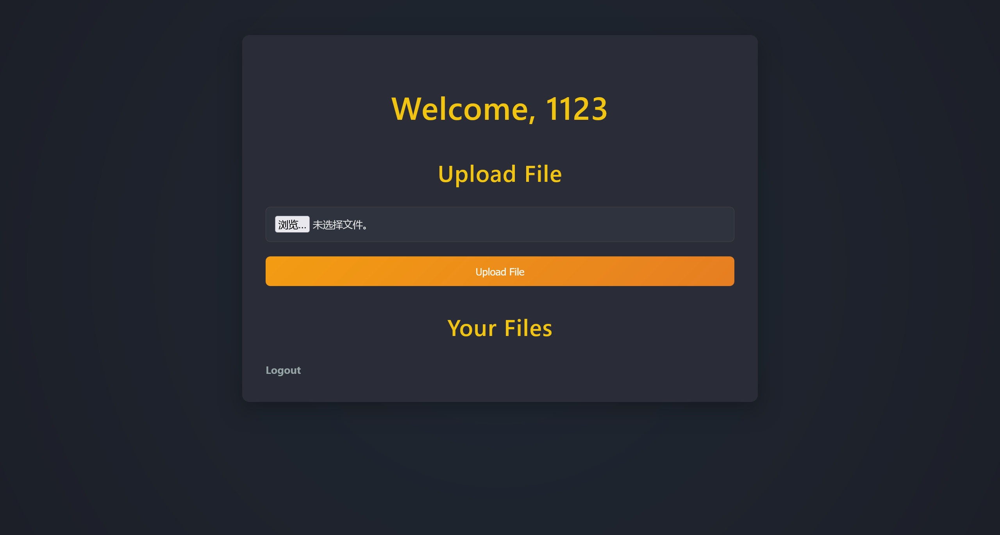
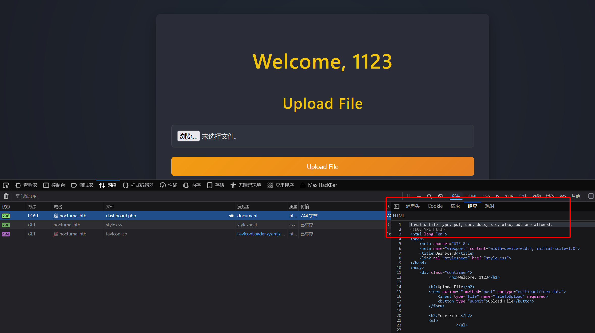

# Nocturnal

:::info

Difficulty: Easy

Operating System: Linux

:::

## ENTRY POINT

```plaintext
10.10.11.64
```

## 信息收集

```bash
┌──(randark㉿kali)-[~]
└─$ sudo nmap -v --min-rate=5000 -A -p- 10.10.11.64

```

## Port 80 Web Service

尝试通过 IP 地址进行连接

```bash
┌──(randark㉿kali)-[~]
└─$ http 10.10.11.64
HTTP/1.1 302 Moved Temporarily
Connection: keep-alive
Content-Length: 154
Content-Type: text/html
Date: Mon, 05 May 2025 01:54:29 GMT
Location: http://nocturnal.htb/
Server: nginx/1.18.0 (Ubuntu)

<html>
<head><title>302 Found</title></head>
<body>
<center><h1>302 Found</h1></center>
<hr><center>nginx/1.18.0 (Ubuntu)</center>
</body>
</html>
```

添加 hosts 记录之后进行访问


看起来是一个文件上传的考点

先来个目录爆破

```bash
┌──(randark㉿kali)-[~]
└─$ dirsearch -u http://nocturnal.htb/

[10:09:41] Starting: 
[10:10:17] 302 -    0B  - /admin.php  ->  login.php
[10:10:46] 301 -  178B  - /backups  ->  http://nocturnal.htb/backups/
[10:10:46] 403 -  564B  - /backups/
[10:11:01] 302 -    0B  - /dashboard.php  ->  login.php
[10:11:30] 200 -  644B  - /login.php
[10:11:31] 302 -    0B  - /logout.php  ->  login.php
[10:12:31] 200 -  649B  - /register.php
[10:12:53] 403 -  564B  - /uploads/affwp-debug.log
[10:12:53] 403 -  564B  - /uploads/
[10:12:53] 403 -  564B  - /uploads_admin
[10:12:53] 403 -  564B  - /uploads
[10:12:53] 403 -  564B  - /uploads/dump.sql
[10:12:56] 302 -    3KB - /view.php  ->  login.php
```

注册一个`1123:1123`用户上去



随便上传一个文件试试



过滤很严格，重心不应该放在这块的文件上传绕过

TODO 未完成
