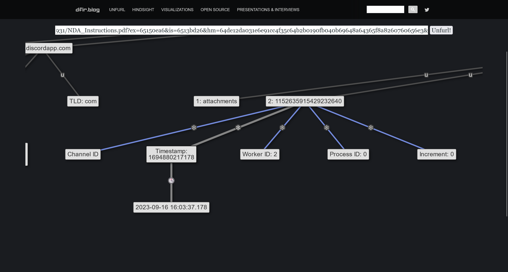
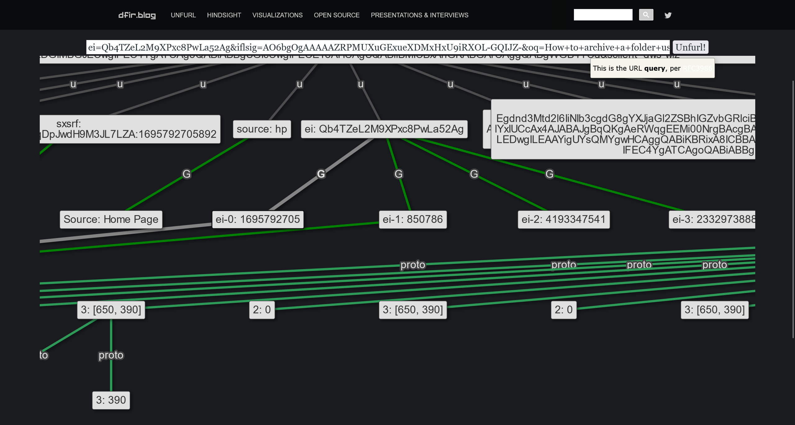

# Constellation

:::info Sherlock Scenario

The SOC team has recently been alerted to the potential existence of an insider threat. The suspect employee's workstation has been secured and examined. During the memory analysis, the Senior DFIR Analyst succeeded in extracting several intriguing URLs from the memory. These are now provided to you for further analysis to uncover any evidence, such as indications of data exfiltration or contact with malicious entities. Should you discover any information regarding the attacking group or individuals involved, you will collaborate closely with the threat intelligence team. Additionally, you will assist the Forensics team in creating a timeline. Warning : This Sherlock will require an element of OSINT and some answers can be found outside of the provided artifacts to complete fully.

SOC 团队最近收到警报，得知可能存在内部威胁。已锁定并检查了嫌疑员工的工作站。在内存分析期间，高级 DFIR 分析师成功从内存中提取了几个有趣的 URL。现将这些 URL 提供给您，以便进一步分析，以发现任何证据，例如数据泄露或与恶意实体联系的迹象。如果您发现有关攻击小组或所涉个人的任何信息，您将与威胁情报团队密切合作。此外，您还将协助取证团队创建时间线。警告：此 Sherlock 将需要 OSINT 的元素，并且可以在提供的工件之外找到一些答案才能完成。
:::

## 题目数据

[constellation.zip](./constellation.zip)

## First of all

首先，题目给了两个文件

```shell
Mode                 LastWriteTime         Length Name
----                 -------------         ------ ----
-----           2023/12/4    20:57            959 IOCs.txt
-----            2024/3/5    18:02          25995 NDA_Instructions.pdf
```

查看两个文件中的内容

```plaintext title="IOCs.txt"
URL 1 : https://cdn.discordapp.com/attachments/1152635915429232640/1156461980652154931/NDA_Instructions.pdf?ex=65150ea6&is=6513bd26&hm=64de12da031e6e91cc4f35c64b2b0190fb040b69648a64365f8a8260760656e3&

URL 2 : https://www.google.com/search?q=how+to+zip+a+folder+using+tar+in+linux&sca_esv=568736477&hl=en&sxsrf=AM9HkKkFWLlX_hC63KqDpJwdH9M3JL7LZA%3A1695792705892&source=hp&ei=Qb4TZeL2M9XPxc8PwLa52Ag&iflsig=AO6bgOgAAAAAZRPMUXuGExueXDMxHxU9iRXOL-GQIJZ-&oq=How+to+archive+a+folder+using+tar+i&gs_lp=Egdnd3Mtd2l6IiNIb3cgdG8gYXJjaGl2ZSBhIGZvbGRlciB1c2luZyB0YXIgaSoCCAAyBhAAGBYYHjIIEAAYigUYhgMyCBAAGIoFGIYDMggQABiKBRiGA0jI3QJQ8WlYxIUCcAx4AJABAJgBqQKgAeRWqgEEMi00NrgBAcgBAPgBAagCCsICBxAjGOoCGCfCAgcQIxiKBRgnwgIIEAAYigUYkQLCAgsQABiABBixAxiDAcICCBAAGIAEGLEDwgILEAAYigUYsQMYgwHCAggQABiKBRixA8ICBBAjGCfCAgcQABiKBRhDwgIOEC4YigUYxwEY0QMYkQLCAgUQABiABMICDhAAGIoFGLEDGIMBGJECwgIFEC4YgATCAgoQABiABBgUGIcCwgIFECEYoAHCAgUQABiiBMICBxAhGKABGArCAggQABgWGB4YCg&sclient=gws-wiz
```

### IOCs.txt

对 url 进行拆开

```plaintext title="URL 1"
https://cdn.discordapp.com
/attachments
/1152635915429232640
/1156461980652154931
/NDA_Instructions.pdf
?ex=65150ea6
&is=6513bd26
&hm=64de12da031e6e91cc4f35c64b2b0190fb040b69648a64365f8a8260760656e3
&
```

```plaintext title="URL 2 After URL Decode"
https://www.google.com
/search
?q=how to zip a folder using tar in linux
&sca_esv=568736477
&hl=en
&sxsrf=AM9HkKkFWLlX_hC63KqDpJwdH9M3JL7LZA:1695792705892
&source=hp
&ei=Qb4TZeL2M9XPxc8PwLa52Ag
&iflsig=AO6bgOgAAAAAZRPMUXuGExueXDMxHxU9iRXOL-GQIJZ-
&oq=How to archive a folder using tar i
&gs_lp=Egdnd3Mtd2l6IiNIb3cgdG8gYXJjaGl2ZSBhIGZvbGRlciB1c2luZyB0YXIgaSoCCAAyBhAAGBYYHjIIEAAYigUYhgMyCBAAGIoFGIYDMggQABiKBRiGA0jI3QJQ8WlYxIUCcAx4AJABAJgBqQKgAeRWqgEEMi00NrgBAcgBAPgBAagCCsICBxAjGOoCGCfCAgcQIxiKBRgnwgIIEAAYigUYkQLCAgsQABiABBixAxiDAcICCBAAGIAEGLEDwgILEAAYigUYsQMYgwHCAggQABiKBRixA8ICBBAjGCfCAgcQABiKBRhDwgIOEC4YigUYxwEY0QMYkQLCAgUQABiABMICDhAAGIoFGLEDGIMBGJECwgIFEC4YgATCAgoQABiABBgUGIcCwgIFECEYoAHCAgUQABiiBMICBxAhGKABGArCAggQABgWGB4YCg
&sclient=gws-wiz
```

## Task 1

> 嫌疑人第一次与外部实体（可能的目标组织员工泄露敏感数据的威胁行为者团体）开始直接消息 (DM) 对话的时间是？（UTC）

在 `URL 1` 中，得到

```plaintext title="URL 1"
/1152635915429232640
```

可以使用 [Discord Snowflake to Timestamp Converter](https://snowsta.mp/)

使用 [unfurl](https://dfir.blog/unfurl/) 进行分析



提取出来

```plaintext
Timestamp: 1694880217178
```

```plaintext title="Answer"
2023-09-16 16:03:37.178
```

## Task 2

> 发送给涉嫌内部威胁的文件的名称是什么？

```plaintext title="Answer"
NDA_Instructions.pdf
```

## Task 3

> 文件发送给涉嫌内部威胁的时间是？（UTC）

```plaintext
&is=6513bd26
```

参考 Discord 官方文档的说明 [Discord Developer Portal — Documentation — Reference](https://discord.com/developers/docs/reference#signed-attachment-cdn-urls-attachment-cdn-url-parameters)

```plaintext
Hex: 6513BD26
DEC: 1695792422
Timestamp: Wed 27 September 2023 05:27:02 UTC
```

```plaintext title="Answer"
2023-09-27 05:27:02
```

## Task 4

> 嫌疑人在收到文件后使用谷歌搜索了一些东西。搜索查询是什么？

在 `URL 2` 中

```plaintext
?q=how+to+zip+a+folder+using+tar+in+linux
```

```plaintext title="Answer"
how to zip a folder using tar in linux
```

## Task 5

> 嫌疑人最初在搜索选项卡中输入了其他内容，但找到了他们点击的谷歌搜索结果建议。你能否确认嫌疑人最初在搜索栏中输入了哪些单词？

在 `URL 2` 中

```plaintext
&gs_lp=Egdnd3Mtd2l6IiNIb3cgdG8gYXJjaGl2ZSBhIGZvbGRlciB1c2luZyB0YXIgaSoCCAAyBhAAGBYYHjIIEAAYigUYhgMyCBAAGIoFGIYDMggQABiKBRiGA0jI3QJQ8WlYxIUCcAx4AJABAJgBqQKgAeRWqgEEMi00NrgBAcgBAPgBAagCCsICBxAjGOoCGCfCAgcQIxiKBRgnwgIIEAAYigUYkQLCAgsQABiABBixAxiDAcICCBAAGIAEGLEDwgILEAAYigUYsQMYgwHCAggQABiKBRixA8ICBBAjGCfCAgcQABiKBRhDwgIOEC4YigUYxwEY0QMYkQLCAgUQABiABMICDhAAGIoFGLEDGIMBGJECwgIFEC4YgATCAgoQABiABBgUGIcCwgIFECEYoAHCAgUQABiiBMICBxAhGKABGArCAggQABgWGB4YCg
```

使用 Base64 解码后，提取字符串，得到

```plaintext
gws-wiz"
How to archive a folder using tar i
2-46
```

```plaintext title="Answer"
How to archive a folder using tar i
```

## Task 6

> 此谷歌搜索是在何时进行的？（UTC）

参考这篇文章 [Analyzing Timestamps in Google Search URLs - Magnet Forensics](https://www.magnetforensics.com/resources/analyzing-timestamps-in-google-search-urls/)

使用 [unfurl](https://dfir.blog/unfurl/) 进行分析



得到会话开始的时间戳

```plaintext
1695792705
Wed 27 September 2023 05:31:45 UTC
```

```plaintext title="Answer"
2023-09-27 05:31:45
```

## Task 7

> 负责贿赂内部威胁的黑客组织的名称是什么？

```plaintext title="Answer"
AntiCorp Gr04p
```

## Task 8

> 涉嫌为内部威胁的人员的姓名是什么？

```plaintext title="Answer"
Karen Riley
```

## Task 9

> 发送给内部威胁的文件中所述的异常创建日期是什么？（UTC）

直接看 pdf 文件的 exif 信息

```shell title="exiftool NDA_Instructions.pdf"
ExifTool Version Number         : 12.57
File Name                       : NDA_Instructions.pdf
Directory                       : .
File Size                       : 26 kB
File Modification Date/Time     : 2024:03:06 00:19:35+08:00
File Access Date/Time           : 2024:03:06 00:19:35+08:00
File Inode Change Date/Time     : 2024:03:06 00:19:35+08:00
File Permissions                : -rw-r--r--
File Type                       : PDF
File Type Extension             : pdf
MIME Type                       : application/pdf
PDF Version                     : 1.7
Linearized                      : No
Page Count                      : 1
Producer                        : AntiCorp PDF FW
Create Date                     : 2054:01:17 22:45:22+01:00
Title                           : KarenForela_Instructions
Author                          : CyberJunkie@AntiCorp.Gr04p
Creator                         : AntiCorp
Modify Date                     : 2054:01:17 22:45:22+01:00
Subject                         : Forela_Mining stats and data campaign (Stop destroying env)
```

```plaintext title="Answer"
2054-01-17 22:45:22
```

## Task 10

> Forela 威胁情报团队正在努力揭露此事件。攻击者犯下的任何 OpSec 错误对于 Forela 的安全团队至关重要。尝试帮助 TI 团队并确认 Anticorp 中代理人 / 处理人的真实姓名。

在 Linkedin 上，通过 `AntiCorp Gr04p` 作为关键词定位到 [Abdullah Al Sajjad - Security Expert - AntiCorp Gr04p | LinkedIn](https://pk.linkedin.com/in/abdullah-al-sajjad-434545293?trk=public_profile_browsemap-profile)

```plaintext title="Answer"
Abdullah Al Sajjad
```

## Task 11

> 威胁行为者属于哪个城市？

上文中就有

```plaintext title="Answer"
Bahawalpur
```
