# 防御靶机

## 防守靶机签到

请识别电子邮件的传递域名顺序

```plaintext
flag:55yL5Yiw5LiqQmFzZTY05a2X56ym5Liy5bCx6Kej56CBPw==
Received: from mail.EJMNvdUnXx.com ([141.145.208.229])
by newuser-1.qq.com (NewMX) with SMTP id 7010A9AD
for <<hellozhang8test@qq.com> style="margin: 0px; padding: 0px; font-family:"Fira Code","Source Code Pro"; scrollbar-width: thin; color: rgb(238, 238, 238); font-size: 14px; font-style: normal; font-variant-ligatures: normal; font-variant-caps: normal; font-weight: 400; letter-spacing: normal; orphans: 2; text-align: start; text-indent: 0px; text-transform: none; widows: 2; word-spacing: 0px; -webkit-text-stroke-width: 0px; white-space: normal; text-decoration-thickness: initial; text-decoration-style: initial; text-decoration-color: initial;">; Thu, 17 Oct 2024 11:24:01 +0800
X-QQ-mid: xmmxszc6-1t1729135441tm9qrjq3k
X-QQ-XMRINFO: NgToQqU5s31XQ+vYT/V7+uk=
Authentication-Results: mx.qq.com; spf=none smtp.mailfrom=<<helper@zhang8.sec> style="margin: 0px; padding: 0px; font-family:"Fira Code","Source Code Pro"; scrollbar-width: thin;">;
dkim=none; dmarc=none(permerror) header.from=zhang8.sec
Received: from mail.zhang8.sec (**-**-*-****** [127.0.0.1])
by mail.EJMNvdUnXx.com (Postfix) with ESMTP id 2EF0A60264
for <<hellozhang8test@qq.com> style="margin: 0px; padding: 0px; font-family:"Fira Code","Source Code Pro"; scrollbar-width: thin;">; Thu, 17 Oct 2024 11:24:01 +0800 (CST)
Date: Thu, 1 Jan 2024 11:24:01 +0800
To: <hellozhang8test@qq.com>
From: 鍏嬪競缃戜俊 <<helper@zhang8.sec> style="margin: 0px; padding: 0px; font-family:"Fira Code","Source Code Pro"; scrollbar-width: thin;">
Subject:xxxxxxxxxx
Message-Id: <20250101112401.032146@mail.zhang8.sec>
X-Mailer: QQMail 2.x
```

```plaintext
flag 格式为 flag{domain1>...>domainN}
```

1. 邮件最初从 `mail.zhang8.sec`（IP `127.0.0.1`，可能是本地伪造）发出，由 `mail.EJMNvdUnXx.com` 接收（第二个 `Received` 头）。
2. 随后由 `mail.EJMNvdUnXx.com`（IP `141.145.208.229`）转发到腾讯的 `newuser-1.qq.com`（第一个 `Received` 头）。
3. 最终投递到收件人 `hellozhang8test@qq.com` 的邮箱。

```flag
flag{mail.zhang8.sec>mail.EJMNvdUnXx.com>newuser-1.qq.com}
```

## 1. 结合邮件正文发掘 flag

在用户桌面发现存在邮件文件

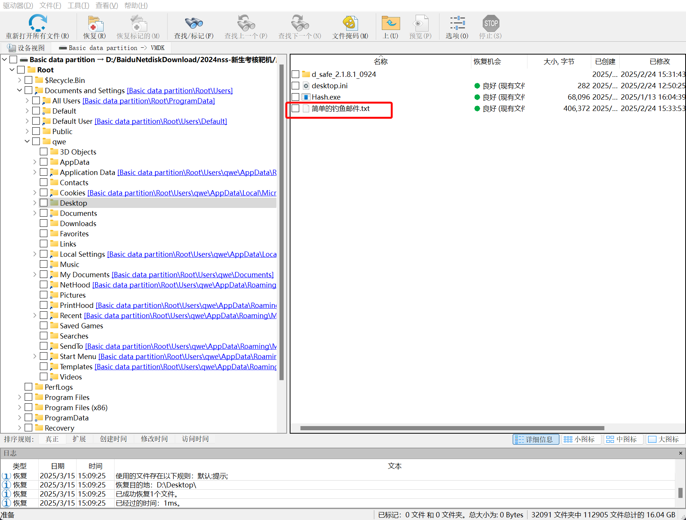

对其进行分析，为 zip 压缩文件

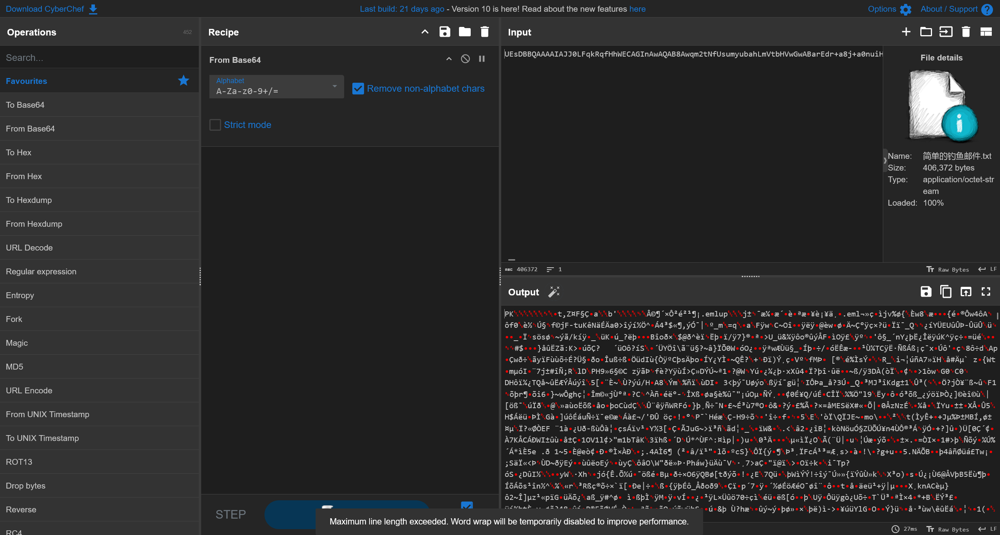

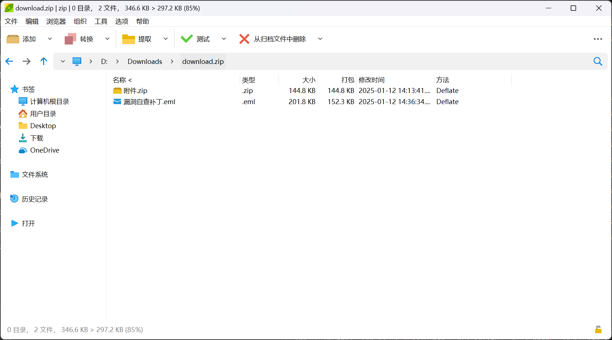

查看eml邮件文件

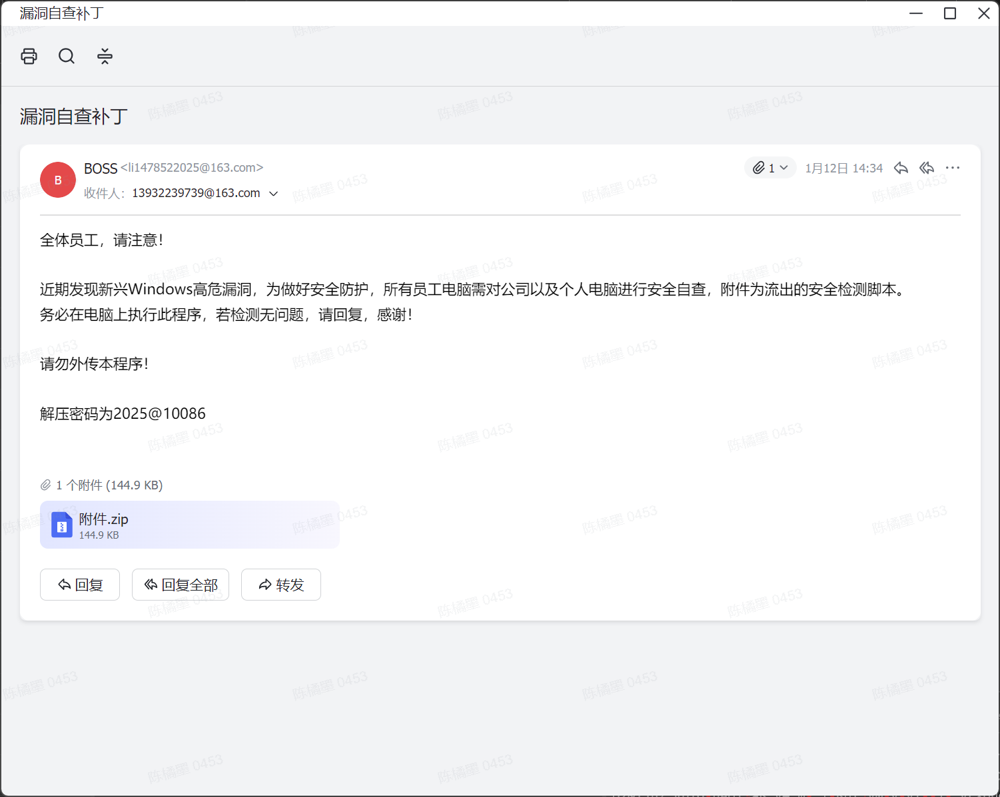

解压附件中的压缩包，即可得到`flag.txt`

```flag
flag{Let-'s-Begain#this@Game}
```

## 2. 请分析获取黑客发送钓鱼邮件时使用的 IP

查看邮件收发的元数据

```plaintext
Received: from li1478522025$163.com ( [101.18.96.66] ) by
 ajax-webmail-wmsvr-40-123 (Coremail) ; Sun, 12 Jan 2025 14:34:30 +0800
 (CST)
X-Originating-IP: [101.18.96.66]
Date: Sun, 12 Jan 2025 14:34:30 +0800 (CST)
From: BOSS <li1478522025@163.com>
To: 13932239739@163.com
Subject: =?GBK?B?wqm2tNfUsumyubah?=
X-Priority: 3
X-Mailer: Coremail Webmail Server Version XT5.0.14 build 20240801(9da12a7b)
 Copyright (c) 2002-2025 www.mailtech.cn 163com
X-NTES-SC: AL_Qu2YBPqdvE4s5iORZekfm00Vhuo9WcC4uvgh3odXNpB6jAnp+BkwXUJSAX38zs60MzuwmgmGTSlry895WpNbUIwaPaMs6p5k0GdETjRqqm31jw==
Content-Type: multipart/mixed; 
 boundary="----=_Part_18253_1155375469.1736663670395"
MIME-Version: 1.0
Message-ID: <3be175a1.11cb.19459389e7b.Coremail.li1478522025@163.com>
X-Coremail-Locale: zh_CN
X-CM-TRANSID:eygvCgDnD5B2YoNn+j9VAA--.25615W
X-CM-SenderInfo: tolrklayvsjiisv6il2tof0z/xtbBzxTS62eDXSJFowABse
X-Coremail-Antispam: 1U5529EdanIXcx71UUUUU7vcSsGvfC2KfnxnUU==
```

即可得到答案

```flag
flag{101.18.96.66}
```

## 3. 请溯源木马远程控制端的 IP

解压压缩包，可以得到一个文件

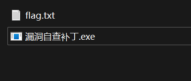

使用云沙箱进行分析 [样本报告-微步在线云沙箱](https://s.threatbook.com/report/file/4902376d830ea5ff021fcadfabe3307f79ea27befa53a59e4a68e126bf8eff43)

得到其CobaltStrike配置信息

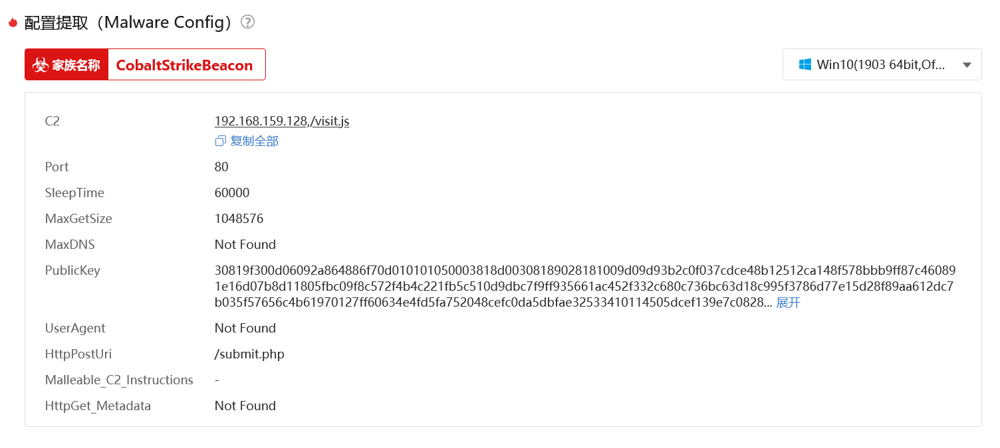

```flag
192.168.159.128
```

## 4. 请锁定留下的远控文件的文件的大写 MD5 值

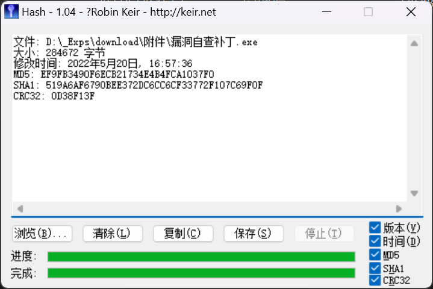

```plaintext
文件: D:\_Exps\download\附件\漏洞自查补丁.exe
大小: 284672 字节
修改时间: 2022年5月20日, 16:57:36
MD5: EF9FB3490F6ECB21734E4B4FCA1037F0
SHA1: 519A6AF6790BEE372DC6CC6CF33772F107C69F0F
CRC32: 0D38F13F
```

即可得到答案

```flag
flag{EF9FB3490F6ECB21734E4B4FCA1037F0}
```

## 5. 判断启动恶意程序的定时任务名

提取注册表文件

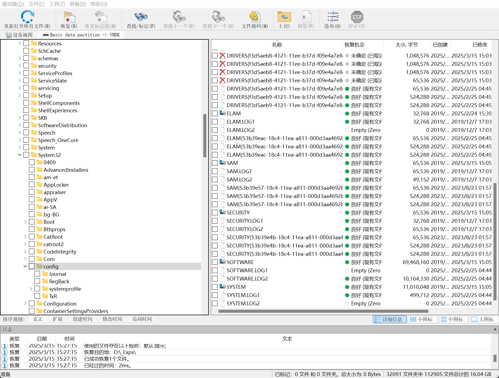

然后使用mimikatz获得用户密码

```bash
PS D:\Downloads\config> .\mimikatz_trunk\x64\mimikatz.exe

  .#####.   mimikatz 2.2.0 (x64) #19041 Sep 19 2022 17:44:08
 .## ^ ##.  "A La Vie, A L'Amour" - (oe.eo)
 ## / \ ##  /*** Benjamin DELPY `gentilkiwi` ( benjamin@gentilkiwi.com )
 ## \ / ##       > https://blog.gentilkiwi.com/mimikatz
 '## v ##'       Vincent LE TOUX             ( vincent.letoux@gmail.com )
  '#####'        > https://pingcastle.com / https://mysmartlogon.com ***/

mimikatz # lsadump::sam /SAM:sam /SYSTEM:system
Domain : DESKTOP-7N1LA14
SysKey : 5de6251ef21157e41353c6b76347344c
Local SID : S-1-5-21-3465538928-3890216618-2527938008

SAMKey : 7d62459da0807146580eaeb3aa866c9f

RID  : 000001f4 (500)
User : Administrator

RID  : 000001f5 (501)
User : Guest

RID  : 000001f7 (503)
User : DefaultAccount

RID  : 000001f8 (504)
User : WDAGUtilityAccount
  Hash NTLM: 6d2312a27dde91e354716c7dfce9b0e3

Supplemental Credentials:
* Primary:NTLM-Strong-NTOWF *
    Random Value : a61f06f2d13b05784b113b091f796179

* Primary:Kerberos-Newer-Keys *
    Default Salt : WDAGUtilityAccount
    Default Iterations : 4096
    Credentials
      aes256_hmac       (4096) : e79a8b9bb5d0cc54a16258de044df37863078c2792bc346a85010ab44d825552
      aes128_hmac       (4096) : f649fc77df64d4f04e2b0159f393c4ae
      des_cbc_md5       (4096) : dcbfb3ae34f26729

* Packages *
    NTLM-Strong-NTOWF

* Primary:Kerberos *
    Default Salt : WDAGUtilityAccount
    Credentials
      des_cbc_md5       : dcbfb3ae34f26729


RID  : 000003e9 (1001)
User : qwe
  Hash NTLM: 117c45b86f0eb51467d24af3c306298a

Supplemental Credentials:
* Primary:NTLM-Strong-NTOWF *
    Random Value : 68494080784464a0250c86a7fde2245a

* Primary:Kerberos-Newer-Keys *
    Default Salt : DESKTOP-7N1LA14qwe
    Default Iterations : 4096
    Credentials
      aes256_hmac       (4096) : 33fee53d782eadef971b3881e58ac3911d805846a35e17789462b1dcd7a8a39a
      aes128_hmac       (4096) : 80fca481de1b3b888009b8d5f9848312
      des_cbc_md5       (4096) : f437545b57fb2c2f
    OldCredentials
      aes256_hmac       (4096) : 33fee53d782eadef971b3881e58ac3911d805846a35e17789462b1dcd7a8a39a
      aes128_hmac       (4096) : 80fca481de1b3b888009b8d5f9848312
      des_cbc_md5       (4096) : f437545b57fb2c2f

* Packages *
    NTLM-Strong-NTOWF

* Primary:Kerberos *
    Default Salt : DESKTOP-7N1LA14qwe
    Credentials
      des_cbc_md5       : f437545b57fb2c2f
    OldCredentials
      des_cbc_md5       : f437545b57fb2c2f
```

哈希查询彩虹表，可得

```plaintext
qwe:117c45b86f0eb51467d24af3c306298a:qwe
```

成功登陆系统

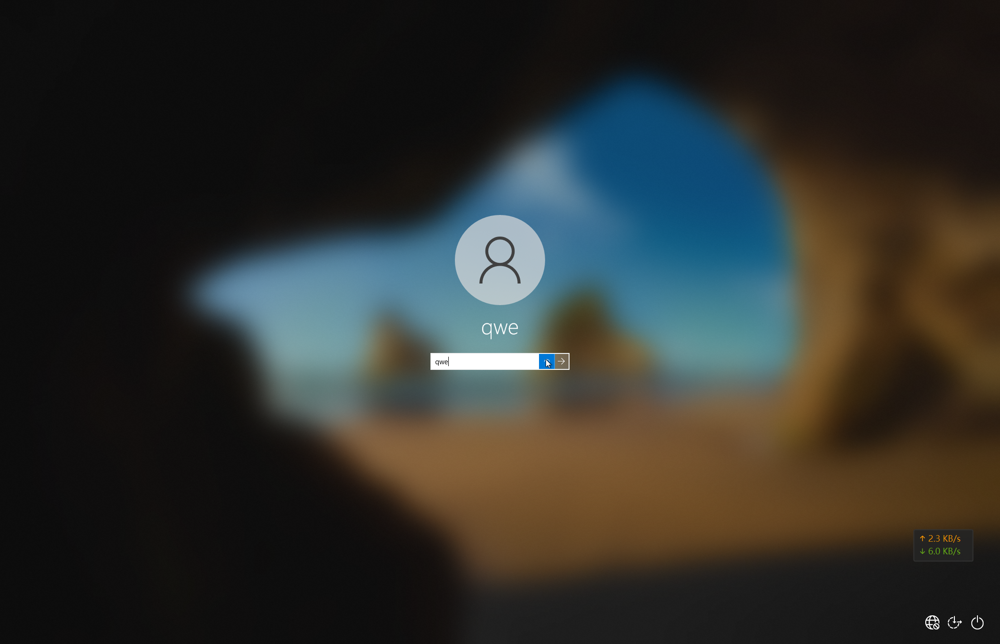

在计划任务中，即可看到答案

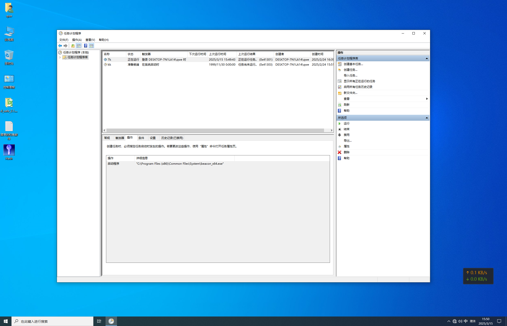

```plaintext
flag{7k}
```

## 6. 判断恶意文件的制作端名

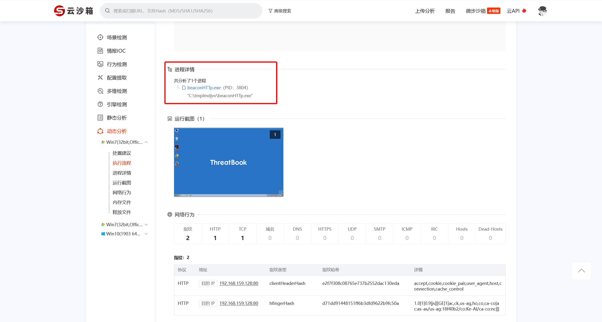

```flag
flag{beaconHTTp.exe}
```

## 7. 请留下你的 WP
