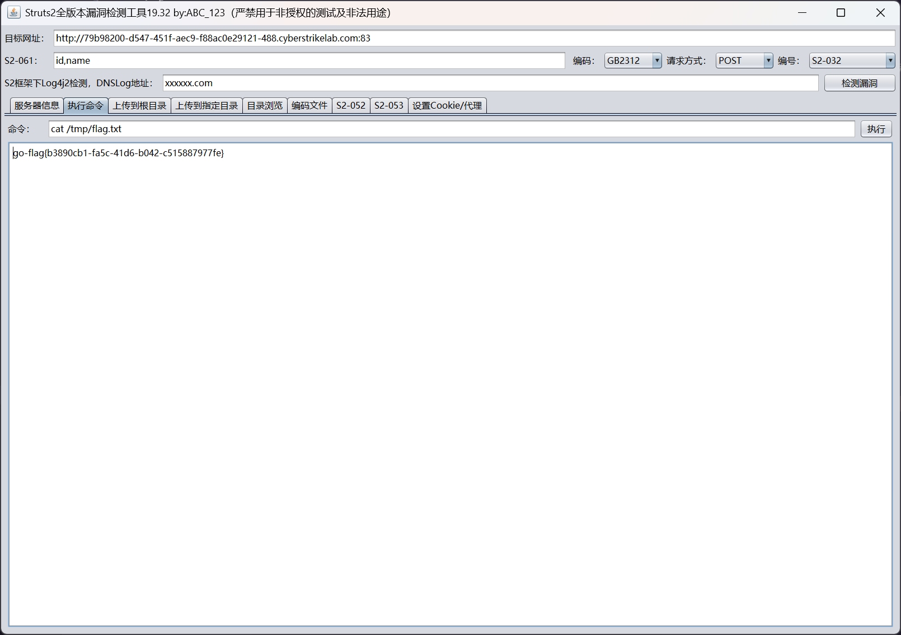

# CVE-2016-3081

:::info

靶标介绍：

> Struts2在开启了动态方法调用（Dynamic Method Invocation）的情况下，可以使用 `method:<name>` 的方式来调用名字是 `<name>` 的方法，而这个方法名将会进行 OGNL 表达式计算，导致远程命令执行漏洞。
>
> - CVE

:::

## 入口点

```plaintext
http://79b98200-d547-451f-aec9-f88ac0e29121-488.cyberstrikelab.com:83
```

Struts2 好说，直接工具打即可


查看当前权限


获取 flag


