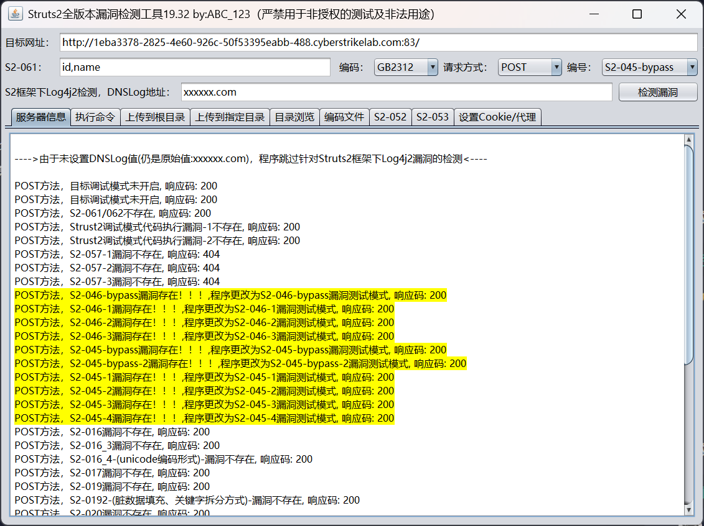

# CVE-2017-12611

:::info

靶标介绍：

> Struts2在使用Freemarker模块引擎的时候,同时允许解析OGNL表达式。导致用户输入的数据本身不会被OGNL解析,但是由于被Freemarker解析一次后变成离开一个表达式,被OGNL解析第二次,导致任意命令执行漏洞。
>
> - CVE

:::

## 入口点

```plaintext
http://1eba3378-2825-4e60-926c-50f53395eabb-488.cyberstrikelab.com:83/
```

不多说，直接用工具打即可


