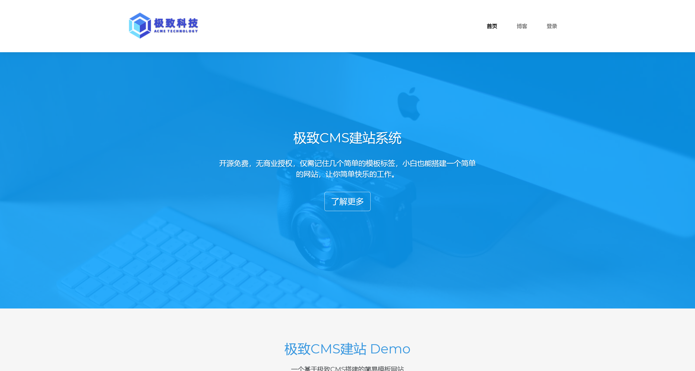

# PRIV-7

:::info

靶标介绍：

> web 渗透提权
>
> - getshell
> - 提权

:::

## 入口点

```plaintext
192.168.111.200
```

## 入口点 - 信息收集

```bash
┌──(randark㉿kali)-[~]
└─$ sudo ./tools/fscan-1.8.4/fscan -h 192.168.111.200

   ___                              _    
  / _ \     ___  ___ _ __ __ _  ___| | __ 
 / /_\/____/ __|/ __| '__/ _` |/ __| |/ /
/ /_\\_____\__ \ (__| | | (_| | (__|   <    
\____/     |___/\___|_|  \__,_|\___|_|\_\   
                     fscan version: 1.8.4
start infoscan
192.168.111.200:22 open
192.168.111.200:80 open
[*] alive ports len is: 2
start vulscan
[*] WebTitle http://192.168.111.200    code:200 len:267    title:None
```

## Web Service

尝试直接访问



可以查询到极致 CMS 的漏洞信息

[PeiQi-WIKI-POC/PeiQi\_Wiki/CMS 漏洞 / 极致 CMS/README.md at master・Arinue/PeiQi-WIKI-POC](https://github.com/Arinue/PeiQi-WIKI-POC/blob/master/PeiQi_Wiki/CMS%E6%BC%8F%E6%B4%9E/%E6%9E%81%E8%87%B4CMS/README.md)

TODO 未完成
