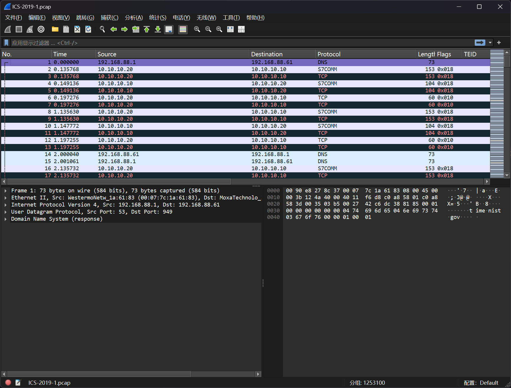
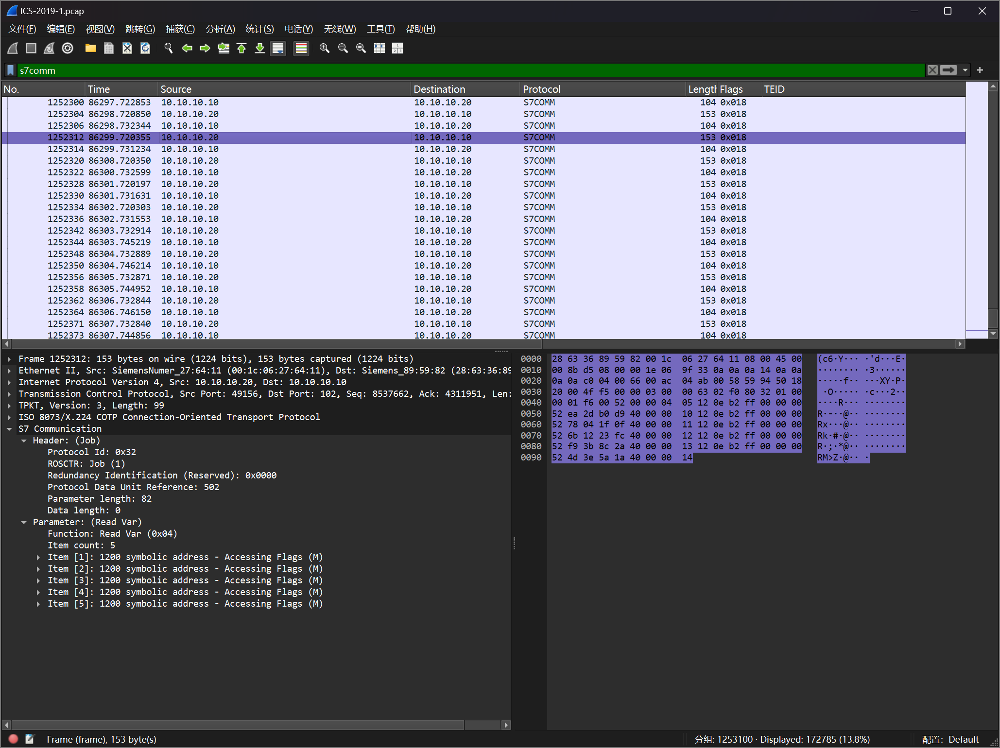
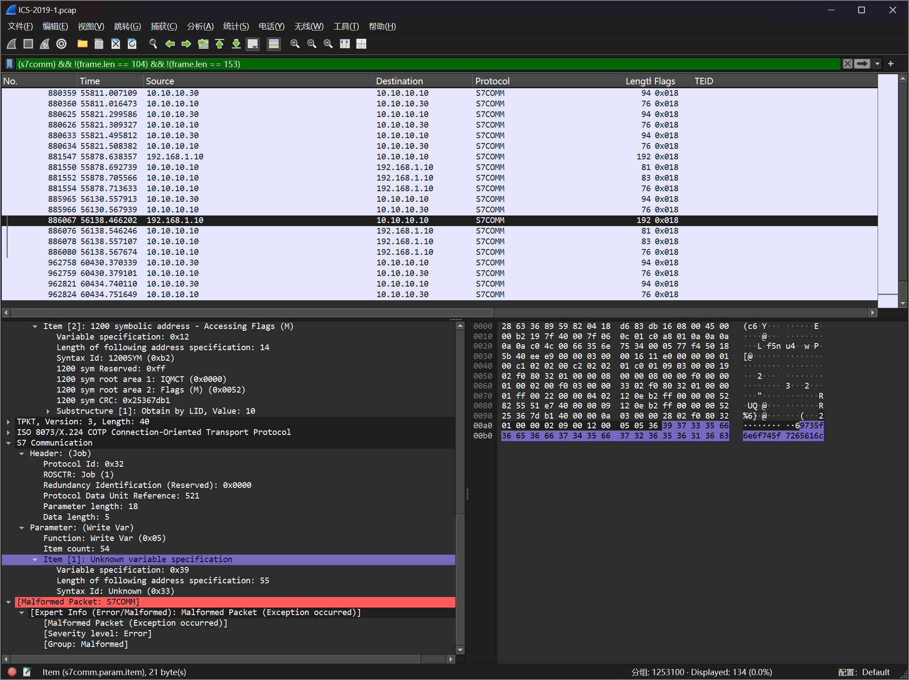
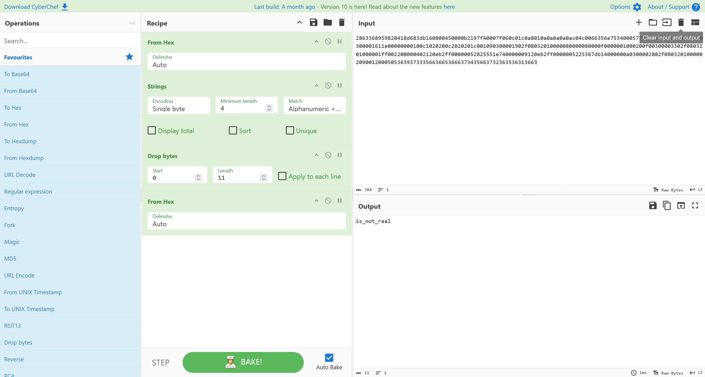

# S7COMM 协议分析

:::note

某 10 段工控网络中，工业协议中存在异常数据。请通过流量中的数据找寻 flag

flag 形式为 `flag{}`

:::

题目提供了 `ICS-2019-1.pcap` 流量包文件，流量包文件较大



根据题目信息，分析`S7COMM`协议的流量包



排除掉常规长度的数据包

```plaintext
(s7comm) && !(frame.len == 104) && !(frame.len == 153)
```

对流量进行排查，发现



对未能解析的数据进行分析，可以得到一份字符串



即可得到答案

```flag
flag{is_not_real}
```
