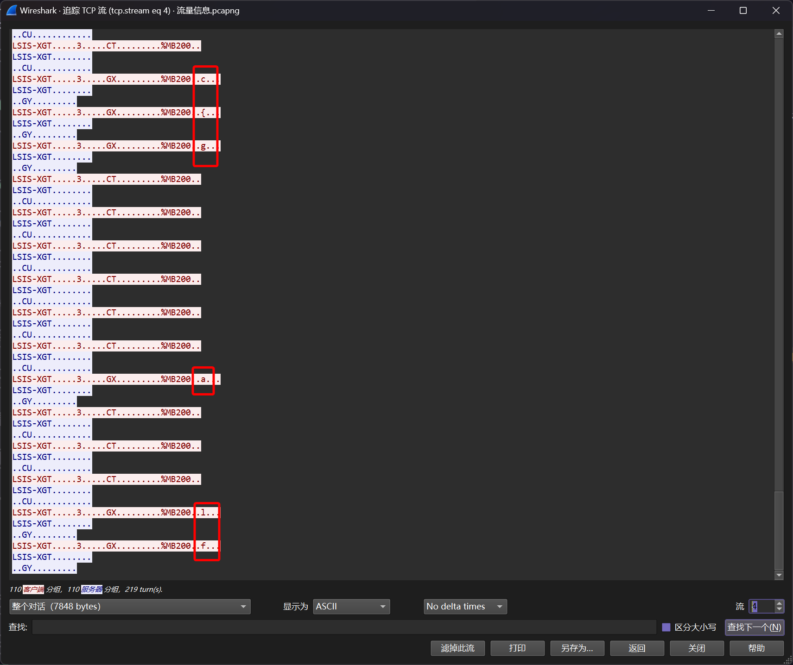

# 协议精准定位分析

:::note

企业自动化运维管理员最近发现某工控设备频繁出现可疑地流量，请您帮助他分析确认一下问题。

Flag 格式为：`flag{}`

:::

题目提供了两个文件

- XGB_FEnet(080611).pdf
- 流量信息. pcapng

`pdf`文件提供的是工控设备的说明文档，文件`pcapng`是工控设备的流量捕获

直接暴力追踪`Tcpsession 4`可以发现以下信息



直接暴力解码

```shell
┌──(randark㉿kali)-[~/tmp]
└─$ tshark -r dfc3c025ff3fb208b7d53a7e10dfb5f9.pcapng -T fields -e data.data | grep -E "^4c5349532d58475400000000a03300001600034758001400000001000600254d423230300400" | awk '{print substr($0, length($0)-7, 2)}' | xxd -r -p | rev
flag{c93650241853da240f9760531a79cbcf}
```

即可得到答案

```flag
flag{c93650241853da240f9760531a79cbcf}
```
