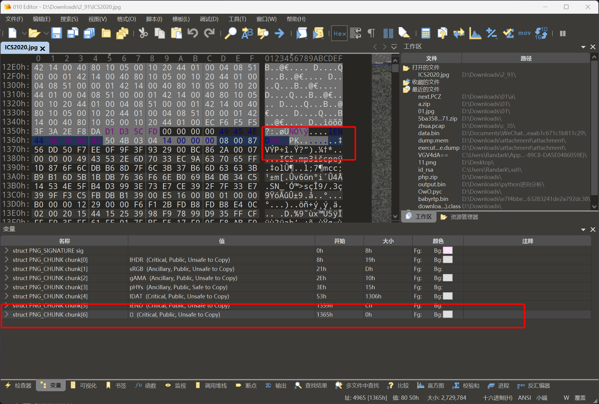
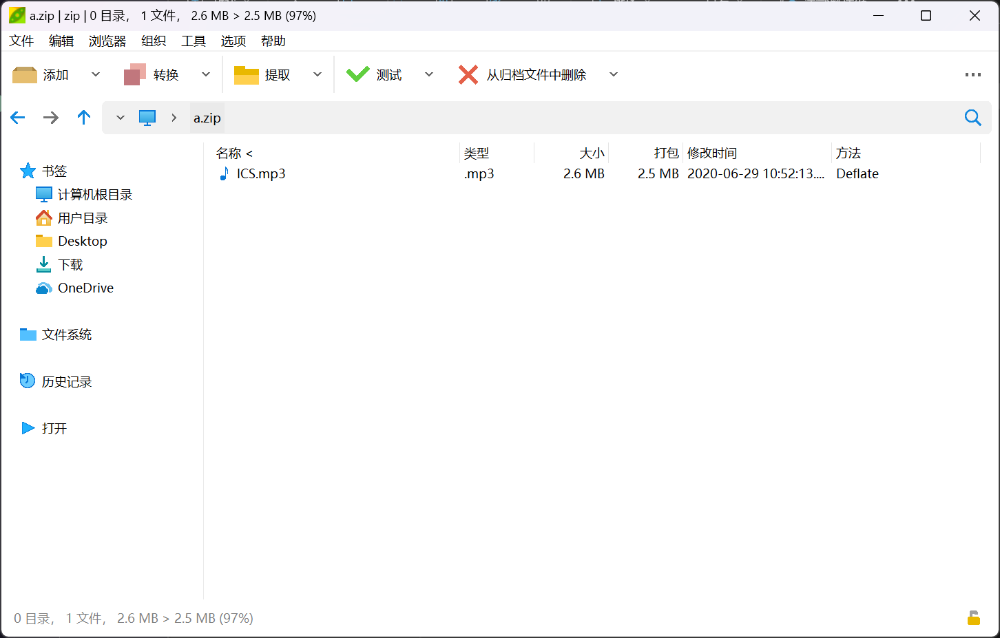
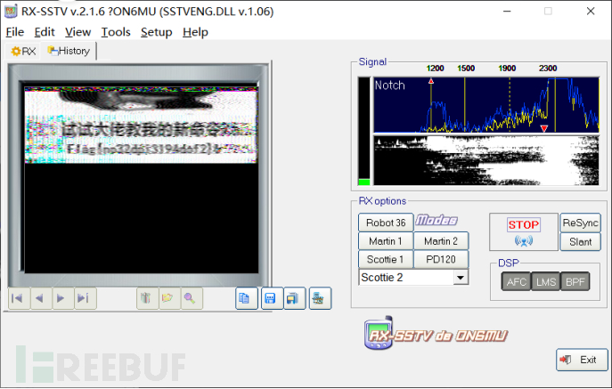

# 奇怪的声音

:::note

某工控环境中泄露了某些奇怪的声音，你能获取到flag吗?

Flag格式为：`flag{}`

:::

题目提供了一个图像文件`ICS2020.jpg`


对其十六进制数据进行分析，在后部发现了zip数据



将附加的zip数据进行提取，得到



解压得到`ICS.mp3`文件，根据其声音特征判断其为SSTV



即可得到答案

```plaintext
flag{no32dpi3194dof2}
```
