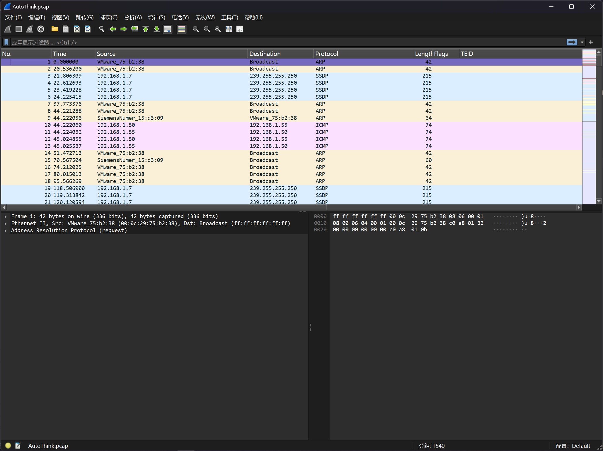
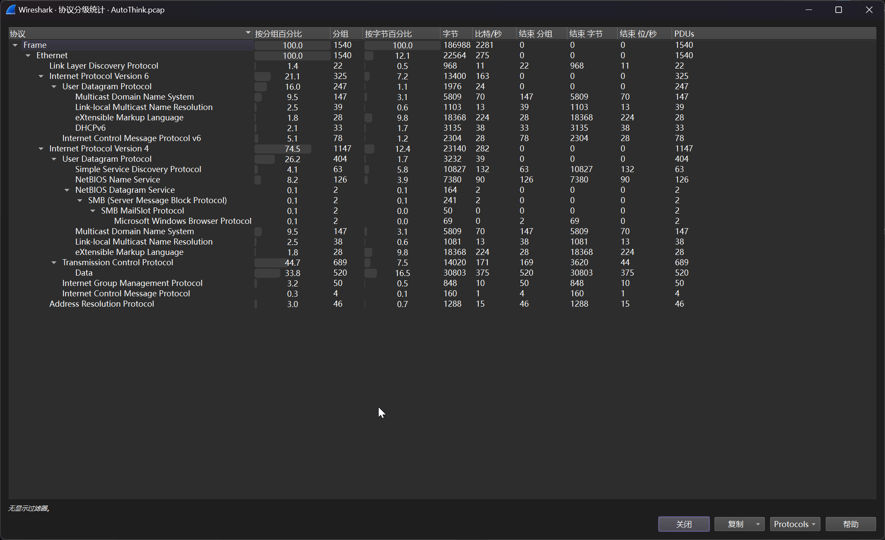

# 工控协议数据分析

:::note

生产系统的运维人员在进行日常审计中发现设备存在大量的告警日志，自动化工程师在进行上载分析中也没有发现相关的问题所在，请您帮助进行分析相关设备的存在的问题

flag 格式为：`flag{hex 数据}`

:::

题目提供了流量包文件 `AutoThink.pcap`



简单看一下协议分级统计



在其中，发现有较多的ARP数据包，发起方都为`VMware_75:b2:3` 和 `SiemensNumer_15:d3:09`

尝试提交答案，可确定答案为`SiemensNumer_15:d3:09`的MAC地址`00:1c:06:15:d3:09`

```flag
flag{001c0615d309}
```
