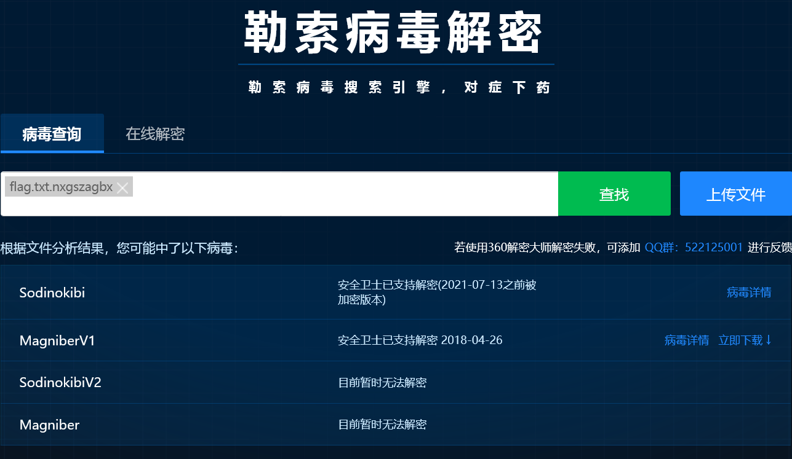

# 病毒文件恢复

:::note

某厂区内部出现勒索病毒，且重要工程文件被黑客锁住，请应急人员解锁被勒索病毒锁住的文件

flag 格式为：`flag{}`

:::

题目提供了以下文件

- `flag.txt.nxgszagbx`
- `NXGSZAGBX-DECRYPT.txt`

其中，文件 `NXGSZAGBX-DECRYPT.txt` 为勒索软件留下的勒索信，文件 `flag.txt.nxgszagbx` 可以推测为 `flag.txt` 文件经过勒索软件加密后的文件

尝试直接使用 [安全卫士勒索病毒专题: 文件恢复_安全卫士离线救灾版_文档卫士](https://lesuobingdu.360.cn/) 进行解密



确定之后，尝试在线解密，即可得到答案

```flag
flag{fngD_vwfW_JTqI_E4Kl}
```
