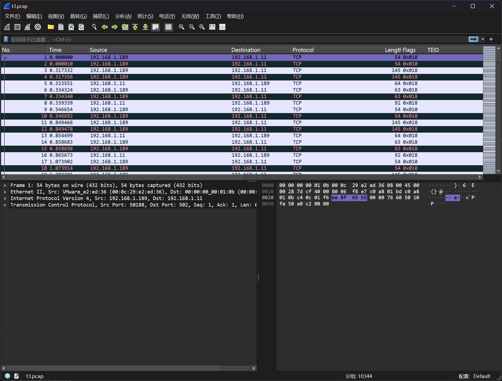
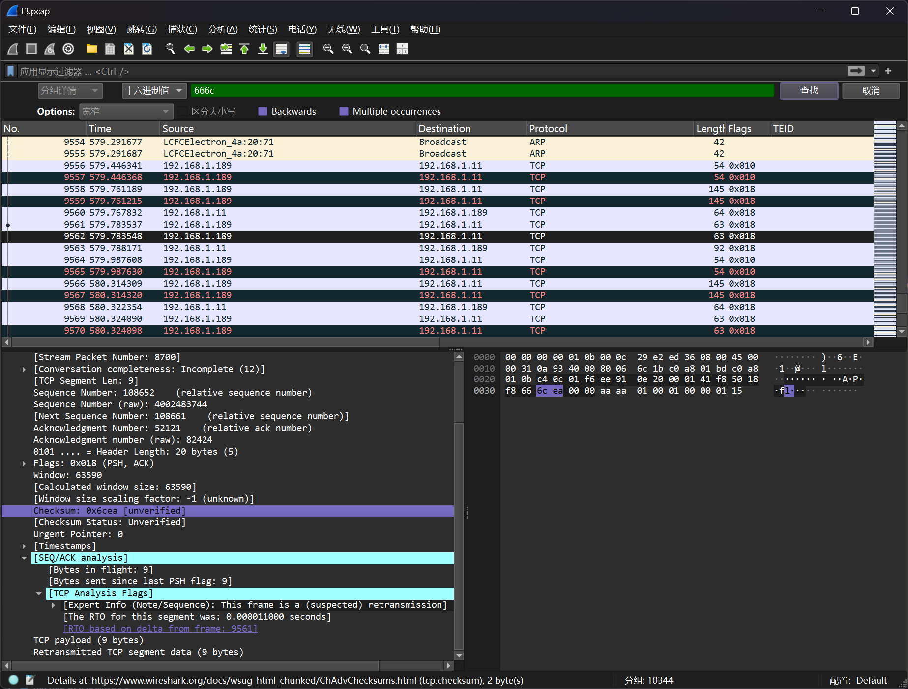

# 简单Modbus协议分析

:::note

由于操作员操作不当导致化工车间蒸馏塔控制器程序出错，请分析错误程序查找错误点并获得flag

flag格式为`flag{}`

:::

题目提供了流量包文件`t3.pcap`



尝试多种筛选，在TCP标头中发现异常



尝试对数据进行提取

```bash
┌──(randark㉿kali)-[~/tmp]
└─$ strings t3.pcap | grep 666c | xxd -r -p
flag{DGswTfgy1GD236fs2sfF2dskLng}
```

即可得到答案

```flag
flag{DGswTfgy1GD236fs2sfF2dskLng}
```
