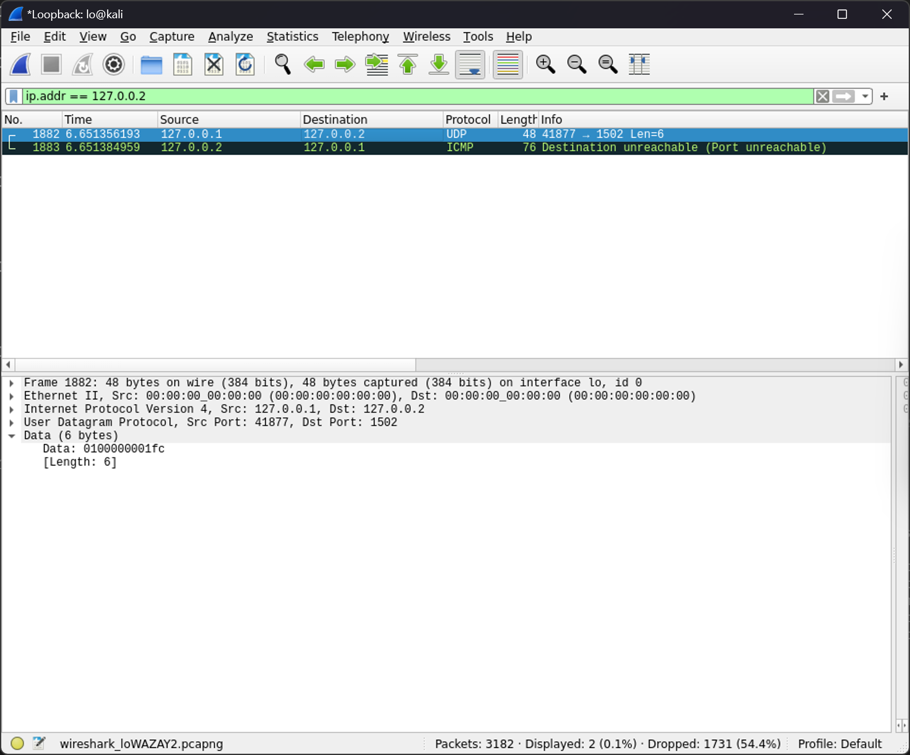

# 恶意软件样本分析

:::note

某家工厂曾发生过宕机事件案例，为防止再发生此事找了技术人员分析攻击行为流量数据包后发现许多异常端口连接记录，最终得到了这个罪魁祸首的病毒样本，请分析病毒样本尝试复现事件案例帮助工厂实施应急演练

flag 形式为 `flag{}`

:::

题目提供了 [MDudek-ICS/TRISIS-TRITON-HATMAN: Repository containting original and decompiled files of TRISIS/TRITON/HATMAN malware](https://github.com/MDudek-ICS/TRISIS-TRITON-HATMAN) 的仓库文件

在 Kali 上进行以下操作

```bash
┌──(randark ㉿ kali)-[~/tmp/attachment_1579251185_2-4/TRISIS-TRITON-HATMAN/decompiled_code]
└─$ mv script_test.py library/

┌──(randark ㉿ kali)-[~/tmp/attachment_1579251185_2-4/TRISIS-TRITON-HATMAN/decompiled_code]
└─$ cd library/

┌──(randark ㉿ kali)-[~/tmp/attachment_1579251185_2-4/TRISIS-TRITON-HATMAN/decompiled_code/library]
└─$ python2 script_test.py 127.0.0.1
bad tcm size
unable to connect!
```

对本地 `Interface - Loopback` 进行监听的同时运行脚本，将地址设置为另一个本地环回地址 `127.0.0.2` 之后，可以得到



传输的数据就是答案

```flag
flag{0100000001fc}
```
