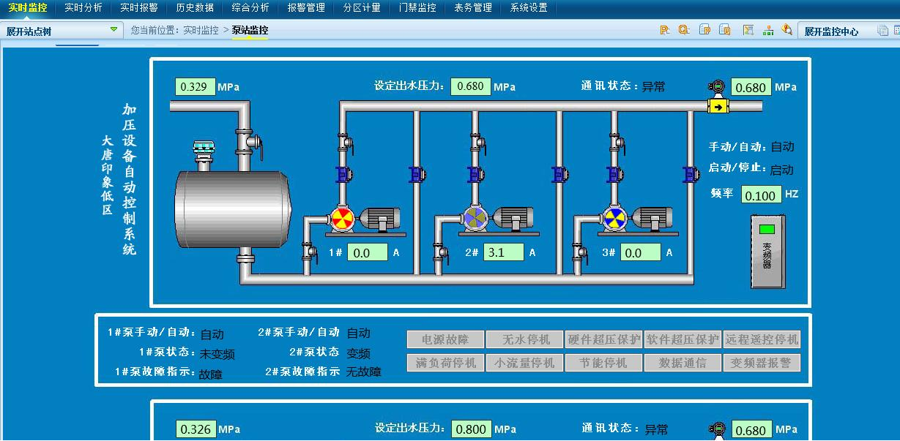

# 隐藏的工艺

:::note

工控安全工程师把工艺流程分享在论坛中，并留下关键敏感信息，你能找到相关线索吗？

flag 格式为: `flag{}`

:::

题目提供了 `01.jpg` 图像文件



对图像文件的十六进制进行分析，发现其尾部含有一个 zip 压缩文件


将附加在尾部的 zip 文件提取出来进行分析


执行密码爆破


得到密码为 `FC00` 之后，解压得到文件 `next.PCZ`

将其作为 zip 文件进行分析


可以注意到，文件 `PackBackup.xml` 存在有加密，但是文件夹 `New App4` 并没有加密

将文件夹 `New App4` 进行提取


在 `bmp` 文件中，发现存在有 flag 文件


执行二维码解码，即可得到答案


```flag
flag{qwerasd}
```
