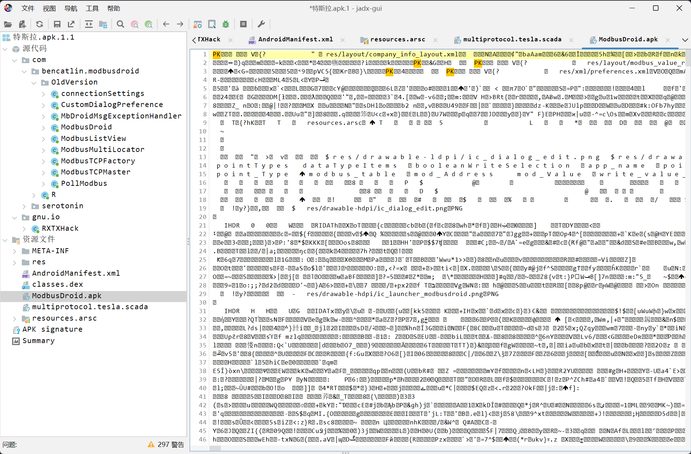
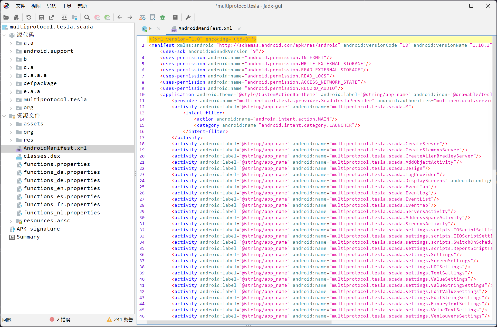
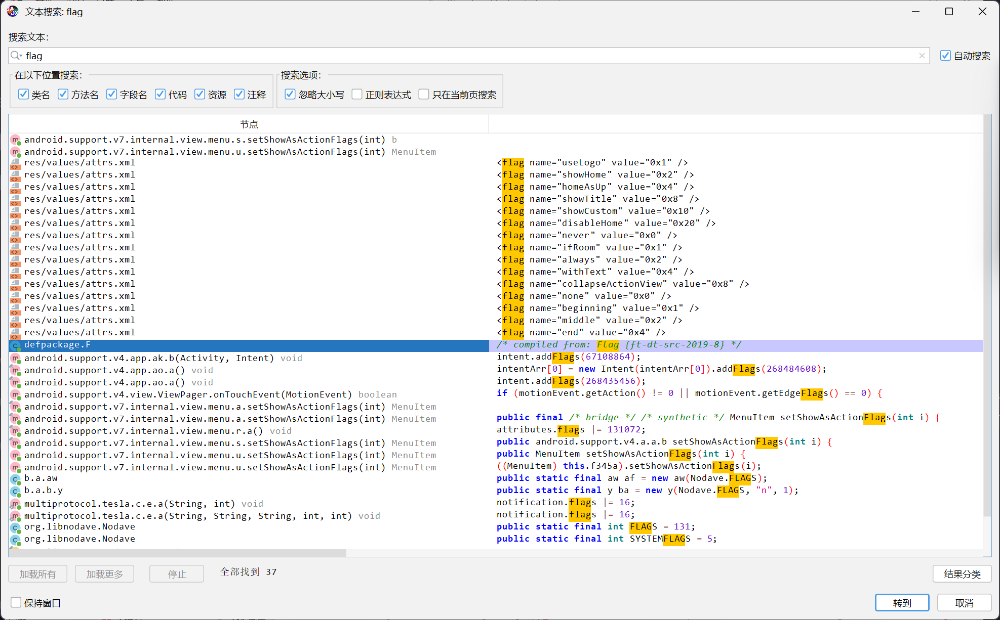
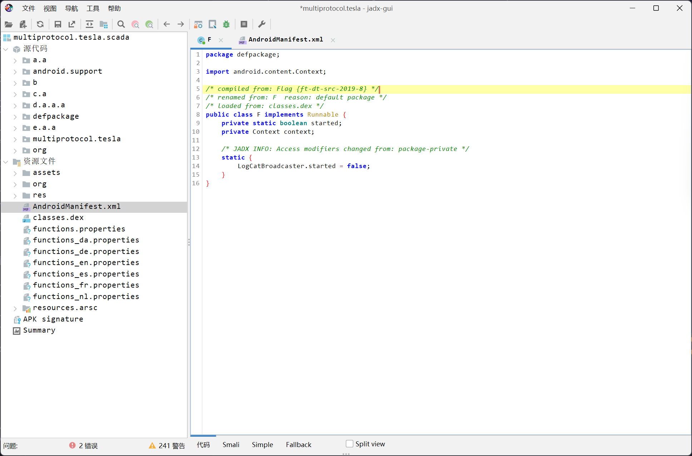

# 简单的 apk 逆向

:::note

工控移动终端逆向，找到 apk 中的 flag

flag 形式为 `flag{}`

:::

题目提供了 `.apk.1.1` 文件，使用 `JADX` 进行反编译，发现存在有额外的资源文件



- ModbusDroid.apk
- multiprotocol.tesla.scada

将额外的 `multiprotocol.tesla.scada` 资源文件提取出来进行分析



在其中直接执行全数据搜索字符串`flag`



定位到



即可得到答案

```flag
flag{ft-dt-src-2019-8}
```
