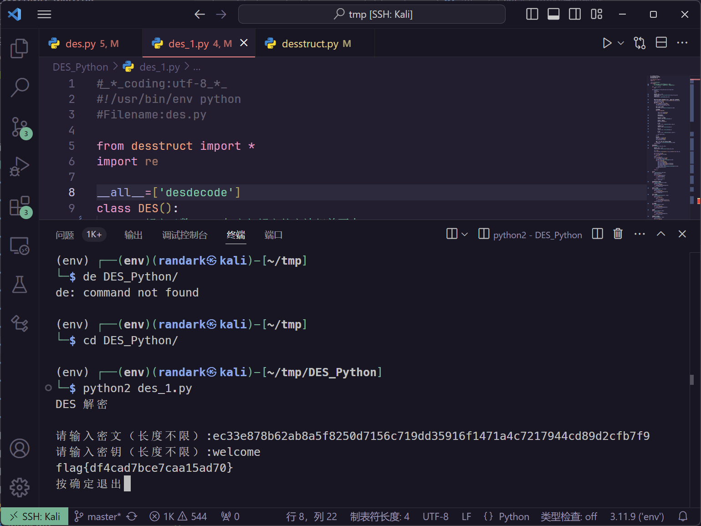

# 常见的对称加密

:::note

标准的对称加密发现 S 盒有问题。

Flag 格式为: `flag{}`

:::

题目提供了一份文件 `decrypt`

使用 [liupengs/DES_Python: des.py 用于加密，des_1.py 用于 des 解密！](https://github.com/liupengs/DES_Python) 执行解密

将 `desstruct.py` 中的 `s` 变量替换为题目给出的 `s` 即可

运行即可得到答案



```flag
flag{df4cad7bce7caa15ad70}
```
